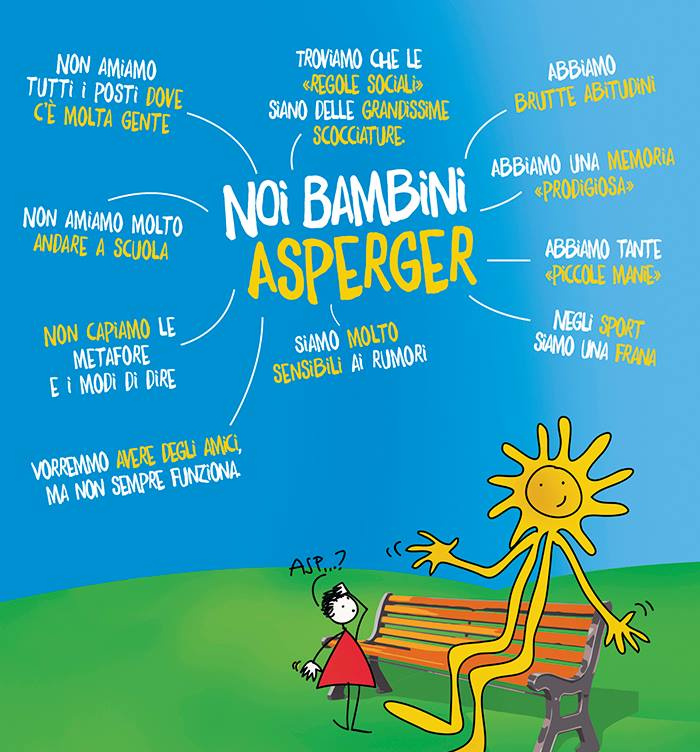

+++++++++++++++++++++++++++++++++++++++++++++++++++++++++++++++++++++++++++++++++

## 1.1   Presentazione - "Come programmare con ESP32"               - breve articolo

La automazione elettronica o I.o.T è stata finora un "lusso" per aziende o abitazioni di un certo livello: Seppure sistemi come "Alexa" di Amazon o i dispositivi "SONOFF" abbiano raggiunto livelli di prezzo e diffusione sorprendenti, non possiamo ancora parlare di una vera integrazione dei sistemi o di case robotizzate. I dispositivi commerciali stentano a trovare un procotollo comune di comunicazione e nuovi, migliori sistemi tendono a privilegiare gli algoritmi della AI piuttosto che la pura "esecuzione" di ordini umani.

Non sappiamo come saranno i nuovi sistemi di automazione ma la disponibilità di schede come "Arduino" o ESP32 ci permette già adesso di risolvere a costi limitati dei singoli, preziosi compiti per cui non vogliamo aspettare le soluzioni universali di "Google Home", "Alexa" o Samsung "SmartThings".

Tutti questi sistemi possono mantenere bassi costi grazie alla produzione in scala massiccia di CPU e controller e sarebbe un peccato lasciare solo alle multinazionali lo sfruttamento di questo promettentissimo sviluppo della tecnologia

Se il costo dell'hardware non pare più un problema, anche i sistemi e i siti di condivisione tipo "Github.com" consentono ai singoli e micro aziende di progettare programmi a costo zero. In questo libro vederemo come sia possibile costruire alcune aplicazioni dell' Iot usando solo programmi Open Source o gratis per essere più chiari.

Il panorama del software Open Source ha raggiunto recentemente vette di qualità estrema come testimoniato da programmi Node-RED di IBM o protocolli come MQTT. Il nostro obiettivo è costruire da zero applicazioni mirate per i nostri problemi  e collegarle ad internet fruttando solo dei protocolli "Open". In tal modo non saremo più soggetti alla schiavitù degli aggiornamenti, o alla condivisione forzata dei nostri dati con i colossi americani e non solo.

Abbiamo scelto ESP32 rispetto al più classico Arduino per una seria di motivi; il primo certamente la connettività a tutta prova di questo controller e in seconda battuta per il favorevolissimo rapporto prestazioni/prezzo. Distribuire la elaborazione dati tra dieci ESP32 può costare meno che impiegare una singola CPU Intel e questo fatto tende a influenzare la topologia dei sistemi IoT: Meno reti e più controller locali, autonomi e integrati.

Seguendo questa filosofia alla fine del libro poterete realizzare una vera centralina di controllo atmosferica con sensori  multipli e condivisione dati via HTML.

# 1.2   Curriculum                                                 - blog in genere 

L'autore insieme al collega Sergio Rame cura il blog "www.robotdazero.it" attivo dal 2017 e incentrato sulla comune passione per l'IoT e la programmazione in C. Il blog contiene news e articoli introduttivi sull'ESP32 senza trascurare il capostipite Arduino e propone progetti con programmi totalmente free e servizi di elaborazione dati in cloud con il marchio "Kaspian". Il blog si sostenta con la vendita di prodotti stampati in 3D via il nostro ecommerce. Se volete restare aggiornati sulle novità del blog potete iscrivervi alla nostra newsletter e nel contempo usufruire di una agevolazione del 20% sul vostro primo acquisto.

1.3   Introduzione                                               - blog/esp32-i-segreti-del-suo-successo/
1.4   Cos'è l'ESP32                                              - blog/esp32-i-segreti-del-suo-successo/
1.5   Caratteristiche principali dell'ESP32                      - blog/esp32-i-segreti-del-suo-successo/
1.6   ESP32 vs Arduino                                           - blog/esp32-i-segreti-del-suo-successo/#un-breve...

## 1.7   Sommario     

In questo capitolo introduttivo abbiamo visto a fondo le potenzialità dell' ESP32 e accennato ad alcune prerogative di questa sorprendente scheda rispetto ai prodotti concorrenti. Nel resto del libro esploreremo ulteriormente queste peculiarità e vederemo quali accorgimento software sono stati predisposti dalla case madre Espressif per gestire la rete dati lungo raggio ESP-NOW e le modalità di connessione al Wi-Fi

+++++++++++++++++++++++++++++++++++++++++++++++++++++++++++++++++++++++++++++++++

2.1   Qualche breve nozione di elettronica                       - blog/introduzione-alla-elettronica/
2.2   La differenza tra corrente e tensione                      - blog/la-differenza-tra-corrente-e-tensione/
2.3   Cosa sono le resistenze                                    - blog/cosa-sono-le-resistenze-elettriche/ 
2.4   Il codice di colore delle resistenze                       - blog/cosa-sono-le-resistenze-elettriche/ 
2.5   I Transistor                                               - blog/introduzione-ai-transistor/
2.6   Il TIP120 per pilotare motori e lampade                    - blog/come-pilotare-un-motore-elettrico-usando-ESP32

## 2.7   Sommario                                                   - breve articolo

In questo paragrafo abbiamo illustrato le fondamentali nozioni elettronica senza le quali ogni ulteriore progresso sarebbe stato incerto e faticoso. Consigliamo i lettori di rileggere le parti sulla legge di Ohm come un principio fondamentale dell'elettronica. Inoltre sarebbe difficile sopravvalutare il ruolo delle resistenze nei moderni dei circuiti elettronici e per questo motivo i due argomenti sono il bagaglio necessario per passare ai circuiti a semiconduttore. La distinzione tra corrente e tensione, seppure banale in apparenza, riesce sempre ostica non appena si esce dalla teoria e si prova a calcolare le resistenza da utilizzare per limitare la tensione in un circuito reale. 

Consiglio vivamente di rileggere questo articolo anche dopo avere intrapreso la "fase" della programmazione in C++. 

+++++++++++++++++++++++++++++++++++++++++++++++++++++++++++++++++++++++++++++++++

## 3.1   Come alimentare l'ESP32                                    - breve articolo

Quando progettiamo un pur semplice circuito per ESP32 dobbiamo pianificare in anticipo la fonte di alimetazione (singola o lutipla) della scheda. Alcune applicaziojni come sistemi di apertura dei cancelli o axinamento di motorini elettrico possono certamente utilizzare la corrente destinata ai dispositivi ontrollati. Altrettanto semplice è la alimentazione dei dispositivi collegati al nostro PC. Ma non sempre la soluzione è così immediata: Dispositivi mobili come i droni impongono letteralmente l'utilizzo di accumulatori ai polimeri di litio con annessi circuiti di ricarica. Dei sensori a basso consumo possono accontentarsi di un banale *power bank* per smartphone. 

3.2   Alimentazione con presa USB                                - blog/esp32-e-la-sua-alimentazione/ 
3.3   Alimentazione tramite il pin VIN                           - blog/esp32-e-la-sua-alimentazione/
3.4   Come ridurre il consumo energetico                         - blog/esp32-e-la-sua-alimentazione/
3.5   La modalità “sleep” dell'ESP32                             - blog/esp32-e-la-sua-alimentazione/
## 3.6   Sommario    

In questo capitolo abbiamo visto principalmente come ridurre il consumo del controller ESP32 e quali tattiche progettuali adottare per lo stesso scopo. In linea di massima consigliamo di provare SEMPRe i vostri progetti con alimentazione USB con un semplice alimentatore per telefonino di buona qualità. Il motivo per cui adottare tale strategia risiede nella semplificazione dello sviluppo: Potete progettare programmi e circuiteria supponendo una tensione stabile a 5V e solo dopo preoccuparvi di integrare il dispositivo con accumulatori al litio o caricabatteria solari.

+++++++++++++++++++++++++++++++++++++++++++++++++++++++++++++++++++++++++++++++++

4.1   La manutenzione dell’ESP32                                 - blog/come-resettare-lesp32/
4.2   Reset immediato                                            - blog/come-resettare-lesp32/
4.3   Quando resettare completamente                             - blog/come-resettare-lesp32/
4.4   Come effettuare il reset completo                          - blog/come-resettare-lesp32/
4.5   Come cancellare la memoria FLASH                           - blog/come-resettare-lesp32/

## 4.6   Sommario    

Abbiamo visto in maniera estesa un aspetto estremamente sottovaluto nell'utilizzo dell'ESP32. La manutenzione di una scheda elettronica appare certamente molto "superflua" se si ignora la complessità di un dispositivi programmabile e le differenti memorie di cui dispone e i loro tipi di funzionamento. Nell'utilizzo reale della scheda infortuni con schede impossibili da programmare sono comuni e aldilà di casi semplici come un cavetto USB difettoso, in certi casi la soluzione migliore può essere il reset completo della scheda. Per i più esperti il controllo con multimetro e oscilloscopio costituisce un ulteriore grado di perizia necessario per un lavoro professionale, noi in questo libro ci siamo limitati ai casi più comuni. Anche la idea di sostutire immediatamente una scheda sospetta è una ipotesi realistica visto il suo bassissimo costo.

+++++++++++++++++++++++++++++++++++++++++++++++++++++++++++++++++++++++++++++++++

## 5.1   Introduzione alla programmazione dell'ESP32  

Il cuore di questa pubblicazione è certamente lo sviluppo software in ambiente ESP32. NEl capitolo affronteremo tutte le tematiche e le soluzioni pratiche per agevolare il tuo percorso di crescita. Andremo a fondo nel descrivere i due possibili approcci alla programmazione in ambiente grafico e in modelità testo. fermo restando che si tratta di una utile semplificazione. Nulla impedisce di usare Arduino Ide dalla linea di comando così come PlatformIO funziona egregiamente con Visual Studio Code. Ti presenteremo le due alternative lasciando al lettore la preferenza. Spesso comunque le due modalità di lavoro tendono a divergere e chi preferisce la interfaccia grafica tende a mettere da parte il programma GIT da linea di comando. Secondo noi questo è un errore gravissimo perchè tende alla unga banalizzare l'utilizzo di GIT abbandonando le funzionalità avanzate come branching, merging, rebasing etc che possono fare la differenza nel lavoro di gruppo e non solo. Sta al lettore decidere l'approccio iniziale e sviluppare le sue competenze secondo i gusti e inclinazioni personali.

5.2   Come installare l'ambiente di sviluppo                     - blog/come-installare-lide-di-arduino/
5.3   Come eseguire alcuni semplici programmi con Arduino IDE    - breve articolo
5.4   Installiamo PlatformIO                                     - blog/come-installare-platformio/
5.5   Come compilare un programma con PlatformIO                 - blog/come-compilare-un-programma-con-platformio/
5.6   Come installare il programma GIT                           - blog/come-installare-il-programma-git
5.7   Come funziona il makefile di Platformio                    - blog/come-funziona-il-makefile-di-platformio
5.8   Alcuni semplici programmi per l'ESP32                      - breve testo
5.9   Come far lampeggiare il LED interno dell'ESP32             - blog/come-far-lampeggiare-il-led-interno-dellesp32
5.10  Come collegare un LED esterno ad ESP32                     - blog/come-collegare-un-led-esterno-ad-esp32 
5.11  Come leggere una porta analogica con ESP32                 - blog/come-leggere-una-porta-analogica-con-esp32/

## 5.12  Sommario   

qd

+++++++++++++++++++++++++++++++++++++++++++++++++++++++++++++++++++++++++++++++++

+++++++++++++++++++++++++++++++++++++++++++++++++++++++++++++++++++++++++++++++++

+++++++++++++++++++++++++++++++++++++++++++++++++++++++++++++++++++++++++++++++++

+++++++++++++++++++++++++++++++++++++++++++++++++++++++++++++++++++++++++++++++++

+++++++++++++++++++++++++++++++++++++++++++++++++++++++++++++++++++++++++++++++++

+++++++++++++++++++++++++++++++++++++++++++++++++++++++++++++++++++++++++++++++++

+++++++++++++++++++++++++++++++++++++++++++++++++++++++++++++++++++++++++++++++++

+++++++++++++++++++++++++++++++++++++++++++++++++++++++++++++++++++++++++++++++++

111111111111111111111111111111111111111111111111111111111111111111111111111111111111111111 asperger 
## Il 18 Febbraio è stata la giornata mondiale della Sindrome di Asperger

La Giornata mondiale della sindrome di Asperger si celebra ogni anno il 18 febbraio per stimolare la consapevolezza verso la malattia e promuovere l'inclusione sociale delle persone colpite. Il 18 febbraio 1906 nasceva Hans Asperger, il futuro pediatra austriaco al cui nome è associato dal 1994 la cosiddetta Sindrome di Asperger, che oggi rientra tra i disturbi dello spettro autistico. 

 
 

Dedicare una giornata di riflessione a questo disturbo del comportamente può certamente aiutarci nello studio delle dinamiche comportamentali di alcuni bambini e adolescenti e svelare la radice di alcuni comportamenti "ossessivi" di persone apparentemente normali. 

> *La sindrome di Asperger è un termine usato per descrivere una ampia gamma di disturbi legati al disturbo dello spettro autistico (DSA). Gli individui interessati da questo disturbo tendono ad avere difficoltà nel relazionarsi con gli altri e raramente sviluppano profonde relazioni sociali. Nei casi più gravi e facilmente diagnosticabili si attengono a una routine molto specifica, sono interessati ad pochi e mirati interessi ed si abbandonano ad alcuni schemi motori come sbattere le mani senza motivo apparente.I medici a volte chiamano Asperger un tipo di ASD "ad alto funzionamento", il che significa che i suoi sintomi tendono a non essere gravi come altri tipi di disturbo dello spettro autistico.*

### La storia della sindrome di Asperger
Il disturno prende il nome da Hans Asperger, un medico attivo nella città di Vienna durante il regno del partito nazista. Nel 1940, Asperger è stato il primo a prendere atto del modello di problemi sociali in alcuni bambini sotto la sua cura che ora definisce il disturbo. Gran parte delle informazioni che gli esperti conoscono oggi su Asperger proviene dal lavoro di Hans Asperger.

Sebbene sia stato un pioniere in questa ricerca, l'uso del suo nome per questo disturbo è controverso. I dibattiti in corso dicono che la sua ricerca potrebbe aver promosso la "igiene razziale" forzata, che includeva le politiche naziste secondo cui le persone con determinate disabilità dovrebbero essere uccise e i genitori di questi bambini dovrebbero essere sterilizzati.

Alcuni sostengono che Asperger abbia creato un linguaggio per descrivere i bambini nella fascia più alta dello spettro autistico come un modo per salvarli da queste politiche naziste. Ma una nuova ricerca mostra un quadro molto più complicato di come questa etichetta abbia danneggiato le persone e persino portato alla morte di alcuni bambini.

### I sintomi dell'Asperger

I sintomi di Asperger iniziano presto nella vita. La maggior parte delle diagnosi avvengono tra i 5 ei 9 anni, anche se alcune persone sono adulti prima di ottenere la loro diagnosi. Non ci sono due persone che hanno gli stessi sintomi. Ma di solito sono legati alle abilità emotive, comunicative e comportamentali.

Le persone con il disturbo possono:

Hanno difficoltà a stabilire un contatto visivo
Sentire e agire imbarazzante in contesti sociali
Difficoltà a rispondere alle persone in conversazione
Miss segnali sociali che altre persone trovano evidenti
Lotta per leggere il linguaggio del corpo
Non capisco cosa significano le espressioni facciali
Mostra poche emozioni
Parla in un tono piatto e robotico
Parla molto di un argomento come le rocce o le statistiche di calcio
Ripetere parole, frasi o movimenti
Antipatia cambiamento
Mantenere lo stesso programma e le stesse abitudini, come mangiare gli stessi pasti

## La storia di "Miriam"

È stata difficoltosa l’interazione sociale per Miriam, sin da quando ha iniziato a muovere i primi faticosi passi verso il mondo esterno, negli anni ’70. Una piccola città dell’estremo sud Italia, come Siracusa, era un universo, per lei, e per di più ostile.

 <h5>Frequentare la scuola era una battaglia ogni giorno,</h5> fra gli altri alunni “normali”, da cui era spesso derisa e schernita a causa della sua timidezza patologica, l’incapacità di esprimersi verbalmente, la mania per l’ordine fuori dal comune e quasi ossessivo, e per il desiderio di isolamento che la portava spesso a rifugiarsi agli ultimi banchi; e insegnanti che esigevano troppo da lei, che non sapevano… non capivano che non riusciva a parlare, però Miriam era una delle più brave a scrivere. Lei si esprimeva attraverso la scrittura… Infatti nei compiti scritti i suoi voti erano eccellenti, ma le interrogazioni orali erano continue “scene mute”, come dicevano le insegnanti a sua madre, consigliandole l’iscrizione in un istituto per bambini con disabilità e ritardi, dove poteva essere seguita da insegnanti specializzati.

 

In quegli anni il disturbo di Miriam non si conosceva. Gli studi del dr. Hans Asperger, pediatra e psichiatra austriaco (18/02/1906-21/10/1980) furono riconosciuti solo negli anni ’90. Miriam e molti altri bambini e adolescenti, infatti, hanno avuto la diagnosi parecchi anni dopo, in età adulta, si tratta appunto della sindrome di Asperger, (dal nome del medico che la scoprì), una sindrome di cui non si conosce la causa, inserita fra i disturbi dello spettro autistico, ma “ad alto funzionamento”, cioè che non comporta ritardi nello sviluppo cognitivo. I soggetti presentano difficoltà nella socializzazione, hanno comportamenti stereotipati e ripetitivi, e nutrono interessi ristretti a determinati ambiti. Alcuni sintomi sono correlati al disturbo non verbale dell’apprendimento, alla fobia sociale, al disturbo schizoide.

Secondo l’O.M.S. il disturbo interesserebbe un bambino ogni 250 e circa il 50% di essi non è diagnosticato. Nel 2001 uno studio britannico ha rivelato che il 46% di soggetti Asperger aveva avuto la diagnosi solo in età adulta.

È un disturbo estremamente variabile per l’eterogeneità dei sintomi e per gli adattamenti, infatti il paziente non ha un unico aspetto ma si presenta con una serie di abilità e comportamenti che, al di là di poche fondamentali caratteristiche, differenziano un individuo dall’altro rendendo difficile la diagnosi. Non esiste una cura unica e probabilmente non si guarisce mai completamente, tuttavia esistono delle terapie di medicina integrata e di regolazione, che, in sinergia con quelle tradizionali (terapia cognitivo- comportamentale, farmacologica, ecc.) sono in grado di fornire un beneficio generale mitigandone i sintomi più evidenti.

Il 18 Febbraio è la giornata mondiale della Sindrome di Asperger, nasce per sensibilizzare, divulgare notizie in merito, fare conoscere nuove terapie e metodi innovativi per aiutare i soggetti cosiddetti Aspie, ad inserirsi nel mondo esterno.

Qui in Sicilia, la regione dovrebbe organizzare, attraverso gli Enti regionali di formazione professionale dislocati in varie città, dei progetti che comprendano varie attività per i ragazzi Asperger nel corso della loro formazione, mirate a fare emergere le loro competenze da impiegare in campo lavorativo e a puntare sul potenziamento delle loro difficili capacità relazionali, seguendo il modello della Fondazione Engim, una O.N.G. operante in Italia e all’estero, i cui centri di recente sono presenti anche a Termini Imerese (PA), Trapani, Sant’Agata di Militello (ME). La sede di Torino, infatti, da una decina d’anni ha incluso dei corsi di formazione per ragazzi Aspie, allo scopo di migliorane le competenze relazionali ed essere così inseriti nel mondo del lavoro.

Donare educazione ed ausilio adeguati ai ragazzi con Sindrome di Asperger, già dalla tenera età, è fondamentale. Il piccolo Aspie và compreso e supportato perché abbia la possibilità di esprimersi al meglio e di credere nelle proprie capacità.

Persone Asperger famose come Einstein, Darwin, Newton, Mozart, Michelangelo, Steve Jobs, Susanna Tamaro, Greta Thunberg, hanno saputo sfruttare al meglio il disturbo, coltivando un interesse e facendolo diventare una passione.

Patrizia Principato 9 Febbraio 2022

111111111111111111111111111111111111111111111111111111111111111111111111111111111111111111 asperger 

 
 

Robotdazero.it - post - R.000.1.0.1
