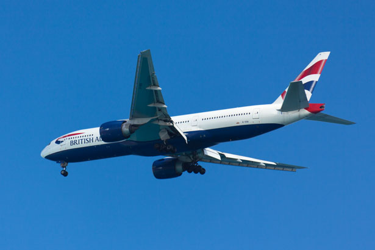
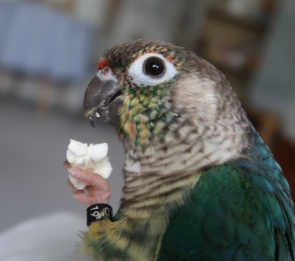

<!-- https://oleksandrg.medium.com/simple-image-classification-on-raspberry-pi-used-the-pre-trained-model-vgg16-part-4-0-afa4f8bdf775  -->


<hr>
<br>

I robot semoventi come il Rover che stiamo progettando sono afflitti da un limite tecnologico al momento insuperabile: la ridotta potenza dei computer per IOT quali <a href="https://en.wikipedia.org/wiki/Raspberry_Pi" target="_blank" rel="noopener">Raspberry Pi</a> o <a href="https://developer.nvidia.com/embedded/jetson-nano-developer-kit" target="_blank" rel="noopener">Jetson Nano</a>. Seppure le prestazioni siano continuamente in crescita al momento siamo costretti a selezionare algoritmi potenti ma non troppo "esigenti" in termini di RAM e CPU. Il nostro robot è autoguidato e deve per questo fare girare programmi in machine learning per riconoscere i percorsi ed evitare gli ostacoli. Nella nostra ricerca di algoritmi performanti ci occupiamo oggi di una libreria neurale molto usata, la "VGG16".   

**In questo breve post vedremo come usare il modello di elaborazione "VGG16" con Tensorflow 2.13.0 e hardware Raspberry PI**

### QUALI SONO I MODELLI DI RETE NEURALE PIÙ ADATTI AD UN HARDWARE LIMITATO?

I modelli di rete neurale convoluzionale più adatti ad un hardware dalle prestazioni limitate sono quelli che hanno una struttura semplice e che non richiedono una grande quantità di dati di addestramento. Alcuni esempi di questi modelli includono:

    Le reti neurali convoluzionali convoluzionali (CNN)
    Le reti neurali convoluzionali residuali (ResNet)
    Le reti neurali convoluzionali convoluzionali (DenseNet)

Questi modelli sono tutti in grado di raggiungere prestazioni elevate su una varietà di compiti, ma sono anche relativamente efficienti in termini di risorse. Ciò li rende adatti per l'esecuzione su hardware dalle prestazioni limitate, come i dispositivi mobili e le schede di elaborazione a tensore.

Oltre alla struttura semplice e alla ridotta necessità di dati di addestramento, ci sono altri fattori che possono contribuire alla compatibilità di un modello di rete neurale con hardware dalle prestazioni limitate. Questi fattori includono:

- La dimensione del modello: un modello più piccolo richiede meno risorse per essere eseguito.
- La complessità del modello: un modello più semplice è più facile da implementare ed eseguire su hardware dalle prestazioni limitate.
- I tipi di dati utilizzati dal modello: alcuni tipi di dati, come le immagini in formato JPEG, sono più efficienti in termini di risorse rispetto ad altri tipi di dati, come le immagini in formato RAW.

<div class="alert alert-doks d-flexflex-shrink-1" role="alert"> ⚡️
Tra le reti convoluzionali (CNN) più diffuse abbiamo deciso di provare la rete VGG16 e di fare un test "dal vivo" sulla più performante delle versioni del Raspberry, l'RPI 400 a 1.8 Ghz con 4GB di Ram.
</div>

### COSA È IL MODELLO VGG16 NEL MACHINE LEARNING?

<a href="https://medium.com/@mygreatlearning/everything-you-need-to-know-about-vgg16-7315defb5918" target="_blank" rel="noopener">VGG16</a> è una rete neurale convoluzionale (CNN) profonda sviluppata dal Visual Geometry Group (<a href="https://www.robots.ox.ac.uk/~vgg/" target="_blank" rel="noopener">VGG</a>) del Dipartimento di Informatica dell'Università di Oxford. È stato presentato per la prima volta nel 2014 al concorso ImageNet Large Scale Visual Recognition Challenge (<a href="https://www.image-net.org/challenges/LSVRC/" target="_blank" rel="noopener">ILSVRC</a>) 2014, dove ha ottenuto un punteggio di top-5 accuracy del 96,7%.

VGG16 è una rete deep, il che significa che ha molti strati. Ha 16 strati convoluzionali, 3 strati fully connected e 3 strati di classificazione. I livelli convoluzionali sono responsabili dell'estrazione di caratteristiche dalle immagini, mentre i livelli fully connected sono responsabili della classificazione delle immagini.

> VGG16 è stato addestrato su un enorme set di dati di immagini chiamato ImageNet. <a href="https://www.image-net.org/" target="_blank" rel="noopener">ImageNet</a> è un set di dati di oltre 14 milioni di immagini etichettate con 22.000 categorie. Allenare un modello su un set di dati così grande richiede molta potenza di elaborazione e tempo.

VGG16 è un modello molto potente per il riconoscimento delle immagini. Tuttavia, è anche molto complesso e richiede molta potenza di elaborazione per essere addestrato. Per questo motivo, VGG16 non è sempre la scelta migliore per i problemi di riconoscimento delle immagini. In alcuni casi, è possibile utilizzare modelli più semplici e meno potenti che possono essere addestrati più velocemente.

Nonostante la sua complessità, VGG16 è ancora un modello molto popolare per il riconoscimento delle immagini. È stato utilizzato in una varietà di applicazioni, tra cui la classificazione delle immagini, il rilevamento degli oggetti e la segmentazione delle immagini.

**Ecco alcune delle caratteristiche di VGG16:**

    È una rete deep con 16 strati.
    È stata addestrata su un enorme set di dati di immagini chiamato ImageNet.
    È molto potente per il riconoscimento delle immagini.
    È anche molto complesso e richiede molta potenza di elaborazione per essere addestrato.
    È ancora un modello molto popolare per il riconoscimento delle immagini.


### QUALI SONO I REQUISITI DI RAM E CPU DEL MODELLO VGG16?

I requisiti di RAM e CPU del modello VGG16 nel Machine Learning variano a seconda della piattaforma su cui viene eseguito il modello. In generale, VGG16 richiede almeno 4 GB di RAM e 4 core di CPU per essere eseguito in modo efficiente. Per l'addestramento, VGG16 richiede almeno 16 GB di RAM e 8 core di CPU.

Ecco alcuni esempi di piattaforme e requisiti di RAM e CPU per VGG16:

- TensorFlow: 4 GB di RAM, 4 core di CPU
- PyTorch: 4 GB di RAM, 4 core di CPU
- Keras: 4 GB di RAM, 4 core di CPU

<div class="alert alert-doks d-flexflex-shrink-1" role="alert"> ⚡️
L'algoritmo non può dunque essere "addestrato" su una macchina "leggera" come l'RPI ma può riconosce le immagini con soli 4 Gb di Ram. Per questo motivo abbiamo deciso di fare un test proatico delle prestazioni.
</div>

<br>

È importante notare che questi sono solo requisiti minimi. I requisiti effettivi di RAM e CPU possono variare a seconda del set di dati utilizzato, della complessità del modello e della piattaforma su cui viene eseguito il modello.

### IL FILE SORGENTE DEL PROGRAMMA


```bash
# file image_classify.py
from keras.applications.vgg16 import VGG16
from keras.preprocessing import image
from keras.applications.vgg16 import preprocess_input, decode_predictions
import numpy as np

model = VGG16(weights='imagenet')
img_path = 'demo.jpg'
img = image.load_img(img_path, target_size=(224, 224))
x = image.img_to_array(img)
x = np.expand_dims(x, axis=0)
x = preprocess_input(x)
preds = model.predict(x)

print('Result:', decode_predictions(preds, top=1)[0])
```

### COME PUOI CARICARE IL PROGRAMMA SU UN DESKTOP LINUX O SU RPI

**1.** Clicca sul comando "Copy" che appare in alto a destra sul sorgente.

**2.** Incolla il programma su un file. 

Per completare questa operazione ti basta usare il terminale con il comando **vi** o **nano**  o puoi usare **GEDIT/SublimeText** dal desktop. In genere non ha nessuna importanza quale software userai purchè si tratti di un editor di testo e non un di un word processor. Usa il programma che preferisci e sava il file con il nome **image_classify.py**. Per eseguire il programma:

```bash
python image_classify.py
oppure
python3 image_classify.py
```




La foto "demo.jpg" che puoi scaricare direttamente dalla pagina facendo click destro e "salva con nome"...


### IL RISULTATO DEL PROGRAMMA

- **Il programma lanciato su uno Raspberry Pi 400**  (mini desktop con clock a 1.8 Ghz) con 4GB di RAM.

Dopo circa 20 secondi di attesa il programma ha tirato fuori la risposta "airliner" cioè aereo di linea commerciale, con un livello di accuratezza dello 0.86%. Un risultato buono ma forse inferiore alle attese. La posizione dell'aereo forse influisce sul risultato.
Il tempo di elaborazione reale è stato di **17.992** secondi.


```bash
(w) raspberry ~/pi (master)$ time python  image_classify.py
2023-08-01 14:22:33.257519: W tensorflow/tsl/framework/cpu_allocator_impl.cc:83] Allocation of 411041792 exceeds 10% of free system memory.
2023-08-01 14:22:33.822023: W tensorflow/tsl/framework/cpu_allocator_impl.cc:83] Allocation of 411041792 exceeds 10% of free system memory.
2023-08-01 14:22:34.270226: W tensorflow/tsl/framework/cpu_allocator_impl.cc:83] Allocation of 411041792 exceeds 10% of free system memory.
2023-08-01 14:22:39.745270: W tensorflow/tsl/framework/cpu_allocator_impl.cc:83] Allocation of 411041792 exceeds 10% of free system memory.
1/1 [==============================] - 2s 2s/step
Result: [('n02690373', 'airliner', 0.86845803)]

real	0m17.992s
user	0m18.217s
sys	0m9.155s
```


<br>

- **Il risultato dell'algoritmo** con una immagine diversa, stavolta di un pappagallo.



```bash
(w) raspberry ~/pi (master)$ time python  image_classify.py
2023-08-06 15:29:38.135273: W tensorflow/tsl/framework/cpu_allocator_impl.cc:83] Allocation of 411041792 exceeds 10% of free system memory.
2023-08-06 15:29:38.695745: W tensorflow/tsl/framework/cpu_allocator_impl.cc:83] Allocation of 411041792 exceeds 10% of free system memory.
2023-08-06 15:29:39.153077: W tensorflow/tsl/framework/cpu_allocator_impl.cc:83] Allocation of 411041792 exceeds 10% of free system memory.
2023-08-06 15:29:44.802273: W tensorflow/tsl/framework/cpu_allocator_impl.cc:83] Allocation of 411041792 exceeds 10% of free system memory.
1/1 [==============================] - 2s 2s/step
Result: [('n01806567', 'quail', 0.1353003)]

real	0m18.637s
user	0m18.892s
sys	0m8.997s

```

Come si vede l’output dopo 18.637 secondi descrive il pappagallo come una quaglia (‘quail’). Il risultato è un poco comico ma la bassa qualità della foto (si vede solo la testa sfocata e uno sfondo complicato) rende accettabile il risultato.


### A COSA SERVONO GLI ALGORITMI IN MACHINE LEARNING DEL NOSTRO ROVER

Gli algoritmi di machine learning vengono utilizzati in vari modi. Un modo è utilizzare gli algoritmi di machine learning per rilevare e classificare gli oggetti nell'ambiente circostante, come altri veicoli, pedoni e ostacoli. Questo viene fatto utilizzando i dati raccolti dai sensori, come telecamere, <a href="https://it.wikipedia.org/wiki/Radar" target="_blank" rel="noopener">Radar</a> e <a href="https://it.wikipedia.org/wiki/Lidar" target="_blank" rel="noopener">LIDAR</a> . Una volta che gli oggetti sono stati rilevati e classificati, gli algoritmi di machine learning possono essere utilizzati per pianificare un percorso sicuro e fluido per il robot o l'auto senza pilota. Questo viene fatto prendendo in considerazione una serie di fattori, come il traffico attuale, le condizioni meteorologiche e le leggi e le normative locali.

> Un altro modo in cui gli algoritmi di machine learning vengono utilizzati per guidare robot e automobili senza pilota è per controllare i movimenti del veicolo. Questo viene fatto inviando segnali ai motori e agli altri sistemi di controllo. Gli algoritmi di machine learning devono essere in grado di eseguire calcoli in tempo reale per tenere il passo con le condizioni in continua evoluzione della strada.

Ecco alcuni esempi specifici:

- **Rilevamento e classificazione degli oggetti**: si tratta di rilevare e classificare oggetti nell'ambiente circostante, come altri veicoli, pedoni e ostacoli. Questo viene fatto utilizzando i dati raccolti dai sensori, come telecamere, radar e LIDAR.
- **Pianificazione del percorso**: in questo caso il rover cerca di pianificare un percorso sicuro e fluido. Questo viene fatto prendendo in considerazione una serie di fattori, come le asperità del percorso e le condizioni meteorologiche.
- **Controllo del rover**: avviene per mezzo di segnali ai motori e agli altri sistemi di controllo. Gli algoritmi devono essere in grado di eseguire calcoli in "tempo reale" per tenere sotto controllo le accelerazioni laterali del mezzo per evitarne il ribaltamento.


<p style="font-size: 11px;">R.100.2.2</p>
