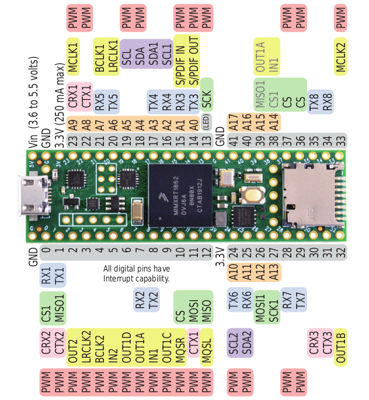

### L'ARDUINO TEENSY È UNA SCHEDA ARDUINO COMPATTA E POTENTE CHE PUÒ ESSERE ALIMENTATA IN DIVERSI MODI. 

Ecco alcuni metodi comuni:

- Uscita USB: L'Arduino Teensy può essere alimentato direttamente da una porta USB. Questo è il modo più semplice per alimentare la scheda e viene spesso utilizzato durante lo sviluppo e il test.
- Alimentatore esterno: L'Arduino Teensy può anche essere alimentato da un alimentatore esterno. Questo può essere utile se si desidera utilizzare la scheda in un progetto portatile o se si desidera avere un maggiore controllo sulla tensione di alimentazione.
- Batteria: L'Arduino Teensy può anche essere alimentato da una batteria. Questo può essere utile se si desidera utilizzare la scheda in un progetto senza accesso a una presa di corrente.

### IL RANGE DI ALIMENTAZIONE DI ARDUINO TEENSY
Quando si alimenta l'Arduino Teensy, è importante assicurarsi che la tensione di alimentazione sia compresa tra 7 e 12 volt. Se la tensione di alimentazione è troppo alta, la scheda potrebbe essere danneggiata. Se la tensione di alimentazione è troppo bassa, la scheda potrebbe non funzionare correttamente.

### ALCUNI SUGGERIMENTI PER ALIMENTARE L'ARDUINO TEENSY

1. Utilizzare un alimentatore che sia in grado di fornire abbastanza corrente per l'Arduino Teensy. La corrente richiesta dall'Arduino Teensy è indicata nelle specifiche della scheda.
2. Utilizzare un alimentatore che abbia una tensione di uscita compresa tra 7 e 12 volt.
 Se si alimenta l'Arduino Teensy da una batteria, utilizzare una batteria che abbia una capacità sufficiente per alimentare la scheda per il periodo di tempo desiderato.
3.  Se si utilizza un alimentatore esterno, utilizzare un alimentatore regolato. Questo garantirà che la tensione di alimentazione fornita all'Arduino Teensy sia costante.

### I VALORI OPERATIVI RACCOMANDATI

 👉 
Tensioni massime operative
 
 
4.5V to 5.5V	16 MHz	Yes
 
3.4V to 4.5V	8 MHz	Yes
 
3.0V to 3.4V	8 MHz	No*
 
2.7V to 3.0V	8 MHz	No
 
2.6V** to 2.7V	2 MHz	No
 

### IL TEENSY IN DETTAGLIO

Teensy non viene assemblato direttamente da Arduino o da un produttore collegato. Viene fornito da una società separata chiamata PJRC, di proprietà di Paul Stoffregen. L'imprenditore ha immediatamente riconosciuto il potenziale della nuova schede e la capacità di sopperire alle lacune della scheda originale. La PJRC ha progettato dunque una versione "ARM based" di Arduino che incorporava tutto il meglio della vecchia scheda, con la potenza di un ARM Cortex-M4 a 180 MHz! Il Teensy rappresenta un salto di potenza enorme rispetto al classico ATmega328P!

### LA PIEDINATURA DEL TEENSY

> In linea di massima, per la presenza di ulteriori dispositivi di I/O la piedinatura appare completamente diversa dall'<a href="diverrsa" target="_blank" rel="noopener">Arduino Mega</a>, soprattutto nelle versioni più recenti.

 

##### La piedinatura del Teensy 4.1 Pins - Parte frontale

 
 
 

##### La piedinatura del Teensy 4.1 Pins - Parte posteriore

 
 
 
 

> Mentre il Teensy originale cercava di mantenere una certa somiglianza con l'hardware Arduino originale...

#### La piedinatura del Teensy 4.1 Pins - rel 1.0

 
 

Oltre ad un processore a 32 bit 180Mhz, alcune versioni del Teensy esibiscono slot per schede SD, porte Ethernet e porte di comunicazione seriale. Il Teensy possiede inoltre decine di librerie aggiuntive e software per Arduino. Ciò significa che tutte le nuove funzionalità sono già integrate a livello software e richiedono solo la aggiunta delle librerie!

 👉 
Nella maggior parte dei casi sarai in grado di compilare e caricare i tuoi progetti Arduino esistenti direttamente sul Teensy senza modifiche.

 

### RISOLUZIONE DEI PROBLEMI PIÙ COMUNI

1. Il LED lampeggia ma nessuna comunicazione USB: 
molti telefoni cellulari sono venduti con cavi di ricarica. Hanno solo 2 fili per l'alimentazione, ma mancano i 2 fili di dati. Prova un altro cavo USB.

2. La porta seriale non viene riconosciuta: 
Teensy utilizza il protocollo HID per il caricamento, non il protocollo seriale. Le nuove schede Teensy vengono fornite con il file di esempio 'blinking LED' compilato per funzionare come RawHID. Bisogna programmare Teensy almeno una volta dall'IDE di Arduino. La porta COM (Windows) o il dispositivo seriale (Mac, Linux) appare solo dopo che Teensy inizia a eseguire il programma. Le normali schede Arduino sono sempre seriali. 

> Teensy utilizza HID e supporta molti protocolli. Per utilizzare serial, assicurarsi che il menu Strumenti > USB Type sia impostato su "Serial" e ricorda che Teensy diventa un dispositivo seriale solo DOPO avere eseguito almeno un programma compilato con questa impostazione.

3. Il chip principale sembra assolutamete inerte:
Più di 4 volt applicati al pin di alimentazione 3.3 V posso bruciare istantaneamente il chip. Serve estrema attenzione nel collegare la alimentazione alla scheda Teensy sia usando il VIN (5 V) che il pin a 3.3. Fili volanti tra Teensy e altri dispistivi elettrici sono il modo più rapiso per rovinare il Teensy. 

4. Comunicazione inaffidabile
Alcuni hub USB hanno problemi a gestire una rapida sequenza di connessione / disconnessione durante la programmazione di Teensy. La maggior parte degli hub funziona bene, ma alcuni possono causare problemi difficili da risolvere. In caso prova ad usare un vecchio cavo USB collaudato con un altro vecchio Arduino.

#### Teensy 3.0 non viene riconosciuto da Teensy Loader
Teensy Loader 1.07 è la prima versione a supportare Teensy 3.0. Puoi controllare la versione usando Help > About . La versione 1.07 fa parte del programma di installazione Teensyduino. Viene eseguito automaticamente quando si fa clic su Carica o Verifica in Arduino.
Nuovo di zecca Teensy non riconosciuto

##### Quando un Teensy nuovo di zecca non è mai stato riconosciuto da Teensy Loader, segui questi passaggi.

- **In primo luogo**, riavvia il computer e rimuovi qualsiasi altro circuito collegato al Teensy.
Il LED dovrebbe lampeggiare quando il cavo USB è collegato. Ogni Teensy è pre-programmato con un programma di lampeggio LED durante il test del prodotto. Non sono necessari driver particolari per fare lampeggiare il LED. È necessaria solo l'alimentazione dal cavo USB. Se il LED non lampeggia, controlla la tensione sulla scheda utilizzando un multimetro o prova un altro cavo o porta USB. Se il LED non lampeggia mai, non preoccuparti di driver o software. Se il non LED lampeggia vuol dire che la scheda non riceve alimentazione!
- **Quando si preme il pulsante**, il LED dovrebbe smettere di lampeggiare. Non servono software o driver sul computer per fermare il lampeggio del LED. Se il LED lampeggia e il pulsante riesce a fermare ilampeggio, questo è un ottimo segnale che Teensy funziona correttamente.
- **Quando il LED smette di lampeggiare**, se il programma Teensy Loader è in esecuzione, dovrebbe rilevare la scheda Teensy. Il messaggio" Premere il pulsante per attivare " scomparirà e l'immagine mostrerà quale scheda è presente. Non servono driver su Windows o Mac. Su Linux, il file delle regole udev deve invece essere installato. Se il LED lampeggia ma il Loader non rileva mai la scheda, il problema è quasi certamente un cavo USB difettoso. Molti cavi USB realizzati per i dispositivi di ricarica hanno solo fili di alimentazione ma nessuna linea dati.

<!-- https://www.pjrc.com/teensy/troubleshoot.html -->

R.104.6.1

