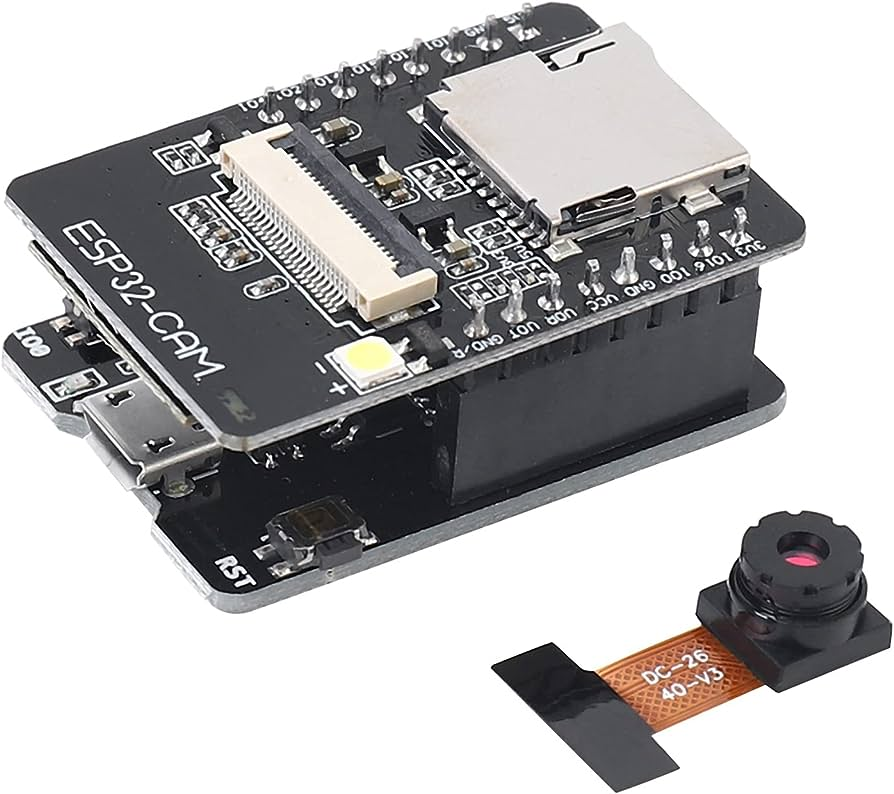
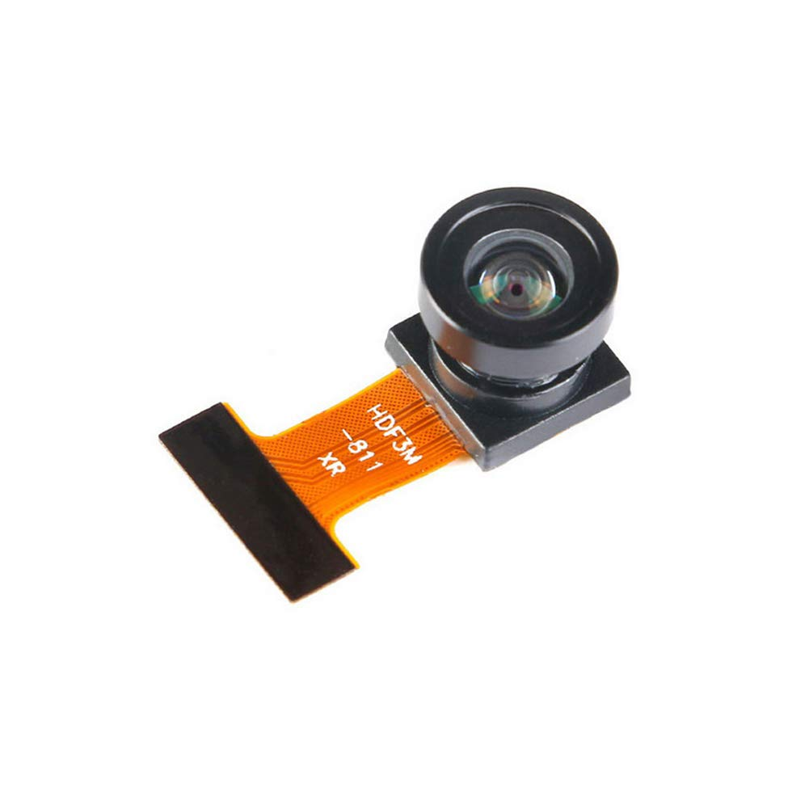
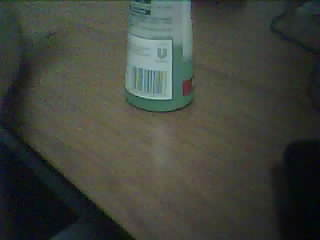
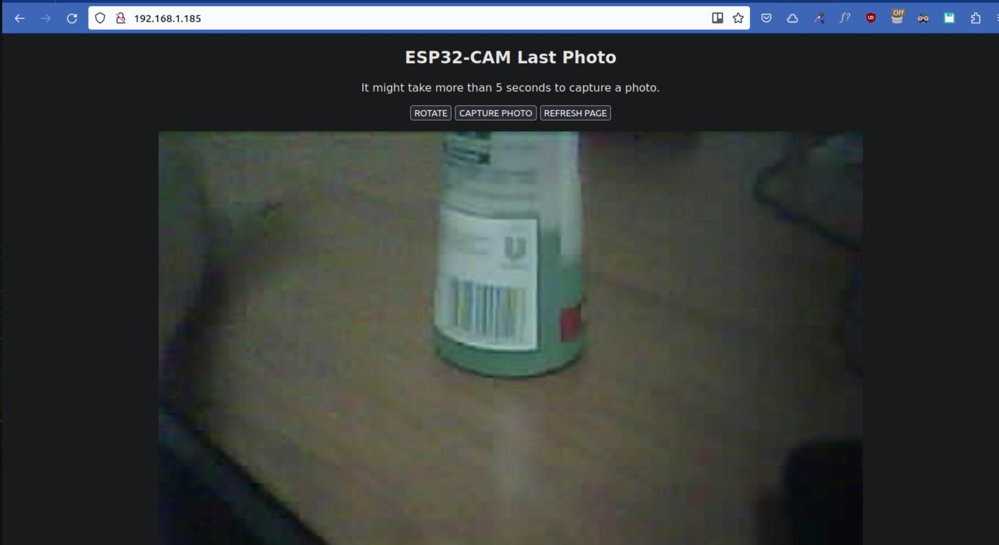

<!-- https://oleksandrg.medium.com/simple-image-classification-on-raspberry-pi-used-the-pre-trained-model-vgg16-part-4-0-afa4f8bdf775  -->
<hr>
<br>


## COSA E' LA OV2640

OV2640 è un sensore di immagine CMOS a colori di tipo retroilluminato (BSI) da 2,0 megapixel prodotto da OmniVision Technologies. È un sensore di immagine a formato 1/3,2 pollici con una risoluzione nativa di 1632x1232 pixel. L'OV2640 è un sensore di immagine molto popolare ed è utilizzato in una varietà di applicazioni, tra cui fotocamere digitali, videocamere digitali, telecamere di sicurezza e telecamere di sorveglianza.

L'OV2640 offre una serie di funzionalità, tra cui:

    Risoluzione di 2,0 megapixel
    Formato 1/3,2 pollici
    Sensore BSI
    Ampio intervallo dinamico (120 dB)
    Basso rumore
    Ottima riproduzione dei colori
    Supporto per l'acquisizione di immagini JPEG e RAW

L'OV2640 è un sensore di immagine versatile e potente che è ideale per una varietà di applicazioni. È un sensore di immagine popolare e ben supportato e sono disponibili molte schede di sviluppo e moduli fotocamera che lo utilizzano.

Ecco alcuni dei vantaggi dell'utilizzo di una camera OV2640:

> Alta risoluzione: l'OV2640 offre una risoluzione di 2,0 megapixel, che consente di acquisire immagini di alta qualità.
    Ampio intervallo dinamico: l'OV2640 ha un ampio intervallo dinamico di 120 dB, che consente di catturare immagini con un'ampia gamma di luminosità.

> Basso rumore: l'OV2640 ha un basso livello di rumore, che consente di acquisire immagini nitide e pulite.
    Ottima riproduzione dei colori: l'OV2640 offre un'ottima riproduzione dei colori, che consente di acquisire immagini realistiche.


### COME INSTALLARE LA CAMERA OV2640 CON WINDOWS

 ecco i passaggi per installare la fotocamera OV2640 su Windows:

- Scarica il driver della fotocamera OV2640 dal sito web del produttore.
- Estrai il contenuto dell'archivio scaricato in una cartella.
- Apri il prompt dei comandi come amministratore.
- Spostati nella cartella in cui hai estratto i file del driver.

quindi esegui il comando seguente per installare il driver:

```bash
.\install.bat
```

e riavvia il computer.

Una volta riavviato il computer, la fotocamera OV2640 dovrebbe essere installata e pronta per l'uso.

### COSA FARE SE LA INSTALLAZIONE NON RIESCE
Ti voglio dare qualche suggerimento aggiuntivo per installare il driver della OV2640:

1. Assicurati che il tuo computer soddisfi i requisiti minimi di sistema per il driver.
2. Se hai problemi a installare il driver, contatta il produttore della fotocamera per assistenza.
3. Se stai utilizzando un sistema operativo Windows 10, potresti dover abilitare la fotocamera nel Pannello di controllo. Per fare ciò, segui questi passaggi:

- Apri il Pannello di controllo.
- Fai clic su "Hardware e suoni".
- Fai clic su "Gestione dispositivi".
- Espandi la categoria "Dispositivi di acquisizione immagini".
- Fai clic con il pulsante destro del mouse sulla fotocamera OV2640 e seleziona "Abilita dispositivo".

##### La fotocamera OV2640 dovrebbe ora essere abilitata e pronta per l'uso.


### COME INSTALLARE LA FOTOCAMERA OV2640 SU RASPBERRY PI 

Su Ubuntu che è la distro Linux che ti suggeriamo puoi seguire questa installazione:

- Accedere alla shell del terminale.
- Eseguire il seguente comando per installare il pacchetto "libv4l-dev":

```bash
sudo apt-get install libv4l-dev
```

- Collegare la fotocamera OV2640 al computer.
- Eseguire il seguente comando per elencare le fotocamere disponibili:

```bash
v4l2-ctl -d /dev/video0
```

##### Se la fotocamera OV2640 è elencata, eseguire il seguente comando per testarla:

```bash
raspistill -t 1000 -o test.jpg
```

Se il comando viene eseguito correttamente, verrà creata un'immagine denominata "test.jpg" nella directory corrente.

Se il comando non viene eseguito correttamente, è possibile che la fotocamera OV2640 non sia compatibile con il sistema operativo Linux o che il driver non sia installato correttamente. In questo caso, è necessario contattare il produttore della fotocamera per assistenza.

Ecco alcuni altri suggerimenti per l'installazione della fotocamera OV2640 su Linux:

-    Assicurarsi che la fotocamera OV2640 sia alimentata correttamente.
-    Utilizzare un cavo USB di alta qualità per collegare la fotocamera al computer.
-    Provare a collegare la fotocamera a una porta USB diversa.
-    Provare a riavviare il computer.
-    Contattare il produttore della fotocamera per assistenza.


### COME ABBIAMO USATO LA CAMERA SU UBUNTU 22.04

Ubuntu 22.04 è attualmente il nostro sistema di riferimento su Linux e lo preferiamo rispetto al normale Raspbian / Raspberry OS per la sua universalità e le risposte che possiamo trovare su <a href="https://askubuntu.com/" target="_blank" rel="noopener">AskUbuntu</a>. In questo post vedremo come programmare la camera per collegarla al WIFI e classificare le foto dal Raspberry.

La camera OV2640 viene installata direttamente sul "telaio" dell'ESP32 in molti "bundle" commerciali disponibili a basso costo. Noi useremo la camera nella foto, un prodotto valido che potete trovare a meno di dieci euro.


##### La camera OV2640


##### La parte ottica della camera ov2640



## COME CLASSIFICARE LE IMMAGINI DELLA CAM USANDO TENSORFLOW

i due programmi che presentiamo permettono di:

1. creare un mini server web sull'ESP32
2. creare il comando "capture" per scattare una foto usando la interfaccia HTML
3. salvare la foto in un file e fornira in rete all'indirizzo della CAM

Per realizzare il programma abbiamo tenuto conto di alcune features che volevamo fossero presenti:

1. La schede ESP32 doveva riconnettersi al WIFI automaticamente 
2. Volevamo evitare i problemi della gestione del "BrownOut" quand su collega la CAM ad una USB dalla tensione instabile
3. Avere un indirizzo IP fisso per permettere al RPI di fare il download della foto in modo sicuro
4. Mostrare come si usano gli interrupt dell'ESP32 per controllare il WIFI e effettuare la riconnessione
5. Mostrare come si puo' scattare una foro con una risoluzione specifica 


### IL PROGRAMMA DA CARICARE SU ESP32


```bash
#include "Arduino.h"
#include "WiFi.h"
#include "driver/rtc_io.h"
#include "esp_camera.h"
#include "esp_timer.h"
#include "img_converters.h"
#include "soc/rtc_cntl_reg.h" // Disable brownour problems
#include "soc/soc.h"          // Disable brownour problems
#include <ESPAsyncWebServer.h>
#include <FS.h>
#include <SPIFFS.h>
#include <StringArray.h>

// Set your Static IP address
IPAddress local_IP(192, 168, 1, 185);
// Set your Gateway IP address
IPAddress gateway(192, 168, 1, 1);

IPAddress subnet(255, 255, 0, 0);
IPAddress primaryDNS(8, 8, 8, 8);   // optional
IPAddress secondaryDNS(8, 8, 4, 4); // optional

const char *ssid = "SSID-xxxx";
const char *password = "passwd-yyyy";

// Create AsyncWebServer object on port 80
AsyncWebServer server(80);

boolean takeNewPhoto = false;

// Photo File Name to save in SPIFFS
#define FILE_PHOTO "/photo.jpg"

// OV2640 camera module pins (CAMERA_MODEL_AI_THINKER)
#define PWDN_GPIO_NUM 32
#define RESET_GPIO_NUM -1
#define XCLK_GPIO_NUM 0
#define SIOD_GPIO_NUM 26
#define SIOC_GPIO_NUM 27
#define Y9_GPIO_NUM 35
#define Y8_GPIO_NUM 34
#define Y7_GPIO_NUM 39
#define Y6_GPIO_NUM 36
#define Y5_GPIO_NUM 21
#define Y4_GPIO_NUM 19
#define Y3_GPIO_NUM 18
#define Y2_GPIO_NUM 5
#define VSYNC_GPIO_NUM 25
#define HREF_GPIO_NUM 23
#define PCLK_GPIO_NUM 22

const char index_html[] PROGMEM = R"rawliteral(
<!DOCTYPE HTML><html>
<head>
  <meta name="viewport" content="width=device-width, initial-scale=1">
  <style>
    body { text-align:center; }
    .vert { margin-bottom: 10%; }
    .hori{ margin-bottom: 0%; }
  </style>
</head>
<body>
  <div id="container">
    <h2>ESP32-CAM Last Photo</h2>
    <p>It might take more than 5 seconds to capture a photo.</p>
    <p>
      <button onclick="rotatePhoto();">ROTATE</button>
      <button onclick="capturePhoto()">CAPTURE PHOTO</button>
      <button onclick="location.reload();">REFRESH PAGE</button>
    </p>
  </div>
  <div></div>
</body>
<script>
  var deg = 0;
  function capturePhoto() {
    var xhr = new XMLHttpRequest();
    xhr.open('GET', "/capture", true);
    xhr.send();
  }
  function rotatePhoto() {
    var img = document.getElementById("photo");
    deg += 90;
    if(isOdd(deg/90)){ document.getElementById("container").className = "vert"; }
    else{ document.getElementById("container").className = "hori"; }
    img.style.transform = "rotate(" + deg + "deg)";
  }
  function isOdd(n) { return Math.abs(n % 2) == 1; }
</script>
</html>)rawliteral";

void WiFiStationConnected(WiFiEvent_t event, WiFiEventInfo_t info) {
  Serial.println("Connected to AP successfully!");
}

void WiFiGotIP(WiFiEvent_t event, WiFiEventInfo_t info) {
  Serial.println("WiFi connected");
  Serial.println("IP address: ");
  Serial.println(WiFi.localIP());
}

void WiFiStationDisconnected(WiFiEvent_t event, WiFiEventInfo_t info) {
  Serial.println("Disconnected from WiFi access point");
  Serial.print("WiFi lost connection. Reason: ");
  Serial.println(info.wifi_sta_disconnected.reason);
  Serial.println("Trying to Reconnect");
  WiFi.begin(ssid, password);
}

void setup() {
  // Serial port for debugging purposes
  Serial.begin(115200);

  // delete old config
  WiFi.disconnect(true);

  delay(1000);

  WiFi.onEvent(WiFiStationConnected,
               WiFiEvent_t::ARDUINO_EVENT_WIFI_STA_CONNECTED);
  WiFi.onEvent(WiFiGotIP, WiFiEvent_t::ARDUINO_EVENT_WIFI_STA_GOT_IP);
  WiFi.onEvent(WiFiStationDisconnected,
               WiFiEvent_t::ARDUINO_EVENT_WIFI_STA_DISCONNECTED);

  /* Remove WiFi event
  Serial.print("WiFi Event ID: ");
  Serial.println(eventID);
  WiFi.removeEvent(eventID);*/

  // Configures static IP address
  if (!WiFi.config(local_IP, gateway, subnet, primaryDNS, secondaryDNS)) {
    Serial.println("STA Failed to configure");
  }

  // Connect to Wi-Fi
  WiFi.begin(ssid, password);
  while (WiFi.status() != WL_CONNECTED) {
    delay(1000);
    Serial.println("Connecting to WiFi...");
  }
  if (!SPIFFS.begin(true)) {
    Serial.println("An Error has occurred while mounting SPIFFS");
    ESP.restart();
  } else {
    delay(500);
    Serial.println("SPIFFS mounted successfully");
  }

  // Print ESP32 Local IP Address
  Serial.print("IP Address: http://");
  Serial.println(WiFi.localIP());

  // Turn-off the 'brownout detector'
  WRITE_PERI_REG(RTC_CNTL_BROWN_OUT_REG, 0);

  // OV2640 camera module
  camera_config_t config;
  config.ledc_channel = LEDC_CHANNEL_0;
  config.ledc_timer = LEDC_TIMER_0;
  config.pin_d0 = Y2_GPIO_NUM;
  config.pin_d1 = Y3_GPIO_NUM;
  config.pin_d2 = Y4_GPIO_NUM;
  config.pin_d3 = Y5_GPIO_NUM;
  config.pin_d4 = Y6_GPIO_NUM;
  config.pin_d5 = Y7_GPIO_NUM;
  config.pin_d6 = Y8_GPIO_NUM;
  config.pin_d7 = Y9_GPIO_NUM;
  config.pin_xclk = XCLK_GPIO_NUM;
  config.pin_pclk = PCLK_GPIO_NUM;
  config.pin_vsync = VSYNC_GPIO_NUM;
  config.pin_href = HREF_GPIO_NUM;
  config.pin_sscb_sda = SIOD_GPIO_NUM;
  config.pin_sscb_scl = SIOC_GPIO_NUM;
  config.pin_pwdn = PWDN_GPIO_NUM;
  config.pin_reset = RESET_GPIO_NUM;
  config.xclk_freq_hz = 20000000;
  config.pixel_format = PIXFORMAT_JPEG;

  if (psramFound()) {
    // config.frame_size = FRAMESIZE_UXGA;
    config.frame_size = FRAMESIZE_QVGA;
    config.jpeg_quality = 10;
    config.fb_count = 2;
  } else {
    config.frame_size = FRAMESIZE_SVGA;
    config.jpeg_quality = 12;
    config.fb_count = 1;
  }
  // Camera init
  esp_err_t err = esp_camera_init(&config);
  if (err != ESP_OK) {
    Serial.printf("Camera init failed with error 0x%x", err);
    ESP.restart();
  }

  // Route for root / web page
  server.on("/", HTTP_GET, [](AsyncWebServerRequest *request) {
    request->send_P(200, "text/html", index_html);
  });

  server.on("/capture", HTTP_GET, [](AsyncWebServerRequest *request) {
    takeNewPhoto = true;
    request->send_P(200, "text/plain", "Taking Photo");
  });

  server.on("/saved-photo", HTTP_GET, [](AsyncWebServerRequest *request) {
    request->send(SPIFFS, FILE_PHOTO, "image/jpg", false);
  });

  // Start server
  server.begin();
}

void loop() {
  if (takeNewPhoto) {
    capturePhotoSaveSpiffs();
    takeNewPhoto = false;
  }
  delay(1);
}

// Check if photo capture was successful
bool checkPhoto(fs::FS &fs) {
  File f_pic = fs.open(FILE_PHOTO);
  unsigned int pic_sz = f_pic.size();
  return (pic_sz > 100);
}

// Capture Photo and Save it to SPIFFS
void capturePhotoSaveSpiffs(void) {
  camera_fb_t *fb = NULL; // pointer
  bool ok = 0; // Boolean indicating if the picture has been taken correctly

  do {
    // Take a photo with the camera
    Serial.println("Taking a photo...");

    fb = esp_camera_fb_get();
    if (!fb) {
      Serial.println("Camera capture failed");
      return;
    }

    // Photo file name
    Serial.printf("Picture file name: %s\n", FILE_PHOTO);
    File file = SPIFFS.open(FILE_PHOTO, FILE_WRITE);

    // Insert the data in the photo file
    if (!file) {
      Serial.println("Failed to open file in writing mode");
    } else {
      file.write(fb->buf, fb->len); // payload (image), payload length
      Serial.print("The picture has been saved in ");
      Serial.print(FILE_PHOTO);
      Serial.print(" - Size: ");
      Serial.print(file.size());
      Serial.println(" bytes");
    }
    // Close the file
    file.close();
    esp_camera_fb_return(fb);

    // check if file has been correctly saved in SPIFFS
    ok = checkPhoto(SPIFFS);
  } while (!ok);
}

```

### IL PROGRAMMA PER RASPBERRY PI

```bash
import requests
import numpy as np
from PIL import Image
from io import BytesIO
from keras.applications.vgg16 import VGG16
from keras.preprocessing import image
from keras.applications.vgg16 import preprocess_input, decode_predictions

model = VGG16(weights='imagenet')
img_path = 'img424.jpg'

response = requests.get("http://192.168.1.185/saved-photo")
tmp = Image.open(BytesIO(response.content))
img = tmp.resize((224, 224))
img.save('img424.jpg')

img = image.load_img(img_path, target_size=(224, 224))
x = image.img_to_array(img)
x = np.expand_dims(x, axis=0)
x = preprocess_input(x)
preds = model.predict(x)

print('Result:', decode_predictions(preds, top=1)[0])
```

### I RISULTATI DEI TEST
Per provare il programma abbiamo usato uma immagine a bassa risoluzione di un flacone di alcool appoggiato sulla nostra scrivania scura: la prima foto è la jpeg che abbiamo fornito a TF, mentre la seconda foto mostra la schermata del sito web fornito dall'ESP32. Il PC è un laptop Ubuntu 22.04.





<p style="font-size: 11px;">R.105.0.1</p
