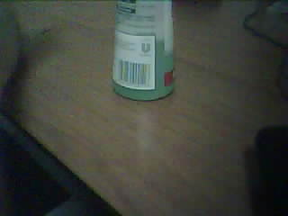

<!-- https://oleksandrg.medium.com/simple-image-classification-on-raspberry-pi-used-the-pre-trained-model-vgg16-part-4-0-afa4f8bdf775  -->

 

> La camera OV2640 richiede un'alimentazione di 5 V DC. È possibile utilizzare un alimentatore esterno da 5 V o alimentare la camera direttamente da una scheda di sviluppo ESP32.

## ALIMENTAZIONE CON ALIMENTATORE ESTERNO

Per alimentare la camera OV2640 con un alimentatore esterno, è necessario collegare i pin di alimentazione VDD e GND della camera ai pin di alimentazione VCC e GND dell'alimentatore. I pin di alimentazione VDD e GND della camera sono solitamente identificati con i simboli +5V e GND.

## ALIMENTAZIONE DA SCHEDA DI SVILUPPO ESP32

Se si utilizza una scheda di sviluppo ESP32, è possibile alimentare la camera OV2640 direttamente dalla scheda. La maggior parte delle schede di sviluppo ESP32 ha un pin di alimentazione dedicato per la camera, che è solitamente indicato con il simbolo CAM. Per alimentare la camera, è sufficiente collegare il pin CAM della scheda di sviluppo ESP32 al pin di alimentazione VDD della camera.

### SCHEMA DI COLLEGAMENTO

Il seguente schema mostra come collegare una camera OV2640 a un alimentatore esterno o a una scheda di sviluppo ESP32:

- +5V (alimentatore esterno) | VDD (camera)
- GND (alimentatore esterno) | GND (camera)
- +5V (scheda di sviluppo) | CAM (camera)
- GND (scheda di sviluppo) | GND (camera)

Attenzione

È importante utilizzare un alimentatore esterno o una scheda di sviluppo ESP32 che sia in grado di fornire almeno 500 mA di corrente.

<!--

-->

R.106.0.1</p
