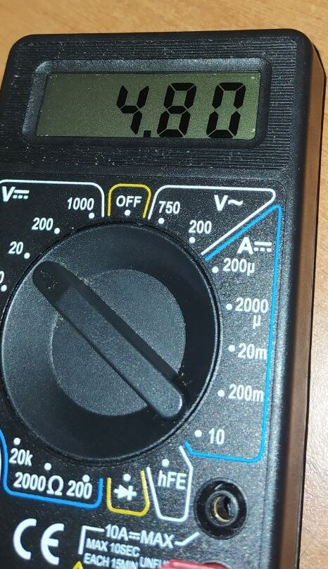

<hr>
<br>


### COSA È IL PIN "VIN" DELLA SCHEDA ESP32?

Il pin "VIN" della scheda ESP32 è un pin di alimentazione che fornisce l'alimentazione alla scheda. Il pin può accettare una tensione compresa tra 3,3 V e 12 V. La tensione nominale è di 5 V. Viene utilizzato per alimentare la scheda ESP32 quando non è possibile utilizzare l'alimentazione USB. Ad esempio, tramite il pin "VIN" si può alimentare la scheda ESP32 da una batteria o da un alimentatore esterno.

> Il pin "VIN" è collegato al regolatore di tensione della scheda ESP32. Il regolatore di tensione converte la tensione in ingresso in una tensione di 3.3V che è la tensione di alimentazione *nativa* dell'ESP32.

**E' un pin importante da conoscere quando si utilizza la scheda ESP32 perchè può funzionare anche come alimentatore per dispostivi esterni quando la scheda viene alimentata via presa USB.**


<br>
Il pin viene spesso chiamato "V5" come vedi in questa immagine: ricorda che "VIN" e "V5" sono del tutto equivalenti.

<br>


<br>
<br>


<br>
<br>

Il display del nostro multimetro mostra solo 4.8V invece dei 5V teorici, la scheda è una ESP32 di media qualità e nell'utilizzo reale potete aspettarvi valori simili.

##### Ecco alcuni dettagli tecnici sul pin "VIN" della scheda ESP32:

```bash
Tensione nominale output: 5V
Range di tensione input: 3.3V - 12V
Corrente massima: 2A
Impedenza: 200 ohm
```

Se vuoi utilizzare il pin "VIN" per fornire corrente all'ESP32 è necessario collegare un alimentatore esterno al pin. L'alimentatore esterno deve fornire una tensione compresa tra 3,3 V e 12 V.


### QUALI DISPOSITIVI ESTERNI POSSO ALIMENTARE QUANDO LA SCHEDA VIENE ALIMENTATA VIA PRESA USB?

La ESP32 può alimentare qualsiasi dispositivo che funzioni a una tensione di 5V o 3,3V. La tensione di uscita della presa USB è di 5V, quindi è possibile alimentare direttamente qualsiasi dispositivo che funzioni a questa tensione. La ESP32 ha anche un pin di uscita 3,3V, quindi è possibile alimentare dispositivi che funzionano a questa tensione utilizzando un convertitore di tensione.

Ecco alcuni esempi di dispositivi che è possibile alimentare con una ESP32 quando viene alimentata via presa USB:

Display LCD
Sensori
Actuator
Moduli wireless
Altri moduli elettronici
È importante notare che la quantità di corrente disponibile per alimentare altri dispositivi dipende dall'alimentatore USB utilizzato. La maggior parte degli alimentatori USB forniscono una corrente di uscita di 500 mA o 1 A. Se si desidera alimentare dispositivi che consumano più corrente, è necessario utilizzare un alimentatore USB con una corrente di uscita maggiore.

> Ad esempio, se si desidera alimentare un display LCD da 128x64 che consuma 100 mA, è possibile farlo utilizzando un alimentatore USB da 500 mA. Se si desidera alimentare un motore che consuma 1 A, è necessario utilizzare un alimentatore USB da 2 A o superiore.

<br>
<br>


<br>
<br>

#### Inoltre, è importante considerare il consumo energetico della stessa ESP32

Il consumo energetico dell'ESP32 varia a seconda del carico e delle impostazioni utilizzate. In generale, l'ESP32 consuma circa 100 mA quando è in standby e 200 mA o più quando è in uso.

Se si desidera alimentare più dispositivi con una ESP32, è importante considerare il consumo energetico totale dei dispositivi. Se il consumo energetico totale è superiore alla corrente di uscita dell'alimentatore USB, l'ESP32 o i dispositivi collegati potrebbero non funzionare correttamente.


### POSSO USARE IL PIN "VIN" PER ALIMENTARE UN DISPOSITIVI ESTERNO?

Sì, come hai visto nella foto è possibile usare il pin "VIN" della scheda ESP32 per alimentare dei dispositivi esterni e puoi ragionevolmente aspettarti una tensione compresa tra 4.8V e 5V.

Per alimentare un dispositivo esterno dal pin "VIN" della scheda ESP32, è necessario collegare il dispositivo al pin "VIN" e al pin <a href="https://en.wikipedia.org/wiki/Ground_(electricity)" target="_blank" rel="noopener">GND</a> della scheda.  Ecco il semplice schema di collegamento:



graph TD
  ESP32 -->|VIN/V5| D[+ POSITIVO del dispositivo esterno]
  ESP32 -->|GND| E[-- negativo del dispositivo esterno]



È importante notare che la corrente massima che può essere fornita dal pin "VIN" è di 2A. Se il dispositivo esterno richiede una corrente superiore devi usare necessariamente un alimentatore esterno o un accumulatore <a href="https://it.wikipedia.org/wiki/Accumulatore_litio-polimero" target="_blank" rel="noopener">LIPO</a> o <a href="https://it.wikipedia.org/wiki/Accumulatore_agli_ioni_di_litio" target="_blank" rel="noopener">Li-Ion</a>.

### COSA RICORDARE

- E' possibile "ricevere" una tensione di 5V dal pin "VIN"/"V5" presente sulla scheda, ma ricorda che la scheda non dovrebbe fornire più di 2.0A in modo continuativo.  

- Dovresti sempre usare un alimentatore esterno stabilizzato per proteggere il dispositivo ESP32 da eventuali sovratensioni. Nelle specifiche teoriche si parla di una tensione compresa tra 3.3V e 12V, ma noi ti consigliamo di fornire 5V~6V. Una tensione di 3.3V comporta fenomeni di "brownout" della scheda mentre tensioni superiori a 6V servono solo ad alzare le temperature. 

<br>
<p style="font-size: 12px;">107.R.3.0.3</p>
