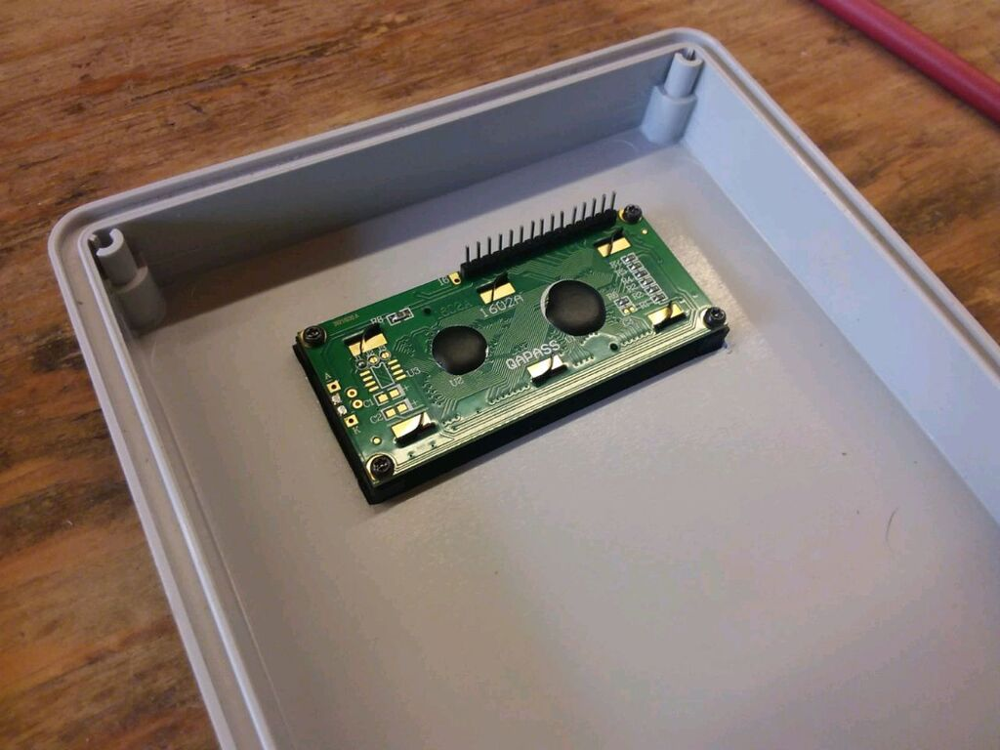

<hr>
<br>

### INTRODUZIONE

> Un semplice progetto con ESP32 o Arduino per leggere in tempo reale il livello dei liquidi in un serbatoio. Useremo un sensore ad ultrasuoni ANGEEK JSN-SR04T con portata max di circa 3.5 mt e un normale display LCD. 

Questo hardware minimale serve a controllare la profondità di un serbatoio fino a circa 4 metri di altezza e a mostrare in real time e in modo continuo il valore della colonna del liquido. Un aspetto interessante e la capacità di adattarsi alla quantità "iniziale" del liquido con una facile calibrazione dei sensori.

La routine di calibrazione per l'ESP32 è davvero semplice ma comunque interessante per chi vuole imparare a programmare con Arduino/Ep32 e vi consigliamo di scaricare il programma (free come sempre) dal nostro sito <a href="https://gist.github.com/sebadima/38770bbaf542c5e1b9f778ffbe4d5831" target="_blank" rel="noopener">Github</a>.

Nell'articolo troverete molte foto della realizzazione pratica e dell'assemblaggio sperimentale che abbiamo adottato per costruire box e circuito.

Dovendo lavorare in un ambiente sottoposto a perdite di liquidi (l'acqua non è amica della elettronica!) Abbiano provveduto a schermare la basetta dalle infiltrazioni usando una cornicetta in plastica PET costruita con la stampante 3D.
<br>
<br>

### I COMPONENTI DEL KIT 


1. Modulo display LCD 16X2 carattere seriale blu con retroilluminazione 
2. Scheda di Sviluppo ESP-WROOM-32 ESP-32 ESP-32S 2.4GHz WiFi
3. Sensore ad ultrasuoni impermeabile ANGEEK JSN-SR04T 
4. Circuito stampato multi-funzione Robotdazero
4  Potenziometro 5 KOhm
5. Alimentatore Wall da 5V e 3A.
6. Circuito stampato multunzione Robotdazero "orange"

> ATTENZIONE: nel kit non sono inclusi: **box, cavetti, connettori Dupont, viti, staffe etc.** Forniamo solo la parte elettronica compreso l'alimentatore da muro. 


### IL CODICE SORGENTE

```bash
#include <LiquidCrystal_I2C.h>
#include <math.h>
#include <Wire.h>

#define I2C_SDA 23
#define I2C_SCL 18
#define VELOCITA_DEL_SUONO 0.034
#define TENTATIVI_CALIBRAZIONE 8

const int echoPin = 21;
const int trigPin = 22;
const int PinPotenziometro = 13;

int   DistanzaCm;
long  DurataPing;

float ValorePotenziometro;   
float h[3];
float CalibrazioneSensore;   
float Livello;   

LiquidCrystal_I2C lcd(0x27,16,2);


void setup() 
{
  Serial.begin(115200);
  Wire.begin(I2C_SDA, I2C_SCL, 10000); 
  lcd.init(); 
  lcd.clear();
  lcd.backlight();
  lcd.setCursor(0,0);  
  lcd.print("Inizio procedura"); 
  delay(3000);  

  pinMode(trigPin, OUTPUT);
  pinMode(echoPin, INPUT);

  for (int ix=1; ix<=TENTATIVI_CALIBRAZIONE; ix++) 
  {
    ValorePotenziometro = round(analogRead(PinPotenziometro)/10);
    h[ix%3] = ValorePotenziometro;  
    Serial.print("Trimmer: ");  
    Serial.println(ValorePotenziometro);  
    lcd.clear();
    lcd.print("Trimmer: "); 
    lcd.print(ValorePotenziometro); 
    delay(1000);  
  }

  Livello = 10 * int((h[0]+h[1]+h[2]) / 30);  
  CalibrazioneSensore = 0;   
  Serial.print("Livello iniziale (cm): ");  
  Serial.println(Livello);  
  Serial.println("Fine setup\n");  

  lcd.clear();
  lcd.setCursor(0,0);
  lcd.print("Liv. iniziale cm:");  
  lcd.setCursor(0,1);
  lcd.print(Livello);  
  delay(3000);  
}


void loop() 
{
  digitalWrite(trigPin, LOW);
  delayMicroseconds(2);
  digitalWrite(trigPin, HIGH);
  delayMicroseconds(10);
  digitalWrite(trigPin, LOW);
  
  DurataPing = pulseIn(echoPin, HIGH);
  DistanzaCm = DurataPing * VELOCITA_DEL_SUONO/2;

  if (!CalibrazioneSensore) {
    CalibrazioneSensore = DistanzaCm;
    Serial.print("Aria libera iniziale (cm): ");  
    Serial.println(CalibrazioneSensore);  
    Serial.println("\n");  
  }

  Serial.print("Aria libera (cm): ");
  Serial.println(DistanzaCm);
  Serial.print("Livello liquido (cm): ");  
  Serial.println(Livello - DistanzaCm + CalibrazioneSensore);  
  Serial.println("\n");  

  lcd.setCursor(0,0);
  lcd.print("Livello liquido:");  
  lcd.setCursor(0,1);
  lcd.print("      ");  
  lcd.setCursor(0,1);
  lcd.print(Livello - DistanzaCm + CalibrazioneSensore);  
  lcd.setCursor(8,1);
  lcd.print("(cm)");  
  delay(2000);  
}
```

### COME COSTRUIRE LA CENTRALINA A COSTO ZERO

Il kit è disponibile sul nostro <a href="https://robotdazero.company.site/Kit-per-profondimetro-digitale-con-ESP32-p594459089" target="_blank" rel="noopener">ecommerce</a> ad un prezzo competitivo, ma nulla vieta di acquistare separatamente i pezzi su Amazon e di fare l'upload del nostro programma sul vostro ESP32. Il codice del programma è "free" e "open source", potete dunque modificarlo a vostro piacere. 

### FOTO DEL KIT MONTATO


<br>
<br>
Contenitore in plastica del sensore di livello liquidi
<br>
<br>
<br>

<br>
<br>
Assemblaggio complessivo del kit 
<br>
<br>
<br>

<br>
<br>
I pezzi principali del kit
<br>
<br>
<br>

<br>
<br>
Vista ravvicinata della basetta con l'ESP32
<br>
<br>
<br>

<br>
<br>
Vista complessiva del kint montato e collaudato
<br>
<br>
<br>

<br>
<br>
Particolare del display LCD 16X2
<br>
<br>


<br>
<br>

<p style="font-size: 12px;">109.R.1.5.5</p
