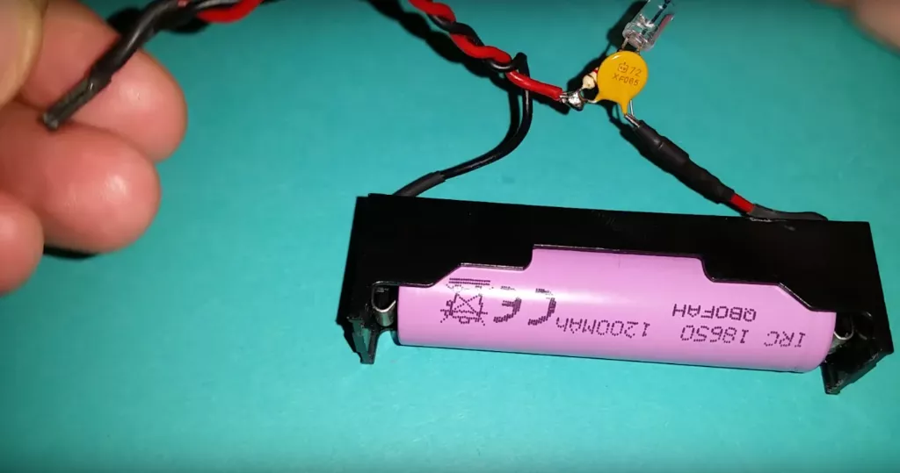

<hr>
<br>

L&#8217;ESP32 è una scheda di sviluppo molto potente e versatile, utilizzata in molte applicazioni IOT. Una delle questioni più importanti quando si lavora con l&#8217;ESP32 è la scelta dell&#8217;alimentazione giusta per garantire il corretto funzionamento della scheda. Può essere alimentato attraverso un&#8217;ampia gamma di fonti di alimentazione, tra cui l&#8217;alimentazione tramite USB, tramite batterie, tramite un alimentatore esterno e molto altro. Ecco alcune delle opzioni più comuni.


## I PIN DI ALIMENTAZIONE DELL'ESP32

Si può alimentare l'ESP32 in due modi diversi: Tramite la presa USB ed erogare 3.3 e 5V dai pin della scheda oppure in alternativa si possono fornire 3.3V o 5V direttamente sulle porte 3.3V e 5V.

Questi sono i pin da usare per la alimentazione della scheda e delle periferiche:

- PIN 3.3V
- PIN 5V
- PIN GROUND (pin della massa)

Le periferiche compatibili possono prevelare dunque 3.3 e 5V da questi PIN quando usiamo la USB.


## ALIMENTAZIONE CON PRESA USB


##### L&#8217;alimentazione tramite USB è una delle opzioni più comuni per l&#8217;ESP32. In questo caso, l&#8217;ESP32 viene alimentato direttamente tramite il cavo USB che viene collegato alla scheda. Questa opzione è molto conveniente e facile da utilizzare, ma non è sempre la soluzione migliore. L&#8217;alimentazione tramite USB può limitare la quantità di corrente disponibile per l&#8217;ESP32, il che può influire sulla sua capacità di funzionare in modo efficiente, soprattutto quando si utilizzano componenti esterni.

> **Le prese USB sono diventate uno standard nella maggior parte dei computer e dei dispositivi elettronici**. Sono utilizzate per alimentare i dispositivi, trasferire dati e fornire connettività a una vasta gamma di periferiche. Purtroppo non tutte le prese USB sono create uguali. In questo articolo, vedremo il voltaggio delle prese USB dei computer e cosa significa per i dispositivi collegati ad esse.

#### Il voltaggio delle prese USB non è sempre di 5V

Il voltaggio delle prese USB può variare a seconda del tipo di porta USB. In genere, le porte USB di tipo 1.0 e 2.0 forniscono un voltaggio di 5 volt, mentre le porte USB di tipo 3.0 e 3.1 forniscono un voltaggio di 5 volt o 12 volt. inoltre non tutte le prese USB forniscono la stessa quantità di corrente. Alcune prese USB possono fornire solo una quantità limitata di corrente diciamo circa 0.5A, mentre altre possono fornire una maggiore quantità di corrente fino a 1.2A.

#### Come controllare il voltaggio delle prese USB?

Per capire il voltaggio delle prese USB, è possibile utilizzare un **voltmetro**. Un voltmetro è un dispositivo che misura la tensione elettrica tra due punti. Per misurare la tensione delle prese USB, è necessario collegare il voltmetro alle prese USB e misurare la tensione. Tuttavia, è importante notare che non tutti i voltmetri sono in grado di misurare la tensione delle prese USB in modo accurato. Alcuni voltmetri potrebbero fornire una lettura inaccurata, a seconda della qualità del dispositivo e della porta USB stessa.

## ALIMENTAZIONE TRAMITE IL PIN VIN
Un altro modo per alimentare <a href="https://amzn.to/447Mz55" target="_blank" rel="noopener">ESP32</a> è utilizzando il pin Vin, comunemente conosciuto come pin 5V. Il pin Vin in ESP32 e in altre schede microcontroller come Arduino è collegato a un regolatore di tensione a bordo. Qualsiasi tensione collegata al pin Vin passa prima attraverso il regolatore, che la riduce a 3,3 V e la alimenta ai periferici della scheda ESP32.
      
Utilizzando una alimentazione esterna regolata da 5V, possiamo alimentare ESP32 attraverso il pin Vin, collegando la GND di ESP32 con la GND esterna dell&#8217;alimentazione. Qualsiasi tensione compresa tra 5V e 12V può essere collegata al pin Vin di ESP32, tuttavia non è consigliabile utilizzare più di 6V o 7V. Poiché ESP32 ha bisogno solo di 3,3 V per funzionare, le restanti tensioni vengono dissipate dal regolatore di tensione LDO sotto forma di calore.

## ALIMENTAZIONE CON BATTERIE RICARICABILI


<br>

La ultima opzione sulla lista per alimentare l&#8217;<a href="https://amzn.to/447Mz55" target="_blank" rel="noopener">ESP32</a> è l&#8217;utilizzo di batterie esterne. L&#8217;ESP32 funziona a 3,3 V, quindi può essere facilmente alimentato utilizzando le batterie esterne. Mentre si alimenta l&#8217;ESP32 con una batteria esterna, utilizzare sempre il pin Vin poiché è collegato a un regolatore di tensione integrato che protegge da qualsiasi tipo di danni all&#8217;ESP32.
      
 Ecco un elenco di tutte le batterie che possono essere utilizzate per alimentare l&#8217;ESP32:
     
Utilizzo di una power bank
Utilizzo di batterie NiMH o batterie standard (2 x 1,5 V)
Batterie al litio
Batterie LiFePO4
Batterie al litio polimero
      
### AVVERTENZE
      
Ecco alcune avvertenze da tenere a mente durante l&#8217;alimentazione dell&#8217;ESP32 con una fonte di alimentazione esterna:
     
Utilizzare sempre una fonte di alimentazione a tensione regolata
Non collegare dispositivi all&#8217;ESP32 che richiedono più corrente, come i motori
Non utilizzare più di una fonte di alimentazione contemporaneamente
Se il regolatore di tensione si surriscalda, spegnere la scheda ESP32.

#### Le batterie ricaricabili LIPO



<br>

Gli accumulatori al litio sono utilizzati in una vasta gamma di dispositivi elettronici, come telefoni cellulari, computer portatili, tablet, droni elettrici, automobili elettriche e molto altro ancora. In questo articolo, vedremo come funzionano gli accumulatori al litio e quali sono i loro vantaggi e svantaggi.

Come funzionano gli accumulatori al litio?

> **Gli accumulatori al litio funzionano attraverso il processo di ioni di litio che si spostano attraverso l&#8217;elettrolita tra gli elettrodi positivi e negativi**. Quando gli ioni di litio si spostano verso l&#8217;elettrodo positivo, si verifica una reazione chimica che rilascia energia elettrica. Quando gli ioni di litio si spostano verso l&#8217;elettrodo negativo, la batteria viene ricaricata.

Gli accumulatori al litio hanno molte caratteristiche positive rispetto ad altri tipi di batterie. In primo luogo, sono leggeri e compatti, il che li rende adatti per l&#8217;uso in dispositivi portatili. In secondo luogo, hanno una durata della vita più lunga rispetto ad altre batterie. Infine, gli accumulatori al litio sono in grado di mantenere una tensione costante durante la maggior parte della loro scarica, il che significa che possono fornire una potenza costante ai dispositivi.

Quali sono i vantaggi e gli svantaggi degli accumulatori al litio?

Come tutte le tecnologie, gli accumulatori al litio hanno vantaggi e svantaggi.

Vantaggi:

  1. **Leggeri** e **compatti**: gli accumulatori al litio sono leggeri e compatti, il che li rende adatti per l&#8217;uso in dispositivi portatili.
  2. **Lunga** **durata** della vita: gli accumulatori al litio hanno una durata della vita più lunga rispetto ad altre batterie.
  3. **Potenza** **costante**: gli accumulatori al litio sono in grado di mantenere una tensione costante durante la maggior parte della loro scarica, il che significa che possono fornire una potenza costante ai dispositivi.

Svantaggi:

  1. **Costi**: gli accumulatori al litio possono essere costosi rispetto ad altre batterie.
  2. **Rischio** **di** **incendio**: gli accumulatori al litio possono causare incendi se non vengono caricati, scaricati o conservati correttamente.
  3. **Sensibilità** **alla** **temperatura**: gli accumulatori al litio possono essere sensibili alle temperature estreme.

> Gli accumulatori al litio sono diventati uno standard nell&#8217;industria delle batterie per i loro vantaggi in termini di leggerezza, durata della vita e potenza costante. Tuttavia, hanno anche degli svantaggi in termini di costi, rischio di incendio e sensibilità alla temperatura. È importante utilizzare gli accumulatori al litio in modo sicuro e corretto per evitare danni o incidenti.

## ALIMENTAZIONE CON ALIMENTATORE ESTERNO


<br>
<br>

L&#8217;alimentazione tramite alimentatore esterno è un&#8217;altra opzione che può essere utile quando si lavora con l&#8217;ESP32. In questo caso, l&#8217;ESP32 viene alimentato attraverso un alimentatore esterno, il quale fornisce una tensione di alimentazione costante e stabile. Questa opzione è particolarmente utile quando si utilizzano sensori o componenti esterni che richiedono una maggiore quantità di corrente. Per realizzare progetti come la <a href="https://www.robotdazero.it/blog/una-centralina-elettronica-per-controllare-il-livello-di-un-serbatoio/" target="_blank" rel="noopener">Centralina controllo livello liquidi</a>  che puoi trovare in <a href="https://robotdazero.company.site/Kit-per-profondimetro-digitale-con-ESP32-p594459089" target="_blank" rel="noopener">kit</a> sul nostro <a href="https://robotdazero.company.site/" target="_blank" rel="noopener">ecommerce</a>, la soluzione con alimentatore esterno rimane al momento la soluzione migliore.
  

### -- GLI ALIMENTATORI DA LABORATORIO

Gli alimentatori elettrici da laboratorio sono strumenti fondamentali per chi lavora con l&#8217;elettronica. Consentono di fornire tensione e corrente regolabili e stabili ai circuiti elettronici, sia per la verifica del funzionamento dei componenti che per la progettazione e la sperimentazione di nuovi circuiti. In questo articolo, esploreremo come funzionano gli alimentatori elettrici da laboratorio e quali sono le loro caratteristiche principali.

##### Come funzionano gli alimentatori elettrici da laboratorio?
Gli alimentatori elettrici da laboratorio funzionano mediante la conversione di tensione alternata (AC) in tensione continua (DC). L&#8217;alimentatore dispone di un trasformatore che converte la tensione alternata della presa a muro in una tensione alternata di bassa frequenza, che viene quindi raddrizzata e filtrata per ottenere una tensione continua. Questa tensione continua viene quindi regolata e controllata mediante circuiti di regolazione per fornire alla uscita dell&#8217;alimentatore una tensione e una corrente costanti e regolabili.
Quali sono le caratteristiche principali degli alimentatori elettrici da laboratorio?
          

<strong>Tensione e corrente regolabili</strong>: la capacità di regolare la tensione e la corrente dell&#8217;alimentatore è fondamentale per adattarsi alle esigenze specifiche del circuito elettronico in fase di test o sperimentazione.
          <strong>Stabilità</strong>: la tensione e la corrente devono essere stabili per evitare danni al circuito in fase di test. L&#8217;alimentatore deve mantenere una tensione e una corrente costante anche in presenza di carichi variabili.
          <strong>Protezioni</strong>: l&#8217;alimentatore deve essere dotato di protezioni come cortocircuiti, sovraccarichi e surriscaldamenti per evitare danni al circuito in fase di test e prevenire il rischio di incendi.

<strong>Display</strong>: gli alimentatori moderni sono dotati di display LCD che forniscono informazioni sulla tensione e la corrente in uscita, consentendo un controllo accurato dei valori.
          <strong>Interfaccia</strong> <strong>utente</strong>: gli alimentatori moderni possono essere dotati di un&#8217;interfaccia utente facile da usare, composta da pulsanti e manopole per la regolazione dei valori di tensione e corrente.
      
<br>

> In conclusione, gli alimentatori elettrici da laboratorio sono strumenti fondamentali per chi lavora con l&#8217;elettronica. Consentono di fornire tensione e corrente regolabili e stabili ai circuiti elettronici, sia per la verifica del funzionamento dei componenti che per la progettazione e la sperimentazione di nuovi circuiti. Quando si sceglie un alimentatore elettrico da laboratorio, è importante valutare le caratteristiche principali come la regolazione della tensione e della corrente, la stabilità, le protezioni, il display e l&#8217;interfaccia utente per garantire un funzionamento sicuro ed efficace.

<br>

Indipendentemente dalla fonte di alimentazione scelta, **è importante assicurarsi che la tensione di alimentazione fornita sia stabile e costante**. Inoltre, è importante scegliere la giusta tensione di alimentazione in base alle <a href="https://www.mischianti.org/it/2020/05/30/esp32-piedinatura-specifiche-e-configurazione-dellarduino-ide-parte-1/" target="_blank" rel="noopener">specifiche</a> dell&#8217;ESP32.

### COME RIDURRE IL CONSUMO ENERGETICO 
##### L'ESP32 è in grado di entrare in modalità sleep
In questa modalità il consumo energetico è ridotto a soli 5 µA. Può essere utilizzata per estendere la durata della batteria di un dispositivo ESP32.
Ad esempio, un progetto di domotica che deve monitorare un sensore di temperatura potrebbe entrare in modalità sleep quando il sensore non rileva alcun cambiamento di temperatura. 

In questo modo, il dispositivo ESP32 consumerà solo una piccola quantità di energia, anche se è in funzione 24 ore su 24, 7 giorni su 7.

### COSA E LA MODALITÀ "SLEEP" DELL ESP32?

La modalità sleep dell'ESP32 è una modalità di funzionamento in cui il consumo energetico del chip è notevolmente ridotto. In modalità sleep, la CPU, la maggior parte della RAM e tutte le periferiche che sono clockate da <a href="https://stackoverflow.com/questions/74925441/esp32-attaching-an-interrupt-directly-to-system-time" target="_blank" rel="noopener">APB_CLK</a> vengono disattivate. 

##### Le uniche parti del chip che rimangono attive sono:

1. Il controller <a href="https://docs.espressif.com/projects/esp-idf/en/latest/esp32/api-reference/system/system_time.html" target="_blank" rel="noopener">RTC</a>
2. Il coprocessore <a href="https://docs.espressif.com/projects/esp-idf/en/latest/esp32/api-reference/system/ulp.html" target="_blank" rel="noopener">ULP</a>
3. La memoria RTC FAST
4. La memoria RTC SLOW

La modalità sleep può essere utilizzata per estendere la durata della batteria di un dispositivo ESP32. Ad esempio, un dispositivo che deve monitorare un sensore di temperatura potrebbe entrare in modalità sleep quando il sensore non rileva alcun cambiamento di temperatura. 

In questo modo, il dispositivo ESP32 consumerà solo una piccola quantità di energia, anche se è in funzione 24 ore su 24, 7 giorni su 7.

##### L'ESP32 offre due modalità sleep:

Light sleep: 
> In modalità light sleep, la CPU e la maggior parte della RAM rimangono attive, ma il loro consumo energetico è ridotto.

Deep sleep: 
> In modalità deep sleep, la CPU, la maggior parte della RAM e tutte le periferiche che sono clockate da <a href="https://stackoverflow.com/questions/74925441/esp32-attaching-an-interrupt-directly-to-system-time" target="_blank" rel="noopener">APB_CLK</a> vengono disattivate.
La modalità deep sleep è più efficiente dal punto di vista energetico rispetto alla modalità light sleep, ma richiede più tempo per riattivare il dispositivo.

Per entrare in modalità sleep, il programmatore deve utilizzare la funzione 
```bash
esp_deep_sleep_start(). 
```
Questa funzione accetta un parametro che specifica il tempo di attesa prima che il dispositivo venga riattivato. Se il parametro è impostato su 0, il dispositivo verrà riattivato da un evento di riattivazione.
<br>
<br>


+++++++++++++++++++++++++++++++++++++++++++++++++++++
++++++++++++++++++++++++++++++++++++++++++++++++++++


## LA ANALISI DETTAGLIATA DEI CONSUMI NELLE VARIE MODALITA'

Quanye sono esattamente esattamente la modalità Sleep dell'ESP32?

Grazie alla sua hestione avanzata dell'alimentazione, l'ESP32 offre cinque modalità di alimentazione configurabili. Secondo il requisito di alimentazione:

- Modalità "Attiva" 
- Modalità "Modem Sleep" 
- Modalità "Light Sleep"
- Modalità "Deep Sleep"
- Modalità "Hibernation"

Ogni modalità ha caratteristiche distinte e capacità di risparmio energetico. Diamo un'occhiata a loro uno per uno.

### Modalità #1: "Attiva" 
La modalità normale è anche indicata come modalità attiva. In questa modalità, tutte le periferiche del chip rimangono attive.

Poiché tutto è sempre attivo in questa modalità (in particolare il modulo WiFi, il core di elaborazione e il modulo Bluetooth), il chip consuma circa 240 mA di potenza. Occasionalmente la scheda può assorbire più di 750 mA in particolare quando sia WiFi e Bluetooth sono utilizzati contemporaneamente.


<div class="alert alert-doks d-flexflex-shrink-1" role="alert">🔑
<strong>Secondo la scheda tecnica ESP32</strong>, il consumo energetico durante le operazioni RF in modalità attiva è il seguente:
</div>

<br>

1. Pacchetto Wi-Fi Tx 13dBm~21dBm **160**~**260** mA
2. Pacchetto Wi-Fi/BT Tx 0dBm **120** mA
3. Wi-Fi / BT Rx e ascolto **80** ~ **90** mA

Questa modalità consuma il massimo della potenza ed è la meno efficiente. Per risparmiare energia, è necessario disabilitare le funzionalità che non sono in uso passando a un'altra modalità di alimentazione.


### Modalità #2: "Modem Sleep" 

In modalità sleep modem, tutto è attivo tranne il WiFi, il Bluetooth e la radio. La CPU rimane attiva e l'orologio è configurabile.

In questa modalità, il chip può consumaew dai **3** mA fino a **20** mA.

Per mantenere attiva la connessione, Wi-Fi, Bluetooth e la radio vengono svegliati a intervalli predefiniti. Durante questo schema di sospensione, ESP32 passa dalla modalità attiva alla modalità di sospensione del modem.

Per realizzare questo sofisticato sistema, l'ESP32 si collega al router in modalità "station mode" usando "DTIM beacon": il modulo Wi-Fi viene disabilitato tra due attivazioni del beacon DTIM e quindi ri-abilitato poco prima dell'arrivo del prossimo beacon. 

Il tempo di sonno è determinato dal tempo di intervallo ddak timing DTIM del router, parliamo di circa 200 ms a 1000 ms.

#### Che cos'è il meccanismo DTIM Beacon?


> **DTIM è l'acronimo di Delivery Traffic Indication Message**:
In questo meccanismo, il punto di accesso (AP)/router trasmette frame beacon periodicamente. Ogni frame contiene informazioni relative alla rete. Viene utilizzato per annunciare la presenza di una rete wireless e per sincronizzare tutti i membri connessi.


### Modalità #3: "Light Sleep”" 

Questa modalità è molto simile al "modem sleep" associazione. L'unica differenza è che in modalità light sleep, la CPU, la maggior parte della RAM e le periferiche digitali sono dotate di clock.

##### Che cosa è il "Clock Gating"?

> **Clock gating è una tecnica di gestione dell'alimentazione** per ridurre il consumo di potenza dinamica rimuovendo o ignorando il segnale di clock della scheda. Il <a href="https://anysilicon.com/the-ultimate-guide-to-clock-gating/" target="_blank">Clock gating</a> riduce il consumo energetico ignorando alcuni cicli del clock (<a href="https://en.wikipedia.org/wiki/Clock_gating" target="_blank">pruning</a>). Con questo sistema vengono disabilitate alcune parti del circuito e in particolare vengono bloccati i circuiti di <a href="https://www.sciencedirect.com/topics/engineering/flip-flop-circuits" target="_blank">flip-flop</a>, impedendo loro di commutare stato. Poichè i circuiti di flip-flop consumano una buona dose di energia, il consumo energetico complessivo viene ridotto enormemente.

Durante la modalità light sleep, la CPU viene messa in pausa disabilitando il suo impulso di clock. Il bmodulo RTC e il coprocessore ULP, d'altra parte, rimangono attivi. Ciò si traduce in un consumo energetico inferiore rispetto alla modalità sleep del modem, che è di circa **0,8** mA.

Prima di entrare in modalità light sleep, ESP32 memorizza il suo stato interno nella RAM e riprende il funzionamento al risveglio dal sonno. Questo è indicato come ritenzione RAM completa.


### Modalità #4: "Deep Sleep”" 

In modalità deep sleep, le CPU, la maggior parte della RAM e tutte le periferiche digitali sono disabilitate. Solo le seguenti parti del chip rimangono operative:

1. Coprocessore ULP
2. RTC: fast and slow memory
3. Regolatore di RTC
7. Periferiche RTC


<div class="alert alert-doks d-flexflex-shrink-1" role="alert">🔑 <strong>L'ESP32 ha 8kB di memoria SRAM  </strong> che nella nomenclatura di Espressif diventano la "RTC fast memory". I dati salvati sulla RTC non vengono cancellati durante il sonno profondo. Tuttavia, verranno cancellati quando si preme il pulsante di reset (il pulsante etichettato **EN** o "RST" sulla scheda ESP32). </div>

<br>

In modalità deep sleep, il chip consuma tra **0,15** mA (quando il coprocessore ULP è acceso) e **10** µA. Parliamo di **µA** e quindi in questa modalità il consumo **può** scendere praticamente a zero!
<br>

> Durante la modalità deep sleep, la CPU principale viene spenta, mentre il coprocessore **ULP** (**Ultra-Low-Power**) può rilevare le letture del sensore e riattivare la CPU in base alle esigenze. Tutto ciò è utile per progettare applicazioni in cui la CPU deve essere svegliata da un evento esterno, come un **timer**, pur mantenendo un consumo energetico minimo.

<div class="alert alert-doks d-flexflex-shrink-1" role="alert">🔑 <strong>Tutto ciò che è memorizzato nella memoria principale viene cancellato</strong> e non è più possibile accedervi. Al contratio la piccolissima  memoria RTC viene mantenuta attiva e il suo contenuto viene conservato fino al "risveglio" del chip. Questo è il motivo per cui il chip memorizza i dati di connessione Wi-Fi e Bluetooth proprio nella memoria RTC!
. </div>

<br>

#### Come conservare i dati ad ogni riavvio nella modalità deep sleep

Se vuoi utilizzare i dati dopo un riavvio, devi memorizzarli nella memoria **RTC** definendo una variabile globale con l'attributo *RTC_DATA_ATTR*. Ad esempio, RTC_DATA_ATTR int myVar = 0;

```bash
RTC_DATA_ATTR int myVar = 0;
```

Quando il chip si sveglia dal sonno profondo, esegue un reset e inizia l'esecuzione del programma dall'inizio.

Quando si sveglia dal sonno profondo, l'ESP32 può eseguire uno stub di veglia del sonno profondo. È un pezzo di codice che viene eseguito non appena il chip si sveglia, prima che venga eseguito qualsiasi normale inizializzazione, bootloader o codice ESP-IDF. Dopo aver eseguito il wake stub, il chip può tornare a dormire o continuare ad avviare ESP-IDF normalmente.

Se sei interessato a saperne di più su ESP32 Deep Sleep e le sue fonti di risveglio, visita il nostro tutorial approfondito qui sotto.

Tutorial per ESP32 Deep Sleep Wakeup Sources
ESP32 Sonno profondo e le sue fonti di risveglio
Quando il tuo progetto IoT è alimentato da un adattatore a muro, non ti importa troppo del consumo energetico. Ma se hai intenzione di alimentare il tuo...
ESP32 Modalità di ibernazione
La modalità Hibernate è molto simile al sonno profondo. L'unica differenza è che in modalità ibernazione, il chip disabilita l'oscillatore interno a 8 MHz e il coprocessore ULP, lasciando solo un timer RTC (su clock lento) e alcuni GPIO RTC per riattivare il chip.

Poiché anche la memoria di ripristino RTC è disattivata, non è possibile salvare i dati in modalità ibernazione.

ESP32 Modalità di ibernazione Schema a blocchi funzionale
Di conseguenza, il consumo energetico del chip è ulteriormente ridotto; in modalità ibernazione, consuma solo circa 2,5 µA.

Questa modalità è particolarmente utile se si sta lavorando su un progetto che non ha bisogno di essere attivo tutto il tempo.


<p style="font-size: 0.80em;">Robotdazero.it - post - 110.R.1.6.0 </p>
