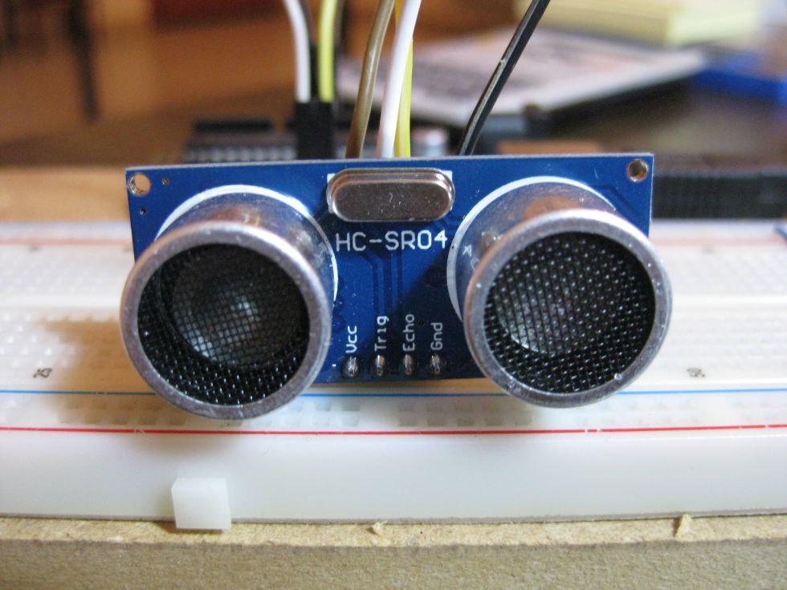
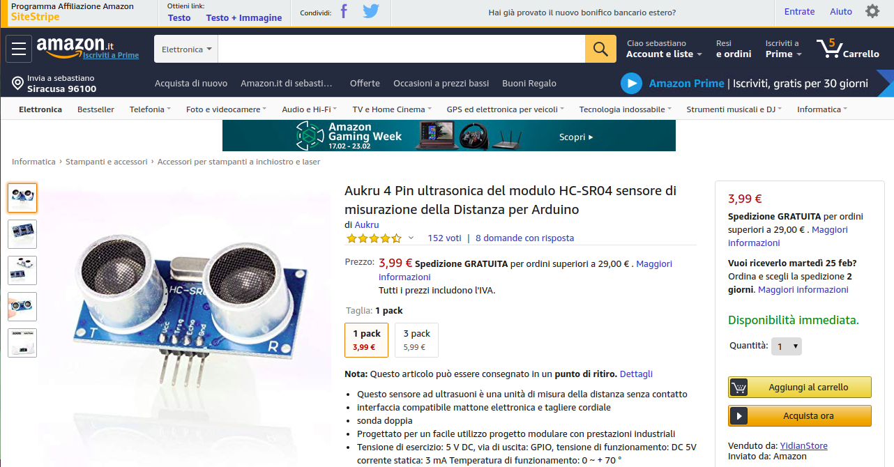
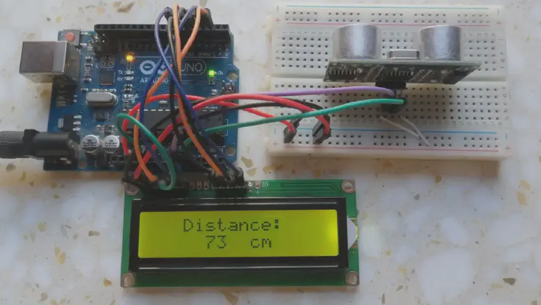
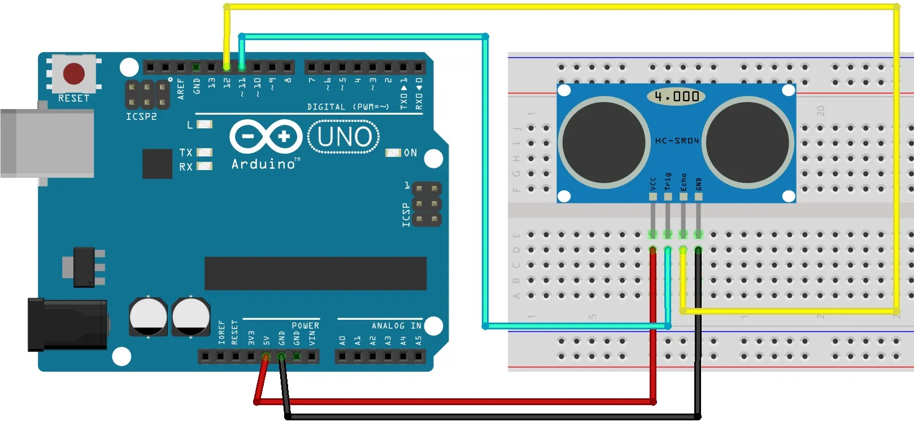

<hr>
<br>

## COSA SONO I SENSORI A ULTRASUONI?

In breve sono l’equivalente elettronico delle orecchie dei pipistrelli, niente horror comunque: si tratta di microfoni specialmente sensibili ai suoni oltre i 20 Khz (Kilo Hertz), generalmente non udibili dall’orecchio umano ma facilmente recepiti dai mammiferi. Pensa a cose come il fischietto per i cani o ai **ping** usati sui sottomarini per trovare le navi.

> La versione *consumer* del <a href="https://it.wikipedia.org/wiki/Sonar" target="_blank" rel="noopener">sonar</a> viene usata nei sensori di parcheggio delle automobili e grazie alla enorme diffusione i costi si sono abbassati moltissimo. Ne useremo un esemplare per il movimento autonomo di un piccolo rover.


## COME CALCOLARE LE DISTANZE USANDO GLI ULTRASUONI 

Per calcolare le distanze usando gli ultrasuoni, si sfrutta il principio del tempo di volo. Un sensore ad ultrasuoni emette un impulso sonoro che si propaga nell'aria a una velocità di circa 343 metri al secondo. Quando l'impulso incontra un ostacolo, viene riflesso indietro verso il sensore. Misurando il tempo che intercorre tra l'emissione e la ricezione dell'impulso, è possibile calcolare la distanza dell'ostacolo.

La formula per calcolare la distanza in centimetri è:

distanza = velocità del suono * tempo di volo / 2
Ad esempio, se il tempo di volo è di 10 millisecondi, la distanza è:

distanza = 343 m/s * 10 ms / 2 = 171,5 cm
In alcuni casi, è necessario tenere conto della temperatura dell'aria, che può influenzare la velocità del suono. La formula corretta è quindi:

distanza = velocità del suono (a temperatura T) * tempo di volo / 2
La velocità del suono in aria varia a seconda della temperatura, secondo la seguente formula:

velocità del suono = 331,4 + 0,6 * T
dove T è la temperatura in gradi Celsius.

In pratica, è possibile utilizzare un sensore ad ultrasuoni per misurare la distanza di un ostacolo in diversi modi. Un modo semplice è quello di utilizzare un Arduino. In questo caso, è necessario collegare il sensore ai pin di Arduino e scrivere un programma che generi un impulso ad ultrasuoni e misuri il tempo di volo.

## COME USARE IL SENSORE A ULTRASUONI HC-SR04 CON ARDUINO

In questo post vedremo come usare il sensore HCSR04 e cercheremo di spiegare come si usa, come funziona e quali caratteristiche ci possono fare comodo per lavorare con Arduino e i nostri Robot in genere. Di seguito riporto le caratteristiche elettriche e dopo vedremo come usarlo in un progetto pratico.



###### Il sensore HC-SR04 montato su una Breadboard per Arduino

<br>
<br>


<br>

###### Pagina di Amazon.it con un esempio del prezzo medio (3.99 euro) 

<br>

#### DESCRIZIONE {#DESCRIZIONE}

Come detto prima l’HC-SR04 usa il principio del Sonar per calcolare la distanza da un oggetto e dunque sfrutta la riflessione del suono sugli ostacoli solidi e la costanza della velocità del suono. Riesce a fornire con buona esattezza la distanza da un oggetto e restituisce dei valori costanti e progressivi, senza ritardi.

> Fisicamente è piccolo, seppure non minuscolo e nella parte anteriore presenta due tronchi di cono in plastica. Uno si limita a trasmettere il segnale mentre l’altro lo riceve. Il sensore rileva il segnale e crea un impulso elettrico di durata proporzionale al ritardo.

### • CARATTERISTICHE ELETTRICHE E DINAMICHE





##### Le specifiche tecniche del sensore HC-SR04:

1. Alimentazione       : +5V DC
2. Corrente a riposo   : &lt;2mA
3. Corrente di lavoro  : 15mA
4. Angolo panoramico   : &lt;15°
5. Distanza di rilevazione : 2cm – 400 cm
6. Risoluzione : 0.3 cm
7. Angolo di misurazione: 30 gradi
8. Durata del segnale di trigger: 10uS
9. Dimensioni: 45mm x 20mm x 15mm


#### Come funziona?

Nel dettaglio in sensore opera in questo modo:

1. Il trasmettitore manda un impulso ad ultrasuoni,
2. Il segnale sonoro incontra un oggetto solido,
3. Il ricevitore riceva l’onda riflessa (l’impulso riflesso).

Il tempo che passa tra la trasmissione e la ricezione del segnale ci permette di calcolare la distanza reale di un oggetto. Come è possibile? Perchè sappiamo con precisione la velocità del suono a livello del mare che è circa 330 mt al secondo e basta fare una proporzione per avere la distanza in centimetri, la risoluzione che verosimilmente ci servirà con i Robot mobili.

## UN PROGETTO PER MISURARE LE DISTANZE USANDO ARDUINO E IL SENSORE HCSR04

In questi progetto il sensore legge e scrive la distanza da un oggetto nel monitor serial del tuo IDE Arduino. L’obiettivo del progetto è iniziare a capire come funziona il sensore, poi nella parte centrale di questo post costruiremo un vero Robot, con una logica di funzionamento “complessa” e capacità dinamiche.

**Nota:** Esiste una libreria per Arduino chiamata NewPing che ci renderà il lavoro molto più semplice.

#### LE PARTI RICHIESTE

Ecco una lista delle cose che vi serviranno:

- Arduino UNO
- Sensore Ultrasonico (HCSR04)
- Breadboard
- Jumper
- Batteria 9V
- Portabatteria con Jack standard 9V




#### I COLLEGAMENTI ELETTRICI

Nella parte sinistra in alto i pin del sensore HCSR04, a destra quelli di Arduino:


graph TD
 VCC -->|5V| E[Arduino]
  Trig -->|PIN 11| E[Arduino]
  Echo -->|PIN 12| E[aaa]
  GND -->|GND| E[Scheda Arduino]



- VCC <--> 5V&nbsp; di Arduino
- Trig&nbsp; <--> Pin 11 di Arduino
- Echo <--> Pin 12 di Arduino
- GND <-->  GND di Arduino


### • IL CODICE COMPLETO

```bash
/*
 *
    Trasmissione : PinTrasmissione Pin 11
    Ricezione    : PinRicezione    Pin 12
    VCC          : +5VDC
    GND          : GND
 */

int PinTrasmissione = 11; 
int PinRicezione    = 12; 
long durata, cm;

void setup() {
  // Inizializza la porta seriale
  Serial.begin (9600);
  // Setta i pin di Arduino per l'input e l'output
  pinMode(PinTrasmissione, OUTPUT);
  pinMode(PinRicezione, INPUT );
}

void loop() {
  // Il sensore viene attivato
  // da impulsi più lunghi di 10 microsecondi
  digitalWrite(PinTrasmissione, LOW);
  delayMicroseconds(5);
  digitalWrite(PinTrasmissione, HIGH);
  delayMicroseconds(10);
  digitalWrite(PinTrasmissione, LOW);

  // Ora legge il segnale dal sensore: un impulso 
  // HIGH segna il tempo in microsecondi tra
  // la trasmissione e la ricezione del segnale.
  pinMode(PinRicezione, INPUT);
  durata = pulseIn(PinRicezione, HIGH);

  // Calcola la distanza partendo dalla durata:
  // Divide inizialmente per 2 la durata per
  // tenere conto di andata e ritorno.
  cm = (durata/2) / 29.1;     
  // Dividiamo per 29.1  che sarebbe come moltiplicare
  // per 0.0343 (i cm percorsi in un microsecondo 
  // da una onda sonora a livello del mare...).
  
  Serial.print("cm:");
  Serial.print(cm);
  Serial.println();
  // Scrive "cm: valore" + una riga vuota

  delay(250);
}
```

Copia e incolla questo programma nel tuo IDE di arduino, fai l’upload con la compilazione automatica, **ignora i warning** e fai attenzione ai messaggi di errore.


#### Come funziona il codice in dettaglio {#come-funziona-il-codice-in-dettaglio}

Per prima cosa dobbiamo creare le variabili per il pin di trasmissione e per quello di ricezione. Il pin di trasmissione è connesso al Pin digitale 11, mentre quello di Ricezione va al Pin digitale 12:

    int PinTrasmissione = 11; 
    int PinRicezione    = 12;
    

Poi serve creare due variabili del tipo **long** per conservare i valori di durata e centimetri. La variabile “durata” conserva il tempo tra trasmissione e ricezione del segnale, la variabile “cm” conserva la distanza in centimetri.

    long durata, cm;
    

Nella fase di setup(), la porta seriale viene inizializzata a 9600 di baud rate, e vengono settati i pin di Output e Input.

    Serial.begin (9600);
    pinMode(PinTrasmissione, OUTPUT);
    pinMode(PinRicezione, INPUT );
    

Nel loop() inneschiamo il sensore mandando un impulso HIGH di 10 microsecondi. Ma prima mandiamo un breve impulso LOW per resettare il sensore e ottenere un impuso HIGH più pulito:

    digitalWrite(PinTrasmissione, LOW);
    delayMicroseconds(5);
    digitalWrite(PinTrasmissione, HIGH);
    delayMicroseconds(10);
    digitalWrite(PinTrasmissione, LOW);
    

Fatto questo possiamo leggere il segnale dal sensore, un impulso HIGH la cui durata esprime il tempo in microsecondi passato fra la tramissione dell’impulso e la sua ricezione.

In poche parole il sensore **invia un impulso elettrico più lungo** a secondo della distanza, in questo modo il calcolo aritmetico diventa quindi una semplice moltiplicazione.

    durata = pulseIn(PinTrasmissione, HIGH);
    

Adesso dobbiamo convertire la durata dell’ **impulso elettrico** del sensore in una vera distanza in centimetri. La calcoliamo in questo modo solo apparentemente complesso:

    prima versione:
    distanza = (durata/2) x (la velocità del suono)
       e poichè la velocità è esattamente: 0.0343 cm/microsecondo...
    
    seconda versione:
    distanza = (durata/2)  x 0.0343
       e visto che 1/0.0343 equivale a 29.1 avremo*
    
    terza versione:
    distanza = (durata /2) / 29.1 
    
    *moltiplicare per 0.343 è come dividere per l'inverso (cioè 29.1)
    

Inoltre dobbiamo dividere per due perchè **il sensore non distingue tra andata e ritorno** ed emette un valore complessivo errato, per così dire, ma facile da correggere.

> Ma alla fine tutto si riduce a questa semplice operazione: distanza = (durata /2) / 29.1 e per ora questo ci basta!

A fine programma scriviamo il risultato su Monitor Seriale dell’ IDE:

    Serial.print("cm:");
    Serial.print(cm);
    Serial.println();
    

**Poichè siamo dentro a loop() non ci serve usare istruzioni “FOR” o “WHILE”: la logica interna del software di Arduino ci risparmia questa operazione**. Con altri linguaggi senza il costrutto sintattico “loop()” dovremmo arrangiarci scrivendo altre linee di codice.

&nbsp;

### • IL PROGRAMMA PER ARDUINO MODIFICATO CON L’USO DI NEWPING

Newping è una una libreria alternativa per la Robotica e non solo, molto semplice da usare. NewPing in certe occasioni risulta consigliabile quando dobbiamo limitarci a calcolare distanze in modo diretto, senza elaborare il segnale di ritorno. 


```bash
/*
 * Libreria Open Source disponibile su: 
   https://playground.arduino.cc/Code/NewPing
*/

#include 

#define PIN_TRASMISSIONE 11
#define PIN_RICEZIONE    12
#define DISTANZA_MAX    200

// Settiamo i pin di Arduino e la distanza massima
NewPing sonar(PIN_TRASMISSIONE, PIN_RICEZIONE, DISTANZA_MAX); 

void setup() {
   Serial.begin(9600);
}

void loop() {
   delay(50);
   unsigned int distanza = sonar.ping_cm();
   Serial.print(distanza);
   Serial.println(" cm");
}  
```


#### Come funziona il programma con NewPing {#come-funziona-il-programma-con-newping}

Calcolare la distanza di un oggetto con NewPing è molto semplice. Innanzitutto devi includere la la libreria nel programma:

    #include <NewPing.h>
    

Poi come al solito devi definire i Pin di Trasmissione e di ricezione. Il Pin di trasmissione del sensore viene connesso al Pin 11 di Arduino mentre quello di Ricezione finisce sul Pin 12. Bisogna inoltre definire una distanza massima.

    #define PIN_TRASMISSIONE 11
    #define PIN_RICEZIONE 12
    #define DISTANZA_MAX 200
    

Adesso possiamo **chiamare** la libreria dal programma:

    NewPing sonar(PIN_TRASMISSIONE, PIN_RICEZIONE, DISTANZA_MAX); 
    

Nel setup(), come al solito bisogna settare la Porta Seriale allavelocità di 9600 baud (bit al secondo).

    Serial.begin(9600);
    

Infine nel loop(), per avere la distanza in cm basta usare la chiamata di funzione ping_cm(). In questo caso possiamo parlare di **metodo** perchè il linguaggio C++ da cui deriva il linguaggio di Arduino è un linguaggio di programmazione **ad oggetti**. Noi ci adeguiamo alla terminologia e invece di chiamata a funzione parliamo di **metodo**.

    unsigned int distanza = sonar.ping_cm();
    Serial.print(distanza);
    Serial.println(" cm");
    

Le solite istruzioni di **print** permettono di vedere sull’IDE di Arduino le distanza dagli oggetti anche in movimento. Provate a vedere la differenza di comportamento con il programma precedente. Se tutto ha funzionato correttamente non dovremmo avere differenze.

<p style="font-size: 12px;">111.R.1.0.1</p>
