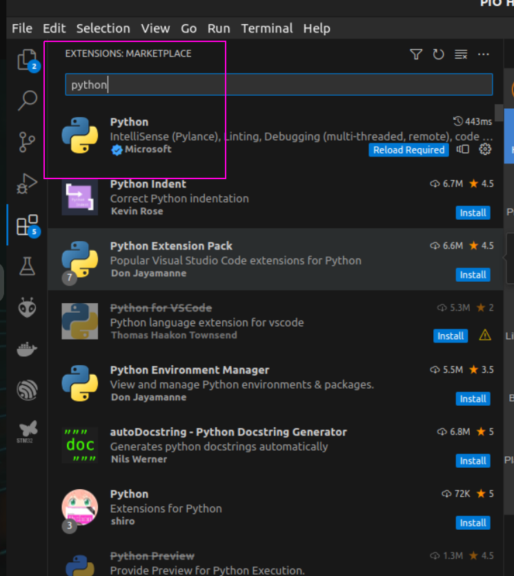

##### Visual Studio Code è un editor di codice open source gratuito e potente che può essere utilizzato per scrivere codice in una varietà di linguaggi, tra cui Python. 

In questo articolo, ti mostreremo come installare e configurare Visual Studio Code per <a href="https://www.python.org/" target="_blank" rel="noopener">Python</a>, come scrivere ed eseguire codice Python e come utilizzare alcune delle funzionalità <a href="https://learn.microsoft.com/it-it/visualstudio/ide/writing-code-in-the-code-and-text-editor?view=vs-2022" target="_blank" rel="noopener">avanzate</a> di Visual Studio Code.

## INSTALLAZIONE

Per installare <a href="https://code.visualstudio.com/download" target="_blank" rel="noopener">Visual Studio Code</a>, vai al sito web di Visual Studio Code e fai clic sul pulsante "Download". Una volta scaricato, installa Visual Studio Code sul tuo computer.

Per configurare Visual Studio Code per Python, apri l'editor e fai clic sul pulsante "Extensions" nell'angolo in alto a sinistra. Nella barra di ricerca, digita "Python" e fai clic sul pulsante "Install" per installare l'estensione "Python".





Una volta installata l'estensione, Visual Studio Code sarà pronto per l'uso con Python.

## SCRITTURA ED ESECUZIONE DI CODICE PYTHON

Per scrivere codice Python in Visual Studio Code, crea un nuovo file con l'estensione ".py". Ad esempio, puoi creare un file chiamato "hello.py".

Inserisci il seguente codice nel file "hello.py":


```bash
print("Hello, world!")
```

Per eseguire il codice, fai clic con il pulsante destro del mouse sul file e seleziona "Run".
Il codice verrà eseguito e visualizzerà il seguente output:

> "Hello, world!"


## FUNZIONALITÀ AVANZATE

Visual Studio Code offre una serie di funzionalità avanzate per Python, tra cui:

- IntelliSense: <a href="https://code.visualstudio.com/docs/editor/intellisense" target="_blank" rel="noopener">IntelliSense</a> fornisce suggerimenti di completamento automatico e informazioni sui tipi di dati.
- Debug: Visual Studio Code include un <a href="https://it.wikipedia.org/wiki/Debugger" target="_blank" rel="noopener">debugger</a> integrato che ti consente di eseguire il debug del tuo codice Python.
- Linting: Il <a href="https://it.wikipedia.org/wiki/Lint_(software)" target="_blank" rel="noopener">lint</a> è un processo che analizza il tuo codice alla ricerca di errori e potenziali problemi.
- Test: Visual Studio Code supporta una varietà di <a href="https://www.develer.com/blog/data-driven-testing-con-python/" target="_blank" rel="noopener">framework di test</a> per Python.

Per saperne di più su queste funzionalità, consulta la <a href="https://code.visualstudio.com/docs" target="_blank" rel="noopener">documentazione</a> di Visual Studio Code.

##### Conclusione

Visual Studio Code è un editor di codice potente e <a href="https://code.visualstudio.com/learn" target="_blank" rel="noopener">versatile</a> che può essere utilizzato per scrivere codice Python. Con un po' di configurazione, puoi iniziare a scrivere e eseguire codice Python in Visual Studio Code in pochi minuti.


<br>
<p style="font-size: 12px;">R.115.1.6.0</p>
<br>	