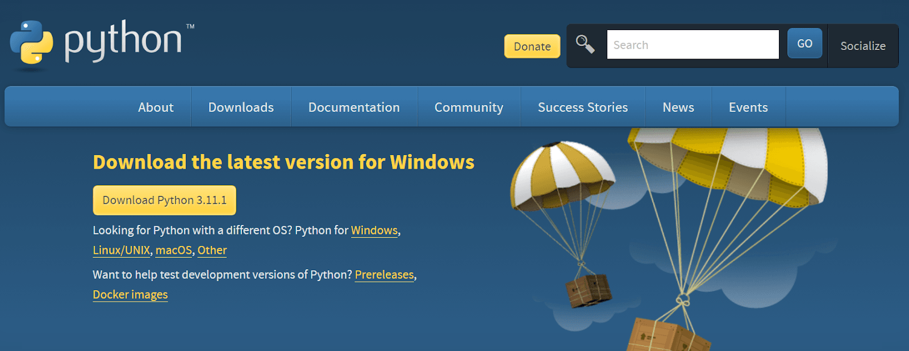

##### Visual Studio Code è un editor di codice open source gratuito e potente che può essere utilizzato per scrivere codice in una varietà di linguaggi, tra cui Python. 

In questo articolo, ti mostreremo come installare e configurare Visual Studio Code per <a href="https://www.python.org/" target="_blank" rel="noopener">Python</a>, come scrivere ed eseguire codice Python e come utilizzare alcune delle funzionalità <a href="https://learn.microsoft.com/it-it/visualstudio/ide/writing-code-in-the-code-and-text-editor?view=vs-2022" target="_blank" rel="noopener">avanzate</a> di Visual Studio Code.

## Installazione super rapida

Per installare <a href="https://code.visualstudio.com/download" target="_blank" rel="noopener">Visual Studio Code</a>, vai al sito web di Visual Studio Code e fai clic sul pulsante "Download". Una volta scaricato, installa Visual Studio Code sul tuo computer.

Per configurare Visual Studio Code per Python, apri VSCode e fai clic sul pulsante "Extensions" nell'angolo in alto a sinistra. Nella barra di ricerca, digita "Python" e fai clic sul pulsante "Install" per installare l'estensione "Python".


Una volta installata l'estensione, Visual Studio Code sarà pronto per l'uso con Python.

### Scrittura ed esecuzione di codice Python

Per scrivere codice Python in Visual Studio Code, crea un nuovo file con l'estensione ".py". Ad esempio, puoi creare un file chiamato "hello.py".

Inserisci il seguente codice nel file "hello.py":


```bash
print("Hello, world!")
```

Per eseguire il codice, fai clic con il pulsante destro del mouse sul file e seleziona "Run".
Il codice verrà eseguito e visualizzerà il seguente output:

> "Hello, world!"


### Funzionalità avanzate 

Visual Studio Code offre una serie di funzionalità avanzate per Python, tra cui:

- IntelliSense: <a href="https://code.visualstudio.com/docs/editor/intellisense" target="_blank" rel="noopener">IntelliSense</a> fornisce suggerimenti di completamento automatico e informazioni sui tipi di dati.
- Debug: Visual Studio Code include un <a href="https://it.wikipedia.org/wiki/Debugger" target="_blank" rel="noopener">debugger</a> integrato che ti consente di eseguire il debug del tuo codice Python.
- Linting: Il <a href="https://it.wikipedia.org/wiki/Lint_(software)" target="_blank" rel="noopener">lint</a> è un processo che analizza il tuo codice alla ricerca di errori e potenziali problemi.
- Test: Visual Studio Code supporta una varietà di <a href="https://www.develer.com/blog/data-driven-testing-con-python/" target="_blank" rel="noopener">framework di test</a> per Python.

Per saperne di più su queste funzionalità, consulta la <a href="https://code.visualstudio.com/docs" target="_blank" rel="noopener">documentazione</a> di Visual Studio Code.


## La guida completa per usare Python con Visual Studio Code


### Installazione di Python

Vai su <a href="https://www.python.org/downloads/" target="_blank" rel="noopener">Python.org</a> e scarica l'ultima versione per Windows. Il programma di installazione è disponibile anche per Linux / Unix, macOS e altre piattaforme. Dopo aver scaricato il programma di installazione, puoi installare tranquillamente Python con le impostazioni predefinite. 


	
Possiamo anche installare Python utilizzando vari strumenti CLI o attraverso il Windows Store. 

- Windows Store (<a href="https://apps.microsoft.com/detail/9PJPW5LDXLZ5?hl=en-US&gl=US" target="_blank" rel="noopener">link</a>)
- Homebrew (<a href="https://docs.brew.sh/Homebrew-and-Python" target="_blank" rel="noopener">link</a>)
- (sudo) apt-get install su Ubuntu (<a href="https://phoenixnap.com/kb/how-to-install-python-3-ubuntu" target="_blank" rel="noopener">link</a>)


### Installazione di VSCode
La installazione è davvero super semplice. Scarica e installa la build stabile dal <a href="https://code.visualstudio.com/download" target="_blank" rel="noopener">sito</a> ufficiale. Il programma di installazione è disponibile per tutti i tipi di sistemi operativi, compresi i browser Web. 

Scarica VSCode dal sito ufficiale.png


### Esecuzione di Python in VSCode

Dopo aver installato Python e VSCode, è il momento di scrivere un breve programmino da eseguire all'interno dell'IDE. 


#### Come creare un nuovo file 

All'inizio, vedrai la nota di benvenuto. Ignora tutto e vai su File > Nuovo file di testo o usa la scorciatoia da tastiera Ctrl + N per creare un nuovo file. Quindi scrivi il comando "print" per visualizzare il classico "Hello World”.


#### Salviamo il file Python

Salva il file usando Ctrl + S. Seleziona la directory del file e digita il nome del file. Assicurati di aggiungere'. py ' alla fine del nome del file. 


#### Selezionare l'interprete 

Per eseguire il file Python, è necessario selezionare l'interprete Python. Per impostazione predefinita, l'ambiente Anaconda viene fornito con Python versione 3.9.13.


#### Eseguire un file Python

Per eseguire il file Python, è sufficiente fare clic sul pulsante Esegui in alto a sinistra, come mostrato nell'immagine. Inizializzerà il terminale ed eseguirà il file Python per visualizzare l'output. 
	
Puoi anche digitare python test.py nel terminale per eseguire il file presente nella directory corrente. 

#### Installazione di estensioni essenziali VSCode Python
Le estensioni Python di VSCode sono usate per la modifica del codice, il linting, la formattazione, debug, test e selezione dell'ambiente. 

#### Come installare una estensione in VSCode 

Fai clic sull'icona della casella sulla barra delle attività o usa la scorciatoia da tastiera: Ctrl + Maiusc + X per aprire il pannello delle estensioni. Digit una qualsiasi parola chiave nella barra di ricerca per esplorare tutti i tipi di estensioni. 


#### Come installare la estensione per Python

Nel nostro caso, digiteremo Python e installeremo l'estensione Python facendo clic sul pulsante Installa, come mostrato sopra. 

Elenco delle estensioni 

1. Python

- IntelliSense (completamento automatico del codice)<br>
- Linting (Pylint, Flake8)<br>
- Formattazione del codice (nero, autopep)<br>
- Debug<br>
- Test (unittest, pytest) <br>
- Notebook Jupyter<br>
- Ambienti (venv, pipenv, conda)<br>
- Refactoring <br><br>

2. Indent-rainbow
Indent-rainbow ci fornisce un rientro colorato multilivello per una migliore leggibilità del codice. Otteniamo colori alternati su ogni passo e ci aiuta a evitare errori di indentazione comuni. 

3. Python-indent
Python-indent ci aiuta con la corretta indentazione. Premendo il tasto Invio, l'estensione analizzerà il file Python e determinerà come la riga successiva deve essere rientrata. È una utility preziosa che permette di risparmiare molto tempo. 

4. Jupyter Notebook Renderers
Jupyter Notebook Renderers fa parte del Jupyter Extension pack. Ci aiuta a renderizzare l'output plotly, vega, gif, png, svg e jpeg. 

5. autoDocstring
L'estensione autoDocstring ci aiuta a generare rapidamente docstring per le funzioni Python. Digitando le virgolette triple """ o "' all'interno della funzione, possiamo generare e modificare docstring. Scopri di più sulle stringhe doc seguendo il nostro tutorial su Python Docstrings.


<div class="alert alert-doks d-flexflex-shrink-1" role="alert">👋 Nota: la maggior parte delle estensioni e delle funzionalità di sviluppo Python sono dotate di estensioni "py". 
</div>


### VSCode e Python per la "Analisi dati"

Visual Studio Code consente agli utenti di eseguire programmi Python dentro i notebook Jupyter. Possiamo eseguire la cella e visualizzare il risultato all'interno di VSCode. Supporta tutti i tipi di linguaggi di programmazione e viene fornito con funzionalità integrate per integrare i notebook Jupyter nell'IDE.

Per utilizzare l'estensione Jupyter notebook, è necessario prima installare un notebook Jupyter. 

```bash
pip install jupyterlab
```


```bash
pip install notebook
```

<div class="alert alert-doks d-flexflex-shrink-1" role="alert">👋 Nota: Jupyter Notebook e Jupyter Lab sono integrati nella distribuzione Anaconda, quindi non è necessario installare nulla. 
</div>

<br>


##### Se non stai usando Anaconda puoi comunque installare l'estensione Jupyter su Visual Studio Marketplace. 

Per creare un file Jupyter notebook, possiamo creare un nuovo file con .estensione **ipynb** o accedere alla tavolozza dei comandi (Ctrl + Maiusc + P) e selezionare Jupyter.

#### Crea uno nuovo notebook Jupyter

Scegli il kernel **Ipython**<br>


Per inizializzare il server Jupyter, dobbiamo selezionare il kernel facendo clic sul kernel picker in alto a destra del notebook, come mostrato nell'immagine.

> Nota: Per impostazione predefinita, Anaconda viene fornito con Python versione 3.9.13. È possibile scaricare l'ultima versione di Python 3.11, ma non supporta tutti i pacchetti. 

Esegui la cella Jupyter<br><br>


Usa "print" per visualizzare "Hello world" e premi il pulsante Esegui. 


Aggiungi un'altra cella<br>


++++++++++++++++++++++++++++++


È possibile utilizzare il tasto B o fare clic su + Codice per aggiungere una nuova cella ed eseguire la cella con Ctrl + Enter Invio. È possibile conoscere le scorciatoie da tastiera Jupyter su defkey.


### Linting
Linting evidenzia i problemi nel codice sorgente Python e ci fornisce suggerimenti. In genere mette in evidenza questioni sintattiche e stilistiche. Linting aiuta a identificare e correggere i problemi di codifica che possono portare a errori. 

È possibile selezionare il metodo di linting selezionando Python: Selezionare il comando Linter nella tavolozza dei comandi (Ctrl + Maiusc + P). È inoltre possibile attivare manualmente il metodo linting in impostazioni. 

Selezionare il metodo di linting<br>

++++++++++++++++++++++	


Nel nostro caso, abbiamo selezionato il metodo flake8. È inoltre possibile rivedere l'elenco dei metodi di linting disponibili.

Enable / Disable Linting: selezionare Python: Enable / Disable Linting nella tavolozza dei comandi. 
Esegui Linting: tavolozza comandi (Ctrl + Maiusc + P) > Python: Esegui Linting.
Correggere l'errore.png

Correzione dell'errore

Dopo aver eseguito il linter Python, vedrai i problemi con i suggerimenti. 

Nota: Abilitando un linter diverso verrà richiesto di installare il pacchetto Python richiesto.

Formattare
La formattazione rende il codice leggibile. Segue regole specifiche per interlinea, rientri, spaziatura attorno agli operatori e parentesi di chiusura. L'estensione Python supporta tre metodi di formattazione Python: autopep8, black o yapf.

Leggendo su PEP-8: Python Naming Conventions & Code Standards, puoi imparare la guida allo stile di Python e le regole di formattazione.

Selezionare il formattatore Python.png

Selezionare il formatter Python

Per accedere all'opzione di formattazione, dobbiamo aprire il pannello delle impostazioni andando su Preferenze - > Impostazioni o usando la scorciatoia da tastiera: Ctrl +,. Successivamente, digita " python formatting provider "nella barra di ricerca e seleziona" nero " dal menu a discesa.

Configurare Python formatter.png

Configurare Python formatter

Per formattare il file Python su save, dobbiamo cercare format on save nelle Impostazioni e abilitare l'opzione Editor: Format on Save.

Debug e test in VSCode
Debug
L'estensione Python viene fornito con il debug per tutti i tipi di applicazioni come applicazioni multi-threaded, web e remote. Possiamo impostare punti di interruzione, ispezionare i dati ed eseguire programmi passo dopo passo. 

Selezionare una configurazione di debug.png

Selezionare una configurazione di debug

Avviare la scheda debug facendo clic sull'icona di debug sulla barra delle azioni o utilizzando la scorciatoia da tastiera Ctrl + Maiusc +D. Per personalizzare le opzioni di debug, fare clic su crea un avvio.file json e selezionare il file Python. 

Pannello di debug.png

Pannello Debug

Esegui il debug facendo clic sul pulsante blu Esegui e Debug, e verrà eseguito il file Python e ci mostrerà le variabili, Guarda, Stack di chiamate e punti di interruzione. 

Debug rapido.png

Debug rapido

Per il debug rapido, è sempre possibile fare clic sulla freccia giù accanto al pulsante Esegui e selezionare Debug Python File.

Test


##### Conclusione

Visual Studio Code è un editor di codice potente e <a href="https://code.visualstudio.com/learn" target="_blank" rel="noopener">versatile</a> che può essere utilizzato per scrivere codice Python. Con un po' di configurazione, puoi iniziare a scrivere e eseguire codice Python in Visual Studio Code in pochi minuti.

<br>
<br>
<p style="font-size: 0.85em;">R.115.2.0.0</p>