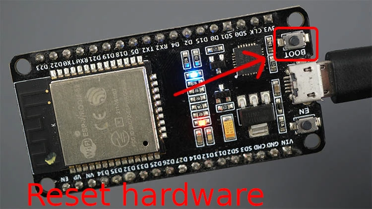

In casi di freezing  o anomalie dell' ESP32 esistono due modi per resettarlo:

1. Reset hardware: Bisona tenere premuto il pulsante RESET per almeno 3 secondi.
2. Reset software: Serve utilizzare il bootloader per cancellare la memoria flash dell'ESP32.



### RESET HARDWARE

Il reset hardware è il modo più semplice per resettare la scheda ESP32. Basta tenere premuto il pulsante RESET per almeno 3 secondi. Questo farà sì che l'ESP32 si riavvii e inizi a eseguire il codice dal <a href="https://docs.espressif.com/projects/esp-idf/en/latest/esp32/api-guides/bootloader.html" target="_blank" rel="noopener">bootloader</a>.

### RESET SOFTWARE

Il reset software è un modo più completo per resettare la scheda ESP32. Cancella la memoria flash dell'ESP32, quindi l'ESP32 inizierà a eseguire il codice dal bootloader.

Per eseguire un reset software, è necessario utilizzare il bootloader. Il bootloader è un programma incorporato nell'ESP32 che consente di caricare nuovo codice sull'ESP32.

## RESET ALLE CONDIZIONI DI FABBRICA

In certe situazioni l'ESP32 può bloccarsi continuamente senza motivi apparenti o non riesce a caricare dei nuovi programmi. Se neppure la presione del tasto **boot** riesce a risolvere il problema è preferibile resettare alle condizioni di fabbrica la CPU. Lo strumento che useremo si chiama esptool.
##### Ecco i passaggi per eseguire un reset software:


- Connetti la scheda ESP32 al computer utilizzando un <a href="https://linuxhint.com/cable-used-for-esp32/" target="_blank" rel="noopener">cavo USB</a>.
- Apri un terminale e impostalo sulla porta seriale associata alla scheda ESP32.
- Esegui il seguente comando:


```bash
esptool.py --chip esp32 erase_flash
```

> Questo comando cancellerà la memoria flash dell'ESP32.
Riavvia la scheda ESP32.
Dopo il riavvio, l'ESP32 inizierà a eseguire il codice dal bootloader.

### EFFETTI DEL RESET

Sia il reset SW che HW azionano una serie di operazioni nella CPU:
 che in dettagCome Arduino l'azionamento Il reset della scheda ESP32 ha i seguenti effetti:

- Cancella la memoria flash dell'ESP32.
- Ripristina l'ESP32 alle impostazioni di fabbrica.
- Cancella tutte le configurazioni e i dati memorizzati sull'ESP32.


## QUANDO RESETTARE LA SCHEDA ESP32

Il reset della scheda ESP32 può essere utile in una serie di situazioni, ad esempio:

1. Se la scheda ESP32 è bloccata o non risponde.
2. Se si desidera cancellare tutte le configurazioni e i dati dall'ESP32.
3. Se si desidera installare una nuova versione del firmware sull'ESP32.

### RESETTARE LA SCHEDA ESP32 USANDO ESPTOOL.PY

Per eseguire un reset di fabbrica ESP32, useremo esptool, che è “un'utilità basata su Python, open-source, indipendente dalla piattaforma per comunicare con il bootloader ROM nei chip Espressif.“

Per installare esptool, è necessario installare Python 3.7 o più recente sul sistema. Puoi scaricare e installare Python al seguente  <a href="https://www.python.org/downloads/" target="_blank" rel="noopener">link</a>(assicurati di scaricare il pacchetto giusto per il tuo sistema):

Scarica Python
Con Python 3 installato, aprire una finestra di terminale e installare l'ultima stabile esptool.py rilascio con pip:

pip installa esptool
Nota: con alcune installazioni Python quel comando potrebbe non funzionare e riceverai un errore. Se questo è il caso, provare a installare esptool.py con:

```bash
pip3 install esptool
python -m pip install esptool
pip2 install esptool
```
Setuptools è anche un requ


<br>
<p style="font-size: 12px;"> R.119.1.0.1 </p>
<br>
