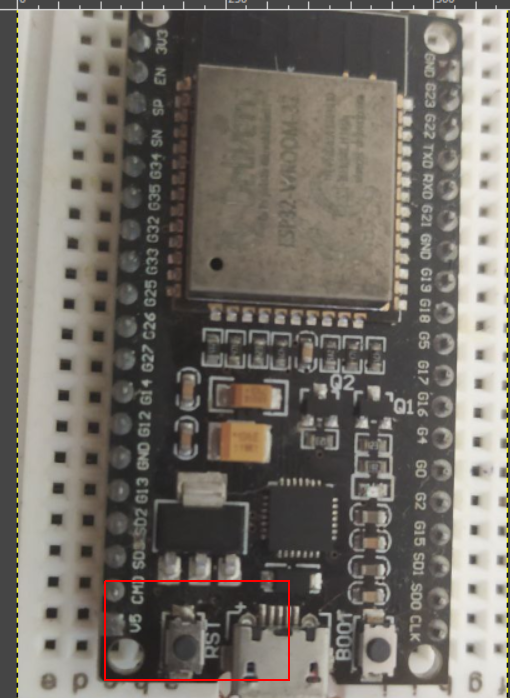

<!--
https://randomnerdtutorials.com/esp32-erase-flash-memory/
-->


<hr>

## INTRODUZIONE
Questa è una guida rapida che mostra come cancellare la memoria flash ESP32 per ripristinarla allo stato originale. "Flashare" l'ESP32 potrebbe essere utile se si desidera eliminare eventuali modifiche apportate al firmware o alle impostazioni di configurazione. E' inoltre una procedua consigliata se il sistema si blocca costantemente e non è possibile caricare nuovo codice o  per cancellare i dati che non sono più necessari.

## RESET IMMEDIATO
In casi di freezing o anomalie occasionali dell'ESP32 esiste un modo rapido per resettare la scheda: basta tenere premuto il pulsante **EN** (Enable) = **RST** (Reset) per almeno 3 secondi come si vede nella foto.



<br>
<br>

Dopo la pressione del tasto l'ESP32 si riavvierà ed eseguirà il codice dal <a href="https://docs.espressif.com/projects/esp-idf/en/latest/esp32/api-guides/bootloader.html" target="_blank" rel="noopener">bootloader</a> interno: è la stessa procedura che avviene quando lo collegate alla alimentazione o fate l'upload in un nuovo codice C++.

## QUANDO RESETTARE COMPLETAMENTE
Il reset della scheda ESP32 può essere utile in una serie di situazioni più gravi, come ad esempio:

1. Se la scheda ESP32 è bloccata o non risponde.
2. Se vuoi cancellare tutte le configurazioni e i dati dalla scheda.
3. Se vuoi installare una nuova versione del firmware.

## COME EFFETTUARE IL RESET
Per eseguire un reset di fabbrica ESP32, useremo <a href="https://github.com/espressif/esptool" target="_blank" rel="noopener">ESPTOOL</a>, una utility basata su Python in grado di comunicare con il bootloader ROM.

Per usare esptool, è necessario installare prima Python 3.8 o una versione più recente. Puoi scaricare e installare Python dal seguente <a href="https://www.python.org/downloads/" target="_blank" rel="noopener">link</a> ma assicurati di scaricare il pacchetto giusto per il tuo sistema.

Con Python 3 installato, apri un terminale di comando e installa l'ultima versione stabile di esptool.py con <a href="https://pip.pypa.io/en/stable/" target="_blank" rel="noopener">PIP</a>:

```bash
pip install esptool
```
#### Nota: con alcune installazioni Python questo comando potrebbe non funzionare e riceverai un errore. In questo caso, provare a installare esptool.py con queste tre soluzioni alternative:

```bash
pip3 install esptool
oppure
python -m pip install esptool
oppure infine
pip2 install esptool
```

Dopo l'installazione, **esptool.py** dovrebbe essere presente nella directory predefinita degli eseguibili Python: a questo punto siamo in grado di eseguirlo con il comando esptool. Nella finestra del terminale digita:

```bash
python -m esptool
```

Adesso non ci resta che cancellare la memoria flash ESP32 per completare il reset di fabbrica. 

### CANCELLARE LA MEMORIA FLASH
Segui questi tre passaggi in sequenza:

1. Collega l'ESP32 al PC
2. Apri un terminale sul tuo PC
3. Tieni premuto il pulsante di avvio dell'ESP32 (BOOT)
4. Digita:

```bash
python -m esptool --chip esp32 erase_flash
```

5. Dopo l'inizio della **cancellazione** puoi rilasciare il pulsante BOOT/FLASH e in pochi secondi la memoria flash dell'ESP32 verrà cancellata. 


<br>
<p style="font-size: 0.75em;">R.119.1.2.1</p>
<br>