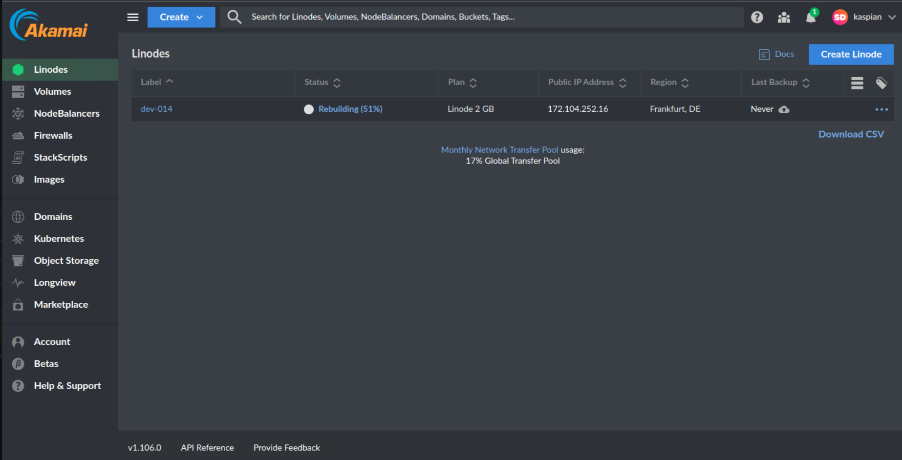
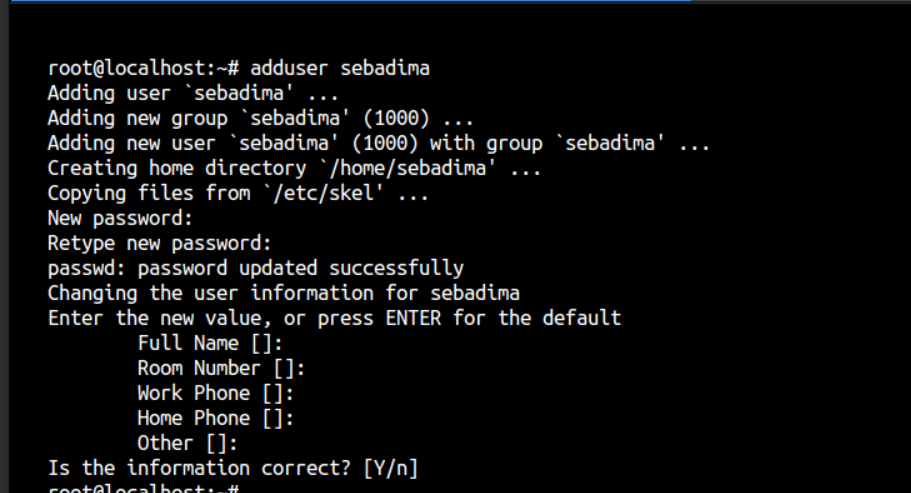
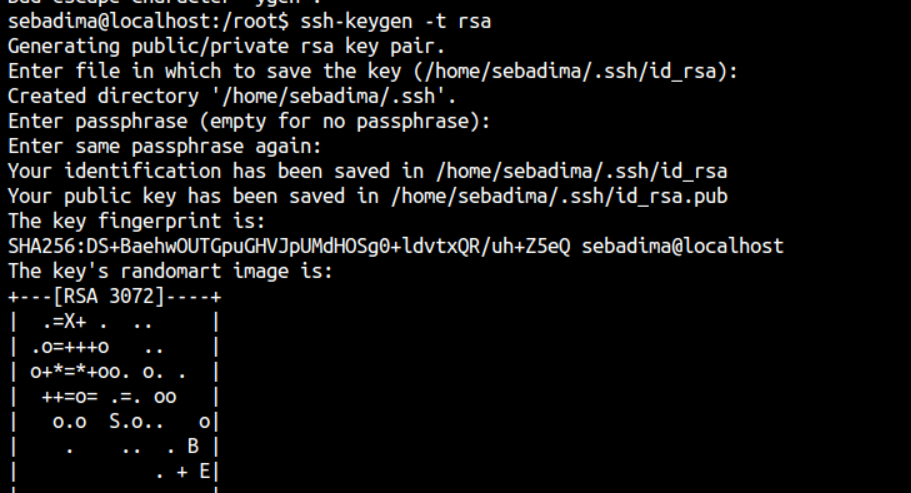
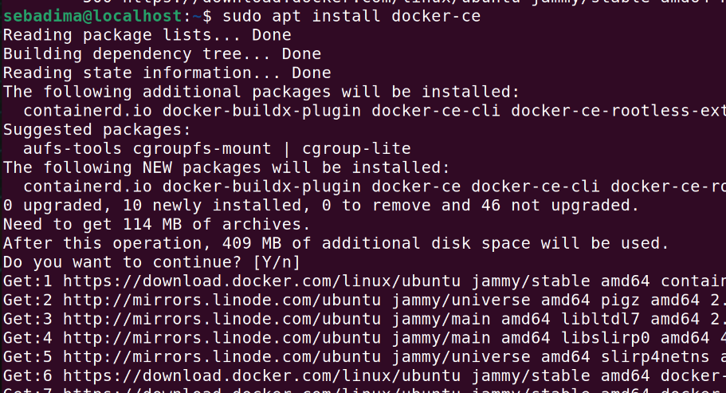
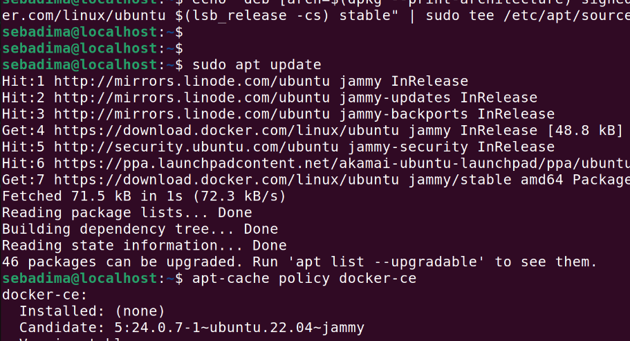
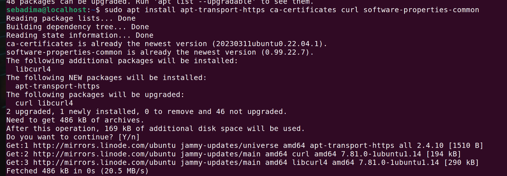
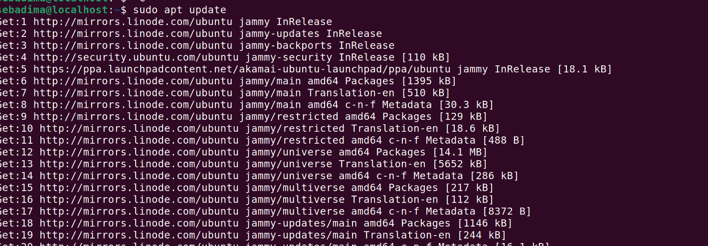
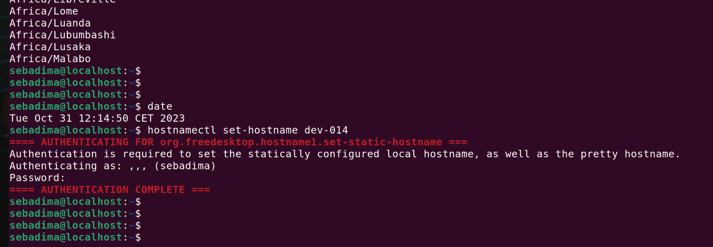
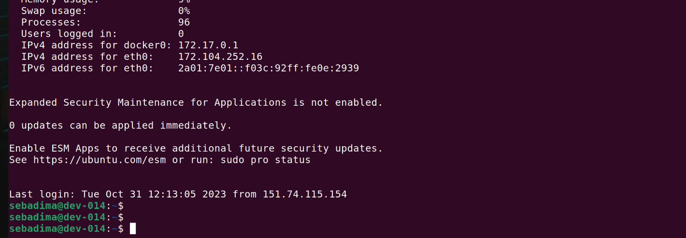

In questo post vedremo come preparare un server Linux per ospitare la piattaforma in ML Kaspian. Vedremo inoltre comeusare il server per comunicare con l'ESP32 attraverso il procotollo MQTT.

Per iniziare servirà aprire un account presso fornitori di server cloud come Linode, Digital Ocean, Vulture, Amazon AWS o simili. In questo post useremo un prodotto di Linode-Akamai, ma ricrdato che a parte la dashnoard e l provedure di registrazione non esiste differenza nella modalità di installazione.



Per inziare con Iot basterà un server Ubuntu con 2GB di Ram e almeno 20 Gb di dati.

## SETUP INIZIALE

### Aggiornamento del server
Le prima operazione necessaria riguarda l'aggiornamento del sistema con:
```bash
sudo apt-get update
sudo apt-get upgrade
```
rispondete con 'Y' alle richieste del siste e provcedete a creare un utente personale da usare al posto di 'root'.

### Creazione di un utente con permessi di amministratore


Usate il comando **adduser** per aggiungere un utente al sistema: 
```bash
adduser utente
```
Dopo a


```bash
Output
Enter new UNIX password:
Retype new UNIX password:
passwd: password updated successfully
```



Adesso bisogna aggiungere l'utente al gruppo **sudo**:
```bash
usermod -aG sudo sammy
```

#### Controllare l'accesso a sudo

```bash
su - sammy
sudo ls
[sudo] password for utente
```
Adesso non serve la password di root ma quella dell'utente.
Se l'utente è nel gruppo corretto e hai inserito correttamente la password, il comando che hai emesso con sudo verrà eseguito con i privilegi di root. 


### la creazione delle chiavi SSH
Se possete un PC Windows potete appoggiarvi al programma Putty per generale le chiavi, mentre se usate un PC con Linux o MAC potete fare tutto in maniera nativa dalla linea di comando:

Le prime oprazione necessaria riguardano la creazione delle chiavi SSH e l'aggiornamento del server. Se possete un PC Windows potete appoggiarvi al programma Putty per generale le chiavi, mentre se usate un PC con Linux o MAC potete fare tutto in maniera nativa dalla linea di comando:
##### dal vostro PC personale

```bash
ssh-keygen -t  rsa
```
quindi andate nella direcory ~/.ssh e scrivete:


```bash
cat *.pub
```
Fate copia e incolla dell'output del programma e 











<br>
<p style="font-size: 12px;"> R.121.1.0.1 </p>
<br>
