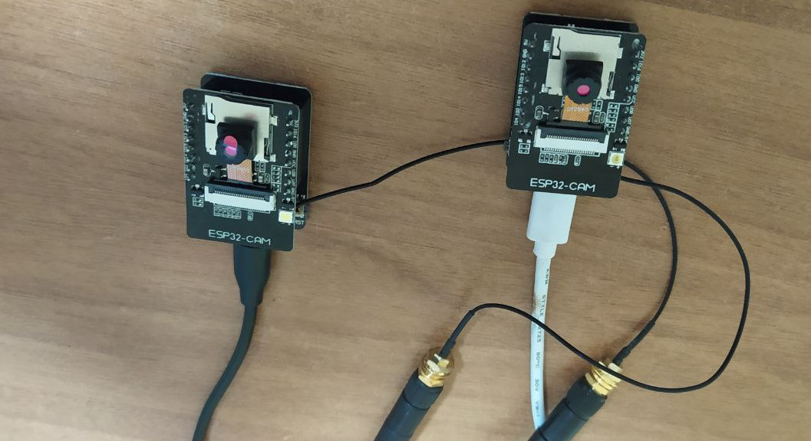
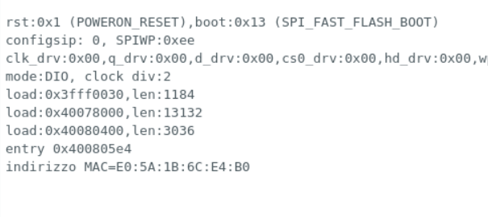
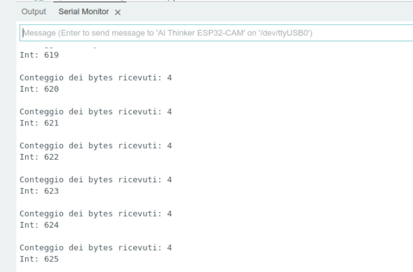

<!--
https://randomnerdtutorials.com/esp-now-esp32-arduino-ide/
https://randomnerdtutorials.com/esp32-esp-now-wi-fi-web-server/
-->

<hr>
<br>
<br>

In questo post vedremo due brevi programmi per testare sul campo la rete ESP-NOW, di cui abbiamo parlato in questo <a href="https://www.robotdazero.it/blog/cosa-sono-le-reti-mesh-per-esp32/" rel="noopener">articolo</a> introduttivo del nostro blog. Vedremo come usare due ESP32-CAM di cui sfruttare l'antennino di circa 10 cm offerto in dotazione: si tratta di un microcontroller molto economico disponibile su <a href="https://it.aliexpress.com/item/1005001900359624.html" target="_blank" rel="noopener">Aliexpress</a> a meno di dieci euro.

## Un progetto minimale
Nel dettaglio vedremo due brevi programmi per inviare e ricevere una sequenza numerica senza usare il WI-FI di casa/ufficio ma usando le caratteristiche radio "native" della scheda ESP32. Si tratta di un vantaggio non da poco perchè permette di far funzionare tutta la apparecchiatura presso nuovi utenti senza impostare login e password in ogni scheda. Il protocollo di comunicazione di <a href="https://www.espressif.com/en/products/sdks/esp-wifi-mesh/overview" target="_blank" rel="noopener">Espressif</a> sostituisce il normale WI-FI ma ne è certamente ispirato: infatti in entrambi i programmi sorgenti useremo questa struzione:
```bash 
#include "WiFi.h" 
```
per settare lo "*scope*" del normale WI-FI e ereditarne variabili e strutture dati. 
Faremo inoltre uso di un mini programma per trovare l'indirizzo MAC della scheda ESP cui inviare i dati. Il protocollo ESPNOW prevede, infatti di specificare il MAC di ogni scheda per consegnare il messaggio. In questo modo possiamo gestire caso per caso i dispositivi finali. Tutti i dispositivi "vicini" sono accessibili alla rete dopo avere completato l'accesso con queste istruzioni:

```bash 
  if (esp_now_add_peer(&peerInfo) != ESP_OK){
    Serial.println("Non riesco ad aggiungere il dispositivo");
    return;
  }
```


<br>
<br>
La immagine dei due dispositivi ESP32-CAM usati per testare e programmare la rete mesh ESP32-NOW.

## Il codice sorgente main.ino per trovare l'indirizzo MAC di una ESP32-CAM
Il programma è brevissimo e prevede la "include" a WIFI.h e l'uso della funzione "WiFi.macAddress()".
Per usarlo serve fare l'upload nell'IDE di Arduino e annotare il valore che appare nel "serial monitor". Se invece usate il programma con PlatformIO potete compilare il programma con "make upload" e quindi lanciare la utility *minicom* per visualizzare l'output.

```bash
#include "WiFi.h"
 
void setup(){
  Serial.begin(115200);
  WiFi.mode(WIFI_MODE_STA);
  Serial.print("indirizzo MAC="); 
  Serial.println(WiFi.macAddress());
}
 
void loop(){ 
}
```

### Il file platformio.ini associato, specifico per ESP32-CAM
Usando PlatformiIO potete usare questo file di settaggio per riconoscere in automatico la ESP32-CAM:

```bash
; PlatformIO Project Configuration File
;
;   Build options: build flags, source filter
;   Upload options: custom upload port, speed and extra flags
;   Library options: dependencies, extra library storages
;   Advanced options: extra scripting
;
; Please visit documentation for the other options and examples
; https://docs.platformio.org/page/projectconf.html

[env:esp32cam]
platform = espressif32
board = esp32cam
framework = arduino
monitor_speed=115200
lib_ldf_mode=deep
build_flags =
   -I../lib/esp32-camera

lib_deps =
```

<br>

##### L'output del "serial monitor" di Arduino con l'indirizzo MAC della scheda ESP32-CAM:


> Nella immagine sopra puoi vedere l'indirizzo MAC *E0:5A:1B:6C:E4:B0* che useremo nel programma di trasmissione.

<br>

## Il programma main.ino per inviare dei dati campione con l'ESP32-CAM
In questo programma useremo l'indirizzo MAC scoperto in precedenza per selezionare il dispositivo ricevente. Il protocollo mesh di Espressif prevede di usare il sistema degli indirizzi hardware anche quando i dispositivi sono solo due. 

```bash
#include <esp_now.h>
#include <WiFi.h>

// Indirizzo MAC del dispositivo di destinazione
// Sostituire nella riga in basso indirizzo MAC
// trovato con la utility apposita
uint8_t broadcastAddress[] = {0xE0, 0x5A, 0x1B, 0x6C, 0xE4, 0xB0};

// Struct per definire il formato dei dati
typedef struct struct_messaggio {
  int contatore;
} struct_messaggio;

struct_messaggio Dati;
esp_now_peer_info_t peerInfo;
int ix; 

// funzione callback da invocare dopo invio
void suInvioDati(const uint8_t *mac_addr, esp_now_send_status_t status) {
  Serial.print("\r\nStatus invio:\t");
  Serial.println(status == ESP_NOW_SEND_SUCCESS ? "Consegna positiva" : "Errore di consegna");
}

void setup() {
  Serial.begin(115200);
  WiFi.mode(WIFI_STA);
  // Inizializza ESP-NOW
  if (esp_now_init() != ESP_OK) {
    Serial.println("Errore di inizializzazione per ESP-NOW");
    return;
  }
  esp_now_register_send_cb(suInvioDati);
  ix= 0;
  memcpy(peerInfo.peer_addr, broadcastAddress, 6);
  peerInfo.channel = 0;  
  peerInfo.encrypt = false;
  // Aggiungi dispositivo
  if (esp_now_add_peer(&peerInfo) != ESP_OK){
    Serial.println("Non riesco ad aggiungere il dispositivo");
    return;
  }
}
 
void loop() {
  // Valori da inviare
  Dati.contatore = ix;
  ix=ix+1;
  // invio del messaggio
  esp_err_t result = esp_now_send(broadcastAddress, (uint8_t *) &Dati, sizeof(Dati));
  if (result == ESP_OK) {
    Serial.println("Messaggio inviato con successo");
  }
  else {
    Serial.println("Errore di invio");
  }
  delay(2000);
}

```


## Il programma main.ino per ricevere i dati con la seconda ESP32-CAM
Questo è il sorgente per ricevere a mostrare i video i dati in arrivo dalla scheda trasmittente.
```bash
#include <esp_now.h>
#include <WiFi.h>

// Struttura di esempio
typedef struct struct_messaggio {
    int b;
} struct_messaggio;

struct_messaggio Dati;

// Funzione di callback dopo invio dati
void suDatiRicevuti(const uint8_t * mac, const uint8_t *incomingData, int len) {
  memcpy(&Dati, incomingData, sizeof(Dati));
  Serial.print("Conteggio dei bytes ricevuti: ");
  Serial.println(len);
  Serial.print("Int: ");
  Serial.println(Dati.b);
  Serial.println();
}
 
void setup() {
  Serial.begin(115200);
  WiFi.mode(WIFI_STA);
  // Inizializza la rete ESP-NOW
  if (esp_now_init() != ESP_OK) {
    Serial.println("Errore nella inizializzazione della rete ESP-NOW");
    return;
  }
  esp_now_register_recv_cb(suDatiRicevuti);
}
 
void loop() {
}
```


<br>
<br>
Nella immagine in alto si vede la sequenza automatica generata dal primo ESP32-CAM e ricevuta dalla seconda ESP32-CAM (619,620,621, etc..).

### Consclusione
Con soli tre brevissimi programmi abbiamo impostato la struttura di funzionamento della rete mesh. Nei prossimi artcoli vedremo come usare questa struttura per realizzare dei compiti utili, con l'utilizzo di 3 o 4 schede ESP32 di modello diverso.
<br>
<br>
<br>
<p style="font-size: 0.8em;">R.123.3.4.0</p>