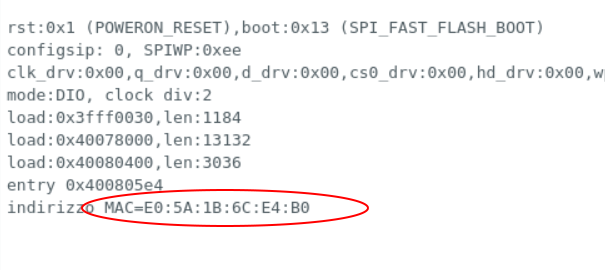

<!--
https://randomnerdtutorials.com/esp-now-esp32-arduino-ide/
https://randomnerdtutorials.com/esp32-esp-now-wi-fi-web-server/
-->

<hr>
<br>
<br>

<br>
<br>
La immagine dei due dispositivi ESP32-CAM usati per testare e programmare la rete mesh ESP32-NOW.


## Il codice sorgente main.ino per trovare l'indirizzo MAC di un ESP32-CAM

```bash
#include "WiFi.h"
 
void setup(){
  Serial.begin(115200);
  WiFi.mode(WIFI_MODE_STA);
  Serial.print("indirizzo MAC="); 
  Serial.println(WiFi.macAddress());
}
 
void loop(){ 
}
```

### Il file platformio.ini associato, specifico per ESP32-CAM

```bash
; PlatformIO Project Configuration File
;
;   Build options: build flags, source filter
;   Upload options: custom upload port, speed and extra flags
;   Library options: dependencies, extra library storages
;   Advanced options: extra scripting
;
; Please visit documentation for the other options and examples
; https://docs.platformio.org/page/projectconf.html

[env:esp32cam]
platform = espressif32
board = esp32cam
framework = arduino
monitor_speed=115200
lib_ldf_mode=deep
build_flags =
   -I../lib/esp32-camera

lib_deps =
```


L'output del "serial monitor" di Arduino con l'indirizzo MAC della prima ESP32-CAM


> Nella immagine puoi vedere l'indirizzo MAC *E0:5A:1B:6C:E4:B0* che useremo nel programma successivo.


## Il programma main.ino per inviare dei dati campione con l'ESP32-CAM

```bash
#include <esp_now.h>
#include <WiFi.h>

// Indirizzo MAC del dispositivo di destinazione
// Sostituire nella riga in basso indirizzo MAC
// trovato con la utility apposita
uint8_t broadcastAddress[] = {0xE0, 0x5A, 0x1B, 0x6C, 0xE4, 0xB0};

// Struct per definire il formato dei dati
typedef struct struct_messaggio {
  int contatore;
} struct_messaggio;

struct_messaggio Dati;
esp_now_peer_info_t peerInfo;
int ix; 

// funzione callback da invocare dopo invio
void suInvioDati(const uint8_t *mac_addr, esp_now_send_status_t status) {
  Serial.print("\r\nStatus invio:\t");
  Serial.println(status == ESP_NOW_SEND_SUCCESS ? "Consegna positiva" : "Errore di consegna");
}

void setup() {
  Serial.begin(115200);
  WiFi.mode(WIFI_STA);
  // Inizializza ESP-NOW
  if (esp_now_init() != ESP_OK) {
    Serial.println("Errore di inizializzazione per ESP-NOW");
    return;
  }
  esp_now_register_send_cb(suInvioDati);
  ix= 0;
  memcpy(peerInfo.peer_addr, broadcastAddress, 6);
  peerInfo.channel = 0;  
  peerInfo.encrypt = false;
  // Aggiungi dispositivo
  if (esp_now_add_peer(&peerInfo) != ESP_OK){
    Serial.println("Non riesco add aggiunger il dispositivo");
    return;
  }
}
 
void loop() {
  // Valori da inviare
  Dati.contatore = ix;
  ix=ix+1;
  // invio del messaggio
  esp_err_t result = esp_now_send(broadcastAddress, (uint8_t *) &Dati, sizeof(Dati));
  if (result == ESP_OK) {
    Serial.println("Messaggio inviato con successo");
  }
  else {
    Serial.println("Errore di invio");
  }
  delay(2000);
}

```


## Il programma main.ino per ricevere i dati con la seconda ESP32-CAM
```bash
#include <esp_now.h>
#include <WiFi.h>

// Struttura di esempio
typedef struct struct_messaggio {
    int b;
} struct_messaggio;

struct_messaggio Dati;

// Funzione di callback dopo invio dati
void suDatiRicevuti(const uint8_t * mac, const uint8_t *incomingData, int len) {
  memcpy(&Dati, incomingData, sizeof(Dati));
  Serial.print("Conteggio dei bytes ricevuti: ");
  Serial.println(len);
  Serial.print("Int: ");
  Serial.println(Dati.b);
  Serial.println();
}
 
void setup() {
  Serial.begin(115200);
  WiFi.mode(WIFI_STA);
  // Inizializza la rete ESP-NOW
  if (esp_now_init() != ESP_OK) {
    Serial.println("Errore nella inizialiazzione dele rete ESP-NOW");
    return;
  }
  esp_now_register_recv_cb(suDatiRicevuti);
}
 
void loop() {
}
```


<br>
<br>
Nella immagine in alto si vede la sequenza automatica generata dal primo ESP32-CAM e ricevuta dalla seconda ESP32-CAM (619,620,621, etc..).
<br>
<br>
<br>
<p style="font-size: 0.8em;">R.123.3.2.5</p>