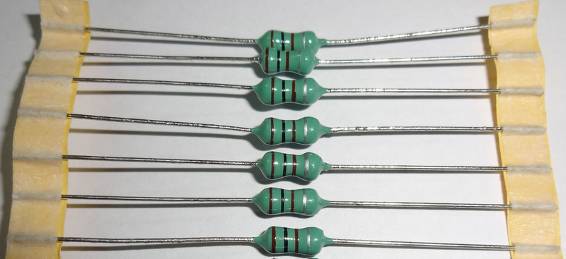
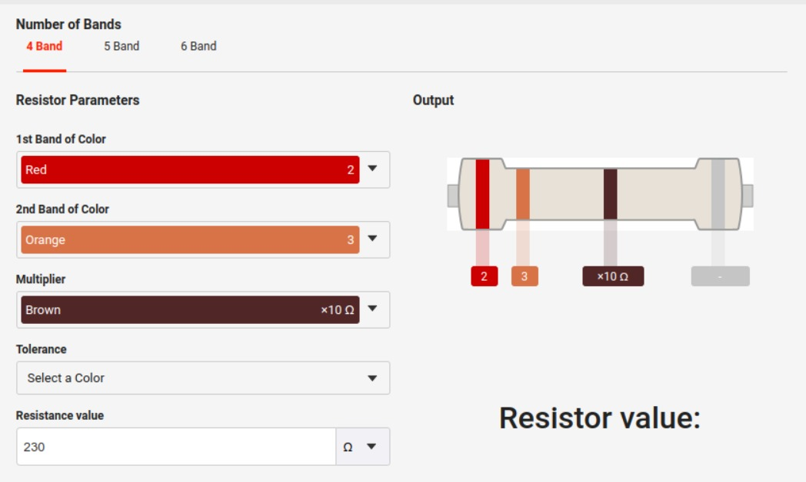

## A cosa servono le resistenze?

La resistenza è una misura dell'opposizione di un oggetto al flusso di elettroni. Questo può suona come una brutta cosa, ma in realtà è utile. La resistenza è ciò che rende possibile generare calore e luce, limitare il flusso di corrente elettrica quando necessario, e assicurarsi che la tensione corretta sia fornita a un dispositivo. 

> Ad esempio, quando gli elettroni viaggiano attraverso il filamento di una lampadina incontrano così tanta resistenza che rallentano e si scontrano furiosamente, generando il bagliore che vedi dalla tua lampadina.

Qualsiasi materiale, anche i migliori conduttori, mostrano una certa resistenza al flusso di elettroni. (In realtà, alcuni materiali, chiamati superconduttori, possono condurre corrente con zero resistenza elettrica ma solo a temperature estremamente basse. Non li incontrerai nella elettronica.) Maggiore è la resistenza, più basso è il flusso di corrente.  

### Cosa determina la resistenza? 

La resistenza dipende da diversi fattori 

- **Materiale**: 

alcuni materiali permettono ai loro elettroni di vagare liberamente, mentre altri tengono vincolati i loro elettroni. Quanto fortemente un materiale specifico si oppone il flusso di elettroni determina la sua resistività. La resistenza è una proprietà di un materiale che riflette la sua struttura chimica.  I conduttori hanno valori relativamente bassi di resistività, mentre gli isolanti hanno una resistività molto elevata.  

- **Area della sezione trasversale**: 

la resistenza varia inversamente con l'area della sezione trasversale; più grande è il diametro, più facile è per gli elettroni muoversi-cioè, il abbassare la resistenza al loro movimento. Pensa all'acqua che scorre attraverso un tubo: più largo è il tubo, più facile è il flusso d'acqua. Sulla stessa linea, a il filo di rame con un grande diametro ha una resistenza inferiore rispetto a un filo di rame con un piccolo diametro.  

- **Lunghezza**: 

più lungo è il materiale, maggiore è la resistenza che ha perché gli elettroni avere più opportunità di imbattersi in altre particelle lungo la strada. In altri
parole, resistenza varia direttamente con la lunghezza.

- **Temperatura**: 

per la maggior parte dei materiali, maggiore è la temperatura, maggiore è la resistenza. Temperature più elevate significano che le particelle all'interno hanno più energia, quindi si scontrano tra loro molto spesso, rallentando il flusso di elettroni. Una notevole eccezione a questo è un tipo di resistenza chiamato termistore: all'aumentare della temperatura il termistore abbassa la resistenza in modo prevedibile. (Puoi immaginare quanto sia utile questa caratteristica in circuiti di rilevamento della temperatura.) 

## Il simbolo della resistenza
Si utilizza il simbolo **R** per rappresentare la resistenza in un circuito elettronico. La resistenza è misurata in unità chiamate <a href="https://it.wikipedia.org/wiki/Ohm#:~:text=L'ohm%20(simbolo%20%CE%A9),dell'omonima%20legge%20di%20Ohm." target="_blank" rel="noopener">ohm</a> (pronunciato "om"), abbreviato con la lettera greca omega (**Ω**). Maggiore è il valore in ohm, maggiore è la resistenza.  Un singolo ohm è così piccolo come unità di misura che probabilmente vedrai solo resistenze misurate in quantità maggiori:

-  kilohms ( kilo + ohm), che è migliaia di ohm ed è abbreviato kΩ, 
-  megohms (mega + ohm), che è milioni di ohm ed è abbreviato MΩ. 

👉 Quindi 1 kΩ = 1.000 Ω e 1 MΩ = 1.000.000 Ω.

## Come funziona il codice di colori delle resistenze?

Nelle immagine sopra avrete certamente notato le bande colorate tracciate sul corpo delle resistenze. 
##### A cosa servono i colori?

Il <a href="https://it.farnell.com/calcolatore-codici-colore-resistore" target="_blank" rel="noopener">codice di colori</a> delle resistenze è un sistema standardizzato per indicare il valore di resistenza di un resistore. È composto da una serie di bande colorate che vengono applicate sul corpo del resistore.

>Il codice colore più diffuso è quello a quattro bande. Le prime due bande rappresentano le prime due cifre del valore nominale della resistenza, la terza banda rappresenta il moltiplicatore e la quarta banda rappresenta la tolleranza.

##### I colori delle bande e i corrispondenti valori sono i seguenti:

Colore -> Valore
- Nero      0
- Marrone   1
- Rosso     2
- Arancione 3
- Giallo    4
- Verde     5
- Blu       6
- Viola     7
- Grigio    8
- Bianco    9

##### Ad esempio, un resistore con le bande colorate: rossa, arancione e marrone ha un valore nominale di 230 ohm. La banda rossa rappresenta la cifra 2, la banda arancio rappresenta la cifra 3 e la banda marrone rappresenta il moltiplicatore 10.

 
 

Per controllare i tuoi calcoli ti sarà molto utile il <a href="https://www.digikey.com/en/resources/conversion-calculators/conversion-calculator-resistor-color-code" target="_blank" rel="noopener">calcolatore on line</a> di Digikey.

Esistono anche resistori a cinque bande. In questo caso, la quinta banda rappresenta un coefficiente termico che indica come cambia la resistenza del resistore al variare della temperatura.

##### I colori delle bande e i corrispondenti valori per il coefficiente termico sono i seguenti:

#### Quinta banda delle resistenze
Colore -> Valore
- Nero	100 ppm/K
- Marrone	50 ppm/K
- Rosso	25 ppm/K
- Arancione	15 ppm/K
- Giallo	10 ppm/K
- Verde	5 ppm/K
- Blu	2 ppm/K
- Viola	1 ppm/K

##### Per leggere il codice colore di un resistore a cinque bande, si procede come segue:

- Si legge il valore nominale come per un resistore a quattro bande,
- Si legge il coefficiente termico.

👉 Ad esempio, un resistore con le bande colorate nere, rosse, arancioni e gialle ha un valore nominale di 230 ohm e un coefficiente termico di 10 ppm/K.

 

Il codice colore delle resistenze è un sistema semplice e pratico per identificare il valore di resistenza di un componente elettronico. È importante familiarizzare con questo sistema per poter lavorare in modo sicuro con i circuiti elettronici.

 

R.130.1.8.0

