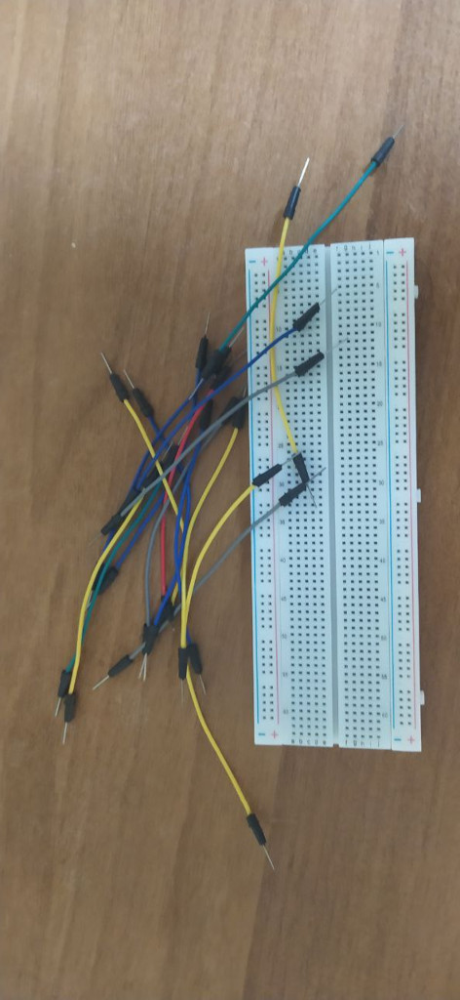

## Cosa sono le breadboard?

Le breadboard servono a collegare i componenti elettronici **senza usare il saldatore**: basta prendere i terminali e inserirli nei buchi a misura standard ed il gioco è fatto. Le puoi comprare in varie forme e dimensioni e, per fortuna, **funzionano tutte allo stesso modo**.

La loro maggiore utilità deriva dal modo in cui i fori sono connessi. I fori sono infatti connessi a **colonne**: se un solo foro viene collegato ad un alimentatore allora tutti gli altri fori della colonna saranno collegati alla alimentazione! E se collegate una colonna di fori alla massa, tutti i fori della colonna saranno collegati a massa.

> In questo modo potrai collegare tutti i componenti alla alimentazione e alla massa del circuito semplicemente variando la loro posizione sulla scheda!

## INSERIRE DEI LED SU UNA BREADBOARD

Vediamo come usarle in progetti appena più complessi. Fino ad ora abbiamo usato il LED interno di Arduino per fare dei semplici test, ma nel prossimo esempio vedremo come collegare dei LED esterni, aggiungendo una resistenza per limitare la corrente.

I LED infatti hanno bisogno di limitare il flusso di elettroni che altrimenti li brucerebbe in pochi secondi, esperienza che capita a tutti principianti almeno una volta nella vita. Il fatto che si possano usare i **4 LED interni** di Arduino senza problemi vuol dire solo che i progettisti hanno già inserito le resistenze adatte nella scheda, non che puoi farne a meno!

Nella figura sottostante puoi vedere una immagine di un circuito completo assemblato su una Breadboard. Consiste di un Arduino, un LED e una resistenza di 1kΩ.

 

Come si vede nella colonna di sinistra abbiamo un filo nero che esce dal connettore GND (ground=massa) di Arduino. Il filo nero si innesta nella breadboard e continua fino al terminale negativo del LED.

Il filo rosso (positivo) conduce il segnale che proviene dal **pin 2** di Arduino fino alla colonna di destra. Salendo sulla colonna di destra la corrente incontra dapprima la resistenza  di un kΩ e poi il terminale positivo del LED. Senza perdere tempo con stagno e saldatore ho realizzato il circuito necessario per accendere un LED con Arduino. Prova a copiare la disposizone dei componenti sulla tua breaboard. 
Volendo potresti modificare il programma e fare lampeggiare il LED a intervalli regolari di un secondo. La modifica è semplicissima, si tratta solo di cambiare una riga, ma se sei nuovo del Blog non ti preoccupare: realizzeremo assieme molti di questi esercizi e in poco tempo saprai cavartela benissimo da solo. 

### Alcuni tutili trucchetti

- Accorcia i terminali dei componenti se si piegano troppo mentre li inserisci nei fori
- Quando accorci i terminali dovresti accorciare un poco di più i terminali **negativi** per riconoscerli più facilmente. I LED ad esempio hanno un terminale positivo e uno negativo
- Se colleghi un LED ad una batteria o ad un alimentatore **DEVI** sempre inserire in linea una resistenza, che per le tensioni che si usano nella Robotica sarà di **150Ω** (si legge 150 Ohm) fino a **1 KΩ** (si legge un Kilo Ohm)
- Puoi [ricavare il valore di una resistenza][4] dalle fasce colorate con cui vengono appositamente verniciate

- Molte delle connessioni tra i componenti sulla tua breadboard sono realizzate da
la breadboard stessa, sotto la superficie, ma quando non puoi fare un
connessione diretta tramite la scheda, si utilizzano cavi di interconnessione (a volte chiamati
ponticelli). Si utilizza un filo isolato solido (non incagliato) da 20 a 22 gauge per collegare i componenti sulla breadboard. Il filo più spesso o più sottile non funziona bene
in breadboard: troppo spesso, e il filo non andrà nei fori; troppo sottile, e il
il contatto elettrico sarà scarso.
Non utilizzare trefoli in un tagliere. I singoli fili possono rompersi,
alloggio all'interno dei contatti metallici della breadboard.
Mentre stai acquistando il tuo tagliere, acquista un set di ponticelli precompressi,
come suggerisco nel Capitolo 13. (Non ottenere a buon mercato ora; questo acquisto è valsa la pena.) I fili precompressi sono disponibili in una varietà di lunghezze e sono già spogliati (ovviamente)
e piegato, pronto per l'uso in breadboards. Ad esempio, un assortimento popolare contiene 10 ciascuno di 14 lunghezze di filo, che vanno da 0,1 pollici a 5 pollici (vedi
Figura 15-4). Un set di 140-350 fili precompressi può costare $6 - $15, ma è possibile
scommetti che il prezzo vale il tempo che risparmierai. L'alternativa è comprare un mazzo
di filo, tagliare segmenti di varie lunghezze e accuratamente striscia circa 1/3 di pollice di
l'isolamento da ciascuna estremità.
Anche se si acquista un vasto assortimento di fili precompressi, ci può venire un
tempo in cui si deve fare un cavo di interconnessione o due del proprio. Inizia con
20-o 22-gauge filo (o una sezione più precompresso che si desidera tagliare in
sezioni più piccole), e tagliarlo alla lunghezza desiderata. Se hai uno spogliarellista con
un calibro-selezione quadrante, impostare il quadrante per il calibro di filo che si sta utilizzando. Altro filo
le spogliarelliste possono avere diverse tacche di taglio etichettate per vari calibri. Usando uno
di questi dispositivi calibro-specifici invece di un generico wire stripper impedisce
da intaccare il filo quando si sta spogliando l'isolamento. Nicks indebolire il
filo, e un filo debole può rimanere bloccato all'interno di un foro tagliere e rovinare il vostro
intera giornata

 

R.131.1.0.0

