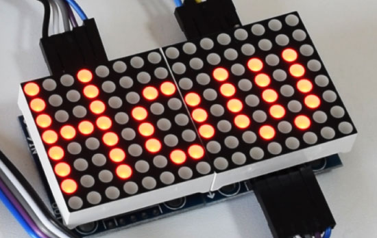

* * *

_In questo post scoprirai come costruire una matrice a LED con max7219 Arduino. Questa è forse la più scenografica delle applicazioni con Arduino, facile da realizzare a livello hardware ma utile per conoscere i “driver” delle Matrici a LED._

## IL CHIP “MAX7219”


Il chip MAX7219 è un driver per display LED comunemente utilizzato in progetti di elettronica fai-da-te e hobbyistici. Si tratta di un dispositivo a 8 pin che può essere utilizzato per controllare fino a 8 display LED a 7 segmenti, un display LED a matrice 8x8 o 64 LED individuali. E' un dispositivo seriale, il che significa che può essere controllato tramite un'interfaccia seriale a 4 bit. Ciò lo rende facile da utilizzare con microcontrollori come Arduino, Raspberry Pi e <a href="https://www.robotdazero.it/tags/esp32/" target="_blank" rel="noopener">ESP32</a>.


<div class="alert alert-doks d-flexflex-shrink-1" role="alert">
 👉 La principale differenza tra un'interfaccia seriale a 4 bit e le altre interfacce seriali è il numero di bit che vengono trasferiti in parallelo in un singolo trasferimento. Un'interfaccia seriale a 4 bit trasferisce 4 bit in parallelo, mentre le altre interfacce seriali possono trasferire 8 bit, 16 bit o più.
 </div>

<div class="alert alert-doks d-flexflex-shrink-1" role="alert">
- Questa differenza nel numero di bit trasferiti in parallelo ha una serie di conseguenze. Innanzitutto, l'interfaccia seriale a 4 bit richiede meno fili per trasmettere i dati. Ciò rende l'interfaccia più semplice da implementare e meno costosa. In secondo luogo, l'interfaccia seriale a 4 bit può trasferire i dati a velocità inferiori rispetto alle altre interfacce seriali.
</div>

##### L'interfaccia seriale a 4 bit è spesso utilizzata in applicazioni in cui il numero di dati da trasferire è relativamente basso e la velocità di trasferimento non è un fattore critico. 


### I pregi del MAX7219 

Questo chip offre una serie di funzioni che lo rendono un driver LED versatile:

- Controllo individuale dei segmenti LED: il MAX7219 consente di controllare individualmente ogni segmento di un display LED. Ciò consente di visualizzare un'ampia varietà di caratteri e simboli.
- Decodifica automatica: il MAX7219 può decodificare automaticamente i numeri da 0 a 9, le lettere maiuscole da A a F e il punto decimale. Ciò semplifica la visualizzazione di numeri e lettere su un display LED.
- Selezione dei digit: il MAX7219 consente di selezionare quali digit di un display LED devono essere visualizzati. Ciò è utile per visualizzare solo una parte di un display LED, ad esempio per visualizzare un numero o una lettera.
- Modalità di risparmio energetico: il MAX7219 dispone di una modalità di risparmio energetico che consente di ridurre il consumo di corrente.

### Applicazioni del chip

Il MAX7219 può essere utilizzato in una varietà di applicazioni, tra cui:

1. Display di testo e numeri: il MAX7219 può essere utilizzato per visualizzare testo e numeri su un display LED. È una buona scelta per applicazioni come orologi, contatori, display di temperatura e altro ancora.
2. Display di immagini: il MAX7219 può essere utilizzato per visualizzare immagini su un display LED. È una buona scelta per applicazioni come giochi, grafici e altro ancora.
3. Display di simboli: il MAX7219 può essere utilizzato per visualizzare simboli su un display LED. È una buona scelta per applicazioni come icone, logo e altro ancora.

> Il chip è in grado di pilotare 64 LED individuali utilizzando solo 3 fili per il link con Arduino, e per di più lo possiamo collegare in configurazione “sequenziale” con altri driver usando sempre gli stessi 3 fili!

<br>


<br>
<br>

**I 64 LED sono pilotati tutti dai 16 pin di uscita dell’IC**. Come è possibile? Ebbene, il numero massimo di LED che si accendono contemporaneamente è in realtà otto. I LED sono disposti come un insieme di righe e colonne 8 × 8. Il drive MAX7219 si attiva per ogni colonna solo per un periodo di tempo molto breve e allo stesso tempo accende in sequenza tutte le righe. Grazie all’effetto di permanenza delle luce sulla retina, i nostri occhi noteranno solamente una luce **continua**.

<br>


<br>
<br>

La tabella seguente è presa pari pari dal datasheet della casa madre e mostra il valore della resistenza che dovremmo usare in base alla caduta di tensione diretta dei nostri LED.


## SCHEMA DEL CIRCUITO

Adesso colleghiamo il modulo Matrice LED 8×8 alla nostra scheda Arduino. Ecco lo schema del circuito:


Il **VCC** e **GND** del modulo vanno ai pin **5V** e **GND** di Arduino e gli altri tre pin, **DIN**, **CLK** e **CS** vanno a un qualsiasi pin digitale della scheda Arduino. Se vogliamo collegare più di un modulo, colleghiamo semplicemente i pin di uscita della precedente scheda pin di ingresso del nuovo modulo. In realtà questi pin sono tutti uguali tranne che il pin **DOUT** della scheda precedente va a finire nel pin **DIN** della nuova scheda. Ti ricordo che puoi ottenere i componenti necessari per questo tutorial dai link sottostanti:

  * Modulo a matrice di punti 8 × 8 LED MAX7219 &#8211; [**Amazon**][1]
  * Modulo Bluetooth HC-05 &#8211; [**Amazon**][2]
  * Una Breadboard e Jump Wires &#8211; [**Amazon**][3]
  * Una [**Scheda**][4] Arduino &#8211; [**Amazon**][5]

## IL PROGRAMMA BASE PER IL MAX7219 + ARDUINO


```bash
// Copyright (c) robotdazero.it
// Permission is hereby granted, free of charge, to any person obtaining a copy
// of this software and associated documentation files (the "Software"), to deal
// in the Software without restriction, including without limitation the rights
// to use, copy, modify, merge, publish, distribute, sublicense, and/or sell
// copies of the Software, and to permit persons to whom the Software is
// furnished to do so, subject to the following conditions:
//
// The above copyright notice and this permission notice shall be included in all
// copies or substantial portions of the Software.
//
// THE SOFTWARE IS PROVIDED "AS IS", WITHOUT WARRANTY OF ANY KIND, EXPRESS OR
// IMPLIED, INCLUDING BUT NOT LIMITED TO THE WARRANTIES OF MERCHANTABILITY,
// FITNESS FOR A PARTICULAR PURPOSE AND NONINFRINGEMENT. IN NO EVENT SHALL THE
// AUTHORS OR COPYRIGHT HOLDERS BE LIABLE FOR ANY CLAIM, DAMAGES OR OTHER
// LIABILITY, WHETHER IN AN ACTION OF CONTRACT, TORT OR OTHERWISE, ARISING FROM,
// OUT OF OR IN CONNECTION WITH THE SOFTWARE OR THE USE OR OTHER DEALINGS IN THE
// SOFTWARE.
//
// Esempio LED Matrix 8x8 con MAX7219
// by robotdazero.it, based on Dejan Nedelkovski
// tratto da: https://howtomechatronics.com/
// Basato sulla libreria Open Source
// https://github.com/riyas-org/max7219

#include <MaxMatrix.h>

int DIN = 7;   // pin DIN del chip MAX7219
int CLK = 6;   // pin CLK del chip MAX7219
int CS = 5;    // pin CS  del chip MAX7219
int maxInUse = 1;


MaxMatrix m(DIN, CS, CLK, maxInUse);

char A[] = {4, 8,
            B01111110,
            B00010001,
            B00010001,
            B01111110,
           };

char B[] = {4, 8,
            B01111111,
            B01001001,
            B01001001,
            B00110110,
           };

char smile01[] = {8, 8,
                  B00111100,
                  B01000010,
                  B10010101,
                  B10100001,
                  B10100001,
                  B10010101,
                  B01000010,
                  B00111100
                 };
char smile02[] = {8, 8,
                  B00111100,
                  B01000010,
                  B10010101,
                  B10010001,
                  B10010001,
                  B10010101,
                  B01000010,
                  B00111100
                 };
char smile03[] = {8, 8,
                  B00111100,
                  B01000010,
                  B10100101,
                  B10010001,
                  B10010001,
                  B10100101,
                  B01000010,
                  B00111100
                 };

void setup() {
  m.init(); // init del chip MAX7219
  m.setIntensity(8); // intensità dei LED tra 0-15
}

void loop() {
  // Setta i LED On e Off a x,y
  m.setDot(6,2,true);
  delay(1000);
  m.setDot(6,3,true);
  delay(1000);
  m.clear(); // Azzera il display
  for (int i=0; i<8; i++){
    m.setDot(i,i,true);
    delay(300);
  }
  m.clear();
  // Mostra il carattere a x,y
  m.writeSprite(2, 0, A);
  delay(1000);

  m.writeSprite(2, 0, B);
  delay(1000);

  m.writeSprite(0, 0, smile01);
  delay(1000);

  m.writeSprite(0, 0, smile02);
  delay(1000);

  m.writeSprite(0, 0, smile03);
  delay(1000);

  for (int i=0; i<8; i++){
    m.shiftLeft(false,false);
    delay(300);
  }
  m.clear();
}
```

Una volta collegati i moduli siamo pronti per caricare il codice Arduino del primo esempio. Useremo la libreria MaxMatrix **specifica per il MAX7219** che può essere scaricata da [GitHub][6]. Non hai bisogno di fare copia e incolla del programma, ti basta andare alla fine del listato e cliccare su una delle 2 icone sottostanti.

Nella **sezione setup** inizializziamo il modulo a LED impostimo la luminosità. Nella **sezione loop** utilizzamo la funzione **setDot()** con cui possiamo impostare qualsiasi singolo LED in modo che si accenda alla posizione desiderata. Quindi usiamo la funzione **clear()** per cancellare il display.

<br>


Per visualizzare i caratteri predefiniti usiamo la **funzione writeSprite()**: i primi due argomenti sono la posizione X e Y dell’angolo superiore sinistro del carattere. A fine sorgente usiamo la funzione **shiftLeft()** per spostare il carattere verso sinistra.

## IL SECONDO PROGRAMMA DI ESEMPIO

```bash
// Copyright (c) robotdazero.it
// Permission is hereby granted, free of charge, to any person obtaining a copy
// of this software and associated documentation files (the "Software"), to deal
// in the Software without restriction, including without limitation the rights
// to use, copy, modify, merge, publish, distribute, sublicense, and/or sell
// copies of the Software, and to permit persons to whom the Software is
// furnished to do so, subject to the following conditions:
//
// The above copyright notice and this permission notice shall be included in all
// copies or substantial portions of the Software.
//
// THE SOFTWARE IS PROVIDED "AS IS", WITHOUT WARRANTY OF ANY KIND, EXPRESS OR
// IMPLIED, INCLUDING BUT NOT LIMITED TO THE WARRANTIES OF MERCHANTABILITY,
// FITNESS FOR A PARTICULAR PURPOSE AND NONINFRINGEMENT. IN NO EVENT SHALL THE
// AUTHORS OR COPYRIGHT HOLDERS BE LIABLE FOR ANY CLAIM, DAMAGES OR OTHER
// LIABILITY, WHETHER IN AN ACTION OF CONTRACT, TORT OR OTHERWISE, ARISING FROM,
// OUT OF OR IN CONNECTION WITH THE SOFTWARE OR THE USE OR OTHER DEALINGS IN THE
// SOFTWARE.
//
// Esempio Scroll LED Matrix 8x8 con MAX7219
// by robotdazero.it, based on Dejan Nedelkovski
// tratto da: https://howtomechatronics.com/
// Basato sulla libreria Open Source
// GitHub - https://github.com/riyas-org/max7219


#include "MaxMatrix.h";
#include "pgmspace.h";

PROGMEM const unsigned char CH[] = {
  3, 8, B00000000, B00000000, B00000000, B00000000, B00000000, // space
  1, 8, B01011111, B00000000, B00000000, B00000000, B00000000, // !
  3, 8, B00000011, B00000000, B00000011, B00000000, B00000000, // x
  5, 8, B00010100, B00111110, B00010100, B00111110, B00010100, // #
  4, 8, B00100100, B01101010, B00101011, B00010010, B00000000, // $
  5, 8, B01100011, B00010011, B00001000, B01100100, B01100011, // %
  5, 8, B00110110, B01001001, B01010110, B00100000, B01010000, // &
  1, 8, B00000011, B00000000, B00000000, B00000000, B00000000, // y
  3, 8, B00011100, B00100010, B01000001, B00000000, B00000000, // (
  3, 8, B01000001, B00100010, B00011100, B00000000, B00000000, // )
  5, 8, B00101000, B00011000, B00001110, B00011000, B00101000, // *
  5, 8, B00001000, B00001000, B00111110, B00001000, B00001000, // +
  2, 8, B10110000, B01110000, B00000000, B00000000, B00000000, // ,
  4, 8, B00001000, B00001000, B00001000, B00001000, B00000000, // -
  2, 8, B01100000, B01100000, B00000000, B00000000, B00000000, // .
  4, 8, B01100000, B00011000, B00000110, B00000001, B00000000, // /
  4, 8, B00111110, B01000001, B01000001, B00111110, B00000000, // 0
  3, 8, B01000010, B01111111, B01000000, B00000000, B00000000, // 1
  4, 8, B01100010, B01010001, B01001001, B01000110, B00000000, // 2
  4, 8, B00100010, B01000001, B01001001, B00110110, B00000000, // 3
  4, 8, B00011000, B00010100, B00010010, B01111111, B00000000, // 4
  4, 8, B00100111, B01000101, B01000101, B00111001, B00000000, // 5
  4, 8, B00111110, B01001001, B01001001, B00110000, B00000000, // 6
  4, 8, B01100001, B00010001, B00001001, B00000111, B00000000, // 7
  4, 8, B00110110, B01001001, B01001001, B00110110, B00000000, // 8
  4, 8, B00000110, B01001001, B01001001, B00111110, B00000000, // 9
  2, 8, B01010000, B00000000, B00000000, B00000000, B00000000, // :
  2, 8, B10000000, B01010000, B00000000, B00000000, B00000000, // ;
  3, 8, B00010000, B00101000, B01000100, B00000000, B00000000, // <
  3, 8, B00010100, B00010100, B00010100, B00000000, B00000000, // =
  3, 8, B01000100, B00101000, B00010000, B00000000, B00000000, // >
  4, 8, B00000010, B01011001, B00001001, B00000110, B00000000, // ?
  5, 8, B00111110, B01001001, B01010101, B01011101, B00001110, // @
  4, 8, B01111110, B00010001, B00010001, B01111110, B00000000, // A
  4, 8, B01111111, B01001001, B01001001, B00110110, B00000000, // B
  4, 8, B00111110, B01000001, B01000001, B00100010, B00000000, // C
  4, 8, B01111111, B01000001, B01000001, B00111110, B00000000, // D
  4, 8, B01111111, B01001001, B01001001, B01000001, B00000000, // E
  4, 8, B01111111, B00001001, B00001001, B00000001, B00000000, // F
  4, 8, B00111110, B01000001, B01001001, B01111010, B00000000, // G
  4, 8, B01111111, B00001000, B00001000, B01111111, B00000000, // H
  3, 8, B01000001, B01111111, B01000001, B00000000, B00000000, // I
  4, 8, B00110000, B01000000, B01000001, B00111111, B00000000, // J
  4, 8, B01111111, B00001000, B00010100, B01100011, B00000000, // K
  4, 8, B01111111, B01000000, B01000000, B01000000, B00000000, // L
  5, 8, B01111111, B00000010, B00001100, B00000010, B01111111, // M
  5, 8, B01111111, B00000100, B00001000, B00010000, B01111111, // N
  4, 8, B00111110, B01000001, B01000001, B00111110, B00000000, // O
  4, 8, B01111111, B00001001, B00001001, B00000110, B00000000, // P
  4, 8, B00111110, B01000001, B01000001, B10111110, B00000000, // Q
  4, 8, B01111111, B00001001, B00001001, B01110110, B00000000, // R
  4, 8, B01000110, B01001001, B01001001, B00110010, B00000000, // S
  5, 8, B00000001, B00000001, B01111111, B00000001, B00000001, // T
  4, 8, B00111111, B01000000, B01000000, B00111111, B00000000, // U
  5, 8, B00001111, B00110000, B01000000, B00110000, B00001111, // V
  5, 8, B00111111, B01000000, B00111000, B01000000, B00111111, // W
  5, 8, B01100011, B00010100, B00001000, B00010100, B01100011, // X
  5, 8, B00000111, B00001000, B01110000, B00001000, B00000111, // Y
  4, 8, B01100001, B01010001, B01001001, B01000111, B00000000, // Z
  2, 8, B01111111, B01000001, B00000000, B00000000, B00000000, // [
  4, 8, B00000001, B00000110, B00011000, B01100000, B00000000, // \ backslash
  2, 8, B01000001, B01111111, B00000000, B00000000, B00000000, // ]
  3, 8, B00000010, B00000001, B00000010, B00000000, B00000000, // hat
  4, 8, B01000000, B01000000, B01000000, B01000000, B00000000, // _
  2, 8, B00000001, B00000010, B00000000, B00000000, B00000000, // `
  4, 8, B00100000, B01010100, B01010100, B01111000, B00000000, // a
  4, 8, B01111111, B01000100, B01000100, B00111000, B00000000, // b
  4, 8, B00111000, B01000100, B01000100, B00101000, B00000000, // c
  4, 8, B00111000, B01000100, B01000100, B01111111, B00000000, // d
  4, 8, B00111000, B01010100, B01010100, B00011000, B00000000, // e
  3, 8, B00000100, B01111110, B00000101, B00000000, B00000000, // f
  4, 8, B10011000, B10100100, B10100100, B01111000, B00000000, // g
  4, 8, B01111111, B00000100, B00000100, B01111000, B00000000, // h
  3, 8, B01000100, B01111101, B01000000, B00000000, B00000000, // i
  4, 8, B01000000, B10000000, B10000100, B01111101, B00000000, // j
  4, 8, B01111111, B00010000, B00101000, B01000100, B00000000, // k
  3, 8, B01000001, B01111111, B01000000, B00000000, B00000000, // l
  5, 8, B01111100, B00000100, B01111100, B00000100, B01111000, // m
  4, 8, B01111100, B00000100, B00000100, B01111000, B00000000, // n
  4, 8, B00111000, B01000100, B01000100, B00111000, B00000000, // o
  4, 8, B11111100, B00100100, B00100100, B00011000, B00000000, // p
  4, 8, B00011000, B00100100, B00100100, B11111100, B00000000, // q
  4, 8, B01111100, B00001000, B00000100, B00000100, B00000000, // r
  4, 8, B01001000, B01010100, B01010100, B00100100, B00000000, // s
  3, 8, B00000100, B00111111, B01000100, B00000000, B00000000, // t
  4, 8, B00111100, B01000000, B01000000, B01111100, B00000000, // u
  5, 8, B00011100, B00100000, B01000000, B00100000, B00011100, // v
  5, 8, B00111100, B01000000, B00111100, B01000000, B00111100, // w
  5, 8, B01000100, B00101000, B00010000, B00101000, B01000100, // x
  4, 8, B10011100, B10100000, B10100000, B01111100, B00000000, // y
  3, 8, B01100100, B01010100, B01001100, B00000000, B00000000, // z
  3, 8, B00001000, B00110110, B01000001, B00000000, B00000000, // {
  1, 8, B01111111, B00000000, B00000000, B00000000, B00000000, // |
  3, 8, B01000001, B00110110, B00001000, B00000000, B00000000, // }
  4, 8, B00001000, B00000100, B00001000, B00000100, B00000000, // ~
};

int DIN = 7;   // pin DIN del chip MAX7219
int CLK = 6;   // pin CLK del chip MAX7219
int CS  = 5;   // pin CS  del chip MAX7219
int maxInUse = 2;

MaxMatrix m(DIN, CS, CLK, maxInUse);

byte buffer[10];

char text[]= "Testo in scorrimento ** ";

void setup() {
  m.init(); // init del modulo
  m.setIntensity(15); // intensità tra 0-15
}

void loop() {

  printStringWithShift(text, 100); // testo e velocità

}

void printCharWithShift(char c, int shift_speed) {
  if (c < 32) return;
  c -= 32;
  memcpy_P(buffer, CH + 7 * c, 7);
  m.writeSprite(32, 0, buffer);
  m.setColumn(32 + buffer[0], 0);

  for (int i = 0; i < buffer[0] + 1; i++)
  {
    delay(shift_speed);
    m.shiftLeft(false, false);
  }
}
// Estrae il carattere dalla stringa
void printStringWithShift(char* s, int shift_speed) {
  while (*s != 0) {
    printCharWithShift(*s, shift_speed);
    s++;
  }
}
```

Adesso diamo un’occhiata al programma con il testo scorrevole e vediamo cosa c’è di diverso. Sotto il codice troverai il mio commento su **alcuni punti qualificanti** del sorgente.

### UN BREVE COMMENTO SUL SECONDO PROGRAMMA

All’inizio dobbiamo fare l'include di una libreria aggiuntiva per poter usare **PROGMEN**, che è un modificatore di variabili. Ci serve per salvare i dati nella **memoria flash** invece che nella **SRAM**: quando abbiamo un **gruppo sostanzioso di variabili statiche**, come in questo caso è meglio memorizzarle nella più capiente memoria flash. La memoria flash infatti ha 32K byte, sedici volte la capacità della SRAM (2K byte).



<br>
<br>

Successivamente con un **array di caratteri** definiamo il testo scorrevole e nella sezione **loop()** definiamo la funzione custom **printStringWithShift()**, che stampa il testo scorrevole sulla matrice LED con una velocità di scorrimento variabile. Puoi cambiare la velocità modificando il secondo argomento, ma ti consiglio di fare esperimenti solo dopo che tutto funzioni, altrimenti non capirai se hai sbagliate le modifiche o la costruzione in se stessa.

<br>

> La funzione printStringWithShift() estrae i caratteri dalla stringa e li visualizza con effetto scroll sulla matrice a LED. La puoi considerare il “nucleo” del programma.
<br>
<br>
<p style="font-size: 0.75em;">Robotdazero.it -  post - R.133.1.1.0</p>