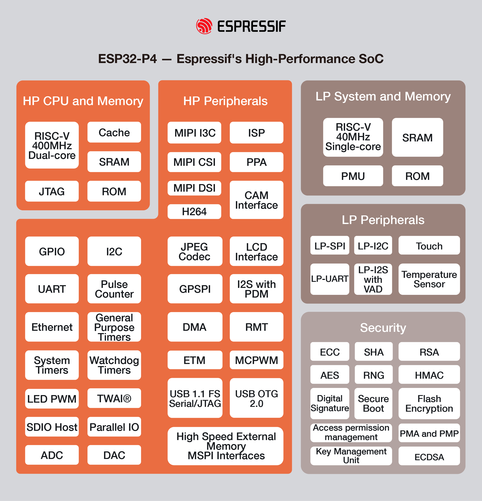

## In arrivo l'ESP32-P4

**Espressif** oggi annuncia l'imminente rilascio del suo ultimo chip <a href="https://www.espressif.com/en/news/ESP32-P4" target="_blank" rel="noopener">ESP32-P4</a>. È alimentato da una CPU <a href="https://en.wikipedia.org/wiki/RISC-V" target="_blank" rel="noopener">RISC-V</a> dual-core con un'estensione delle istruzioni AI, un sottosistema di memoria avanzato e periferiche integrate ad alta velocità. 
ESP 32-P4 è progettato per applicazioni ad alte prestazioni che richiedono una forte sicurezza. 

 👉 In effetti, ESP32-P4 mira a soddisfare la prossima era di applicazioni embedded che si baseranno su un solido supporto per ricche interfacce uomo-macchina, un efficiente edge computing e migliori requisiti di connettività.

## CPU ad alte prestazioni e sottosistema di memoria

Con una CPU RISC-V dual-core con clock di 400 MHz, ESP32-P4 supporta anche estensioni FPU e AI a precisione singola, fornendo così tutte le risorse computazionali necessarie alle moderne applicazioni IOT. ESP32-P4 integra un LP-Core che può funzionare fino a 40 MHz: questo è fondamentale in termini di supporto di applicazioni a bassissima potenza che possono occasionalmente richiedere un calcolo elevato. In tali scenari, i core HP possono essere tenuti fermi per la maggior parte del tempo, allo scopo di risparmiare energia.

### La SRAM on-chip
Il sistema ESP32-P4 ha 768KB di SRAM on-chip, che può diventare accessibile come cache quando è disponibile una PSRAM esterna. Inoltre, il sistema possiede 8KB di RAM TCM a attesa zero, che può essere utilizzata per sezioni di codice time-critical. Questo sistema di memoria ad alte prestazioni, insieme al supporto per PSRAM e Flash esterni, garantisce che la latenza di accesso alla RAM sia sempre molto ridotta.

### La Sicurezza

La sicurezza è al centro del progetto ESP32-P4. Caratteristiche, come avvio sicuro, crittografia Flash,acceleratori crittografici, TRNG, etc. forniscono la infrastruttura necessaria per blindare il dispositivo. 

> **Con l'aiuto della periferica di firma digitale** e di un'unità di gestione delle chiavi dedicata, ESP32-P4 garantisce che le chiavi private siano generate sul SoC stesso e non siano compromesse da software e dati in chiaro (non *crittografati*). Il SoC supporta anche la protezione degli accessi hardware che gestisce i permessi di accesso.

## Ricca interfaccia uomo-macchina

**ESP32-P4** include il supporto per MIPI-CSI con ISP integrato e MIPI-DSI, consentendo così l'integrazione di una fotocamera ad alta risoluzione. Per consentire una maggiore connettività sono inclusi anche ingressi touch capacitivi e funzioni di riconoscimento vocale che questa dispositivo adattissimo ad ogni applicazione basata su HMI.

**Inoltre**, ESP32-P4 integra acceleratori hardware per vari protocolli di codifica dei media, nonché protocolli di compressione evoluti per l'elaborazione delle immagini, incluso il supporto per la codifica H.264. Il chip possiede anche un hardware integrato **Pixel Processing Accelerator**, adatto per lo sviluppo di interfacce GUI.

### Periferiche altamente integrate

**ESP32-P4** ha più di 50 GPIO programmabili, che è significativamente più di quelli di qualsiasi altro chip costruito da Espressif. Supporta tutte le periferiche comunemente utilizzate, come SPI, I2S, I2C, LED PWM, MCPWM, RMT, ADC, DAC, UART e TWAITM. Inoltre, ESP32-P4 supporta USB OTG 2.0 HS, Ethernet e SDIO Host 3.0 per la connettività ad alta velocità.

🔑 Se l'applicazione richiede connettività wireless, ESP32-P4 può facilmente connettersi, come un chip compagno wireless, a qualsiasi prodotto della serie ESP32-C/S/H su SPI/SDIO / UART, utilizzando le soluzioni ESP-Hosted o ESP-AT. 

##### ESP32-P4 può anche funzionare come MCU host per altre soluzioni di connettività, come ACK, AWS IoT ExpressLink,ecc.

ESP32-P4 sarà supportato attraverso ESP-IDF (Matured IoT Development Framework) di Espressif, in modo che gli utenti possano beneficiare della loro familiarità con la piattaforma ESP32.
 
 

Robotdazero.it -  post - R.134.1.0.0
  