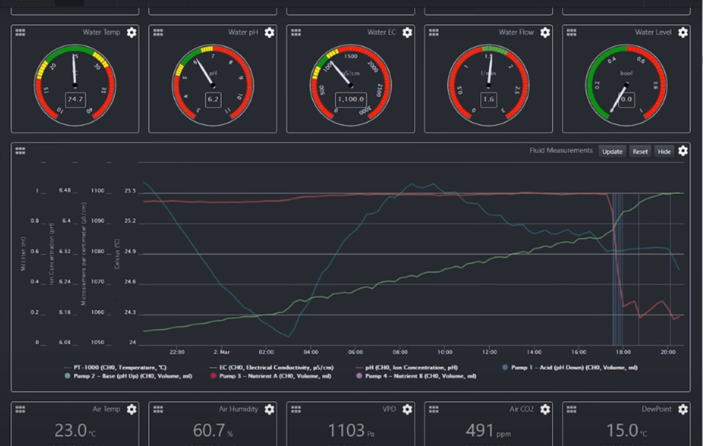
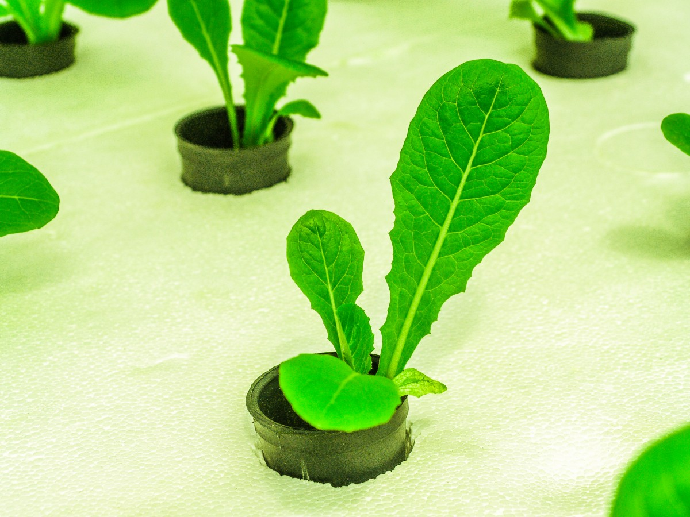
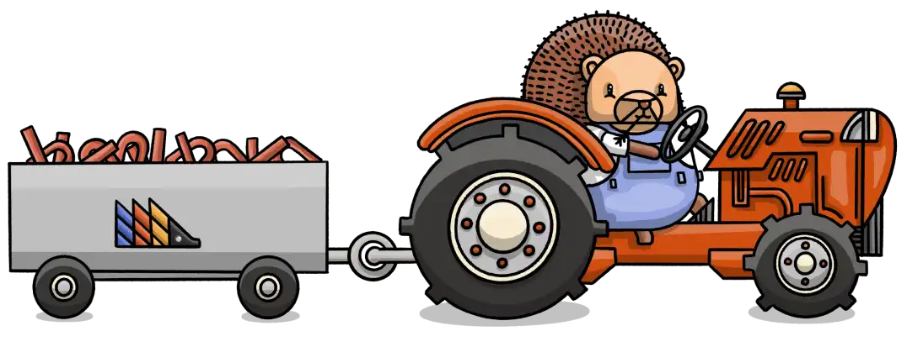

## Cosa è la Idroponica
L'<a href="https://it.wikipedia.org/wiki/Idroponica" target="_blank" rel="noopener">idroponica</a> è un metodo di coltivazione di piante senza terreno, utilizzando acqua o una soluzione ricca di <a href="https://growrillahydroponics.com/fertilizzanti/fertilizzanti-idroponica/" target="_blank" rel="noopener">nutrienti</a> per fornire i nutrienti necessari direttamente alle radici della pianta. Questo metodo offre diversi vantaggi rispetto al giardinaggio tradizionale a base di suolo, tra cui un aumento delle rese, un migliore assorbimento di nutrienti e un ridotto utilizzo di acqua.

Per automatizzare un sistema idroponico, è necessario un controller in grado di monitorare l'ambiente e regolare le condizioni in base alle esigenze. Un'opzione popolare è il computer a scheda singola Raspberry Pi. Il <a href="https://it.wikipedia.org/wiki/Raspberry_Pi" target="_blank" rel="noopener">Raspberry Pi</a> è un piccolo, potente computer che può essere utilizzato per eseguire una varietà di software, tra cui Mycodo, un pacchetto software open-source per il monitoraggio e il controllo ambientale.

## Il software per la coltivazione idroponica

<a href="https://kylegabriel.com/projects/2020/06/automated-hydroponic-system-build.html" target="_blank" rel="noopener">Mycodo</a> è uno strumento facile da usare ma potente che può essere utilizzato per automatizzare una vasta gamma di sistemi idroponici. Può monitorare la temperatura, il pH e i livelli di nutrienti della soluzione acquosa e regolare l'illuminazione, il dosaggio dei nutrienti e le pompe secondo necessità.

 
 

Oltre alla sua interfaccia user-friendly con potenti funzionalità, <a href="https://kylegabriel.com/projects/2020/06/automated-hydroponic-system-build.html" target="_blank" rel="noopener">Mycodo</a> è anche gratuito e open-source. Ciò significa che puoi modificare e migliorare liberamente il software per soddisfare le tue esigenze specifiche.

Ecco una breve panoramica di come utilizzare Mycodo per automatizzare un sistema idroponico:

1. Installare Mycodo sul Raspberry Pi.
2. Configurare Mycodo per monitorare l'ambiente e controllare il sistema.
3. Distribuire il software Mycodo sul Raspberry Pi.
4. Monitorare il sistema e apportare le modifiche necessarie.

Automatizzando il tuo sistema idroponico con Raspberry Pi e Mycodo, puoi aumentare significativamente le tue rese e goderti un approccio più rilassato al giardinaggio, trascurando come come la irrigazione, la pulizia e la concimazione.

<iframe width="800" src="https://www.youtube.com/embed/nyqykZK2Ev4?si=2NuAYExwlSx2DKru" title="YouTube video player" frameborder="0" allow="accelerometer; autoplay; clipboard-write; encrypted-media; gyroscope; picture-in-picture; web-share" allowfullscreen></iframe>

### Coltura idroponica vs. Coltivazione tradizionale

Ci sono molte ragioni diverse per cui scegliere l'idroponica rispetto al tradizionale giardinaggio del suolo. 
I sistemi idroponici funzionano senza suolo, ma sono in grado di far crescere le piante molto più velocemente di quanto possibile con i sistemi tradizionale. 

Si possono ottenere esemplari migliori e in modo rapido con dei costi per l'acqua praticamente azzerati. L'acqua infatti viene riciclata senza perdite escluso la evaporazione e l'assorbimento intrinseco delle piante.

### Gli svantaggi
Ci sono costi di avvio non trascurabili come ad esempio le vasche e i LED per "nutrire " di luce le piante coltivate in appartamento. Ma in generale i costi dipendono dal tipo di impianto e dal numero di piante desiderate. I prezzi vanno da meno di 100 euro per un un impianto con 10 piantine fino a 1000~2000 euro max per un eccellente impianto casalingo.

I costi come vedi possono essere bassi ma sono comunque superiori a quelli del giardinaggio "normale" (parliamo di meno di 10 euro per semi e contenitori). A questo punto forse ti starai chiedendo: "Vale davvero la pena di provare la coltivazione idroponica?"

🔑 Per molte persone la risposta sorprendentemente può essere "SI". I vantaggi della coltivazione idroponica sono infatti molti e importanti.

### I vantaggi della coltivazione idroponica

- non richiede diserbanti
- non ti obbliga a sforzare la schiena (prova a dire che è una cosa secondaria!)
- funziona benissimo dentro un appartamento
- non richiede irrigazione
- non esistono posti in cui i parassiti o gli insetti possano nascondersi
- grazie alla <a href="https://filodendro.it/giardinaggio/substrati/perlite/" target="_blank" rel="noopener">perlite</a> le piante cresco più alte e marciscono raramente
- i costi iniziali vengono ammortizzati molto velocemente

### È sicuro lasciare i LED accesi per 18 ore al giorno?

Se siete preoccupati per sicurezza vostra o della vostra casa, i LED moderni producono poco calore e possono restare accesi 24 ore senza preoccuparsi di vampate o simili. Anche se la loro durata negli anni dipende dalla marca ed dal costo puoi probabilmente lasciarli accessi per 16 ore al giorno. Molti impianti commerciali restano accessi anche più si 16 ore.

 

#### Quanta luce serve alle piante
Molte ricerche hanno scoperto che le piante richiedono un periodo di respirazione giornaliero di almeno 6 ore al giorno per le piantine e di 8~10 ore per le piante mature. Pertanto non è consigliabile fornire più di 12~14 ore al giorno di luce. La regola vale anche se si coltivano varietà che amano le lunghe giornate o volete indurre la fioritura (o frutta) anticipata delle piante.

 

 

## Conclusioni

Nei prossimi post vedremo come realizzare un impianto idroponico "tecnologico" grazie a Mycodo e al Raspberry PI.
Tratteremo della costruzione elettrica e meccanica con i disegni in 3D per gli erogatori dei nutrienti. Alla fine della serie vedremo come implementare semplici algoritmi di machine learning per migliorare la resa e i costi dell'impianto.

<!--

+++++++++++++++++++++++++++++++++++++++++++++
Il serbatoio, un altro componente essenziale del tuo sistema idroponico, svolge un ruolo cruciale nel suo successo. Fortunatamente, simile al vassoio in crescita, questo elemento non richiede un investimento finanziario significativo. Il tuo serbatoio può essere praticamente qualsiasi contenitore in grado di contenere l'acqua, a condizione che tu garantisca che il sistema stesso sia ermetico e completamente opaco. Non vuoi che la luce penetri nel serbatoio che ospita la tua soluzione nutritiva. Se la luce riesce a entrare nel serbatoio, è probabile che si verifichi la crescita di alghe, che può essere un grave mal di testa. Mentre le alghe in sé non sono intrinsecamente dannose, possono causare conseguenze dannose per il sistema idroponico. Riduce essenzialmente la quantità di nutrienti disponibili che le piante non saranno in grado di assorbire da sole. Questo è un problema significativo: se permetti alle alghe di prosperare, le tue piante non riceveranno i livelli di nutrienti appropriati e la loro crescita sarà stentata.
+++++++++++++++++++++++++++++++++++++++++++++

-->

 
 

Robotdazero.it -  post - R.136.1.2.1
  
