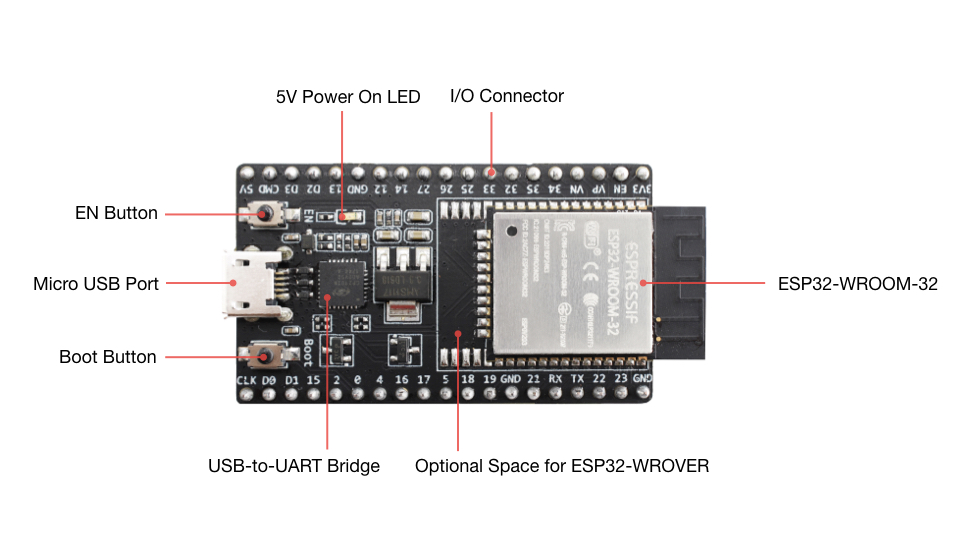

## Le principali caratteristiche tecniche

L'<a href="https://www.espressif.com/en/products/socs/esp32" target="_blank">ESP32</a> è una scheda elettronica integrata (SoC) sviluppata da <a href="https://www.espressif.com/" target="_blank">Espressif Systems</a>. È un chip a basso costo e ad alte prestazioni che offre una varietà di funzionalità, tra cui:

- Processore dual core a 32 bit con clock fino a 240 MHz
- Wi-Fi 802.11 b/g/n,
- <a href="https://it.wikipedia.org/wiki/Bluetooth" target="_blank">Bluetooth</a> 5.0,
- 25 piedini <a href="https://www.renesas.com/us/en/support/engineer-school/mcu-programming-peripherals-01-gpio" target="_blank">GPIO</a>,
- Supporto per sensori e periferiche.

Per quanto riguarda gli utilizzi possibili, L'ESP32 è una piattaforma che può essere utilizzata per una varietà di applicazioni, tra cui:

<div class="alert alert-doks d-flexflex-shrink-1" role="alert">
- Internet delle cose (IoT)<br>
- Dispositivi indossabili<br>
- Giochi e intrattenimento<br>
- Sistemi di automazione domestica<br>
</div>


## La storia dell'ESP32

L'ESP32 ha conquistato dall'oggi al domani una larga fetta del mercato IOT. Nel 2024, grazie ale sue spiccate doti di connettività con reti <a href="https://www.youtube.com/watch?v=aqmIOn3L_Sw" target="_blank">WI-FI</a> e dispositivi Bluetooth, è diventato un punto fermo della comunità dei "maker" Diamo uno sguardo alla sua breve storia.

### La casa madre: Espressif

Il ESP32 è prodotto dalla <a href="https://www.espressif.com/" target="_blank">Espressif</a>, una azienda di microelettronica con sede in Cina fondata appena nel 2008. Il suo primo prodotto, un sistema Wi-Fi "system on chip" (<a href="https://it.wikipedia.org/wiki/System-on-a-chip" target="_blank">SoC</a>) a 2,4 GHz, è stato introdotto sul mercato nel 2013. Si chiamava <a href="https://taoic.oss-cn-hangzhou.aliyuncs.com/sku/pdf/613d09e7100ee9df8577807cd89192a7ed6c218d.pdf" target="_blank">ESP8089</a> ed era destinato all'uso su tablet e applicazioni set-top box. Ma è stato l' <a href="https://it.wikipedia.org/wiki/ESP8266" target="_blank">ESP8266</a>, rilasciato nel 2014, che ha portato questa famiglia di prodotti alla attenzione di makers ed aziende.

La "mission" di Espressif si concentra soprattutto sulle soluzioni per L'Intelligenza artificiale delle cose (<a href="https://www.internet4things.it/iot-library/artificial-intelligence-of-things-aiot-che-cose-e-come-funziona/" target="_blank">IoT</a>). Con l'ESP32 è riuscita a conciliare una discreta potenza di elaborazione con la connettività wireless a basso consumo. L'antenato dell'ESP32 e cioè la scheda ESP8266 aveva aperto la strada pochi anni prima mondo IOT creando per la prima volta un dispositivo single-chip facile da usare con tutto il software necessario per comunicare via Wi-Fi.

### I "motori" della Espressif

Parlando della impostazione di base, l'ESP8266 era alimentato da un processore RISC <a href="https://www.cadence.com/en_US/home/tools/ip/tensilica-ip.html" target="_blank">Tensilica Xtensa</a> L106 a 32 bit: questa tipo di architettura piuttosto originale deriva dai progetti della americana <a href="https://www.cadence.com/en_US/home.html" target="_blank">Cadence</a> (un fornitore leader di IT con sede in San Jose - California con oltre 10.000 dipendenti).

 L'obiettivo dichiarato della azienda, secondo un comunicato stampa del 2007, era raggiungere uno score in Dhrystone <a href="https://it.wikipedia.org/wiki/MIPS_(unit%C3%A0_di_misura)" target="_blank">MIPS</a> migliore del noto <a href="https://developer.arm.com/Processors/Cortex-M3" target="_blank">ARM Cortex-M3</a>. Inoltre, proprio per facilitare la connettività del processore hanno cercato il minimo consumo in mW per agevolare i disporitivi alimentati a batteria.

### I primi successi commerciali

La comunità dei produttori è venuta a conoscenza di questi dispositivi nel 2014, quando <a href="https://hackaday.com/" target="_blank">Hackaday</a> ha annunciato l'introduzione di un nuovo modulo Wi-Fi da $5 venduto tramite Seeed Studio. Conosciuto come ESP-01, questo modulo è stato costruito dal produttore di terze parti Ai-Thinker, anch'esso con sede in Cina. 

Era in sostanza il primo prototipo dell'ESP32 ed era severamente limitato dagli appena otto pin disponibili, due dei quali per giunta utilizzati dalla interfaccia UART. La scheda ESP-01 comunque era facile da integrare con la <a href="https://www.arduino.cc/en/software" target="_blank">piattaforma software</a> di Arduino, con la possibilità di connettersi a Internet senza bisogno di schedine aggiuntive. L'unico punto critico: tutta la documentazione è stata scritta in cinese! 

### Il costo dell'ESP32

La bellezza dei moduli basati sull'ESP8266 era il minimo numero di componenti necessari per costruire una scheda usabile dagli appassionati e da piccole aziende con un modulo Wi-Fi funzionale. Supponendo che fosse disponibile un'alimentazione a 3,3 V, i progetti avevano solo bisogno di poche <a href="https://www.robotdazero.it/blog/cosa-sono-le-resistenze-elettriche/" target="_blank">resistenze</a> e condensatori, un'antenna e un <a href="https://www.digikey.it/it/ptm/n/nxp-semiconductors/quad-spi-flash-interface-spifi" target="_blank">programmatore seriale QSPI</a> esterno. All'accensione, l'ESP8266 estraeva il firmware dal flash e quindi lo copiava nella <a href="https://en.wikipedia.org/wiki/Static_random-access_memory" target="_blank">SRAM</a> interna da dove veniva eseguito.
 
Fu immediatamente chiaro che si potevano costruire dei microcontroller stile <a href="https://www.robotdazero.it/blog/la-guida-definitiva-per-scegliere-il-tuo-arduino/" target="_blank">Arduino</a> a bassissimo prezzo. 
Tecnicamente il processore presentava ingressi/uscite generiche (<a href="https://it.wikipedia.org/wiki/General_Purpose_Input/Output" target="_blank">GPIO</a>), uscite <a href="https://it.wikipedia.org/wiki/Modulazione_di_larghezza_d%27impulso" target="_blank">PWM</a> (pulse-width modulated), un convertitore analogico-digitale (<a href="https://it.wikipedia.org/wiki/Convertitore_analogico-digitale" target="_blank">ADC</a>) e tutte le interfacce seriali standard. 

Con queste premesse non è passato molto tempo prima che qualche programmatore usasse la sterminata libreria già disponibile per Arduino sulla nuova scheda "cinese".

Inoltre nel 2015 Espressif aveva rilasciato un <a href="https://www.espressif.com/en/products/software/esp-sdk/overview" target="_blank">kit</a> di sviluppo software (SDK) che permetteva di creare codice utente che si collegava Wi-Fi. Il kit era ed è disponibile in due versioni: una basata sul sistema operativo in tempo reale <a href="https://www.freertos.org/a00104.html" target="_blank">FreeRTOS</a> e un'altra che si basava su <a href="https://it.wikipedia.org/wiki/Callback" target="_blank">callback</a> e timer software per garantire che il programma utente rispettasse l tempo di elaborazione con lo stack software del Wi-Fi. Secondo le specifiche della casa madre il kit e l'hardware potevano disporre di circa 50 kB di memoria per il loro codice.

### Gli sviluppi recenti

I dispositivi della serie ESP32 attualmente disponibili dispongono di un microprocessore dual-core Tensilica Xtensa LX6 a 32 bit. Con 48 pin, forniscono 520 kB di SRAM e, per alcuni dispositivi, tra 4 e 8 MB di memoria flash. 2.4 GHz Wi-Fi e Bluetooth/Bluetooth LE versione 4.2 sono disponibili sul lato connettività. Un modulo integrato ultra-low-power (<a href="https://www.st.com/en/microcontrollers-microprocessors/stm32-ultra-low-power-mcus.html" target="_blank">ULP</a>) è disponibile sul chip dell'ESP32 per gestire la modalità "deep sleep". Questo modulo riesce a monitorare alcune periferiche (non tutte) durante la modalità sleep (una specie di ibernazione controllata) rendendolo perfetto per progetti alimentati a batteria.


Schema a blocchi del Tensilica Xtensa 32-bit LX6

<br>

Con le serie ESP32-S2 (single-core) e ESP-S3 (dual-core) a 56 pin, gli sviluppatori beneficiano del processore <a href="https://www.cadence.com/en_US/home/resources/datasheets/xtensa-lx7-processor-ds.html" target="_blank">Xtensa LX7</a> a 32 bit. Questo core da 240 MHz offre istruzioni vettoriali, fornendo il "boost" necessario per l'utilizzo dalle reti neurali.

La nuova versione comprende ovviamente Wi-Fi e Bluetooth, anche se quest'ultimo è aggiornato solo alla versione 5.0. Le periferiche di interfaccia rimangono più o meno le stesse con l'aggiunta del sistema <a href="https://docs.espressif.com/projects/esp-idf/en/latest/esp32/api-reference/peripherals/twai.html" target="_blank">TWAI</a>
, una interfaccia automobilistica a due fili. Quest'ultimo è compatibile con ISO 11898-1, altrimenti noto come <a href="https://protezione-auto.it/can-bus-come-funziona/" target="_blank">CAN</a>, uno standard "storico" dei produttori di automobili occidentali. La sicurezza è inoltre potenziata con la disponibilità di crittografia flash e un acceleratore <a href="https://docs.espressif.com/projects/esp-idf/en/latest/esp32s2/api-reference/peripherals/hmac.html" target="_blank">HMAC</a> (Message Authentication Code) basato su hash.


### Il software della piattaforma ESP32

Al 2024 una vasta gamma di tools e codice sono già disponibili per gli sviluppatori. Per chi utilizza Arduino, il modo più facile per iniziare consiste nell'usare lo stesso IDE di Arduino!

 Basta aggiungere la posizione dei pacchetti Arduino-ESP32 tramite File - > Preferenze, quindi selezionare ESP32 da Strumenti - > Board - > Board Manager (Figura 3). Una volta completato, una serie di esempi verrà visualizzata in File -> Esempi, proprio come con qualsiasi piattaforma Arduino standard. 


 <div class="alert alert-doks d-flexflex-shrink-1" role="alert">
 🔑 Il codice sorgente viene salvato con lo standard '.ino ' come nome file e i programmi seguono la solita impostazione setup() e loop() a cui sei probabilmente abituato.
  </div>
 


### Parliamo del modulo Wi-Fi
L'ESP32 integra un modulo Wi-Fi 802.11 b/g/n che supporta velocità di trasmissione dati fino a 150 Mbps. Ciò lo rende ideale per applicazioni che richiedono una connessione wireless ad alta velocità, come la trasmissione di dati in tempo reale o la gestione di dispositivi IoT.
Bluetooth 5.0
L'ESP32 integra un modulo Bluetooth 5.0 che supporta velocità di trasmissione dati fino a 2 Mbps. 

> Ciò lo rende ideale per applicazioni che richiedono una connessione Bluetooth ad alta velocità, come ad esempio la trasmissione di dati audio o la connessione in LAN di altri dispositivi IoT.

## L'utilizzo dell'ESP32

L'ESP32 dispone di 25 pin GPIO che possono essere utilizzati per interfacciarsi con sensori e periferiche. Ciò lo rende versatile e adatto a una varietà di applicazioni. Supporta una ampia gamma di sensori e periferiche, tra cui sensori di temperatura, luce, movimento oltre a display, motori, servocomandi industriali e per modellismo. 

Inoltre è una piattaforma ideale per lo sviluppo di dispositivi indossabili come smartwatch, fitness tracker e altri. È molto piccolo e leggero, il che lo rende ideale per questo tipo di applicazioni.L'ESP32 può essere utilizzato per sviluppare giochi e applicazioni di intrattenimento. 

#### LA differenza tra ESP32 e ESP8266
Come già accennato in precedenza, l'ESP32 è il successore di ESP8266 nella tabella in basso possiamo vedere le maggiori differenze tra i due microchip:

1. ESP32 ha un core aggiuntivo rispetto a ESP8266
2. Il sistema Wi-Fi è più veloce
3. E' aumentato il del numero di pin GPIO (input/output) 
4. ESP32 dispone di Compatibilità con Bluetooth 4.2 e Bluetooth low energy (low energy).

## La schema interno dell'ESP32

Di seguito è riportato lo schema a blocchi dell'ESP32 con tutti i blocchi funzionali che compongono il SOC.


Diagramma a blocchi dell'ESP32

### Connettività wireless:
Il chip SOC ESP32 ha connettività WiFi, essendo compatibile con 802.11 b/g/n nella banda 2.4 GHz, raggiungendo velocità fino a 150 Mbit/s. Non funziona con i canali a 5GHz. Include anche la comunicazione Bluetooth compatibile con Bluetooth v4.2 e Bluetooth Low Energy (BLE).

### Core
Il processore è un Tensilica Xtensa 32-bit LX6 <a href="https://it.wikipedia.org/wiki/Processore_multicore" target="_blank">dual core</a>. I nomi dei core sono PRO-CPU e APP-CPU. Pro-CPU sta per Protocol CPU e APP-CPU sta per Application CPU. La CPU Protocol è progettata per gestire funzionalità utente come Wi-Fi, Bluetooth e periferiche. La CPU dell'applicazione è progettata per gestire i codici in ESP 32. 

Entrambi questi core sono collegati ai <a href="https://it.wikipedia.org/wiki/Registro_(informatica)" target="_blank">registri</a> di memoria e indirizzo. I core di LX6 hanno una frequenza di clock di 160 MHz e quella di LX7 è di 240 MHz. La figura seguente mostra la mappatura delle 2 CPU alle varie unità di memoria.


Schema a blocchi del chip Tensilica Xtensa 32-bit LX6

<br>

I microprocessori Tensilica Xtensa LX6 e LX7 hanno un'architettura <a href="https://it.wikipedia.org/wiki/Reduced_instruction_set_computer" target="_blank">RISC</a> a 32 bit. Pertanto, le unità di memoria e le periferiche sono progettate in modo tale da poter comunicare con registri di indirizzi a 32 bit. La mappatura dell'architettura è mostrata nel diagramma sottostante in cui si può vedere che tutte le periferiche, <a href="https://www.fastweb.it/fastweb-plus/digital-magazine/che-cos-e-e-a-cosa-serve-la-memoria-rom/" target="_blank">ROM</a> e SRAM interne, memoria di comunicazione in tempo reale veloce e lenta, memoria cache e flash esterno, sono tutte mappate con registri a 32 bit.


Mappatura dei chip RISC Tensilica Xtensa LX6 e LX7

<br>

> **I chip possiedono un co-processore** a bassissima potenza che viene utilizzato per eseguire conversioni analogico-digitali e altre operazioni e può funzionare in modalità deep sleep - low-power. In questo modo, si ottiene un consumo elettrico ridottissimo.

### Un breve confronto con Arduino

Alcuni vantaggi rispetto ad Arduino UNO:

- Frequenza di funzionamento: 240 MHz (esegue le istruzioni 15 volte più veloce di una scheda Arduino UNO)
- Consente di eseguire operazioni con numeri reali (numeri con virgole) in modo molto efficiente.
- Consente di moltiplicare istantaneamente grandi numeri.

Sebbene queste caratteristiche siano trasparenti durante la programmazione, hanno un grande impatto sull'efficienza e sulle dimensioni del codice scritto sul microcontroller.


#### La memoria dell'ESP32 e quella di Arduino
Nella maggior parte dei microcontrollori basati su Arduino, ci sono tre tipi di memorie:

- Memoria di programma: per memorizzare il codice.
- Memoria SRAM: per memorizzare le variabili utilizzate nel codice.
- Memoria EEPROM: per memorizzare variabili statiche che non perdono il loro valore anche quando il dispositivo è spento.

L'ESP32 funziona in modo leggermente diverso, infatti ha altri tipi di memorie che di solito sono classificate in interne ed esterne. Le memorie interne sono quelle che sono già incluse nel SoC, e quelle esterne sono quelle che possono essere aggiunte per espandere la capacità del sistema.

Molte schede di sviluppo basate su ESP32 aggiungono memoria esterna per un sistema più performante.

#### Quali sono le Memorie interne:

- Memoria ROM (448 KiB): questa memoria è di sola scrittura, cioè non è possibile riprogrammarla. È qui che vengono memorizzati i codici che gestiscono lo stack Bluetooth, il controllo del Wi-Fi e il bootloader per avviare i programmi utente.
- Memoria SRAM interna (520 KiB): questa memoria viene utilizzata dal processore per memorizzare sia i dati che le istruzioni. Il suo vantaggio è che è molto più facile per il processore accedere rispetto alla SRAM esterna.
- <a href="https://www.st.com/en/clocks-and-timers/rtc-parallel-interface-timekeepers.html" target="_blank">RTC</a> SRAM (16 KiB): questa memoria viene utilizzata dal coprocessore quando il dispositivo funziona in modalità deep sleep .
- <a href="https://onlinedocs.microchip.com/pr/GUID-9DEF0110-B60A-445F-B120-FC5000EE0D2F-en-US-2/index.html?GUID-9D9539CA-799C-4FEC-B119-4BD30EFAEC09" target="_blank">Efuse</a> (1 Kb): 256 bit di questa memoria sono utilizzati dal sistema stesso e i restanti 768 bit sono riservati ad altre applicazioni.
- Flash embedded (Embedded flash): questa memoria è dove è memorizzato il codice dell'applicazione. 

La quantità di memoria varia a seconda del chip utilizzato:
0 MB (chip ESP32-D0WDQ6, ESP32-D0WD, ESP32-S0WD)
2 MB (circuito integrato ESP32-D2WD)
4 MB (Chip ESP32-PICO-D4)

Per ESP32S che non hanno memoria incorporata o semplicemente quando la memoria è insufficiente per l'applicazione, è possibile aggiungere più memoria esternamente :

#### Espansione di memoria
<div class="alert alert-doks d-flexflex-shrink-1" role="alert">
⚡️ È' possibile aggiungere fino a 16 MB di memoria flash esterna: in questo modo è possibile sviluppare applicazioni estremamente complesse. Supporta anche fino a 8 MB di memoria SRAM esterna. 
</div>

#### Acceleratori hardware di crittografia
Uno dei fattori più importanti in qualsiasi sistema è la sicurezza. Ecco perché l'ESP32 ha acceleratori di algoritmi mirati alla <a href="https://it.wikipedia.org/wiki/Crittografia" target="_blank">crittografia</a>:

1. AES (FIPS PUB 197)
2. SHA (FIPS PUB 180-4)
3. RSA
4. ECC

Questi acceleratori consentono di aumentare la velocità di funzionamento, e permettono di lanciare algoritmi di crittografia e de-crittografia dinamica. In tal modo il sistema è meglio protetto da possibili attacchi di hacking.


#### La scheda di sviluppo DevKitC

L'ESP32 è un chip versatile ed ampiamente adottato dalla industria "automotive" per esempio, ma per essere usato da hobbysti e programmatori ha bisogno di una scheda di sviluppo che fornisca la alimentazione e la connessione seriale.



Il piccolo chip che provvede alla alimentazione si chiama AMS1117 e lo vedi nella foto al centro della scheda, vicino al bridge UART. 

<br>

## La piedinatura del modulo ESP32 WROOM


immagine della piedinatura del modulo ESP32 WROOM

Come potete vedere dall'immagine sopra del diagramma di piedinatura del modulo ESP32 WROOM, tutti i diversi tipi di pin sono menzionati in diversi colori e sono raggruppati per uilizzo. Molti piedini posso compiere diverse funzioni.

#### I pin digitali

> **L'ESP32 ha un totale di 34 pin digitali**. Questi pin sono simili ai pin digitali Arduino che consentono di aggiungere display a LED, display OLED, sensori, pulsanti, cicalini, ecc. ai nostri progetti.

La maggior parte di questi pin supporta anche l'uso di pull-up interno (in sostanza una resistenza da 10 KOhm). Ciò li rende ideali per il collegamento di pulsanti e tastiere a matrice, e per controllare gruppi di LED.

> **Il modulo WROOM ESP32 ha 25 pin GPIO** e la corrente massima assorbita per un singolo GPIO è 40mA secondo la sezione "Condizioni operative consigliate" nella scheda tecnica dell'ESP32.


### Come settare i pin digitali in "OUTPUT"

È possibile utilizzare i pin GPIO in OUTPUT per controllare qualsiasi cosa, da dispositivi con minimo assorbimento come un LED, fino a dispositivi di elevato wattaggio utilizzando dei relay o dei tiristori, ecc. Facciamo l'esempio classico in cui vogliamo accendere e spegnere un LED esterno, ovviamente aggiungendo una resistenza di 330 Ohm!

Prima di tutto, è necessario definire il pin GPIO per operare in modalità di output nella funzione "setup()", utilizzando la funzione Arduino "pinMode()" come mostrato di seguito:

```bash
pinMode(GPIO_pin, OUTPUT);
```
Quindi puoi settare il pin **HIGH** o **LOW** per cambiarne lo stato digitale. Puoi accendere il LED scrivendo HIGH o 1, vengono interpretati allo stesso modo. <br>Per spegnerlo ovviamente puoi scrivere un LOW o 0. In entrambi casi si utilizza la funzione Arduino "digitalWrite()" come vedi in basso:

```bash
digitalWrite(GPIO_pin, HIGH); // Accendi 
digitalWrite(GPIO_pin, LOW);  // Spegni
```


##### Ingresso solo pin (senza resistente di PULLUP)

- GPIO 34
- GPIO 35
- GPIO 36
- GPIO 39

##### Pin con INPUT_PULLUP (dispongono di una resistenza di 10KOhm)

- GPIO14
- GPIO16
- GPIO17
- GPIO18
- GPIO19
- GPIO21
- GPIO22
- GPIO23

##### Pin senza pull up interno

- GPIO13
- GPIO25
- GPIO26
- GPIO27
- GPIO32
- GPIO33

##### ADC (convertitori analogico-digitali)
Alcuni dei pin elencati nel diagramma di piedinatura possono anche essere utilizzati per interagire con sensori analogici, come i pin analogici di Arduino.

<div class="alert alert-doks d-flexflex-shrink-1" role="alert">
🔑 <strong>I pin analogici dell'ESP32</strong> hanno una risoluzione di 12 bit (0-4096). Se la tensione osservata è <strong>0</strong> il valore rilevato dalla CPU è <strong>0</strong>. Se la tensione arriva sul pin a <strong>3,3V</strong> il valore rilevato diventa <strong>4096</strong>.
</div>

##### Questi i pin di ingresso analogico:

- ADC1_CH0 (GPIO 36)
- ADC1_CH1 (GPIO 37)
- ADC1_CH2 (GPIO 38)
- ADC1_CH3 (GPIO 39)
- ADC1_CH4 (GPIO 32)
- ADC1_CH5 (GPIO 33)
- ADC1_CH6 (GPIO 34)
- ADC1_CH7 (GPIO 35)
- ADC2_CH0 (GPIO 4)
- ADC2_CH1 (GPIO 0)
- ADC2_CH2 (GPIO 2)
- ADC2_CH3 (GPIO 15)
- ADC2_CH4 (GPIO 13)
- ADC2_CH5 (GPIO 12)
- ADC2_CH6 (GPIO 14)
- ADC2_CH7 (GPIO 27)
- ADC2_CH8 (GPIO 25)
- ADC2_CH9 (GPIO 26)


#### DAC (Convertitori da digitali ad analogici)
I segnali PWM sono utilizzati sulla maggior parte delle schede Arduino per generare tensioni analogiche. L'ESP32 ha due convertitori da digitale ad analogico a 8 bit.

## Il successo commerciale dell'ESP32
Con queste premesse possiamo capire come la scheda abbia scalato le classifiche di vendita dell'IOT. Seppure venga percepita come una **alternativa** rispetto ad Arduino, ne eredita moltissimi tools e librerie. Gli appassionati che vogliono provare il nuovo sistema possono dunque godere delle maggiori prestazioni senza perdere tempo con nuovi software.

#### Ultimi arrivi della famiglia ESP32
Il microcontroller <a href="https://www.robotdazero.it/blog/in-arrivo-il-nuovo-esp32-p4/" target="_blank">ESP32-P4</a> promette di migliorare ancora le prestazioni della nostra scheda. Con una CPU RISC-V dual-core con clock di 400 MHz e 768KB di SRAM on-chip il nuovo sistema garantisce elevate prestazioni e una più facile connessione di fotocamere ad alta risoluzione con protocollo MIPI-CSI.
<br>
<br>
<p style="font-size: 0.80em;">Robotdazero.it -  post - R.138.1.2.4</p>
