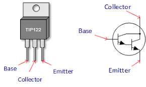
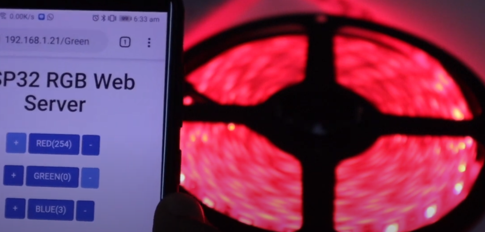
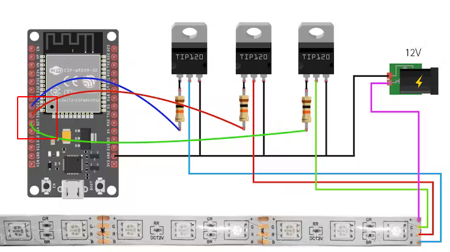

<!-- https://diyusthad.com/2019/10/controlling-rgb-lights-from-esp32-web-server.html -->
## L'ESP32 e i dispositivi ad alto assorbimento

In molte applicazioni IOT ti troverai a usare dispositivi ad alto assorbimento, che richiedono correnti che l'ESP32 non è in grado di fornire. In questi casi, prima di passare ai relays elettronici o meccanici possiamo ricorrere ad un economico transistor di media potenza come il **TIP120**.

<br>

> Un errore comune tra i neofiti è provare a pilotare motori elettrici, servocomandi o decine di Led usando la corrente di uscita di un ESP32 o di un Arduino. Purtroppo tali dispositivi esterni possono richiedere correnti elevate, molto più alte di quelle erogabili da un controller. Arduino, ad esempio può erogare appena **40mA** a **5.0V** e quindi **0.2W** di potenza a fronte di richieste di **50**~**100W**!

Per fare un esempio, la striscia di **LED RGB** che useremo in questo progetto richiede correnti di **5**~**6** Ampere per una potenza complessiva di circa **70W**: pensa alla corrente che sarebbe necessaria per azionare un cancello automatico!


<div class="alert alert-doks d-flexflex-shrink-1" role="alert">🔑
<strong>Come calcolare la corrente necessaria per questo progetto:</strong><br>La corrente che può consumare una striscia di LED di 5 mt alimentata a 12V dipende dalla potenza nominale della striscia. La potenza nominale è indicata in Watt per metro lineare, quindi per calcolare la corrente totale della striscia basta moltiplicare la potenza nominale per la lunghezza della striscia.<br>Nel nostro progetto la striscia di LED da 14,4W/mt consuma 72W su una lunghezza di 5mt. La corrente totale assorbita dalla striscia sarà quindi 72W / 12V = 6A.
</div>

<br>

Detto questo, la soluzione ai nostri problemi di erogazione è molto semplice: basta usare un transistor come *switch*, e per questo compito non esiste nulla di meglio che usarne uno di tipo <a  target="_blank" href="https://it.wikipedia.org/wiki/Transistor_Darlington">Darlington</a> come ad esempio il **TIP120**.



<br>
<br>

Quando applichiamo una piccola tensione alla base di un transistor Darlington, il componente si attiva e permette alla corrente a **12V** di fluire liberamente e alimentare il carico, nel nostro caso i LED. Se vuoi approfondire la differenza tra corrente e tensione ti consiglio di leggere questo [articolo](https://www.robotdazero.it/blog/la-differenza-tra-corrente-e-tensione) del blog di Robotdazero.

## Il nostro progetto

Obiettivo di questo prototipo è *pilotare* da smartphone o desktop una striscia di LED RGB a **12V**: la striscia verrà collegata a 3 TIP 120, a loro volta connessi ad un singolo ESP32. Le basi dei transistor sono collegate a 3 pin **PWM** dell'ESP32, uno ciascuno per le linee rosse, verdi e blu della striscia.



<br>
<br>

Per quanto riguarda il software, abbiamo creato un server web minimale da caricare sul browser digitando l'indirizzo **IP** acquisito del nostro ESP32. La pagina Web contiene alcuni pulsanti per attivare / disattivare ogni colore e ci sono anche pulsanti per mescolare i colori rosso, verde e blu per creare qualsiasi combinazione di colori. Si tratta comunque di un server web minimale, senza supporto per AJAX e perciò noterai un breve **refresh** della pagina dopo la pressione di un pulsante.


<div class="alert alert-doks d-flexflex-shrink-1" role="alert">🔑
<strong>Cosa è AJAX:</strong>
AJAX, abbreviazione di Asynchronous JavaScript and XML, è un insieme di tecnologie che consentono di scambiare dati tra un browser web e un server web in modo asincrono. Ciò significa che l'utente può continuare a interagire con la pagina web, anche mentre i dati vengono caricati.<br><br>AJAX è composto da diverse tecnologie, tra cui:
<strong>HTML/XHTML</strong>: il linguaggio di markup utilizzato per creare la struttura di una pagina web.
<strong>CSS</strong>: il linguaggio di stile utilizzato per definire l'aspetto di una pagina web.
<strong>JavaScript</strong>: il linguaggio di scripting utilizzato per aggiungere funzionalità dinamiche a una pagina web.
<strong>XMLHttpRequest</strong>: un'API JavaScript che consente di inviare richieste al server web e ricevere le risposte.
<br><br>AJAX viene utilizzato per creare pagine web più dinamiche e interattive: ad esempio, viense spesso utilizzato per 
aggiornare il contenuto di una pagina web senza ricaricarla da zero.
</div>


### Lo schema elettrico del circuito
Segui attentamente la disposizione dei connettori, studia la foto e in pochi minuti sarai in grado di creare ogni combinazione di colore RGB.



<br>
<br>

1. Collega i terminali **R**,**G** & **B** della striscia al pin di **collettore** del transistor come da immagine.
2. Usando le tre resistenze da **10 Kohm** collega la **base** di ogni transistor ai rispettivi pin **D25**, **D26** e **D27** dell'ESP32.

Le resistenze sono utili per limitare la corrente di ingresso nei transistor e non sono opzionali. Inoltre tutti i dispositivi devono essere collegati tra di loro: il **GND** dell'ESP32 deve essere collegato al **GND** dei transistor e a quello dell'alimentatore a 12V. L'ESP32 può essere alimentato da un semplice cavo USB collegato al PC. Nella immagine in alto puoi notare il rettangolo rosso attorno ai pin **26**,**27**,**25** dell'ESP32.

### L'hardware utilizzato 
Il circuito comprende pochi pezzi facili da assemblare anche senza una breadboard:

- ESP32 (**1 pz**)
- TIP120 (**3 pz**)
- Resistenze 10K Ohm (**3 pz**)
- Striscia di LED RGB (**1 pz**)  <a href="https://amzn.to/3Sb5V6S" target="_blank">vedi su Amazon</a>


### Il codice completo

```bash
// Carica la libreria  Wi-Fi
#include <WiFi.h>
#include <analogWrite.h>

// Sostituisci con le tue vere credenziali
const char* ssid     = "SSID";
const char* password = "Password";

WiFiServer server(80);
String header;

const int redPin   = 26;
const int greenPin = 27;
const int bluePin  = 25;

int greenValue = 0;
int redValue   = 0;
int blueValue  = 0;

String redValueString = String(redValue);
String greenValueString = String(greenValue);
String blueValueString = String(blueValue);

void setup() {
  Serial.begin(115200);

  Serial.print("In connessione");
  Serial.println(ssid);
  WiFi.begin(ssid, password);
  while (WiFi.status() != WL_CONNECTED) {
    delay(500);
    Serial.print(".");
  }
  
  // Scrivi l'indirizzo IP del server web
  Serial.println("");
  Serial.println("WiFi connesso.");
  Serial.println("Indirizzo IP: ");
  Serial.println(WiFi.localIP());
  server.begin();

  analogWriteResolution(8);
}

void loop(){

  WiFiClient client = server.available();   // In ascolto per le connessioni

  if (client) {                             // Quando si connette un client,
    Serial.println("New Client.");          // scrivi un messaggio sul monitor seriale
    String currentLine = "";                // Crea una String per conservare i dati della connessione
    while (client.connected()) {            // Loop... 
      if (client.available()) {             // Se c'è un dato in arrivo dal client,
        char c = client.read();             // leggi il caratter, 
        Serial.write(c);                    // e scrivilo sul monitor seriale
        header += c;
        if (c == '\n') {                    // Se era "newline" esegui le 4 linee seguenti
          if (currentLine.length() == 0) {
            client.println("HTTP/1.1 200 OK");
            client.println("Content-type:text/html");
            client.println("Connection: close");
            client.println();

            if(header.indexOf("GET /-r") >=0 ) redValue -=1;
            else if(header.indexOf("GET /+r") >=0) redValue +=1;
            else if(header.indexOf("GET /+g") >=0) greenValue +=1;
            else if(header.indexOf("GET /-g") >=0) greenValue -=1;
            else if(header.indexOf("GET /+b") >=0)  blueValue +=1;
            else if(header.indexOf("GET /-b") >=0) blueValue -=1;
            else if(header.indexOf("GET /Red") >=0) if(redValue == 0) redValue = 254; else redValue = 0;
            else if(header.indexOf("GET /Green") >=0) if(greenValue == 0) greenValue = 254; else greenValue = 0;
            else if(header.indexOf("GET /Blue") >=0) {if(blueValue == 0) blueValue = 254; else blueValue = 0;}

            analogWrite(redPin,redValue);
            analogWrite(bluePin,blueValue);
            analogWrite(greenPin,greenValue);

            redValueString = String(redValue);  
            greenValueString = String(greenValue);
            blueValueString = String(blueValue);

            // Mostra la pagina web
            client.println("<!DOCTYPE html><html>");
            client.println("<head><meta name=\"viewport\" content=\"width=device-width, initial-scale=1\">");
            client.println("<link rel=\"icon\" href=\"data:,\">");
            // CSS to style the on/off buttons 
            client.println("<link rel=\"stylesheet\" href=\"https://maxcdn.bootstrapcdn.com/bootstrap/3.4.0/css/bootstrap.min.css\">");
            
            // Heading della pagina web
            client.println("</head>");
            client.println("<center>");
            client.println("<body><h1>ESP32 RGB Web Server</h1>"); 
            client.println("<br>");

            client.println("<a href = \" /+r \" ");
            if(redValue == 254)
            client.println("<button type=\"button\" class=\"btn btn-primary btn-md disabled\">+</button>"); 
            else
            client.println("<button type=\"button\" class=\"btn btn-primary btn-md\">+</button>"); 
            client.println("</a>");

            client.println("<a href = \" /Red\" ");
            client.println("<button type=\"button\" class=\"btn btn-primary btn-md\">RED(" + redValueString + ")</button>");  
            client.println("</a>");
            
            client.println("<a href = \" /-r \" ");
            if(redValue == 0)
            client.println("<button type=\"button\" class=\"btn btn-primary btn-md disabled\">-</button>");  
            else
            client.println("<button type=\"button\" class=\"btn btn-primary btn-md\">-</button>");  
            client.println("</a>");

            client.println("<br>");
            client.println("<br>");

            client.println("<a href = \" /+g \" ");
            if(greenValue == 254)
            client.println("<button type=\"button\" class=\"btn btn-primary btn-md disabled\">+</button>"); 
            else
            client.println("<button type=\"button\" class=\"btn btn-primary btn-md\">+</button>"); 
            client.println("</a>");
            
            client.println("<a href = \" /Green \" ");
            client.println("<button type=\"button\" class=\"btn btn-primary btn-md\">GREEN(" + greenValueString + ")</button>");  
            client.println("</a>");

            client.println("<a href = \" /-g \" ");
            if(greenValue == 0)
            client.println("<button type=\"button\" class=\"btn btn-primary btn-md disabled\">-</button>");  
            else
            client.println("<button type=\"button\" class=\"btn btn-primary btn-md\">-</button>");
            client.println("</a>");

            client.println("<br>");
            client.println("<br>");

            client.println("<a href = \" /+b \" ");
            if(blueValue == 254)
            client.println("<button type=\"button\" class=\"btn btn-primary btn-md disabled\">+</button>");  
            else
            client.println("<button type=\"button\" class=\"btn btn-primary btn-md\">+</button>");  
            client.println("</a>");

            client.println("<a href = \" /Blue \" ");
            client.println("<button type=\"button\" class=\"btn btn-primary btn-md\">BLUE(" + blueValueString + ")</button>");  
            client.println("</a>");

            client.println("<a href = \" /-b \" ");
            if(blueValue == 0)
            client.println("<button type=\"button\" class=\"btn btn-primary btn-md disabled\">-</button>");  
            else
            client.println("<button type=\"button\" class=\"btn btn-primary btn-md\">-</button>");  
            client.println("</a>");

            client.println("<center>");
            client.println("</body></html>");

            
            client.println();
            break;
          } else {
            currentLine = "";
          }
        } else if (c != '\r') {
          currentLine += c;
        }
      }
    }
    header = "";
    client.stop();
    Serial.println("Client disconnesso.");
    Serial.println("");
  }
}
```

#### Il file make per PlatformIO

Se decidi di utilizzare PlatformIO dalla linea di comando crea un file "platformio.ini" con questo contenuto:

```bash
; PlatformIO Project Configuration File
;
;   Build options: build flags, source filter
;   Upload options: custom upload port, speed and extra flags
;   Library options: dependencies, extra library storages
;   Advanced options: extra scripting
;
; Please visit documentation for the other options and examples
; https://docs.platformio.org/page/projectconf.html

[env:esp32dev]
platform = espressif32
board = esp32dev
framework = arduino
lib_deps = 
  erropix/ESP32 AnalogWrite@^0.2
```

Dopo la compilazione puoi lanciare il tuo browser all'indirizzo che apparirà dopo la connessione. Dopo la apertura della pagina potrai usare i cursori per regolare separatamente i livelli dei tre colori fondamentali. 

### Conclusione

Una delle competenze più importanti che è necessario imparare per utilizzare ESP32 è certamente il pilotaggio di carichi esterni. Potrai così creare sistemi di illuminazione automatizzati, centraline di sicurezza e magari sistemi di irrigazione regolati dall'ESP32. 

Potrai avvalerti non solo di transistor come il TIP120, ma anche di schede già pronte per il pilotaggio di grossi motori elettrici. Queste schede sono di utilizzo semplicissimo: basta collegare il loro pin di input ad uno dei pin dell'ESP32 (ad esempio **25**,**26**,**27** del nostro prototipo) e il gioco è fatto!
Imparare a pilotare carichi esterni con ESP32 è uno *skill*  essenziale per chiunque voglia creare progetti di domotica avanzati.

<br>
<br>
<p style="font-size: 0.80em;">Robotdazero.it -  post - R.139.2.7.1</p>  