<!--
-->

<hr>
<br>

##  Perchè installare GIT

È importante installare GIT per molti motivi:

<strong>1</strong>. Controllo delle versioni: GIT è un sistema di controllo delle versioni distribuito che consente di tenere traccia delle modifiche apportate ai file nel tempo. E' uno strumento basilare per gestire progetti software, documentazione, file di configurazione e altro ancora.

<strong>2</strong>. Collaborazione: GIT facilita la collaborazione sui progetti condivisi. Piattaforme di hosting come <a href="https://github.com/" target="_blank">github.com</a> consentono a più persone di lavorare su un progetto contemporaneamente, tenere traccia delle modifiche e consentire facile coordinamento delle modifiche ai programmi.

<strong>3</strong>. Backup e ripristino: Con GIT e github.com puoi backup dei tuoi progetti e ripristinare versioni precedenti. Questo fornisce una preziosa forma di sicurezza per i tuoi dati.

<strong>4</strong>. Flusso di lavoro (Workflow) ramificato: GIT supporta flussi di lavoro ramificati, consentendo di lavorare su nuove funzionalità o correzioni di bug in "zone" separate senza influenzare la parte principale del progetto.


## Come installare GIT

Vediamo le istruzioni passo passo per installare questo tool nei due sistemi operativi più diffusi tra i "maker", Linux e Windows 10/11.


### Installiazione da terminale su Linux:
Puoi aprire il terminale utilizzando il menu delle applicazioni o usando la combinazione di tasti Ctrl + Alt + T.

Aggiorna i pacchetti: Assicurati di avere l'elenco dei pacchetti aggiornato eseguendo il comando:

```bash
sudo apt update
```

Installa GIT: Puoi installare GIT utilizzando il gestore dei pacchetti della tua distribuzione Linux. Per Ubuntu e derivate, esegui:

```bash
sudo apt install GIT
```

Verifica l'installazione: Dopo l'installazione, verifica che GIT sia correttamente installato eseguendo:

```bash
GIT --version
```

Questo dovrebbe mostrare la versione di GIT installata sul tuo sistema.

### Installazione su Windows 10/11:

- Scarica l'installer: Vai al sito ufficiale di GIT a questo <a href="https://git-scm.com/" target="_blank">link</a> e scarica l'installer per Windows.

- Esegui l'installer: Dopo aver scaricato l'installer, fai doppio clic su di esso per avviare il processo di installazione.

- Configura l'installazione: Durante l'installazione, segui le istruzioni visualizzate sull'installer. Di solito puoi lasciare le opzioni predefinite a meno che tu non abbia esigenze particolari.

Completa l'installazione: Dopo aver configurato le opzioni desiderate, completa il processo di installazione. Lascia selezionata l'opzione per aggiungere GIT al PATH di Windows durante l'installazione.

#### La guida visiva alla installazione:

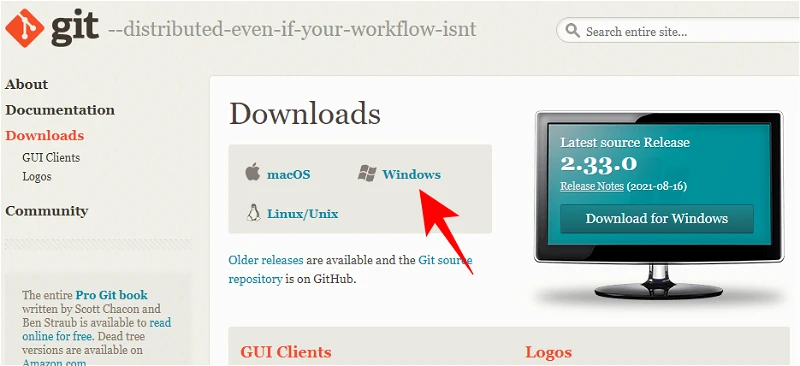

######  La pagina iniziale del sito <a href="https://git-scm.com/" target="_blank">Git-scm</a>. Clicca su Windows come vedi nella schermata.
<br>
<br>


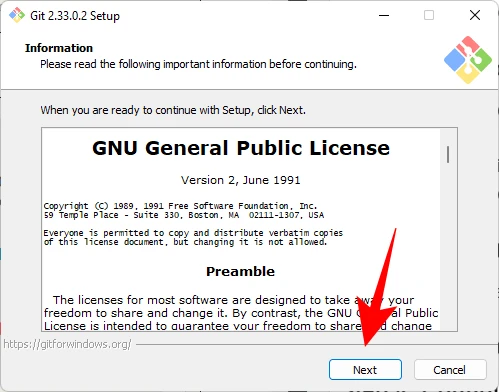

######  La pagina della licenza open source di GIT. Clicca su Next.
<br>
<br>

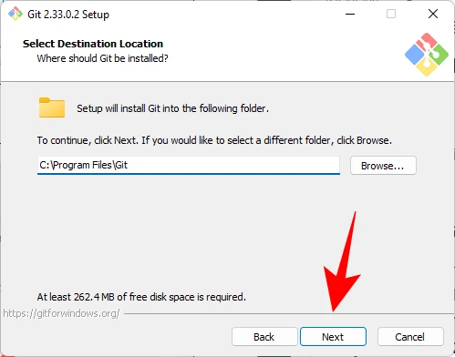

######  La scelta della directory destinazione: basta lasciare quella di default. Clicca su Next.
<br>
<br>

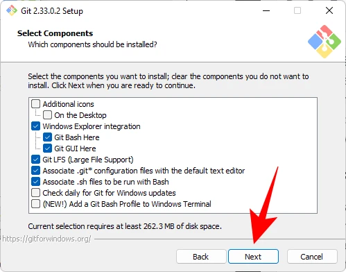

######  In questa schermata puoi selezionare i componenti da installare. A meno che non sia necessario modificare qualcosa in modo specifico, consigliamo di mantenere le opzioni impostate su default. Clicca su Next.
<br>
<br>

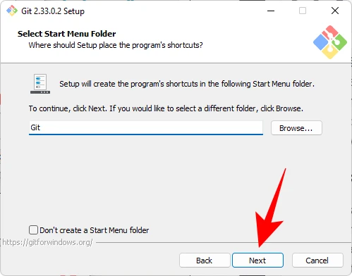

######  Le opzioni del menu per GIT, fai semplicemente clic su Next.
<br>
<br>

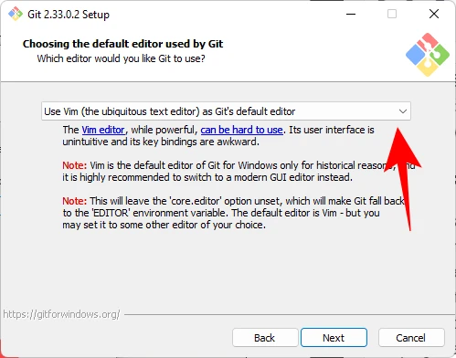

###### La scelta dell'editor di default. Clicca su Next.
<br>
<br>

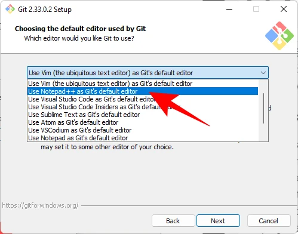

###### Scegli Visual Studio Code o altrimenti un editor più minimalista come "Notepad". Clicca su Next.

> **Notepad++ è un editor di testo avanzato** e open source per il sistema operativo Windows. È progettato per essere una miglioria del blocco note predefinito di Windows, offrendo una vasta gamma di funzionalità per gli sviluppatori e gli utenti che lavorano con file di testo, codice sorgente e markup.

<br>

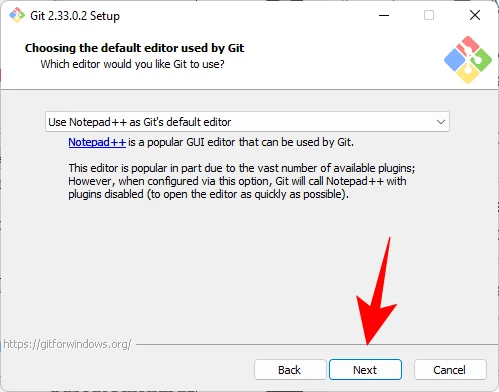

###### La conferma di Notepad++ come editor di default di GIT. Clicca su Next.
<br>
<br>

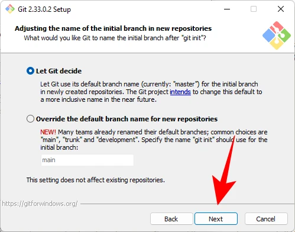

###### In questa schermata puoi scegliere il nome del "branch" iniziale nei nuovi repository GIT: il nome predefinito è 'master' e ti consiglio di lasciare questo valore. Clicca su Next.

> **Il branch iniziale di un repository GIT** è il punto di partenza da cui si sviluppano altri branch. Solitamente, quando viene creato un nuovo repository GIT, viene creato automaticamente un branch di default, che solitamente è chiamato "master" o "main" (a seconda delle convenzioni del progetto o della piattaforma di hosting).

<br>

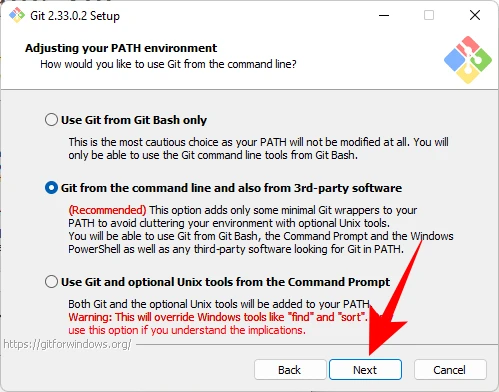

###### In questa schermata viene chiesto se aggiungere l'ambiente PATH per GIT quando si eseguono comandi da applicazioni della riga di comando (come CMD e PowerShell). <br>Clicca su Next.
<br>
<br>

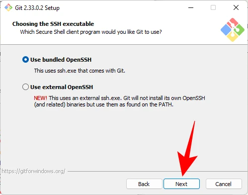

###### Scegli il programma client Secure Shell da utilizzare per GIT. Poiché il programma di installazione viene fornito in bundle con OpenSSH, non sono necessarie modifiche. <br>Clicca su Next.

> **OpenSSH** è un'implementazione open source del protocollo SSH (Secure Shell), che fornisce un ambiente di comunicazione sicuro e crittografato tra due dispositivi su una rete non sicura. SSH è ampiamente utilizzato per connettersi in modo sicuro a server remoti per scopi di gestione remota, trasferimento di file e tunneling di connessioni

<br>

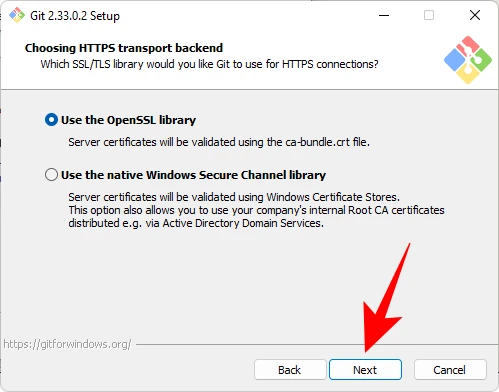

###### Quando si scelgono i certificati del server, ti consiglio di usare la libreria OpenSSL predefinita. Clicca su Next.
<br>
<br>

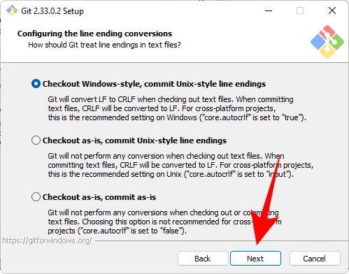

###### La scelta tra il caratteri di fine linea tipo UNIX (LF) o Windows (CRLF): lascia le impostazione di default. Clicca su Next.

>**In Windows, il termine "CRFL" si riferisce** alla sequenza di caratteri di controllo utilizzata per indicare una nuova riga in un file di testo. Questa sequenza è composta dai caratteri Carriage Return (CR) e Line Feed (LF), rappresentati rispettivamente dai byte 13 e 10 in formato ASCII.

<br>
<br>

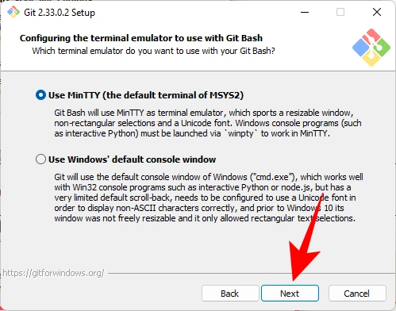

###### Scegli il tuo emulatore di terminale. Ancora una volta, ti consigliamo di attaccare con il MinTTY predefinito. Clicca su Next.

> **Mintty è un emulatore di terminale** open-source per sistemi operativi Windows, noto per essere il terminale predefinito di Cygwin. Cygwin è un ambiente di runtime che consente di eseguire applicazioni Unix-like sui sistemi Windows.

Mintty fornisce un'interfaccia a riga di comando per interagire con il sistema operativo Windows utilizzando un ambiente molto simile a quello di Unix.

<br>

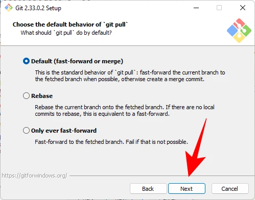

###### Usa il comportamento predefinito del comando "git pull". Clicca su Next.

>**Il comando "git pull** è utilizzato in GIT per recuperare le modifiche da un repository remoto e unirle con il ramo attuale del repository locale. In sostanza, "git pull" combina due operazioni: "git fetch", che scarica i commit dal repository remoto nel repository locale senza applicare alcuna modifica, e "git merge", che unisce i commit scaricati nel ramo attuale.

<br>

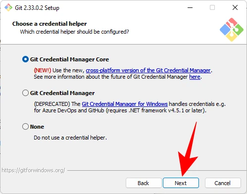

###### Devi scegliere un "helper di credenziali" che ti aiuterà a ottenere e salvare le credenziali.<br> Il core di GIT Credential Manager (selezione predefinita) è il più stabile del lotto.

> Il "GIT Credential Manager" è uno strumento utilizzato con GIT per la gestione delle credenziali di autenticazione. Questo strumento viene utilizzato principalmente su piattaforme Windows per semplificare il processo di autenticazione quando si lavora con repository GIT remoti.

<div class="alert alert-doks d-flexflex-shrink-1" role="alert">🔑
<strong>Il GIT Credential Manager </strong> memorizza le credenziali di autenticazione in modo sicuro, evitando agli utenti di inserire manualmente le loro credenziali. Risulta comodissimo per interagire con un repository, come durante l'esecuzione di "git push" o "git pull".</div>

<br>
<br>


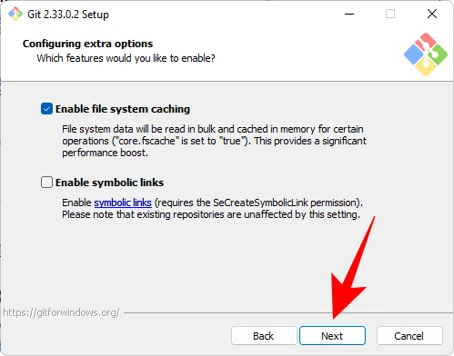

###### Resta poco altro da configurare: la prima opzione (selezionata per default) è quella di “Abilitare la memorizzazione nella cache del file system”. E' utile lasciarla attivata perchè migliora le prestazioni del sistema. Clicca su Next.

L'altra opzione riguarda i "symlink" ed è quella di "Abilitare i collegamenti simbolici" che sono simili alle scorciatoie da riga di comando. Selezionala **soltanto** se sai di cosa stiamo parlando, ma ti consiglio di lasciarla inattiva.

> Il supporto per symlink può variare tra i sistemi operativi e può comportare alcuni **comportamenti imprevisti**, specialmente quando si sposta il repository GIT tra sistemi operativi che gestiscono symlink in modi diversi (ad esempio, tra sistemi Windows e sistemi Unix-like come Linux o macOS).

<br>
<br>

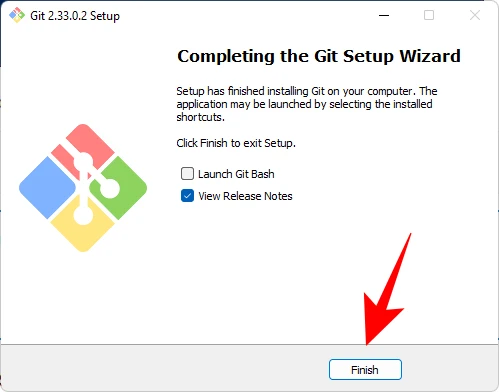

###### Adesso la installazione è terminata e puoi cliccare su "Finish"

<br>
<br>


Terminata la installazione, apri il Prompt dei comandi di Windows o PowerShell ed esegui:

```bash
GIT --version
```

Questo dovrebbe mostrare la versione di GIT appena installata sul tuo sistema.

Una volta installato GIT su Windows o Linux, puoi iniziare a utilizzarlo eseguendo comandi come "git clone", "git init", etc.


## Perchè usare GITHUB.COM


Github.com è un colossale sito gestito dalla Microsoft che ospita migliaia di progetti open source relativi ad IoT, Arduino ed ESP32. Lo trovi cliccando su questo <a href="https://github.com/search?q=ESP32&type=repositories&s=stars&o=desc" target="_blank">link</a>.

Puoi facilmente trovare questi progetti utilizzando la funzione di ricerca di github. Ecco alcuni suggerimenti su come trovare progetti open source relativi a queste tecnologie su github:

Utilizza la barra di ricerca di <a href="https://github.com/search?q=ESP32&type=repositories&s=stars&o=desc" target="_blank">github.com</a> e inserisci parole chiave come "IoT", "Arduino", "ESP32" per trovare progetti correlati.
Filtra i risultati per "Repositories" per visualizzare solo i progetti ospitati su github.
Esplora i repository risultanti per trovare progetti che soddisfino le tue esigenze specifiche.

<div class="alert alert-doks d-flexflex-shrink-1" role="alert">🔑
<strong>Su github ci sono moltissimi elenchi </strong> curati dalla comunità che raggruppano i migliori progetti open source per la robotica e l'IoT. Puoi esaminare queste raccolte per clonare *legalmente i loro programmi, chiedere supporto, leggere i "Wiki" e le "FAQ" di ogni singolo progetto.</div>

<br>
Ricorda che la comunità open source è dinamica e in continua evoluzione, quindi il numero di progetti disponibili su github può variare nel tempo.


### Come usare github.com

Per utilizzare GIT con github, è necessario:

- Creare un account github: Vai su github e crea un account se non ne hai già uno.

- Creare un repository: Dopo aver effettuato l'accesso a github, puoi creare un nuovo repository facendo clic sul pulsante "New" nella tua dashboard.

- Clonare il repository: Utilizza il comando GIT clone nel tuo terminale per clonare il repository github sul tuo computer locale. Ad esempio:

```bash
GIT clone https://github.com/username/repository.GIT
```

Aggiungere file e apportare modifiche: Aggiungi i tuoi file al repository clonato sul tuo computer locale e apporta le modifiche desiderate.

Commit e push delle modifiche: Utilizza i comandi GIT add, GIT commit e GIT push per inviare le tue modifiche al repository remoto su github. Ad esempio:

```bash

GIT add .

GIT commit -m "Descrizione delle modifiche"

GIT push origin nome-del-branch

```

> Pull delle modifiche: Se altri collaboratori hanno apportato modifiche al repository remoto su github, puoi utilizzare il comando GIT pull per aggiornare il tuo repository locale con le modifiche più recenti.

Questi sono solo alcuni passaggi di base per utilizzare GIT con github. Ci sono molte altre funzionalità e concetti avanzati da esplorare mentre diventi più esperto nell'utilizzo di queste tecnologie.

<br>
<br>
<p style="font-size: 0.80em;">Robotdazero.it -  post - R.147.0.4.1</p>