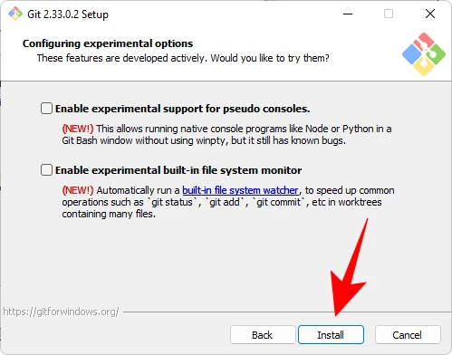

<!--

-->

<hr>
<br>

##  Perchè installare GIT

È importante installare Git per molti motivi:

1. Controllo delle versioni: Git è un sistema di controllo delle versioni distribuito che consente di tenere traccia delle modifiche apportate ai file nel tempo. Questo è utile per gestire progetti software, documentazione, file di configurazione e altro ancora.

2. Collaborazione: Git facilita la collaborazione su progetti condivisi. Piattaforme di hosting come GitHub consentono a più persone di lavorare su un progetto contemporaneamente, tenendo traccia delle modifiche apportate da ciascun collaboratore e consentendo un facile coordinamento e fusione delle modifiche.

3. Backup e ripristino: Utilizzando Git e piattaforme di hosting come GitHub, è possibile creare backup dei tuoi progetti e ripristinare versioni precedenti se necessario. Questo fornisce una forma di sicurezza per i tuoi dati.

4. Tracciabilità delle modifiche: Git tiene traccia delle modifiche apportate ai file nel tempo, consentendo di esaminare la storia delle modifiche, confrontare versioni diverse e identificare quando e da chi sono state apportate modifiche specifiche.

Flusso di lavoro ramificato: Git supporta flussi di lavoro ramificati, consentendo di lavorare su nuove funzionalità o correzioni di bug in branch separati senza influenzare il ramo principale del progetto fino a quando non sei pronto per integrare le modifiche.


## Come installare GIT

Ecco come installare Git su Linux passo dopo passo:

### Su Linux:
Apri il terminale: Puoi aprire il terminale utilizzando il menu delle applicazioni o usando la combinazione di tasti Ctrl + Alt + T.

Aggiorna i pacchetti: Assicurati di avere l'elenco dei pacchetti aggiornato eseguendo il comando:

```bash
sudo apt update
```

Installa Git: Puoi installare Git utilizzando il gestore dei pacchetti della tua distribuzione Linux. Per Ubuntu e derivate, esegui:

```bash
sudo apt install git
```

Verifica l'installazione: Dopo l'installazione, verifica che Git sia correttamente installato eseguendo:

```bash
git --version
```

Questo dovrebbe mostrare la versione di Git installata sul tuo sistema.

### Su Windows 10/11:
Scarica l'installer: Vai al sito ufficiale di Git all'indirizzo https://git-scm.com/ e scarica l'installer per Windows.

Esegui l'installer: Dopo aver scaricato l'installer, fai doppio clic su di esso per avviare il processo di installazione.

Configura l'installazione: Durante l'installazione, segui le istruzioni visualizzate sull'installer. Di solito puoi lasciare le opzioni predefinite a meno che tu non abbia esigenze particolari.

Completa l'installazione: Dopo aver configurato le opzioni desiderate, completa il processo di installazione. Lascia selezionata l'opzione per aggiungere Git al PATH di Windows durante l'installazione.

### La guida visiva alla installazione:


######  La pagina iniziale di git-scm.com. Clicca su Next.
<br>
<br>


######  La pagina della licenza open source di GIT. Clicca su Next.
<br>
<br>


######  La scelta della directory destinazione: basta lasciare quella di default. Clicca su Next.
<br>
<br>


######  In questa schermata puoi selezionare i componenti da installare. A meno che non sia necessario modificare qualcosa in modo specifico, consigliamo di mantenere le opzioni impostate su default. Clicca su Next.
<br>
<br>


######  Le opzioni del menu per GIT, fai semplicemente clic su Next.
<br>
<br>


###### La scelta dell'editor di default. Clicca su Next.
<br>
<br>


###### Scegli Visual Studio Code o altrimenti un editor più minimalista come "Notepad". Clicca su Next.
<br>
<br>


###### La conferma di Notepad++ come editor di default di GIT. Clicca su Next.
<br>
<br>


###### In questa schermata puoi scegliere il nome del "branch" iniziale nei nuovi repository GIT: il nome predefinito è 'master' e ti consiglio di lasciare questo valore. Clicca su Next.
<br>
<br>


###### In questa schermata viene chiesto se aggiungere l'ambiente PATH per Git quando si eseguono comandi da applicazioni della riga di comando (come CMD e PowerShell). Clicca su Next.
<br>
<br>


###### Scegli il programma client Secure Shell da utilizzare per Git. Poiché il programma di installazione viene fornito in bundle con OpenSSH, non sono necessarie modifiche qui (a meno che non si desideri utilizzare un OpenSSH esterno). Clicca su Next.
<br>
<br>


###### Quando si scelgono i certificati del server, ti consiglio di usare la libreria OpenSSL predefinita. Clicca su Next.
<br>
<br>


###### La scelta tra il caratteri di fine linea tipo UNIX (LF) o Windows (CRLF): lascia le impostazione di default. Clicca su Next.

>In Windows, il termine "CRFL" si riferisce alla sequenza di caratteri di controllo utilizzata per indicare una nuova riga in un file di testo. Questa sequenza è composta dai caratteri Carriage Return (CR) e Line Feed (LF), rappresentati rispettivamente dai byte 13 e 10 in formato ASCII.

<br>
<br>


###### scegli il tuo emulatore di terminale. Ancora una volta, ti consigliamo di attaccare con il MinTTY predefinito.
<br>
<br>





Verifica l'installazione: Dopo l'installazione, apri il Prompt dei comandi di Windows o PowerShell e esegui:

```bash
git --version
```

Questo dovrebbe mostrare la versione di Git appena installata sul tuo sistema.

Una volta installato Git su entrambe le piattaforme, puoi iniziare a utilizzarlo eseguendo comandi come git clone, git init, 


## Perchè usare GITHUB.COM


Ci sono migliaia di progetti open source relativi all'IoT, ad Arduino e all'ESP32 su <a href="https://github.com/search?q=ESP32&type=repositories&s=stars&o=desc" target="_blank">Github.com</a>.

Puoi facilmente trovare questi progetti utilizzando la funzione di ricerca di GitHub. Ecco alcuni suggerimenti su come trovare progetti open source relativi a queste tecnologie su GitHub:

Utilizza la barra di ricerca di <a href="https://github.com/search?q=ESP32&type=repositories&s=stars&o=desc" target="_blank">Github.com</a> e inserisci parole chiave come "IoT", "Arduino", "ESP32" per trovare progetti correlati.
Filtra i risultati per "Repositories" per visualizzare solo i progetti ospitati su GitHub.
Esplora i repository risultanti per trovare progetti che soddisfino le tue esigenze specifiche.
Inoltre, ci sono molti elenchi e raccolte curate da comunità o utenti che raccolgono progetti open source relativi a queste tecnologie su GitHub. Puoi esaminare queste raccolte per scoprire una vasta gamma di progetti.

Ricorda che la comunità open source è dinamica e in continua evoluzione, quindi il numero di progetti disponibili su GitHub può variare nel tempo.


### Come usare github.com

Per utilizzare Git con GitHub, è necessario:

- Creare un account GitHub: Vai su GitHub e crea un account se non ne hai già uno.

- Creare un repository: Dopo aver effettuato l'accesso a GitHub, puoi creare un nuovo repository facendo clic sul pulsante "New" nella tua dashboard.

- Clonare il repository: Utilizza il comando git clone nel tuo terminale per clonare il repository GitHub sul tuo computer locale. Ad esempio:

```bash
git clone https://github.com/username/repository.git
```

Aggiungere file e apportare modifiche: Aggiungi i tuoi file al repository clonato sul tuo computer locale e apporta le modifiche desiderate.

Commit e push delle modifiche: Utilizza i comandi git add, git commit e git push per inviare le tue modifiche al repository remoto su GitHub. Ad esempio:

```bash

git add .

git commit -m "Descrizione delle modifiche"

git push origin nome-del-branch

```

> Pull delle modifiche: Se altri collaboratori hanno apportato modifiche al repository remoto su GitHub, puoi utilizzare il comando git pull per aggiornare il tuo repository locale con le modifiche più recenti.

Questi sono solo alcuni passaggi di base per utilizzare Git con GitHub. Ci sono molte altre funzionalità e concetti avanzati da esplorare mentre diventi più esperto nell'utilizzo di queste tecnologie.


<br>
<br>
<p style="font-size: 0.80em;">Robotdazero.it -  post - R.147.0.4.0</p>