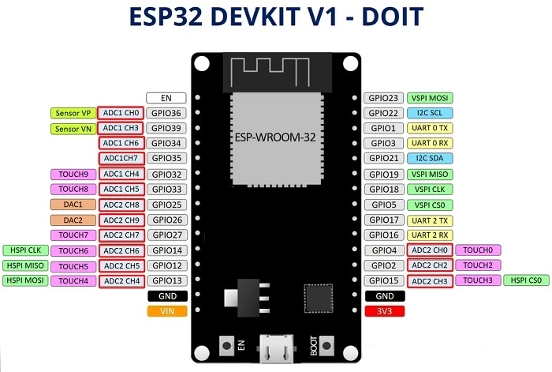
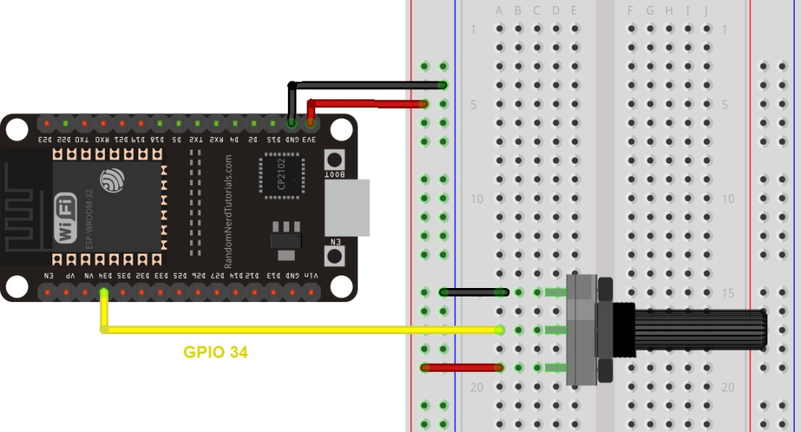
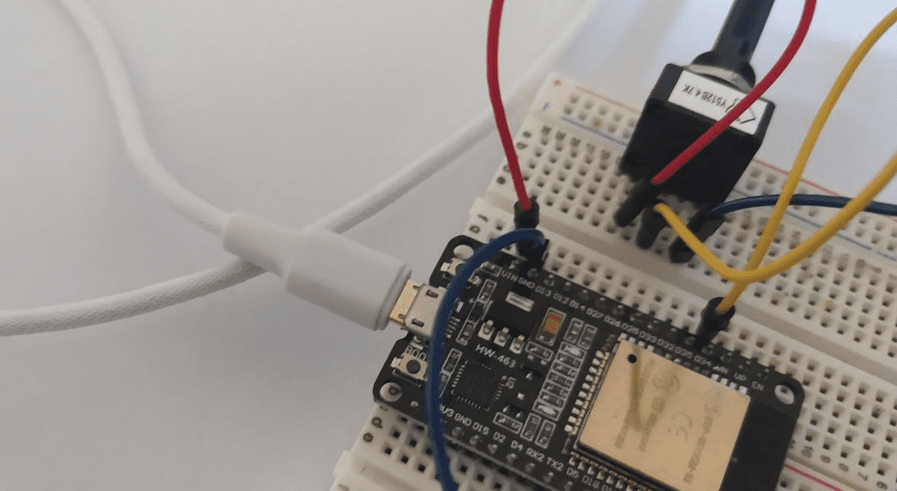

<!--
https://randomnerdtutorials.com/esp32-adc-analog-read-arduino-ide/
-->
<hr>
<br>


## Introduzione:

L'ESP32 è un microcontroller che supporta la lettura di segnali analogici attraverso i suoi pin ADC (Analog to Digital Converter). Per leggere i canali analogici, useremo il linguaggio di programmazione C++ insieme alla libreria Arduino per ESP32.

## I pin analogici dell'ESP32

La scheda ESP32 riesce a leggere valori digitali e analogici dai suoi pin di ingresso: la operazione di lettura non presenta particolari difficoltà ma talvolta può essere noioso trovare i piedini liberi o adatti per l'uso. Nella immagine sotto vedi la piedinatura completa della ESP32 DEVKIT-V1 a 30 pin. 

#### I piedini disponibili per l'ingresso analogico sono evidenzati in rosso.



### Gli ingressi analogici ADC

> <strong>ADC</strong> è l'acronimo di "Analog-to-Digital Converter", che in italiano significa "Convertitore Analogico-Digitale". 

Si tratta di un componente elettronico utilizzato per convertire segnali come tensioni o correnti, in valori digitali che possono essere elaborati da un microcontroller o da un computer. Gli ADC sono comunemente utilizzati in dispositivi elettronici per misurare e monitorare i segnali dei sensori o da altre sorgenti analogiche.

La lettura di un valore analogico con l'ESP32 significa semplicemente misurare i livelli di tensione tra 0V e 3.3V. Ci aspetteremo che i dispositivi ADC abbiano sempre un comportamento neutro e accurato, ma non è sempre così. Leggi la sezione sotto per saperne di più.

<div class="alert alert-doks d-flexflex-shrink-1" role="alert">🔑
<strong>Il comportamento dei circuiti ADC non è sempre lineare.</strong> In linea di massima l'ESP32 non riesce a distinguere la differenza tra 3,3V e 3,2V: otterremo sempre lo stesso valore numerico e cioè 4095. Lo stesso problema si presenta per valori di tensione molto bassi: Per 0V e 0.1V otteniamo lo stesso valore e cioè 0! 
<br>È necessario tenerlo bene a mente quando si utilizzano i pin ADC dell'ESP32.
</div>


## I componenti necessari

Per questo progetto, sono necessarie le seguenti 4 parti:

- <strong>1</strong>. ESP32 DOIT DEVKIT V1 (30 pin)
- <strong>2</strong>. Potenziometro
- <strong>3</strong>. Breadboard
- <strong>4</strong>. Ponticelli


## Lo schema elettrico

Collega un potenziometro all'ESP32, fai attenzione a collegare il perno centrale del potenziometro al pin GPIO 34. Puoi usare lo schema in basso come riferimento.



<br>
<br>
Puoi vedere nella immagine sotto come abbiamo collegato i jumper (ponticelli) rosso e nero ai pin esterni del potenziometro, mentre il jumper giallo serve a collegare il pin centrale del potenziometro con il pin 34 dell'ESP32. <br>Il jumper nero è collegato al negativo della breadboard e quindi al pin "GND" dell'ESP32.<br>Il jumper rosso è collegato al positivo della breadboard e quindi al pin "VIN" dell'ESP32.

<br>
<br>




## Come eseguire il programma

Programmeremo l'ESP32 usando il compilatore PlatformIO e quindi assicurati di avere installato il programma secondo le instruzioni di questo <a href="https://www.robotdazero.it/blog/come-installare-platformio/">post</a> prima di procedere.
Per compilare e testare il programma basta fare copia e incolla delle tre righe che vedi nello specchietto in basso:<br> 
- la prima riga "clona" sul tuo PC il codice originale dal nostro account Github, 
- la seconda lo compila,
- la terza lancia il monitor seriale.

```bash
git clone git@github.com:sebadima/analog_read.git
make upload
platformio device monitor --baud 115200  --rts 0 --dtr 0
```

Come vedi si tratta di una operazione velocissima, molto più veloce di Arduino IDE, al solo *costo* di <a href="https://www.robotdazero.it/blog/come-installare-platformio/">installare</a> PlatformIO sul tuo PC. Spesso si ha la sensazione erronea che lavorare in modalità testo sia più lento che usare interfacce grafiche, ma come vedi il lavoro manuale è stato compresso praticamente a zero.

Dopo avere lanciato il monitor seriale di PlatformIO (*la terza riga*) vedrai l'output del programma: prova a ruotare il potenziometro per vedere i valori che cambiano...

```bash
Valore del potenziometro = 0
Valore del potenziometro = 0
Valore del potenziometro = 118
Valore del potenziometro = 450
Valore del potenziometro = 733
Valore del potenziometro = 979
Valore del potenziometro = 1234
Valore del potenziometro = 1484
Valore del potenziometro = 1744
Valore del potenziometro = 1968
Valore del potenziometro = 2192
Valore del potenziometro = 2397
Valore del potenziometro = 2619
Valore del potenziometro = 2838
Valore del potenziometro = 3110
Valore del potenziometro = 3399
Valore del potenziometro = 3810
Valore del potenziometro = 4095
Valore del potenziometro = 4095
```


### Le istruzioni C++ per leggere un pin analogico

La funzione **analogRead(GPIO)** legge un ingresso analogico, dove GPIO indice il piedino che vuoi leggere: nel nostro caso useremo il pin 34. L'ESP32 supporta le misure ADC in 18 pin, ma solo 15 di questi sono disponibili nella scheda *DEVKIT V1 DOIT* (versione con 30 pin) che noi usiamo di preferenza.

Questi pin di ingresso analogici hanno una risoluzione massima di 12 bit. Ciò significa che quando si legge un ingresso analogico, il suo intervallo numerico può variare da 0 a 4095.

> <strong>analogReadResolution(resolution)</strong>. E' una istruzione preliminare ad ogni uso degli ADC. Serve a impostare i bit e la risoluzione del campionamento. Il parametro può essere un valore compreso tra 9 (0 – 511) e 12 bit (0-4095) con un valore predefinito di 12 bit.


#### Altre funzioni utili

Ci sono altre funzioni più avanzate da utilizzare con i pin ADC che possono risultare utili in altri progetti.

- Analsetwidth (width): imposta i bit di esempio e la risoluzione. Può essere un valore compreso tra 9 (0 – 511) e 12 bit (0-4095). Il valore predefinito è la risoluzione a 12 bit.

- analogSetCycles (cicli): imposta il numero di cicli per campionamento. Il valore predefinito è 8. Intervallo: da 1 a 255.

- analogSetSamples (samples): imposta il numero di campionamenti nell'intervallo. Il valore predefinito è 1. Ha l'effetto di aumentare la sensibilità.

- analogSetClockDiv (attenuazione): imposta il divisore per l'orologio ADC. Il valore predefinito è 1, l'intervallo va da 1 a 255.

- analogSetAttenuation (attenuazione): imposta l'attenuazione di ingresso per tutti i pin ADC. Valore predefinito = ADC_11db. 


### Come costruire da zero il programma

Lavorando con PlatformIO puoi semplicemente "clonare" un progetto da Github e poi modificarlo a tuo piacimento. Inoltre puoi usare questo stesso progetto come "template universale" e clonarlo in una directory differente per avere in un attimo un nuovo progetto!<br> Eviterai in questo modo di combattere con librerie, PATH, configurazione della "board", etc. tipici di Arduino IDE. 

> <strong>Se sei agli inizi con ESP32</strong> troverai comunque interessante creare da zero i tuoi files e scoprire così qualche nuovo trucco di PlatformIO. Continua a leggere questa sezione per conoscere i dettagli.

Il programma, come dicevamo prima, legge semplicemente i valori dal potenziometro e li scrive nel monitor seriale: questi sono i 3 punti chiave del programma:

- In <strong>setup</strong>(), il programma inizializza la comunicazione seriale ad una velocità di trasmissione di 115200 baud,
- Nel <strong>loop</strong>(), la funzione analoRead(34) legge l'ingresso analogico dal pin 34,
- Serial.<strong>println</strong>() stampa il valore ottenuto.

#### main.ino

```bash
void setup() {

  // Setta la seriale a 115200 baud
  Serial.begin(115200);
  // Setta la precisione a 12 bits (0-4096)
  // Il valore 4095 corrisponde a 3.3V
  analogReadResolution(12);

}

void loop() {

  // Leggi il valore del potenziometro al pin 34
  int ValoreAnalogico = analogRead(34);
  // Scrivi il valore appena rilevato 
  Serial.printf("Valore del potenziometro = %d\n", ValoreAnalogico);
  delay(100); // Un decimo di secondo tra due letture consecutive

}
```


Carica il codice fornito sopra in un file **main.ino** e inoltre usa il tuo editor preferito per creare un file platformio.ini con il seguente contenuto:

#### platformio.ini
```bash
; PlatformIO Project Configuration File
;
;   Build options: build flags, source filter
;   Upload options: custom upload port, speed and extra flags
;   Library options: dependencies, extra library storages
;   Advanced options: extra scripting
;
; Please visit documentation for the other options and examples
; https://docs.platformio.org/page/projectconf.html

[env:esp32dev]
platform = espressif32
board = esp32dev
framework = arduino
lib_deps = 

```


Segui lo stesso procedimento per creare un file "Makefile" con il seguente contenuto:

#### Makefile
```bash
# Uncomment lines below if you have problems with $PATH
#SHELL := /bin/bash
#PATH := /usr/local/bin:$(PATH)

all:
	pio -f -c vim run

upload:
	pio -f -c vim run --target upload

clean:
	pio -f -c vim run --target clean

program:
	pio -f -c vim run --target program

uploadfs:
	pio -f -c vim run --target uploadfs

update:
	pio -f -c vim update
```


E quindi scrivi le 2 seguenti istruzione nel terminale (fai copia e incolla): 

```bash
make upload
platformio device monitor --baud 115200  --rts 0 --dtr 0
```

Il programma partirà dopo pochi secondi e anche in questo caso puoi vedere il funzionamento del canale ADC 34 ruotando il potenziometro...

<br>
<br>
<p style="font-size: 0.80em;">Robotdazero.it - post - R.148.1.2.0</p>