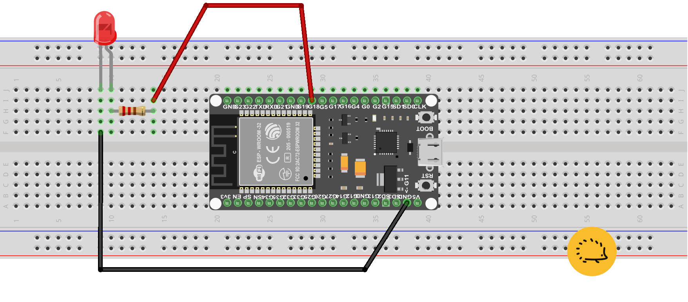

<hr>
<br>

## Il programma "Blink"

Il programma "Blink" per far lampeggiare l'ESP32 è l'equivalente IoT del classico "Hello world" dei linguaggi di programmazione. Poichè la sua compilazione è un passaggio obbligato per ogni "Maker" la tratteremo in modo esteso e vedremo come portarla a termine sia con Arduino Ide che con PlatformIO.


## Lo schema del progetto per collegare un LED esterno ad ESP32

Come vedi dalla foto si tratta di assemblare pochi componenti esterni: nonostante questo non stiamo parlando di un progetto banale. Il calcolo della resistenza non è infatti semplicissimo e lo trovi già svolto nello specchietto in basso. Applicando correttamente la legge di Ohm possiamo ottenere dal LED una luminosità brillante senza bruciarlo in un attimo.

#### Come calcolare la resistenza:

>Dalle specifiche del prodotto sappiamo che il diodo rosso ha una caduta di tensione diretta di <strong>1.7 V</strong> e noi vogliamo far passare una corrente di <strong>20 mA</strong>:<br>
<strong>5 V − 1.7 V</strong> (la caduta di tensione del LED) = <strong>3.3 V</strong>
<br><strong>3.3 V / 20 mA</strong>  scritto in maniera più semplice diventa:
<br><strong>3.3 / 0.02 = 165</strong> Ohm
<br>Per sicurezza useremo una resistenza di <strong>220 Ohm</strong>, il valore di poco superiore disponibile in commercio.

Ricorda che due LED di colore diverso hanno un assorbimento diverso. Comunque con la resistenza adottata puoi usare tutti gli altri LED compreso quello a luce bianca.


### Componenti necessari

- un LED di colore rosso
- una Resistenza da 220 Ohm
- una o due Breadboard 
- 2 Jumper o connettori Dupont


#### Le breadboard per l'ESP32

L'ESP32 non può essere ospitato "comodamente" sulla singola breadboard, anche nel modello più grande: o ne colleghi due affiancate o inserisci il connettore dentro lo "stesso foro" in cui entra il GND dell'ESP32. Puoi però ricorrere ad un facile trucco:  tutte le breadboard "maxi" possono essere incastrate in parallelo a patto di togliere il corridoio centrale (puoi usare un taglierino).

##### Se usi il trucco delle due breadboard affiancate il montaggio dell'ESP32 viene reso molto più semplice

Nello schema in basso per semplificare ti mostriamo il montaggio "classico". Il pin GND (cioè la massa) della scheda ESP32 viene collegato al Catodo del LED (il polo negativo). Il <strong>pin 18</strong> dell'ESP32 va a pilotare la resistenza da 220 Ohm che a sua volta viene collegata all'Anodo del LED (il polo positivo con il connettore più lungo).

<div class="alert alert-doks d-flexflex-shrink-1" role="alert">🔑
<strong>Nel contesto dei componenti elettronici</strong>, i termini "anodo" e "catodo" sono comunemente associati ai diodi normali e ad emissione laser (LED). 
<br><strong>Anodo</strong> è il terminale positivo di un diodo, <strong>Catodo</strong> è il terminale negativo.</div>

<br>



<br>
<br>

La resistenza non ha un "verso" particolare mentre l'anodo del LED (quello con il terminale più lungo) deve essere collegato alla resistenza. Non appena avrai completato lo schema elettrico puoi compilare il programma.

## Come compilare il programma "Blink" con Arduino IDE

Apri l'Arduino IDE.

- Vai su File -> Preferenze.
- Nella finestra delle preferenze, aggiungi l'URL seguente nella casella "URL aggiuntivi per il gestore schede":

```bash
https://dl.espressif.com/dl/package_esp32_index.json
```
- Clicca su "OK" per chiudere la finestra delle preferenze.
- Vai su Strumenti -> Scheda -> Gestore Schede.
- Cerca "esp32" e installa "ESP32 by Espressif Systems".

#### Selezione della scheda ESP32

Dopo aver installato il supporto per ESP32, seleziona la scheda giusta. 

- Vai su Strumenti -> Scheda e seleziona la tua scheda ESP32 dalla lista.

### Il programma "Blink" per ESP32

Ora puoi aprire l'esempio di "Blink" predefinito in Arduino IDE. 
<br>Vai su File > Esempi > ESP32 > Basics > Blink.

Quindi per sicurezza fai copia e e incolla del programma in basso: in questo modo sarai sicuro che venga usato il pin 18 della scheda.

#### da incollare nell'IDE di Arduino

```bash
const int pinLED = 18;

void setup() {
  // Setta il Pin D18 come uscita (OUTPUT)
  pinMode (pinLED, OUTPUT);
}

void loop() {
  digitalWrite (pinLED, HIGH);  // Accendi il LED
  delay(1000);  // Pausa di un secondo
  digitalWrite (pinLED, LOW); // Spegni il LED
  delay(1000);  // Pausa di un secondo 
}
```


### Compilazione e upload del programma

- Collega il tuo ESP32 al computer tramite un cavo USB.
- Seleziona la porta corretta sotto Strumenti -> Porta.
- Cicca su Sketch -> Verifica/Compila.

Se la compilazione ha successo, puoi caricare il programma sull'ESP32 facendo clic su Sketch -> Carica.

## Come compilare "Blink" usando Github.com

Se non hai ancora installato PlatformIO sul tuo PC puoi leggere questo <a href="https://www.robotdazero.it/blog/come-installare-platformio/">post</a> del nostro blog. Usando questo compilatore, gli strumenti a linea di comando e i files presi da Github.com puoi migliorare la tua produttività in modo importante. <br>Infatti quando svilupperai i tuoi progetti sarai "sempre" alle prese con complessi comandi "<a href="/blog/come-installare-il-programma-git/">GIT</a>" sulla linea di comando. E commutare su Arduino Ide o Visual Studio ti costa molto più tempo che scrivere "make" sulla tastiera! 

Per compilare e testare il programma fai copia e incolla del testo sottostante e incollalo nel terminale di Linux o nel CMD di Windows:<br> 
- la prima riga copia sul tuo PC il codice dal nostro account Github, 
- la seconda lo compila usando le istruzioni contenute nel "Makefile" e in "platformio.ini".

```bash
git clone git@github.com:sebadima/blinkESP32.git
make upload
```

Dopo la fine della compilazione il LED dovrebbe iniziare a lampeggiare, in caso contrario vai alla fine del post e leggi la sezione sul Test del programma.


## Come scrivere da zero il programma per collegare un LED esterno ad ESP32

Con PlatformIO puoi "clonare" il programma da Github: come hai notato non serve scaricare il file (https://dl.espressif.com/dl/package_esp32_index.json) e non devi settare la "board" come sei costretto a fare con Arduino IDE. 

> <strong>Se sei agli inizi con ESP32</strong> troverai interessante creare da zero i tuoi files e scoprire così qualche nuovo trucco di PlatformIO. Continua a leggere questa sezione per conoscere i dettagli.

Il codice è davvero breve e qui lo spieghiamo in dettaglio:

- In <strong>setup</strong>(), il programma setta il pin 18 in modalità OUTPUT
- Nel <strong>loop</strong>(), la funzione digitalWrite() commuta continuamente lo stato del LED da HIGH a LOW.


#### main.ino

```bash
const int pinLED = 18;

void setup() {
  // Setta il Pin D18 come uscita (OUTPUT)
  pinMode (pinLED, OUTPUT);
}

void loop() {
  digitalWrite (pinLED, HIGH);  // Accendi il LED
  delay(1000);  // Pausa di un secondo
  digitalWrite (pinLED, LOW); // Spegni il LED
  delay(1000);  // Pausa di un secondo 
}
```

Crea una directory "src" e carica il codice sopra in un file **src/main.ino**. Usa il tuo editor preferito per creare un **file platformio.ini** con il seguente contenuto:

#### platformio.ini
```bash
; PlatformIO Project Configuration File
;
;   Build options: build flags, source filter
;   Upload options: custom upload port, speed and extra flags
;   Library options: dependencies, extra library storages
;   Advanced options: extra scripting
;
; Please visit documentation for the other options and examples
; https://docs.platformio.org/page/projectconf.html

[env:esp32dev]
platform = espressif32
board = esp32dev
framework = arduino
lib_deps = 
```

Per creare il Makefile puoi leggere questo <a href="/blog/come-funziona-il-makefile-di-platformio/">post</a> oppure fare copia e incolla del codice in basso in un file con lo stesso nome:

#### Makefile
```bash
# Uncomment lines below if you have problems with $PATH
#SHELL := /bin/bash
#PATH := /usr/local/bin:$(PATH)

all:
  pio -f -c vim run

upload:
  pio -f -c vim run --target upload

clean:
  pio -f -c vim run --target clean

program:
  pio -f -c vim run --target program

uploadfs:
  pio -f -c vim run --target uploadfs

update:
  pio -f -c vim update
```

Dopo avere creato il file, lancia la compilazione con "make" oppure carica il programma sulla scheda scrivendo "make upload".

#### Il test del programma

Sia che tu abbia usato Arduino IDE o PlatformIO dovresti avere lo stesso risultato finale, con il LED esterno che viene attivato per un secondo ed effettua una pausa di un secondo. In caso di malfunzionamento ti consiglio di controllare il verso del diodo LED, la connessione tra il filo rosso e il pin 18 dell'ESP32 e la connessione tra il filo nero e la massa dell'ESP32. Se neppure in questo caso riesci a far funzionare il programma prova a cambiare il cavetto USB.

<br>
<br>
<p style="font-size: 0.80em;">Robotdazero.it - post - R.151.0.1.0</p>