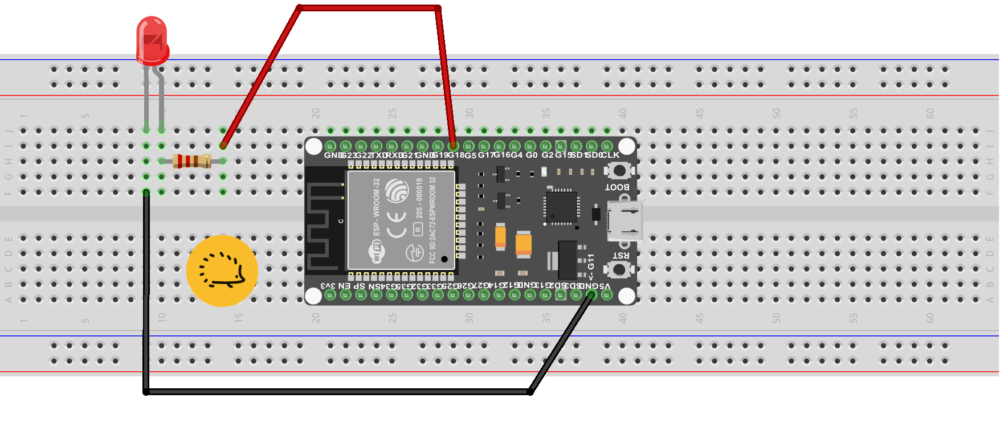

<hr>
<br>

## Il programma "Blink"

Il programma "Blink" per far lampeggiare l'ESP32 (o Arduino) è l'equivalente IoT del classico "Hello world" dei linguaggi di programmazione. Poichè la sua compilazione è un passaggio obbligato per ogni "Maker" lo vogliamo trattare in modo esteso prevedendo la compilazione sia con Arduino Ide che con PlatformIO.


## Lo schema del progetto

Come si tratta di pochi componenti esterne, ma fai attenzione che la presenza del resistore è necessaria non opzionale. In caso contratio la corrente assorbita del LED lo farebbe "bruciare" in meno di un secondo.

### Componenti necessari

- LED di colore rosso
- Resistenza da 220 Ohm
- Breadboard 
- 2 Jumper o connettori Dupont

> **L'ESP32 non può essere ospitato "comodamente" sulla singola breadboard**, anche nel modello più grande: o ne colleghi due affiancate o inserisci il connettore dentro lo "stesso foro" in cui entra il GND dell'ESP32 oppure ricorri ad un facile trucco. Tutte le breadbord possono essere incastrate in parallelo a patto di togliere il corridoio centrale. 


##### In questo modo potresti avere una Maxi breadboard ideale per l'ESP32. 


Nello schema in basso ti mostriamo il montaggio "classico" visto che stiamo usando appena due componenti e riuscirai a montarli in ogni caso. Il pin GND (cioè la massa) della scheda viende collegata al Catodo del LED. Il pin 18 dell'ESP va a pilotare la resistenza da 220 Ohm che a sua volta viene collegata all'Anodo del LED.


<div class="alert alert-doks d-flexflex-shrink-1" role="alert">🔑
Nel contesto dei componenti elettronici, i termini "anodo" e "catodo" sono comunemente associati ai diodi e ai componenti a semiconduttore come i LED e i diodi laser. Questi termini si riferiscono alle due estremità di un diodo, che è un dispositivo a due terminali.
<br><br><strong>Anodo</strong>: È il terminale positivo di un diodo o di un altro dispositivo a semiconduttore. In un diodo a giunzione p-n, l'anodo è la parte del diodo in cui la corrente entra quando il diodo è polarizzato in avanti (cioè quando la tensione applicata è positiva rispetto all'anodo). L'anodo è solitamente indicato con un simbolo o una marcatura sul corpo del componente.
<br><br><strong>Catodo</strong>: È il terminale negativo di un diodo o di un altro dispositivo a semiconduttore. Nel caso di un diodo a giunzione p-n, il catodo è la parte del diodo in cui la corrente esce quando il diodo è polarizzato in avanti (cioè quando la tensione applicata è negativa rispetto al catodo). Il catodo è generalmente identificato da un simbolo o una marcatura sul corpo del componente, spesso attraverso una striscia o un punto.</div>

<br>



Non appena avrai completato lo schema elettrico potrai provvedere alla compilazione del programma.


## Come compilare il programma "Blink" con Arduino IDE

Apri l'Arduino IDE.

- Vai su File -> Preferenze.
- Nella finestra delle preferenze, aggiungi l'URL seguente nella casella "URL aggiuntivi per il gestore schede":
- Clicca su "OK" per chiudere la finestra delle preferenze.
- Vai su Strumenti -> Scheda -> Gestore Schede.
- Cerca "esp32" e installa "ESP32 by Espressif Systems".

#### Selezione della scheda ESP32

Dopo aver installato il supporto per ESP32, seleziona la scheda giusta. 

- Vai su Strumenti -> Scheda e seleziona la tua scheda ESP32 dalla lista.

### Il programma "Blink" per ESP32

Ora puoi aprire l'esempio di "Blink" predefinito in Arduino IDE. 
<br>Vai su File > Esempi > ESP32 > Basics > Blink.

Quindi per sicurezza fai copie e incolla del programa in basso:

#### da incollare nell'IDE di Arduino

```bash
#define LED 18

void setup() {
  // Setta il baud rate della seriale a 115200
  Serial.begin(115200);
  // Setta il pin 2 in modalità OUTPUT
  pinMode(LED,OUTPUT);
}

void loop() {
  delay(50);
  digitalWrite(LED,HIGH);
  Serial.println("Led è HIGH");
  delay(50);
  digitalWrite(LED,LOW);
  Serial.println("Led è LOW");
}

```


### Compilazione e upload del programma

- Collega il tuo ESP32 al computer tramite un cavo USB.
- Seleziona la porta corretta sotto Strumenti -> Porta.
- Cicca su Sketch -> Verifica/Compila.

Se la compilazione ha successo, puoi caricare il programma sull'ESP32 facendo clic su Sketch -> Carica.

## Come compilare "Blink" usando Github.com

Se non hai ancora installato PlatformIO sul tuo PC puoi leggere questo <a href="https://www.robotdazero.it/blog/come-installare-platformio/">post</a> del nostro blog. Usando questo compilatore, gli strumenti a linea di comando e i files presi da Github.com puoi migliorare la tua produttività in modo importante. <br>Infatti quando svilupperai i tuoi progetti sarai "sempre" alle prese con complessi comandi "<a href="/blog/come-installare-il-programma-git/">GIT</a>" sulla linea di comando. E commutare su Arduino Ide o Visual Studio ti costa molto più tempo che scrivere "make" sulla tastiera! 

Per compilare e testare il programma fai copia e incolla del testo sottostante e incollalo nel terminale di Linux o nel CMD di Windows:<br> 
- la prima riga copia sul tuo PC il codice dal nostro account Github, 
- la seconda lo compila usando le istruzioni contenute nel Makefile e in platformio.ini,
- la terza lancia il monitor sulla seriale.

```bash
git clone git@github.com:sebadima/blinkESP32.git
make upload
platformio device monitor --baud 115200  --rts 0 --dtr 0
```

### Come costruire da zero il programma

Con PlatformIO puoi "clonare" il programma da Github: come hai notato non serve scaricare il file (https://dl.espressif.com/dl/package_esp32_index.json) e non devi settare la "board" come sei costretto a fare con Arduino IDE. 

> <strong>Se sei agli inizi con ESP32</strong> troverai interessante creare da zero i tuoi files e scoprire così qualche nuovo trucco di PlatformIO. Continua a leggere questa sezione per conoscere i dettagli.

Il codice è davvero breve e qui lo spieghiamo in dettaglio:

- In <strong>setup</strong>(), il programma inizializza la comunicazione seriale ad una velocità di trasmissione di 115200 baud e inoltra setta il pin 2 in modalità OUTPUT
- Nel <strong>loop</strong>(), la funzione digitalWrite() commuta continuamente lo stato del LED da HIGH a LOW.


#### main.ino

```bash
#define LED 18

void setup() {
  // Setta il baud rate della seriale a 115200
  Serial.begin(115200);
  // Setta il pin 2 in modalità OUTPUT
  pinMode(LED,OUTPUT);
}

void loop() {
  delay(50);
  digitalWrite(LED,HIGH);
  Serial.println("Led è HIGH");
  delay(50);
  digitalWrite(LED,LOW);
  Serial.println("Led è LOW");
}

```


Carica il codice sopra in un file **main.ino** e inoltre usa il tuo editor preferito per creare un **file platformio.ini** con il seguente contenuto:

#### platformio.ini
```bash
; PlatformIO Project Configuration File
;
;   Build options: build flags, source filter
;   Upload options: custom upload port, speed and extra flags
;   Library options: dependencies, extra library storages
;   Advanced options: extra scripting
;
; Please visit documentation for the other options and examples
; https://docs.platformio.org/page/projectconf.html

[env:esp32dev]
platform = espressif32
board = esp32dev
framework = arduino
lib_deps = 
```


Per creare il Makefile puoi leggere questo <a href="/blog/come-funziona-il-makefile-di-platformio/">post</a> oppure fare copia e incolla del codice in basso in un file con lo stesso nome:

#### Makefile
```bash
# Uncomment lines below if you have problems with $PATH
#SHELL := /bin/bash
#PATH := /usr/local/bin:$(PATH)

all:
  pio -f -c vim run

upload:
  pio -f -c vim run --target upload

clean:
  pio -f -c vim run --target clean

program:
  pio -f -c vim run --target program

uploadfs:
  pio -f -c vim run --target uploadfs

update:
  pio -f -c vim update
```

Dopo avere creato il file, lancia la compilazione con "make" oppure carica il programma sulla scheda scrivendo "make upload".

<br>
<br>
<p style="font-size: 0.80em;">Robotdazero.it - post - R.151.0.1.0</p>