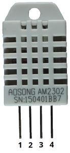

<hr>
<br>

## Il sensore DHT11


Il sensore DHT11 viene usato per misurare la temperatura e l'umidità relativa. Sono dei modelli estremamente popolari in parte per il basso costo in parte per la facilità di collegamento ad ESP32 e Arduino. Sono dei sensori digitali e pertanto non necessitano di conversione del voltaggio in uscita e inoltr non richiedono una resistenza di pull-up/pull-down. Un resisore da 10 KOhm si trova sempre incorporato nella basetta (salvo modelli super economici) e pertanto basta semplicemente collegarlo alla uscita a 5V di ESP32.

Il DHT22

Il DHT11 poddide un quasi gemello, il DHT22 con delle specifiche similari. Il sensore DHT22 ha una risoluzione migliore e un campo di misura di temperatura e umidità più ampio. Tuttavia, è un poco più costoso e puoi effettuare letture solo ad intervalli di 2 secondi. Nel nostro tutorial useremo il DHT11.

### Le specifiche del DHT11

- Intervallo di temperatura da 0 a 50 ºC + / -2 ºC
- Intervallo di umidità da 20 a 90% + / -5% 
- Risoluzione Umidità: 1%
- Temperatura: 1ºC Umidità: 0.1%
- Temperatura: 0.1 ºC
- Tensione di funzionamento 3-5. 5 V 
- Corrente di alimentazione 0.5 – 2.5 mA 
- Periodo di campionamento 1 secondo 


### La piedinatura del DHT11

I sensori DHT hanno quattro pin come mostrato nella figura seguente. Tuttavia, se si ottiene il sensore DHT in una scheda breakout, viene fornito con solo tre pin e con una resistenza di pull-up interna sul pin 2.



La tabella seguente mostra il pinout del DHT11 a 4 pin. Quando il sensore è rivolto verso di te, la numerazione dei pin inizia da 1 da sinistra verso destra.

Pin #1 3.3 V ~ 5.V
Pin #2 Qualsiasi GPIO digitale dell'ESP32 (puoi anche collegare una resistenza di pull-up da 10 k Ohm)
Pin #3 Non collegato
Pin #4 GND


La prossima mostra invece il pinout del DHT11 a 3 pin e quindi con resistenza di pull-up incorporata. 

Pin #1 (GND) 
Pin #2 (DATA) - Qualsiasi GPIO digitale dell'ESP32 
Pin #3 (VCC) - 3.3 V ~ 5.V

Nel progetto pilota useremo la versione a 3 pin.

```bash
git clone git@github.com:sebadima/corso-ESP32-dht11-basic.git
make upload
platformio device monitor --baud 115200  --rts 0 --dtr 0
```
### Il collaudo del programma 

Sia che tu abbia usato Arduino IDE o PlatformIO dovresti avere lo stesso risultato finale, con il LED esterno che viene attivato per un secondo ed effettua una pausa di un secondo. In caso di malfunzionamento ti consiglio di controllare il verso del diodo LED, la connessione tra il filo rosso e il pin 18 dell’ESP32 e la connessione tra il filo nero e la massa dell’ESP32. Se neppure in questo caso riesci a far funzionare il programma prova a cambiare il cavetto USB.

<br>
<br>
<p style="font-size: 0.80em;">Robotdazero.it - post - R.152.1.0.3</p>