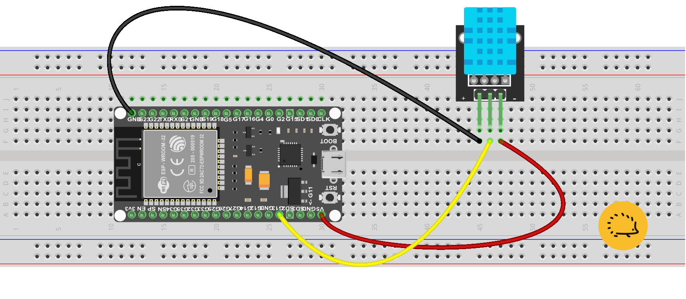

<!-- https://randomnerdtutorials.com/esp32-dht11-dht22-temperature-humidity-sensor-arduino-ide/ -->
<hr>
<br>

## Il sensore DHT11

Il sensore DHT11 viene usato per misurare la temperatura e l'umidità relativa dell'aria. E' probabilmente il sensore digitale più popolare, in parte per il basso costo e in parte per la semplicità di collegamento. Proprio perchè digitale infatti, non necessita di calcoli per la conversione e può inoltre essere adoperato senza componenti aggiuntivi: le versioni più recenti non necessitano neppure di una resistenza di *pull-up*. 

> I progettisti hanno pensato bene di saldare una resistenza di pull-up da **10 KΩ** nella mini basetta del DHT11 e in questo modo sono riusciti a semplificare il lavoro di progettisti e assemblatori. 

Per collegarlo basta perciò fornirgli l'alimentazione e connettere il pin "dati" ad un pin GPIO digitale. Anche l'alimentazione è molto semplice: visto il basso assorbimento lo possiamo collegare senza problemi al **pin 5V** di ESP32.

### Caratteristiche del sensore DHT11


<div class="alert alert-doks d-flexflex-shrink-1" role="alert">🔑
- <strong>Sensore digitale di temperatura e umidità</strong>a funzionamento resistivo per l'umidità, NTC per la temperatura. Calibrazione effettuara in fabbrica, riesce a misurare l'umidità relativa (RH) e la temperatura ambiente.
<br>- Ampia gamma di misurazione della <strong>temperatura</strong>: da 0°C a 50°C
<br>- Gamma di misurazione della <strong>umidità</strong>: da 20% a 80%.
</div>


##### La precisione del sensore:
- Temperatura: ± 0.1°C
- Umidità: ± 5%
- Frequenza di campionamento: 1 Hz (una misurazione al secondo)


##### E la sua connettività:

- Interfaccia digitale a 1 filo (semplice da collegare)
- Basso consumo energetico
- Tensione di funzionamento 3.3V ~ 5V 
- Corrente di alimentazione 0.5 mA ~ 2.5 mA 

##### Il sensore DHT11 è un sensore **NTC**, ma cosa significa esattamente?

> <strong>I sensori NTC</strong>:
o termistori a coefficiente di temperatura negativo, sono componenti elettronici che sfruttano la proprietà di alcuni materiali semiconduttori di variare la propria resistenza in base alla temperatura. In parole povere, più la temperatura aumenta, più la resistenza del sensore diminuisce.
<br><strong>Come funzionano:</strong>:
Il principio di funzionamento si basa sul fatto che all'aumentare della temperatura, il numero di portatori di carica liberi nel materiale semiconduttore aumenta, favorendo il passaggio di corrente. Di conseguenza, la resistenza del sensore diminuisce.

#### Il DHT22

Il DHT11 ha un "quasi gemello", il DHT22 con delle specifiche similari. Il sensore DHT22 ha una risoluzione migliore e un campo di misura di temperatura e umidità più ampio. Tuttavia è più costoso e non può effettuare letture ad intervalli di 1 secondo. Nel nostro tutorial useremo solo il DHT11.


### Il pinout del DHT11

I vecchi sensori DHT11 avevano quattro pin come mostrato nella figura seguente: 


<br>
<br>

Nella tabella in basso puoi vedere il pinout del DHT11 a <strong>4 pin</strong>. 
Quando il sensore è rivolto verso di te, la numerazione dei pin inizia da 1 da sinistra verso destra.

- pin1: Alimentazione da 3.3V fino a 5V
- pin2: Qualsiasi GPIO digitale dell'ESP32 (con una resistenza)
- pin3: Non collegato
- pin4: GND

##### Le versioni più moderne del DHT11

Le versioni recenti del sensore sono fornite con una scheda breakout con solo tre pin e con una resistenza di pull-up collegata elettricamente al pin 2. La puoi vedere facilmente nel cerchietto rosso accanto al pin **VCC**.


<br>

In basso trovi il pinout del DHT11 a <strong>3 pin</strong>. 

- Pin 1 - (GND) - Massa del circuito
- Pin 2 - (DATA) - Uscita dati verso qualsiasi GPIO digitale dell'ESP32 
- Pin 3 - (VCC) - Alimentazione da 3.3V fino a 5V

Nel nostro progetto useremo solo la versione a 3 pin.

> <strong>Le resistenze di pull-up</strong> sono dei componenti utilizzati nei circuiti digitali per garantire che un segnale rimanga a un livello logico alto (1 logico) quando non è altrimenti definito. Questo è particolarmente importante in dispositivi a logica aperta (open-drain o <a href="https://it.wikipedia.org/wiki/Open_collector" target="_blank">open-collector</a>) o quando si lavora con dispositivi a bassa corrente come i MOSFET.


## Lo schema elettrico

Nello schema in basso:

- il filo nero collega il pin <strong>GND</strong> dell'ESP32 al <strong>pin1</strong> del DHT11 (il pin più a sinistra),

- il filo giallo connette il pin <strong>GPIO 13</strong> dell'ESP con il <strong>pin centrale</strong> del DHT11,

- il filo rosso serve a collegare la alimentazione prelevata dal <strong>pin 5V</strong> della scheda con il <strong>terzo pin</strong> a destra del sensore.




## Il programma per leggere il sensore DHT11 con ESP32

Se vuoi sapere come compilare un programma con Arduino Ide e con PlatformIO a linea di comando puoi leggere questo <a href="/blog/come-collegare-un-led-esterno-ad-esp32/">post</a> del nostro blog. Per installare PlatformIO puoi invece fare riferimento a questo altro <a href="/blog/come-installare-platformio/">post</a>. Nei progetti più complessi useremo soprattutto PlatformIO per sua semplice interazione con il comando GIT. 

Per installare il progetto completo dal nostro account Github fai copia e incolla dalla casella sottostante:

```bash
git clone git@github.com:sebadima/corso-ESP32-dht11-basic.git
cd corso-ESP32-dht11-basic
make upload
platformio device monitor --baud 115200  --rts 0 --dtr 0
```

Dopo alcuni istanti vedrai i valori di Temperatura e Umidità rilevati dal sensore. Con Platformio non è necessario settare scheda, porta e installare librerie "a mano", un vantaggio non da poco. Il trucco è semplicissimo: i nomi e le versioni delle librerie sono scritte nel file platformio.ini e il comando "make" si occupa di scaricarle da internet, compilarle e *linkarle*.

### Il file main.ino


```bash
#include <Arduino.h>
#include <Adafruit_Sensor.h>
#include <DHT.h>

#define DHTPIN  13    // Pin #13 dell ESP32
#define DHTTYPE DHT11 // DHT 11
DHT dht(DHTPIN, DHTTYPE);

float t;
float h;


void setup(){
  Serial.begin(115200);
  dht.begin();
}

void loop(){  
    float newT = dht.readTemperature();

    if (isnan(newT)) {
      Serial.println("Non riesco a leggere il sensore DHT!");
    }
    else {
      t = newT;
      Serial.print("Temperatura = ");
      Serial.println(t);
    }

    float newH = dht.readHumidity();

    if (isnan(newH)) {
      Serial.println("Non riesco a leggere il sensore DHT!");
    }
    else {
      h = newH;
      Serial.print("Umidità = ");
      Serial.println(h);
    }

    delay(1000);
}
```

Se hai scaricato da Github avrai l'ambiente di sviluppo già pronto compreso il file sorgente, ma è utile dargli una occhiata se vuoi, ad esempio, apportare delle piccole modifiche.

<strong>La struttura dati:<br></strong> 
DHT dht(DHTPIN, DHTTYPE);<br>
serve a far funzionare il DHT11 isolandolo in un "oggetto" incapsulato, cui accedere solo attraverso delle chiamate di funzione senza leggere o peggio modificare variabili e puntatori.

<strong>La funzione</strong>:
<br>setup()<br> 
non serve a nulla di speciale ma serve a settare la seriale a 115200 baud ed a inizializzare in automatico l'"oggetto" per il DHT11.

<strong>La istruzione: </strong>
<br>float newT = dht.readTemperature();<br>
legge le temperatura mentre la istruzione:<br>
if (isnan(newT)) ...<br>
permette di controllare se il DHT11 è davvero collegato e se arrivano i dati.

<strong>Infine la istruzione:  </strong>
<br>delay(1000);<br>
serve ad introdurre un breve intervallo di un secondo, abbastanza veloce per rilevare il movimento di un accendino nei paraggi del sensore


### Il collaudo del programma per leggere il sensore DHT11 con ESP32

Dopo avere lanciato il monitor seriale dovresti leggere la temperatura e la umidità come nella immagine sopra. Se ciò non accade controlla di avere collegato il pin GPIO13 di ESP al connettore centrale del DHT11. Ricontrolla la connessione del cavetto di alimentazione (rosso) collegato al pin 5V dell'ESP. In casi estremi prova a cambiare il cavo USB.

<br>
<br>
<p style="font-size: 0.80em;">Robotdazero.it - post - R.152.1.6.1</p>
