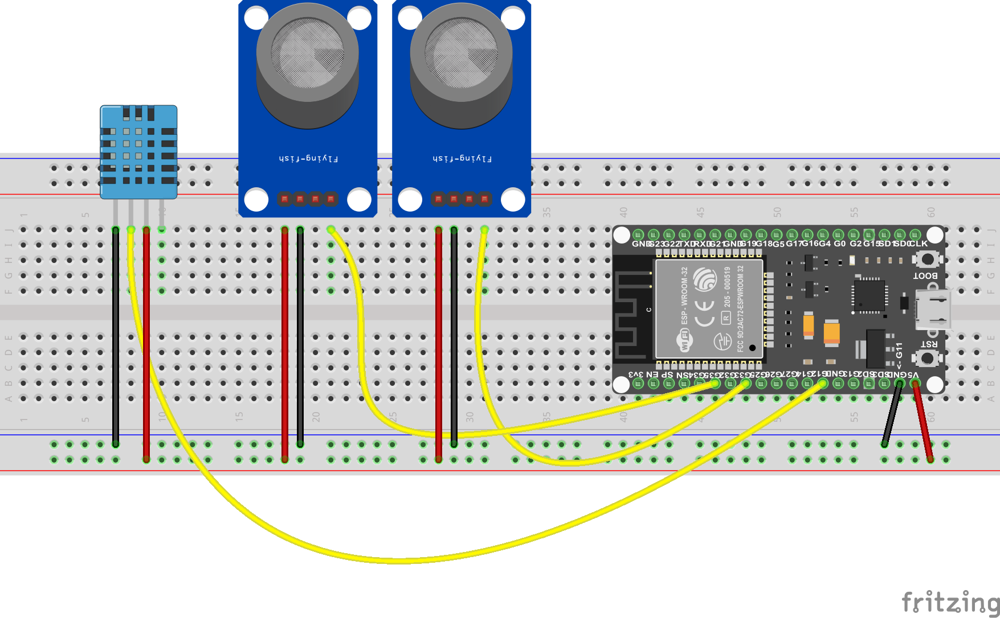

<!-- https://randomnerdtutorials.com/esp32-dht11-dht22-temperature-humidity-sensor-arduino-ide/ 


-->

## Introduzione

L'avvento dell'Internet of Things (IoT) ha rivoluzionato il modo in cui interagiamo con la nostra casa. La domotica, in particolare, ha portato all'introduzione di dispositivi intelligenti in grado di automatizzare diverse funzioni e di monitorare l'ambiente domestico.

In questo articolo, presenteremo un progetto per la realizzazione di una centralina multi-sensore basata sulla scheda ESP32. La centralina sarà in grado di:

- Rilevare la temperatura e l'umidità dell'ambiente,
- Monitorare la qualità dell'aria,
- Rilevare la presenza di gas combustibili.


Il progetto è rivolto a hobbisti ed appassionati di elettronica con un livello di conoscenza intermedio. La realizzazione della centralina richiede l'utilizzo di componenti elettronici di base, facilmente reperibili online o nei negozi di elettronica.

Cosa troverai in questo articolo:

- La lista dei componenti necessari,
- Lo schema elettrico della centralina,
- Il programma free per ESP32.

## Il sensore di gas MQ-2

Il sensore di gas <a href="https://www.az-delivery.de/it/products/gas-sensor-modul" target="_blank">MQ-2</a> è un dispositivo elettronico ampiamente utilizzato per rilevare la presenza di vari gas nel suo ambiente circostante. Questo sensore è particolarmente noto per la sua capacità di rilevare gas <a href="https://www.vigilfuoco.it/sitiComandi/GestioneSiti/downloadFile.asp?s=181&f=106408" target="_blank">infiammabili</a> come metano, propano, butano, idrogeno e altri gas combustibili, oltre a essere sensibile anche a gas nocivi come fumi di sigaretta, alcol, <a href="https://www.chemos.de/import/data/msds/IT_it/1336-21-6-A0023969-IT-it.pdf" target="_blank">ammoniaca</a> e vapori di <a href="https://www.issalute.it/index.php/la-salute-dalla-a-alla-z-menu/b/benzene" target="_blank">benzene</a>. 

> Il sensore MQ-2 si basa su una tecnologia di rilevamento nota come sensore di gas a <a href="https://it.emcelettronica.com/i-sensori-resistivi" target="_blank">resistenza variabile</a>. Questo tipo di sensore utilizza un elemento sensibile che reagisce chimicamente alla presenza di gas specifici, causando una variazione nella sua resistenza elettrica. Quando il gas viene rilevato, la resistenza dell'elemento sensibile cambia e questa variazione viene misurata per determinare la <a href="https://www.arpa.veneto.it/temi-ambientali/aria/qualita-dellaria/approfondimenti/metodi-di-misura-inquinanti-atmosferici" target="_blank">concentrazione</a> del gas nell'ambiente.

<br>

Dal punto di vista tecnico, il sensore MQ-2 è costituito da diversi componenti chiave, tra cui l'elemento sensibile, un <strong>circuito di controllo</strong> e un dispositivo di rilevamento delle variazioni di resistenza.

<div class="alert alert-doks d-flexflex-shrink-1" role="alert">🔑
<strong>Il circuito di controllo</strong> gestisce tutte le operazioni del sensore, inclusa la conversione del valore di resistenza in un segnale elettrico. Il dispositivo che legge il valore della resistenza si chiama <a href="https://it.wikipedia.org/wiki/Conversione_analogico-digitale" target="_blank">convertitore</a> analogico-digitale ed è in grado di trasformare la tensione analogica in un valore digitale. Tutti i moderni <a href="https://eurek.it/microcontrollori-cosa-sono-e-a-cosa-servono-nell-elettronica/" target="_blank">microcontrollori</a> come il nostro ESP32 riescono a leggere senza problemi i segnali digitali.</div>


### Come funziona il sensore di gas MQ-2

Il sensore è composto da un elemento riscaldante in <a href="https://it.wikipedia.org/wiki/Diossido_di_stagno" target="_blank">ossido di stagno</a> (SnO2) posizionato su un substrato di ceramica. Al riscaldamento, l'elemento sensibile presenta una conduttività elettrica che varia in base alla <a href="https://incoedile.altervista.org/blog/le-unita-di-misura-dei-gas/" target="_blank">concentrazioni</a> di gas combustibili presenti nell'aria circostante. In presenza di gas, le molecole di gas si <a href="https://www.treccani.it/enciclopedia/adsorbimento/" target="_blank">adsorbono</a> sulla superficie dell'ossido di stagno, provocando una diminuzione della conduttività. 

> La variazione di conduttività viene misurata da un circuito elettrico e convertita in un segnale analogico proporzionale alla concentrazione di gas presente

### Le migliori qualità del sensore di gas MQ-2

- Sensibilità elevata: Il sensore è particolarmente sensibile a gas combustibili come GPL, propano e metano.
- Ampia gamma di rilevamento: Il sensore è in grado di rilevare concentrazioni di gas da **200** ppm a **10000** ppm.
- Tempo di risposta rapido: Il sensore ha un <a href="https://www.tecnosoft.eu/it/faq/tempo-di-risposta/" target="_blank">tempo di risposta</a> rapido, inferiore a 2 secondi.
- Facilità di utilizzo: Il sensore è facile da utilizzare e richiede solo una semplice alimentazione a 5V, erogabile dalla uscita a 5V di ESP32.
- Costo contenuto: Il sensore ha un costo relativamente basso.


### I campi di applicazione del sensore di gas MQ-2
A parte il semplice progetto che ti presentiamo, il sensore MQ-2 viene utilizzato in svariate applicazioni con Arduino ed ESP32 tra cui:

- Rilevamento di fughe di gas: Il sensore può essere utilizzato per rilevare fughe di gas in abitazioni, industrie e ambienti commerciali.
- Sistemi di allarme antincendio: Il sensore può essere utilizzato in sistemi di allarme antincendio per rilevare la presenza di fumi e gas combustibili.
- Controllo della <a href="https://waqi.info/it/" target="_blank">qualità dell'aria</a>: Il sensore può essere utilizzato per monitorare la qualità dell'aria in ambienti interni ed esterni.
- Domotica: Il sensore può essere utilizzato in sistemi di domotica per controllare la ventilazione in base alla qualità dell'aria.

##### Le altre tipologie di sensori di gas

Esistono in commercio oltre 40 sensori di gas alternativi a MQ-2, grossomodo riconducibili a tre sole categorie:

**1**. Sensori <a href="https://www.processsensing.com/it-it/blog/come-funzionano-i-sensori-elettrochimici.htm" target="_blank">elettrochimici</a>: sono più selettivi rispetto al sensore MQ-2 e sono in grado di distinguere tra diversi tipi di gas.

**2**. Sensori a <a href="https://it.wikipedia.org/wiki/Sensore_a_infrarossi_passivo" target="_blank">infrarossi</a>: questi sensori sono in grado di rilevare la presenza di gas senza entrare in contatto con essi.

**3**. Sensori a <a href="https://www.fisica.unina.it/documents/12375590/13725484/2790_VerdeC_18-12-2018.pdf/55f3bdb0-9060-47ee-95fc-870804ca16c0" target="_blank">stato solido</a>: sono più stabili e affidabili rispetto al sensore MQ-2.

#### Perchè abbiamo scelto proprio il sensore MQ-2

Abbiamo testato molti dei sensori alternativi e in alcuni casi abbiamo rilevato tempi di risposta più rapidi o maggiore omogeneità di risultati. Abbiamo comunque preferito l'MQ-2 per il rapporto qualità prezzo imbattibile e la robustezza del case metallico, ideale per la costruzione di un prototipo. 


## Il sensore di gas MQ-135

Il sensore di gas MQ-135 è un sensore a semiconduttore di tipo chemio-resistivo, progettato per rilevare la presenza di gas combustibili come GPL, propano, metano, idrogeno e fumi in aria.

> <strong>Il sensore dell'MQ-135</strong> è composto da un elemento riscaldante in ossido di stagno (SnO2) posizionato su un substrato di ceramica. <br>Dopo il pre-riscaldamento, l'elemento sensibile presenta una conduttività elettrica che varia in base alla concentrazione di gas combustibili presenti nell'aria.


In presenza di gas, le molecole di gas si <a href="https://it.wikipedia.org/wiki/Adsorbimento" target="_blank">adsorbono</a> sulla superficie dell'<a href="https://it.wikipedia.org/wiki/Ossido" target="_blank">ossido</a> di stagno, provocando una diminuzione della conduttività.
La variazione di conduttività viene misurata da un circuito elettrico e convertita in un segnale analogico proporzionale alla concentrazione di gas presente.

##### La qualità chiave di questo sensore è la sensibilità elevata:<br> L'MQ-135 è fra i migliori dispositivi per tracciare gas potenzialmente pericolosi come GPL, propano e metano.

Possiede inoltre una ampia gamma di rilevamento: Il sensore è in grado di rilevare concentrazioni di gas da 200 ppm a 10000 ppm.

### Perchè abbiamo usato l'MQ-135 in questo progetto
  
A parte la somiglianza con l'MQ-2 e quindi la estrema robustezza del case metallico lo abbiamo selezionato per due motivi ben precisi:

- Il tempo di risposta rapido: MQ-135 ha un tempo di risposta assai rapido, inferiore ai 2 secondi. Grazie a questa possiamo usarlo con vantaggio in questo prototipo, dove verosimilmente proveremo a testarlo "live" con svariati gas e vapori.
- La facilità di di utilizzo: è un prodotto "da scaffale" facile da utilizzare e richiede una banale alimentazione a 5V. Le connessioni sono adatte ai connettori Dupont a differenza dei sensori industriali che *possono* richiedere saldature o connettori speciali.


## Il sensore DHT11

Il sensore <a href="/blog/come-leggere-il-sensore-dht11-con-esp32/">DHT11</a> è un <a href="/blog/i-sensori-di-temperatura-per-la-robotica/">sensore</a> digitale che può svolgere il doppio ruolo di rilevazione della temperatura e della umidità: vediamo brevemente come funziona in entrambi i casi.

#### 1 - Sensore di temperatura
Il DHT11 utilizza un termistore per rilevare la temperatura ambiente. Un termistore è un dispositivo resistivo la cui resistenza varia in base alla temperatura. Nel caso del DHT11, il termistore è costituito da un materiale il cui valore di resistenza diminuisce al crescere della temperatura.

#### 2 - Sensore di umidità
Il DHT11 misura l'umidità relativa e per fare questo utilizza un condensatore a film polimerico con un dielettrico. Il dielettrico (isolante) al cambiamento dell'umidità modifica la capacità del condensatore. Le variazioni vengono quindi convertite in un segnale elettrico.

### Il funzionamento del DHT11
Il sensore contiene un <a href="https://it.wikipedia.org/wiki/Circuito_integrato" target="_blank">circuito integrato</a> che si occupa di leggere la resistenza e la capacità in <a href="https://vitolavecchia.altervista.org/differenza-tra-segnale-digitale-e-analogico-in-elettronica/" target="_blank">segnali digitali</a>. Il circuito riesce a convertire i valori di temperatura e umidità in un segnale digitale standard. I dati così ottenuti vengono inviati all'ESP32 che con questo sistema non deve effettuare nessuna <a href="http://www.elemania.altervista.org/adda/campionamento/campdig.html" target="_blank">conversione</a>.


> <strong>I segnali digitali</strong> assumono solo due valori discreti, solitamente rappresentati come "0" e "1". In termini elettrici, questi valori possono corrispondere a due tensioni differenti, come 0V e 5V, oppure a due stati logici, come "vero" e "falso".
<br>Caratteristiche:
<br><strong>Ampiezza</strong>: I segnali digitali hanno un'ampiezza ben definita e non possono assumere valori intermedi tra i due livelli discreti.
<br><strong>Frequenza</strong>: La frequenza di un segnale digitale rappresenta il numero di volte al secondo in cui il segnale cambia stato.
<br><strong>Forma d'onda</strong>: La forma d'onda di un segnale digitale può essere quadrata, sinusoidale o di altra forma, a seconda dell'applicazione.
<br>Esempi di segnali digitali: 1. Bit in un computer 2. Segnali di clock 3.Dati binari 4. 
<br><br><strong>Segnali Analogici</strong>:
I segnali analogici assumono un'ampiezza continua all'interno di un intervallo specificato. In altre parole, possono assumere qualsiasi valore all'interno di tale intervallo.
<br>Caratteristiche:<br>
<strong>Ampiezza</strong>: L'ampiezza di un segnale analogico varia in modo continuo in base al valore che rappresenta.
<strong>Frequenza</strong>: La frequenza di un segnale analogico può essere costante o variabile, a seconda del tipo di segnale.
<strong>Forma d'onda</strong>: La forma d'onda di un segnale analogico può essere sinusoidale, quadrata, triangolare o di altra forma, a seconda dell'applicazione.

#### Le caratteristiche tecniche del DHT11

- Accuratezza: ±1°C per la temperatura e ±5% per l'umidità.
- Risoluzione: 1°C per la temperatura e 1% per l'umidità.
- Gamma di misurazione: 0-50°C per la temperatura e 20-90% per l'umidità.
- Tempo di risposta: 1 secondo.

## Come usare questo progetto

Questa mini-stazione di controllo dotata di sensori DHT11, MQ-2 e MQ-135 può essere utilizzata per monitorare la temperatura e l'umidità dell'aria in ambienti interni ed esterni, e risulta ideale per applicazioni in questi settori:

- Domotica in genere: La centralina può controllare la temperatura e l'umidità delle singole stanze,
- Rilevamento di gas pericolosi: La combinazione di MQ2 e MQ135 permette di controllare la maggior parte dei gas domestici pericolosi,
- Gestione delle serre: Il DHT11 può essere usato nelle serre per monitorare temperatura e umidità.


### Componenti del progetto

Il progetto non usa resistenze o altri componenti passivi e non ha bisogno di saldature: i connettori Dupont e una breadboard sono sufficienti per completare il montaggio. Ti ricordo che dovresti sempre usare dei colori *consistenti* nella scelta dei fili di collegamento ed usare, ad esempio solo Dupont neri o blu scuro per il negativo, solo rossi per il positivo e gialli/verdi per il segnale elettrico. 

Lo schema di colori che ti ho suggerito è solo indicativo e puoi modificarlo secondo le tue preferenze ma ti consiglio di adottarne solo *uno* e di mantenere le tue scelte nel tempo. Oltre ai connettori ti servirà una breadboard.

- Sensore MQ-2 - vedi su <a href="https://amzn.to/49pwhrF" target="_blank">Amazon</a>
- Sensore MQ-135 - vedi su <a href="https://amzn.to/48qeoaT" target="_blank">Amazon</a>
- Sensore DHT11 - vedi su <a href="https://amzn.to/49f2fqF" target="_blank">Amazon</a>
- Scheda ESP32 - vedi su <a href="https://amzn.to/49Gig8Q" target="_blank">Amazon</a>
- Breadboard per montaggi elettronici (oppure 2 breadboard unite lungo la linea di mezzeria)


## Lo schema elettrico

La massa (**GND**) dell'ESP32 deve essere collegata al negativo comune della breadboard e il pin **5V** sempre dell'ESP32 deve essere collegato alla linea rossa della breadboard. 

Le connessioni (+) e (-) dei sensori finiscono sulle righe rosse e blu della breadboard. L'assemblaggio non presenta grosse difficoltà: basta seguire scrupolosamente il disegno. Le linee dati dei sensori sono rappresentate in giallo. Il pin centrale del DHT11 viene collegato al pin 13 dell'ESP32 mentre i due sensori MQ sono collegati ai pin 33 e 35.
<br>
<br>



<br>

## Il programma

Vediamo adesso come installare il programma sull'ESP32: procederemo inizialmente ad usare PlatformIO e poi vederemo come compilare con Arduino IDE. Andiamo sul terminale di Linux o sulla Windows *PowerShell* e facciamo copia e incolla del riquadro sotto.

```bash
git clone git@github.com:sebadima/corso-esp32-centralina-multisensore.git
cd corso-esp32-centralina-multisensore
make upload
platformio device monitor --baud 115200  --rts 0 --dtr 0
```

Dopo avere premuto il tasto invio avremo questa sequenza dal terminale:

```bash
Cloning into 'corso-esp32-centralina-multisensore'...
remote: Enumerating objects: 36, done.
remote: Counting objects: 100% (36/36), done.
remote: Compressing objects: 100% (16/16), done.
remote: Total 36 (delta 11), reused 34 (delta 9), pack-reused 0
Receiving objects: 100% (36/36), 6.22 KiB | 1.24 MiB/s, done.
Resolving deltas: 100% (11/11), done.
pio -f -c vim run --target upload
Processing esp32dev (platform: espressif32; board: esp32dev; framework: arduino)
```

Platformio provvederà a compilare il programma, a scaricare le librerie e a linkarle al codice oggetto. Il codice oggetto compilato verrà quindi *caricato* sulla scheda. In caso di problemi con l'upload devi editare il file *platformio.ini* e modificare la porta utilizzata dall'ESP32. 

> Se usi Linux puoi trovare la porta utilizzata dalla scheda scrivendo: 

```bash
ls /dev/ttyUS*
```

mentre su Windows puoi usare il comando:

```bash
Get-CimInstance -Class Win32_SerialPort | Select-Object Name, Description, DeviceID
```

### Il file principale "main.ino"
```bash
#include <Arduino.h>
#include "DHT.h"
#include "soc/soc.h"
#include "soc/rtc_cntl_reg.h"

#define DHTPIN 13
#define DHTTYPE DHT11

DHT dht(DHTPIN, DHTTYPE);
float t, h, g_1, g_2;
int lost_packages;
int Gas_1 = 33;
int Gas_2 = 35;


void setup() {
  Serial.begin(115200);
  WRITE_PERI_REG(RTC_CNTL_BROWN_OUT_REG, 0); //disable brownout detector

  dht.begin();
  pinMode(Gas_1, INPUT);
  pinMode(Gas_2, INPUT);
}

void loop() {
  h   = dht.readHumidity();
  t   = dht.readTemperature();
  g_1 = analogRead(Gas_1);
  g_2 = analogRead(Gas_2);

  if (isnan(g_1) )
  {
    Serial.println(F("Non riesco a leggere dal sensore di GAS 1!"));
    return;
  }

  if (isnan(g_2) )
  {
    Serial.println(F("Non riesco a leggere dal sensore di GAS 2!"));
    return;
  }
 
  if (isnan(t) ) 
  {
    Serial.println(F("Non riesco a leggere dal sensore DHT!"));
    return;
  }

  Serial.print("Temperatura: ");
  Serial.println(t);
  Serial.print("Umidità: ");
  Serial.println(h);
  Serial.print("Gas_1: ");
  Serial.println(g_1);
  Serial.print("Gas_2: ");
  Serial.println(g_2);
  Serial.println("");

  delay(2000);
}
```

### Come compilare "main.ino" con Arduino IDE

Segui questi passaggi:

1. Apri Arduino IDE,
2. Crea un nuovo progetto cliccando su "File" > "Nuovo". Verrà creato un nuovo progetto vuoto,
3. Incolla il codice "main.ino" nell'area di testo principale, 
4. Clicca sul pulsante "Verifica" nella barra degli strumenti,
5. Se non ci sono errori collega la scheda Arduino al computer,
6. Seleziona la scheda Arduino corretta dal menu "Strumenti" > "Scheda",
7. Clicca sul pulsante "Carica" nella barra degli strumenti.

Adesso Il programma verrà caricato sulla scheda Arduino. Per leggere i valori dei sensori ti basta andare su "Strumenti" > "Monitor Seriale".

#### Un breve commento alle istruzioni del programma

##### La linea:

```bash
DHT dht(DHTPIN, DHTTYPE);
```

serve ad inizializzare nella RAM l'oggetto che rappresenta il *driver* per il DHT11. La istruzione *mappa* nella area "codice" di ESP32 funzioni e variabili interne tipiche della programmazione ad oggetti. A questi valori si può accedere solo usando i metodi di *interfaccia* tipici dei linguaggi "Object Oriented". Più in basso vedremo come il programma riesca ad usare l'oggetto "DHT dht()" per leggere istantaneamente la temperatura.


##### La linea:

```bash
  WRITE_PERI_REG(RTC_CNTL_BROWN_OUT_REG, 0); 
```

viene usata per disabilitare il controllo del *BROWNOUT* dell'ESP32.  Si tratta di un controllo elettrico voluto dai progettisti per segnalare anomalie nella tensione di alimentazione. Poichè stiamo usando l'ESP32 collegato al cavetto USB preferiamo disabilitarlo per evitare improbabili e inutili segnalazioni di errore. Nel caso di alimentazione a batteria probabilmente può avere un senso riabilitarlo.

##### Le linee:

```bash
  dht.begin();
  pinMode(Gas_1, INPUT);
  pinMode(Gas_2, INPUT);
```

servono la prima a lanciare la funzione di *start up* dell'oggetto "dht", mentre le due successive servono a segnalare all' ESP32 che deve usare i due *pin* 33 e 35 come input.

##### Le linee:

```bash
h   = dht.readHumidity();
t   = dht.readTemperature();  
```
servono a leggere umidità e temperatura usando le funzioni *di interfaccia* dell'oggetto "dht" ovvero le funzioni sicure pensate dai progettisti per nascondere la complessità del codice interno. Le funzioni sono introdotte dal "." come stabilito dalla sintassi del C++.

##### Le linee:

```bash
g_1 = analogRead(Gas_1);
g_2 = analogRead(Gas_2);
```
servono a leggere la tensione fornita dai pin 33 e 35 usando una funzione predefinita di Arduino: analogRead().
La interpretazione del valore viene lasciata al software e all'utente, a differenza di quanto riesce a fare il DHT11.

##### Infine le tre linee:

```bash
if (isnan(g_1) ) ...
if (isnan(g_2) ) ...
if (isnan(t) ) ...
```

sono usate per tracciare gli errori dei tre sensori, come ad esempio valori fuori scala o infiniti (NaN). 


<div class="alert alert-doks d-flexflex-shrink-1" role="alert">🔑
<strong>In informatica, NaN (Not a Number)</strong>, è un particolare simbolo che non è rappresentabile come un numero. Ad esempio il risultato della operazione "0/0" non è rappresentabile come un numero. L'uso sistematico delle <strong>NAN</strong> è stato introdotto dallo <a href="https://en.wikipedia.org/wiki/IEEE_754"_blank">standard IEEE 754</a> in virgola mobile nel 1985.</div>


### Troubleshooting

Se il progetto sembra non funzionare correttamente le cause degli errori potrebbero essere in ordine di probabilità:
- un errato collegamento dei connettori, 
- un problema grave come la rottura del sensore, 
- un problema alla tensione della USB del computer, 
- un cavo USB difettoso e cioè parzialmente spezzato all'interno.


##### Come fare il troubleshooting per un progetto con ESP32


<strong>1</strong>. Identificare il problema:

Il primo passo è identificare il problema che si sta verificando con il progetto.
Quali sono i sintomi del problema?
Quando si verifica il problema?
C'è un componente specifico che sembra essere la causa del problema?

<strong>2</strong>. Controllare i collegamenti:

Una volta identificato il problema, è necessario controllare i collegamenti.
Assicurati che tutti i collegamenti siano ben saldi e che non ci siano fili allentati o danneggiati.
Controlla che i componenti siano collegati correttamente all'<a href="/blog/esp32-i-segreti-del-suo-successo">ESP32</a>.

<strong>3</strong>. Testare i componenti:

È possibile utilizzare un multimetro per testare la tensione, la corrente e la resistenza dei componenti.
È possibile anche utilizzare un <a href="https://it.wikipedia.org/wiki/Oscilloscopio">oscilloscopio</a> per testare i segnali elettrici dei componenti.

> *L'oscilloscopio può essere utilizzato per testare circuiti elettronici digitali con ESP32 in diversi modi*:
<br><br><strong>Misurare la tensione</strong>:
<br>L'oscilloscopio può essere utilizzato per misurare la tensione ai pin dell'ESP32 per verificare se i livelli logici sono corretti.
<br>È importante utilizzare una sonda con una <a href="https://www.electroyou.it/vis_resource.php?section=DomRisp&id=364" target="_blank">impedenza</a> di ingresso elevata per evitare di caricare il circuito e influenzare le misure.
<br><strong>Misurare la frequenza</strong>:
<br>L'oscilloscopio può essere utilizzato per misurare la frequenza di un segnale digitale, come ad esempio il clock del microcontrollore.La funzione di frequenza automatica (<a href="https://youtu.be/XF_RkKm_O2U?si=Ae0fCXvQXFmvJns0" target="_blank">autorange</a>) dell'oscilloscopio può facilitare questa misurazione.
<br><strong>Visualizzare la forma d'onda</strong>:
<br>L'oscilloscopio può essere utilizzato per visualizzare la forma d'onda di un segnale digitale.
Questo può essere utile per identificare problemi come i ritardi di propagazione, i tempi di salita e discesa e le distorsioni del segnale.
<br><strong>"Triggerare" su un evento specifico</strong>:
<br>L'oscilloscopio può essere configurato per triggerare l'acquisizione di una traccia su un evento specifico, come ad esempio un fronte di salita o discesa di un segnale.
Questo può essere utile per catturare dettagli specifici del segnale che si desidera analizzare.
<br><strong>Usare le funzioni di analisi avanzate</strong>:
<br>Gli oscilloscopi moderni offrono diverse funzioni di analisi avanzate, come ad esempio la misura del <a href="https://logicaprogrammabile.it/duty-cycle-guida-definitiva/" target="_blank">duty cycle</a>, la demodulazione AM/FM e l'analisi FFT.
Queste funzioni possono essere utilizzate per ottenere informazioni più precise sul comportamento del circuito in esame.
<br><br><strong>Consigli per usare un oscilloscopio con ESP32</strong>:
<br>Utilizzare una <a href="https://www.aripordenone.it/progetto-sonda-alta-impedenza/" target="_blank">sonda</a> con un'impedenza di ingresso elevata per evitare di caricare il circuito.
Impostare la scala di tensione e di tempo in modo da visualizzare correttamente il segnale e infine usare la funzione di trigger per catturare il segnale desiderato.

<br><strong>4</strong>. Sostituire i componenti danneggiati:

Se un componente è danneggiato, è necessario sostituirlo.
Assicurati di utilizzare un componente con le stesse caratteristiche del componente originale. Puoi usare i nostri link su Amazon o se preferisci puoi acquistare i componenti da siti alternativi come Aliexpress.

## Conclusioni
Questo progetto di media complessità permette di controllare in modo estremamente preciso la qualità dell'aria e la presenza di gas nocivi e combustibili. Potresti assemblare la centralina in un contenitore chiuso per montaggi elettronici e magari aggiungere un display LCD per ottenere un prodotto funzionale. In seguito presenteremo una evoluzione di questo progetto dotandolo di un server web che può condividere i dati in tempo reale su un qualunque smartphone o PC collegato al Wi-Fi.

<br>
<br>
<p style="font-size: 0.80em;">Robotdazero.it - post - R.153.1.6.3</p>
