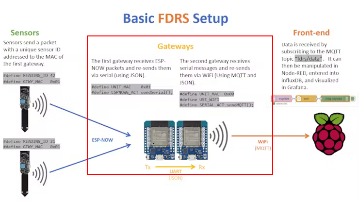

<!-- 
https://randomnerdtutorials.com/esp32-ESP-NOW-wi-fi-web-server/  
https://rntlab.com/question/how-to-know-and-or-set-the-wifi-channel-on-an-esp32/?utm_source=pocket_saves
https://github.com/HarringayMakerSpace/ESP-Now/blob/master/espnow-sensor-minimal/espnow-sensor-minimal.ino
-->

## Una breve premessa

La connessione simultanea WIFI ed ESP-NOW con l'ESP32 presenta alcune sfide di programmazione non indifferenti e per questo abbiamo deciso di trattare l'argomento in modo esteso, prima di presentare dei nuovi progetti che sfruttano a fondo entrambe le tecnologie.

### Cosa è ESP-NOW

ESP-NOW è un protocollo di rete proprietario sviluppato da Espressif per la comunicazione a bassa latenza e basso consumo energetico tra dispositivi ESP32. Offre un'alternativa al Wi-Fi per la connessione di dispositivi in reti locali, con alcuni vantaggi:

- Maggiore affidabilità: ESP-NOW è progettato per ambienti con interferenze RF elevate e offre una maggiore affidabilità rispetto al Wi-Fi.
- Minore latenza: ESP-NOW offre una latenza inferiore rispetto al Wi-Fi, rendendola ideale per applicazioni in tempo reale.
- Minore consumo energetico: ESP-NOW consuma meno energia rispetto al Wi-Fi, prolungando la durata della batteria dei dispositivi.


### Un programma basico per commettersi ad ESP-NOW

La trasmissione dati tra due ESP32 utilizzando il protocollo ESP-NOW è ben documentata da Espressif e il codice per inviare dati ad una scheda di cui conosciamo l'indirizzo <a href="https://it.wikipedia.org/wiki/Indirizzo_MAC" target="_blank">MAC</a> si limita a queste poche righe:

##### Esempio di base per ESP-NOW:
```bash
#include <WiFi.h>
#include <esp_now.h>

// Indirizzo MAC della scheda slave
uint8_t slave_mac[] = {0xXX, 0xXX, 0xXX, 0xXX, 0xXX, 0xXX};

// Messaggio da inviare
char message[] = "Ciao da ESP32 Master!";

void setup() {
  Serial.begin(115200);

  // Inizializzazione ESP-NOW
  if (esp_now_init() != ESP_OK) {
    Serial.println("Errore durante l'inizializzazione!");
    while(1);
  }

  // Imposta la scheda come master
  esp_now_set_self_role(ESP_NOW_ROLE_MASTER);

  // Aggiungi la scheda slave
  esp_now_add_peer(slave_mac);
}

void loop() {
  // Invia il messaggio alla scheda slave
  esp_now_send(slave_mac, (uint8_t*)message, strlen(message));
  Serial.println("Messaggio inviato: " + String(message));

  // Attendi 10 secondi prima di inviare di nuovo il messaggio
  delay(10000);
}
```

## I problemi nell'utilizzo simultaneo di Wi-Fi e ESP-NOW

Dall'esempio precedente si nota come ESP-NOW non sia un protocollo "difficile" da inserire nei nostri programmi, ma la sua coesistenza con il Wi-Fi sull'ESP32 presenta delle sfide non banali. Tra queste la maggiore è sicuramente la dotazione di una singola radio (e antenna) che deve essere condivisa tra i due sistemi.
Questa limitazione tecnica può causare, e spesso causa, conflitti e rallentamenti in entrambe le connessioni.

### Possibili soluzioni

Poichè avevamo deciso di implentare una centralina di monitoraggio dell'aria con accesso ai sensori ESP-NOW e con server WEB integrato, abbiamo sperimentato alcune scappatoie per aggirare il problema. Il primo passo è stato studiare le limitazioni per il loro uso in simultanea che riassumiamo in breve:

> *- La schede ESP32 trasmittente deve utilizzare lo stesso canale Wi-Fi della scheda ricevente.
Il canale WiFi della scheda ricevente viene assegnato automaticamente dal router WiFi e questo è già una fonte di potenziali problemi.
<br>- La modalità Wi-Fi della scheda ricevente deve essere "access point e station" e quindi deve essere definita con il parametro (**WIFI_AP_STA**).
È possibile impostare manualmente (sul router) lo stesso canale Wi-Fi, ma è preferibile scrivere una funzione software per "agganciare" il canale Wi-Fi delle due schede.*


### I problemi dell'approccio basico ad ESP-NOW

Se, come noi, hai usato l'esempio base aggiungendo la connessione Wi-Fi, avrai notato che, non appena questa viene attivata, la maggior parte dei pacchetti ESP-NOW non arriva affatto. Questa anomalia sembra essere correlata al modo in cui funziona il Wi-Fi in genere e non solo con ESP32. Vediamo meglio come risolvere il problema e cominciamo dai problemi pratici:

#### L'esempio di base e i problemi con il "Master"

Il master è il nodo che invierà i dati ESP-NOW allo slave, che a sua volta si occuperà di connettersi al WiFi. Il Master non si connetterà al WiFi e quindi lo useremo solo per inviare.


> *Master e Slave in ESP-NOW di Espressif per ESP32:
<br>- Master: Invia dati ad altri dispositivi (slave), avvia la comunicazione con gli slave, può comunicare con più slave contemporaneamente.
<br>- Slave:
Riceve dati dal master, Risponde alle richieste del master, Può comunicare con un solo master alla volta.
<br><br>- Configurazione Master/Slave:
<br>La configurazione del ruolo master/slave avviene tramite software.
<br>La libreria software ESP-NOW (<a href="https://github.com/yoursunny/WifiEspNow" target="_blank">link</a>) fornisce funzioni per impostare il ruolo del dispositivo ESP32, mentre questa <a href="https://espressif-docs.readthedocs-hosted.com/projects/arduino-esp32/en/latest/api/espnow.html" target="_blank">pagina</a> fornisce (in inglese) la documentazione completa dell'intero pacchetto.*


#### I problemi della scheda "Slave"
Lo slave sarà dunque il nodo che si connette al WiFi per poter inviare i dati su Internet. È proprio in questo nodo che troveremo il problema dei pacchetti che *non arrivano* con conseguente perdita di dati. Se per il master non si poteva parlare di un vero e proprio difetto di progettazione, con lo slave siamo costretti a modificare il programma di base fornito da Expressif.

<div class="alert alert-doks d-flexflex-shrink-1" role="alert">🔑
<strong>Perchè la colpa è realmente della connessione WI-FI</strong>:
<br>Se hai provato l'esempio di base ed hai aggiunto i comandi per collegarsi al tuo Wi-Fi, avrai osservato che i pacchetti non riescono a passare tra il nodo master e lo slave solo <strong>DOPO</strong> che viene attivato il WiFi. Infatti, se commenti la linea "WiFi.begin()" nel tuo programma l'errore scompare!</div>

### Una prima soluzione

Abbiamo visto, per esempio in questo <a href="https://www.hackster.io/news/timm-bogner-s-farm-data-relay-system-uses-esp8266-esp32-nodes-and-gateways-for-sensor-networks-b87a75c69f46" target="_blank">sito</a> che in alcuni casi i progettisti ricorrevano a due schede "gateway" che scambiano dati via <a href="https://www.w3schools.com/js/js_json_intro.asp" target="_blank">JSON</a> sulla porta seriale, con il primo gateway collegato ai sensori ESP-NOW e il secondo a Wi-Fi. 



Nel box in rosso si vede come le due schede ESP32 provvedano a dividersi i compiti e a scambiare i dati via JSON. In questo modo si risolve la anomalia ma si introduce un nuovo elemento di complessità alla rete mista con ESP-NOW/Wi-Fi. E sappiamo per esperienza che la complessità si porta appresso un sacco di conseguenza "indesiderate".

Abbiamo dunque cercato per la nostra centralina una soluzione più semplice.

> *Il problema principale sembra essere causato dalla modalità station WiFi che entra in modalità sleep mentre non si ha lavoro. Ciò significa che non ascolta per ricevere i pacchetti ESP-NOW e quindi sono persi. Per risolvere questo problema dovremo forzare il nostro microcontrollore ad ascoltare continuamente, e questo si ottiene trasformandolo in un AP (Access Point). Rilassati, non sarà necessario esporre il microcontrollore, basta dirgli di configurarsi come AP e Stazione allo stesso tempo.*


 Per questo cambieremo questa linea:

WiFi.modalità(WIFI_STA);
Per questo:

WiFi.modalità(WIFI_AP_STA);

E con questo semplice cambiamento, si risolve un problema che sembra aver trasformato molti su Internet. Non sto dicendo che le persone sono molto goffe, forse quando l'hanno provato non è riuscito o non è stato implementato. Ecco perché vi porto questo modo facile nella speranza che servirà a molti.


Difficile
Se l'opzione sopra non ti è riuscita, c'è un'opzione alternativa che è quella di mettere il canale WiFi sul master, che sembra essere anche un requisito per farlo funzionare. Nel mio caso senza andare oltre, al momento della pubblicazione della prima parte di questa guida ha funzionato perfettamente per me, ma quando sono andato a implementarlo due giorni dopo nel mio progetto ha iniziato a fallire. Forse è stato un cambio di canale dal mio router o simili, così ho deciso di espandere questa guida con l'altra opzione che avevo visto.

Non essere spaventato dal titolo, il "modo difficile" è perché devi aggiungere qualche riga in più, ma non è davvero difficile. Le linee da aggiungere sono l'intestazione per poter configurare il canale e la linea in cui è indicato il canale.


++++

Dopo questi aggiustamenti dovrebbe funzionare per te, ma se nel tuo caso non conosci il canale o ti succede come se fosse automatico, potrebbe essere meglio per te rilevare automaticamente il canale del tuo router. Per questo puoi usare questo codice:

Che passando l'SSID del router restituisce il canale corrente. Grazie a Randomnerdtutorial che mi ha aiutato con quest'ultima soluzione.

Con entrambe le modifiche il codice finale sarebbe simile a questo:

```bash
++++

#include "ESPAsyncWebServer.h"
#include <Arduino_JSON.h>
#include <Arduino.h>
#include <esp_now.h>
#include <esp_wifi.h>
#include <WiFi.h>
#include "soc/soc.h"
#include "soc/rtc_cntl_reg.h"
#include "BluetoothSerial.h"

constexpr char WIFI_SSID[] = "rda0";
constexpr char WIFI_PASS[] = "pippo1243";

// Setta un indirizzo IP Fisso
IPAddress local_IP(192, 168, 1, 200);
// Setta l'indirizzo del Gateway
IPAddress gateway(192, 168, 1, 1);
IPAddress subnet(255, 255, 0, 0);
IPAddress primaryDNS(8, 8, 8, 8); //opzionale
IPAddress secondaryDNS(8, 8, 4, 4); //opzionale

// Struttura dati, deve corrispondere a quella del mittente
typedef struct struttura_dati {
  char  v0[32];
  int   v1;
  float v2;
  float v3;
  float v4;
  unsigned int progressivo;
} struttura_dati;

struttura_dati LettureSensori;

#if !defined(CONFIG_BT_ENABLED) || !defined(CONFIG_BLUEDROID_ENABLED)
#error Bluetooth is not enabled! Please run `make menuconfig` to and enable it
#endif

BluetoothSerial SerialBT;
JSONVar board;
AsyncWebServer server(80);
AsyncEventSource events("/events");

volatile int interruptCounter;
int totalInterruptCounter;
hw_timer_t * timer = NULL;
portMUX_TYPE timerMux = portMUX_INITIALIZER_UNLOCKED;
#define DELAY_RECONNECT 60


void IRAM_ATTR onTimer() 
{
  // https://github.com/espressif/arduino-esp32/blob/master/libraries/ESP32/examples/Timer/RepeatTimer/RepeatTimer.ino
  portENTER_CRITICAL_ISR(&timerMux);
  interruptCounter++;
  if (WiFi.status() != WL_CONNECTED)
  {
    ESP.restart();
  }
  portEXIT_CRITICAL_ISR(&timerMux);
}

void suDatiRicevuti(const uint8_t * mac_addr, const uint8_t *incomingData, int len) { 
  // Copi l'indirizzo MAC del mittente
  char macStr[18];
  Serial.print("Pacchetto ricevuto da: ");
  snprintf(macStr, sizeof(macStr), "%02x:%02x:%02x:%02x:%02x:%02x",
           mac_addr[0], mac_addr[1], mac_addr[2], mac_addr[3], mac_addr[4], mac_addr[5]);
  Serial.println(macStr);
  memcpy(&LettureSensori, incomingData, sizeof(LettureSensori));
  
  board["v1"] = LettureSensori.v1;
  board["v2"] = LettureSensori.v2;
  board["v3"] = LettureSensori.v3;
  board["v4"] = LettureSensori.v4;
  board["progressivo"] = String(LettureSensori.progressivo);
  String jsonString = JSON.stringify(board);
  events.send(jsonString.c_str(), "new_readings", millis());
  
  Serial.printf("Board ID %u: %u bytes\n", LettureSensori.v1, len);
  Serial.printf("t valore: %4.2f \n", LettureSensori.v2);
  Serial.printf("h valore: %4.2f \n", LettureSensori.v3);
  Serial.printf("Progressivo: %d \n", LettureSensori.progressivo);
  Serial.println();
}

const char index_html[] PROGMEM = R"rawliteral(
<!DOCTYPE HTML><html>
<head>
  <title>Robotdazero - rete "Ambientale" con ESP32</title>
  <meta name="viewport" content="width=device-width, initial-scale=1">
  <link rel="stylesheet" href="https://use.fontawesome.com/releases/v5.7.2/css/all.css" integrity="sha384-fnmOCqbTlWIlj8LyTjo7mOUStjsKC4pOpQbqyi7RrhN7udi9RwhKkMHpvLbHG9Sr" crossorigin="anonymous">
  <link rel="icon" href="data:,">
  <style>
    html {font-family: Arial; display: inline-block; text-align: center;}
    p {  font-size: 1.2rem;}
    body {  margin: 0;}
    .topnav { overflow: hidden; background-color: #2f4468; color: white; font-size: 1.7rem; }
    .content { padding: 20px; }
    .card { background-color: white; box-shadow: 2px 2px 12px 1px rgba(140,140,140,.5); }
    .cards { max-width: 700px; margin: 0 auto; display: grid; grid-gap: 2rem; grid-template-columns: repeat(auto-fit, minmax(300px, 1fr)); }
    .reading { font-size: 2.8rem; }
    .packet { color: #bebebe; }
    .card.temperature { color: #fd7e14; }
    .card.humidity { color: #1b78e2; }
  </style>
</head>
<body>
  <div class="topnav">
    <h3>ROBOTDAZERO - rete "Ambientale" con ESP32</h3>
  </div>
  <div class="content">
    <div class="cards">
      <div class="card temperature">
        <h4><i class="fas fa-thermometer-half"></i> SCHEDA #1 - TEMPERATURA</h4><p><span class="reading"><span id="t1"></span> &deg;C</span></p><p class="packet">sensore DHT11: <span id="rt1"></span></p>
      </div>
      <div class="card humidity">
        <h4><i class="fas fa-tint"></i> SCHEDA #1 - UMIDITA'</h4><p><span class="reading"><span id="h1"></span> &percnt;</span></p><p class="packet">sensore DHT11: <span id="rh1"></span></p>
      </div>
      <div class="card temperature">
        <h4><i class="far fa-bell"></i> SCHEDA #1 - Fumo/Metano</h4><p><span class="reading"><span id="t2"></span> ppm</span></p><p class="packet">sensore MQ-2: <span id="rt2"></span></p>
      </div>
      <div class="card humidity">
        <h4><i class="far fa-bell"></i> SCHEDA #1 - Qualita' dell'aria</h4><p><span class="reading"><span id="h2"></span> ppm</span></p><p class="packet">sensore MQ-135: <span id="rh2"></span></p>
      </div>
    </div>
  </div>
<script>
if (!!window.EventSource) {
 var source = new EventSource('/events');
 
 source.addEventListener('open', function(e) {
  console.log("Events Connected");
 }, false);
 source.addEventListener('error', function(e) {
  if (e.target.readyState != EventSource.OPEN) {
    console.log("Events Disconnected");
  }
 }, false);
 
 source.addEventListener('message', function(e) {
  console.log("message", e.data);
 }, false);
 
 source.addEventListener('new_readings', function(e) {
  console.log("new_readings", e.data);
  var obj = JSON.parse(e.data);
  document.getElementById("t1").innerHTML = Math.round(obj.v2 * 100) / 100;
  document.getElementById("h1").innerHTML = obj.v1;
  document.getElementById("t2").innerHTML = obj.v3;
  document.getElementById("h2").innerHTML = obj.v4;
 }, false);
}
</script>
</body>
</html>)rawliteral";

void initBT() {
  SerialBT.begin("ESP32-sensori");    
  Serial.println("Dispositivo avviato, puoi accoppiarlo con bluetooth...");
}

void initWiFi() {
    WiFi.mode(WIFI_MODE_APSTA);

    if(!WiFi.config(local_IP, gateway, subnet, primaryDNS, secondaryDNS)) {
      Serial.println("STA Failed to configure");
    }

    WiFi.begin(WIFI_SSID, WIFI_PASS);

    Serial.printf("Connecting to %s .", WIFI_SSID);
    while (WiFi.status() != WL_CONNECTED) { Serial.print("."); delay(200); }
    Serial.println("ok");

    IPAddress ip = WiFi.localIP();

    Serial.printf("SSID: %s\n", WIFI_SSID);
    Serial.printf("Channel: %u\n", WiFi.channel());
    Serial.printf("IP: %u.%u.%u.%u\n", ip & 0xff, (ip >> 8) & 0xff, (ip >> 16) & 0xff, ip >> 24);
}

void initEspNow() {
    if (esp_now_init() != ESP_OK) {
        Serial.println("ESP NOW failed to initialize");
        while (1);
    }
    esp_now_register_recv_cb(suDatiRicevuti);
}

void setup() {
  Serial.begin(115200);
  WRITE_PERI_REG(RTC_CNTL_BROWN_OUT_REG, 0); //disabilita brownout detector

  initWiFi();
  initEspNow();
  initBT();

  timer = timerBegin(0, 80, true);
  timerAttachInterrupt(timer, &onTimer, true);
  timerAlarmWrite(timer, DELAY_RECONNECT * 1000000, true);
  timerAlarmEnable(timer);

  server.on("/", HTTP_GET, [](AsyncWebServerRequest *request){
    request->send_P(200, "text/html", index_html);
  });
   
  events.onConnect([](AsyncEventSourceClient *client){
    if(client->lastId()){
      Serial.printf("Riconnessione! Ultmo messaggio ricevuto: %u\n", client->lastId());
    }
    client->send("hello!", NULL, millis(), 10000);
  });
  server.addHandler(&events);
  server.begin();
}
 
void loop() {
  static unsigned long lastEventTime = millis();
  static const unsigned long EVENT_INTERVAL_MS = 5000;
  if ((millis() - lastEventTime) > EVENT_INTERVAL_MS) {
    events.send("ping",NULL,millis());
    lastEventTime = millis();
  }
}
++++
```


<br>
<br>
<p style="font-size: 0.80em;">Robotdazero.it - post - R.155.0.3.1</p>

