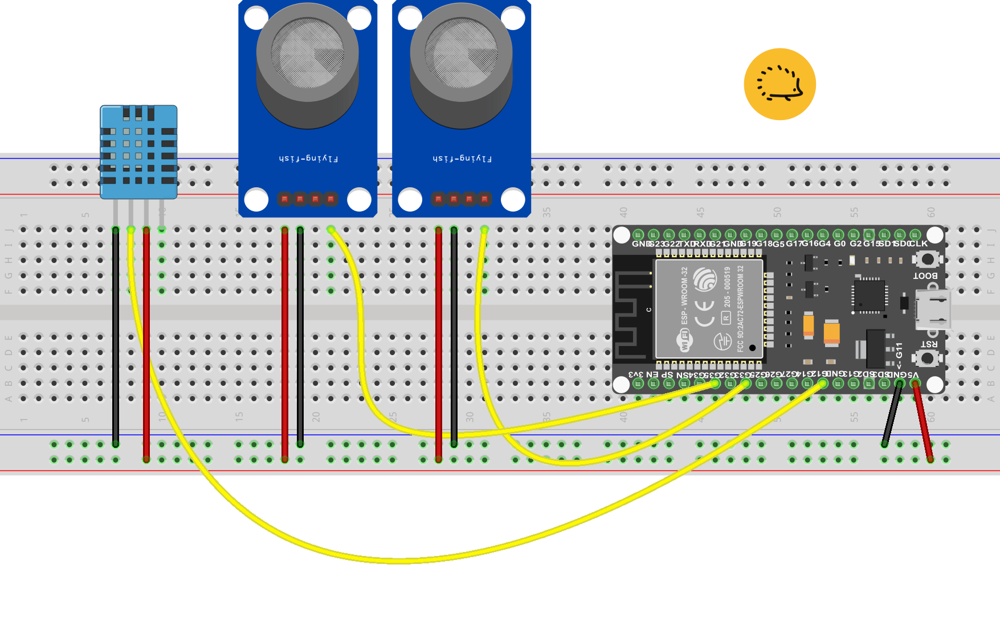

<!-- 

<strong>1</strong>. <span style="background-color:#eeeeee"> Controllo delle versioni</span>:
img width="70" class="x figure-img img-fluid lazyload blur-up"  src="/hog/inter.svg" alt="logo sezione"><br><br>

```bash
```     
<div class="alert alert-doks d-flexflex-shrink-1" role="alert">🔑.</div>
<iframe  width="800" height="1200" src="https://robotdazero.ck.page/posts/000002" title="W3Schools Free Online Web Tutorials"></iframe>

-->


## Introduzione

La nostra centralina "meteo" con sensori di gas nocivi può catturare in tempo reale la presenza di +25 sostanze tossiche, tra cui idrocarburi  e ossidi di azoto e visualizzare la concentrazione dei gas, la temperatura e l'umidità dell'aria su un qualunque dispositivo dotato di browser Web.

### Le scelte di progetto

Il progetto usa stazioni trasmittenti multiple, da collocare in zone anche distanti e non coperte dal segnale Wi-Fi: Sfruttando il protocollo ESP-NOW di Espressif la centralina può visualizzare i dati dei sensori posti fino a 800 metri di distanza!<br>
  
Per la stazione trasmittente abbiamo inoltre selezionato dei componenti di pregio, come i due sensori di gas MQ2 e MQ135. Questi dispositivi garantiscono delle misurazioni affidabili  ad un un costo contenuto, ed essendo dotati di connettori con passo di 2.54 mm permettono di assemblare tutto il prototipo su una classica breadboard da 830 punti.

> *Il progetto è facilmente estensibile per leggere il valore di otto diversi trasmettitori con minime modifiche ai programmi. A tale scopo **tutto** il software viene distribuito in modalità "Open Source" e quindi completamente gratuito e personalizzabile.*

#### Utilizzo della centralina in ambienti "chiusi"

Con il dispositivo potresti, ad esempio, controllare la qualità dell'aria nella tua casa e monitorare gas come CO, metano, GPL e fumi di combustione. In questo modo otterresti un ambiente più sicuro in tutti locali compresi box e garage esterni. Inoltre il sensore MQ2 potrebbe diventare un alleato prezioso per anticipare problemi all'impianto del metano, a stufe e scaldabagni a gas.

> *La centralina può sicuramente aiutarti a prevenire malanni legati agli sbalzi di temperatura e definire una qualità dell'aria superiore grazie al sensore incorporato MQ135. Il sensore infatti riesce a tracciare la infiltrazione di molti inquinanti industriali, come il benzene e gli ossidi di azoto e i pericolosi "vapori" di ammoniaca e trielina.* 


#### Utilizzo della centralina in ambienti "aperti"

All'aperto la centralina può controllare la qualità dell'aria in giardini, parchi e camping grazie ai due sensori MQ. Avrai solo bisogno di una sorgente di alimentazione a 5V con attacco USB, una esigenza che puoi assolvere facilmente con degli economici *power bank* per telefonia mobile.<br>Per quanto riguarda i dati e il server Web, la centralina funziona egregiamente sfruttando il solo *hotspot* del telefonino e con un consumo di dati molto ridotto grazie alla tecnologia di programmazione "AJAX". 

### Gli utilizzi professionali della nostra centralina

Nell'ambito della domotica potresti integrare la centralina nel tuo sistema domestico, per offrire *anche* il controllo completo dell'aria e dei gas pericolosi.<br>Nel giardinaggio potresti monitorare a basso costo le condizioni climatiche delle tue piante direttamente sul terreno e lontano dalla rete Wi-Fi. <br>E nel campo della industria e limitatamente alla qualità dell'aria, il dispositivo potrebbe controllare la conformità delle aziende alle normative ambientali. 

#### Perchè proprio ESP32 e non Arduino

Abbiamo scelto ESP32 per la sua formidabile connettività: la rete ESP-NOW, disponibile solo su questo *controller*, permette di porre i sensori ad oltre 800 metri dalla stazione ricevente: Una prestazione impossibile da ottenere con il solo Arduino e la normale copertura del Wi-Fi.


<div class="alert alert-doks d-flexflex-shrink-1" role="alert">🔑
 I valori da noi indicati si riferiscono alle normali installazioni di ESP-NOW in modalità "<strong>long range</strong>" e senza antenne speciali o amplificatori RF. I dispositivi possono certamente raggiungere queste portate, ma solo a patto di posizionarli in posizioni elevate e lontane da interferenze fisiche (muri, palazzi, alberi).</div>


<br>In versioni future della centralina useremo gli stessi sensori e le schede di comunicazione dati "LoRa" per consentire la trasmissione fino a 2/3 chilometri in ambiente urbano e 10/15 chilometri in aria libera.

## i componenti e il software

### #1 - Il trasmettitore

Pe realizzare il trasmettitore ti serviranno questi materiali:

- Sensore MQ-2 - vedi su <a href="https://amzn.to/49pwhrF" target="_blank">Amazon</a>
- Sensore MQ-135 - vedi su <a href="https://amzn.to/48qeoaT" target="_blank">Amazon</a>
- Sensore DHT11 - vedi su <a href="https://amzn.to/49f2fqF" target="_blank">Amazon</a>
- Scheda ESP32 - vedi su <a href="https://amzn.to/49Gig8Q" target="_blank">Amazon</a>
- Breadboard per montaggi elettronici

### Assemblaggio del trasmettitore

Per costruire il trasmettitore puoi usare i connettori Dupont seguendo lo schema fornito. Ti suggerisco di inserire innanzitutto la scheda ESP32 e quindi i connettori verso i sensori. Solo DOPO dovresti inserire i sensori con la filatura  già pronta. Non serve alcuna saldatura a meno che tu non voglia assemblare il progetto per venderlo a terzi o magari farne una versione *altamente* portatile magari con accumulatori al litio.

<br>



### Configurazione software del trasmettitore 

Per la compilazione di questo progetto puoi usare Arduino Ide o il compilatore a linea di Comando PlatformIO. Esiste una terza possibilità per compilare i programmi e cioè usare PlatformIO integrato in Visual Studio Code; ma per il momento ti forniremo istruzioni dettagliate solo per le prime due opzioni.

#### Compilazione con Arduino IDE

- Spiegare come installare le librerie necessarie.
- Fornire il codice sorgente per la configurazione del sensore di temperatura e umidità.

```bash
git clone git@github.com:sebadima/corso-ESP32-centralina-meteo-trasmettitore.git
cd corso-ESP32-centralina-meteo-trasmettitore
make upload
platformio device monitor --baud 115200  --rts 0 --dtr 0 --port /dev/ttyUSB0
```     

####  Compilazione con PlatformIO

- Mostrare come configurare il sensore di pressione atmosferica.
- Illustrare la configurazione del sensore di gas nocivi.

```bash
git clone git@github.com:sebadima/corso-ESP32-centralina-meteo-trasmettitore.git
cd corso-ESP32-centralina-meteo-trasmettitore
make upload
platformio device monitor --baud 115200  --rts 0 --dtr 0 --port /dev/ttyUSB0
```     


### #2 - Il ricevitore 


### Assemblaggio del ricevitore

minimo assemblaggio 


### Configurazione software del ricevitore 

Puoi usare Arduino Ide o il compilatore a linea di Comando PlatformIO. Esiste una terza possibilità per compil

####  Compilazione con Arduino IDE

- Specificare l'IDE utilizzato (es. Arduino IDE).
- Spiegare come installare le librerie necessarie.
- Fornire il codice sorgente per la configurazione del sensore di temperatura e umidità.

```bash
git clone git@github.com:sebadima/corso-ESP32-centralina-meteo-trasmettitore.git
cd corso-ESP32-centralina-meteo-trasmettitore
make upload
platformio device monitor --baud 115200  --rts 0 --dtr 0 --port /dev/ttyUSB0
```     

#### Compilazione con PlatformIO

- Mostrare come configurare il sensore di pressione atmosferica.
- Illustrare la configurazione del sensore di gas nocivi.


```bash
git clone git@github.com:sebadima/corso-ESP32-centralina-meteo-trasmettitore.git
cd corso-ESP32-centralina-meteo-trasmettitore
make upload
platformio device monitor --baud 115200  --rts 0 --dtr 0 --port /dev/ttyUSB0
```     


<br><br><br>


## Il server Web

- Descrivere come acquisire i dati dai sensori.
- Spiegare come memorizzare i dati su scheda SD o EEPROM.
- Mostrare come inviare i dati ad un server remoto.
- Visualizzazione dei dati:

- Presentare diverse opzioni per la visualizzazione dei dati, come un grafico o un pannello di controllo.
- Fornire il codice sorgente per la visualizzazione dei dati sul display LCD.
- Mostrare come creare un'interfaccia web per la visualizzazione dei dati.


## Troubleshooting

riprendere da altri post

## Conclusioni

Riassumere i vantaggi della centralina meteo realizzata con ESP32 e C++.
Suggerire possibili miglioramenti e future implementazioni.
Ringraziare i lettori per l'attenzione e invitarli a lasciare commenti o domande.


<br>
<br>
<p style="font-size: 0.80em;">Robotdazero.it - post - R.159.0.3.0</p>