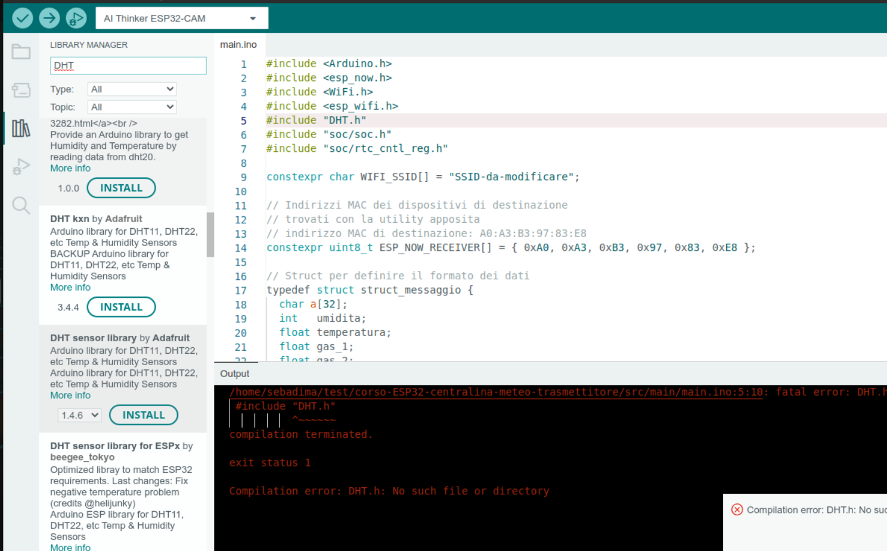
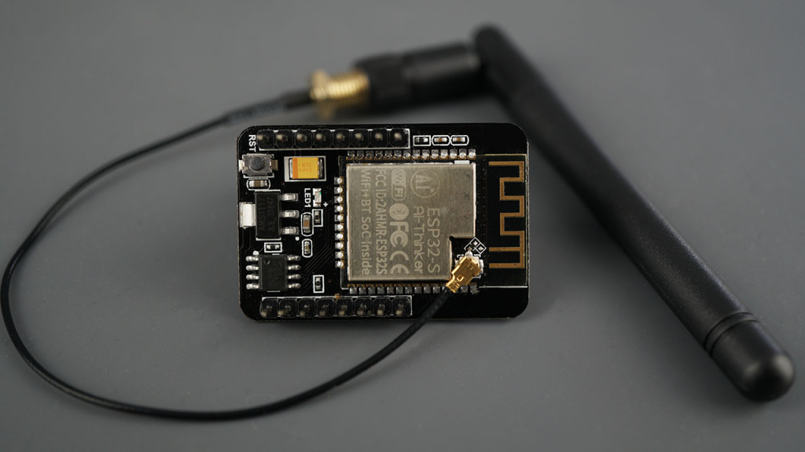

<!-- 
https://github.com/espressif/arduino-esp32/blob/master/libraries/ESP32/examples/Timer/RepeatTimer/RepeatTimer.ino
https://espressif-docs.readthedocs-hosted.com/projects/arduino-esp32/en/latest/api/timer.html
https://randomnerdtutorials.com/esp32-cam-connect-external-antenna/
https://deepbluembedded.com/esp32-timers-timer-interrupt-tutorial-arduino-ide/

-->


## Introduzione

La nostra centralina "meteo" con sensori di gas nocivi può catturare in tempo reale la presenza di +25 sostanze tossiche, tra cui idrocarburi  e ossidi di azoto e visualizzare la concentrazione dei gas, la temperatura e l'umidità dell'aria su un qualunque dispositivo dotato di browser Web.

### Le scelte di progetto

Il progetto usa stazioni trasmittenti multiple, da collocare in zone anche distanti e non coperte dal segnale Wi-Fi: Sfruttando il protocollo ESP-NOW di Espressif la centralina può visualizzare i dati dei sensori posti fino a 800 metri di distanza!<br>
  
Per la stazione trasmittente abbiamo inoltre selezionato dei componenti di pregio, come i due sensori di gas MQ2 e MQ135. Questi dispositivi garantiscono delle misurazioni affidabili  ad un un costo contenuto, ed essendo dotati di connettori con passo di 2.54 mm permettono di assemblare tutto il prototipo su una classica breadboard da 830 punti.

> *Il progetto è facilmente estensibile per leggere il valore di otto diversi trasmettitori con minime modifiche ai programmi. A tale scopo **tutto** il software viene distribuito in modalità "Open Source" e quindi completamente gratuito e personalizzabile.*

#### Utilizzo della centralina in ambienti "chiusi"

Con il dispositivo potresti, ad esempio, controllare la qualità dell'aria nella tua casa e monitorare gas come CO, metano, GPL e fumi di combustione. In questo modo otterresti un ambiente più sicuro in tutti locali compresi box e garage esterni. Inoltre il sensore MQ2 potrebbe diventare un alleato prezioso per anticipare problemi all'impianto del metano, a stufe e scaldabagni a gas.

> *La centralina può sicuramente aiutarti a prevenire malanni legati agli sbalzi di temperatura e definire una qualità dell'aria superiore grazie al sensore incorporato MQ135. Il sensore infatti riesce a tracciare la infiltrazione di molti inquinanti industriali, come il benzene e gli ossidi di azoto e i pericolosi "vapori" di ammoniaca e trielina.* 


#### Utilizzo della centralina in ambienti "aperti"

All'aperto la centralina può controllare la qualità dell'aria in giardini, parchi e camping grazie ai due sensori MQ. Avrai solo bisogno di una sorgente di alimentazione a 5V con attacco USB, una esigenza che puoi assolvere facilmente con degli economici *power bank* per telefonia mobile.<br>Per quanto riguarda i dati e il server Web, la centralina funziona egregiamente sfruttando il solo *hotspot* del telefonino e con un consumo di dati molto ridotto grazie alla tecnologia di programmazione "AJAX". 

### Gli utilizzi professionali della nostra centralina

Nell'ambito della domotica potresti integrare la centralina nel tuo sistema domestico, per offrire *anche* il controllo completo dell'aria e dei gas pericolosi.<br>Nel giardinaggio potresti monitorare a basso costo le condizioni climatiche delle tue piante direttamente sul terreno e lontano dalla rete Wi-Fi. <br>E nel campo della industria e limitatamente alla qualità dell'aria, il dispositivo potrebbe controllare la conformità delle aziende alle normative ambientali. 

#### Perchè proprio ESP32 e non Arduino

Abbiamo scelto ESP32 per la sua formidabile connettività: la rete ESP-NOW, disponibile solo su questo *controller*, permette di porre i sensori ad oltre 800 metri dalla stazione ricevente: Una prestazione impossibile da ottenere con il solo Arduino e la normale copertura del Wi-Fi.


<div class="alert alert-doks d-flexflex-shrink-1" role="alert">🔑
 I valori da noi indicati si riferiscono alle normali installazioni di ESP-NOW in modalità "<strong>long range</strong>" e senza antenne speciali o amplificatori RF. I dispositivi possono certamente raggiungere queste portate, ma solo a patto di posizionarli in posizioni elevate e lontane da interferenze fisiche (muri, palazzi, alberi).</div>


<br>Nelle versioni future della centralina useremo gli stessi sensori e le schede di comunicazione dati "LoRa" per consentire la trasmissione fino a 2/3 chilometri in ambiente urbano e 10/15 chilometri in aria libera.

## i componenti e il software

## #1 - Il trasmettitore

Pe realizzare il trasmettitore ti serviranno questi materiali:

- Sensore MQ-2 - vedi su <a href="https://amzn.to/49pwhrF" target="_blank">Amazon</a>
- Sensore MQ-135 - vedi su <a href="https://amzn.to/48qeoaT" target="_blank">Amazon</a>
- Sensore DHT11 - vedi su <a href="https://amzn.to/49f2fqF" target="_blank">Amazon</a>
- Scheda ESP32 - vedi su <a href="https://amzn.to/49Gig8Q" target="_blank">Amazon</a>
- Breadboard per montaggi elettronici

### Assemblaggio del trasmettitore

Per costruire il trasmettitore puoi usare i connettori Dupont seguendo lo schema elettrico che vedi in basso. Ti suggerisco di inserire innanzitutto la scheda ESP32 e quindi i connettori per i sensori e l'alimentazione. Solo "**dopo**" dovresti inserire i sensori con il vantaggio di avere la filatura già pronta. <br>Per montare il trasmettitore non serve alcuna saldatura a meno che tu non voglia creare un prodotto molto robusto da distribuire commercialmente: Anche in questo caso, comunque potresti ridurre al minimo le saldature utilizzando la scheda multifunzione disponibile nel nostro <a href="/docs/ecommerce/multifunzione/">ecommerce</a>. 

<br>


### Configurazione software del trasmettitore 

Per la compilazione di questo progetto puoi usare Arduino Ide o il compilatore a linea di Comando PlatformIO. Esiste una terza possibilità per compilare i programmi e cioè usare PlatformIO integrato in Visual Studio Code; ma per il momento ti forniremo istruzioni dettagliate solo per le prime due opzioni.

#### Compilazione con Arduino IDE

Per ottenere il codice sorgente specifico per il trasmettitore ti basta lanciare il comando GIT seguito dall'indirizzo del repository "corso-ESP32-centralina-meteo-trasmettitore" preparato per il nostro corso on line. Puoi fare copia e incolla dagli esempio in basso, modificando se vuoi il nome della directory.

##### su Windows con PowerShell:
```bash
md c:\Progetti_Arduino
cd c:\Progetti_Arduino
git clone git@github.com:sebadima/corso-ESP32-centralina-meteo-trasmettitore.git
```     

##### sul Terminale di Linux:
```bash
cd 
mkdir Progetti_Arduino
cd Progetti_Arduino
git clone git@github.com:sebadima/corso-ESP32-centralina-meteo-trasmettitore.git
```     

Fatto questo puoi aprire il programma con: "File"-> "Apri" dall'IDE e rispondere alla eventuale richiesta di spostare la directory o il "file main.ino". Potresti teoricamente compilare subito il programma, ma otterresti solo degli errori relativi alle librerie mancanti. Ad esempio potrebbero mancare due librerie come la "esp_now" o la "DHT" dedicata al sensore DHT11. <br>Detto ciò vediamo come risolvere il problema delle librerie mancanti...

##### Come installare le librerie su Arduino IDE

Per installare le librerie mancanti puoi procedere in questo modo:

- Apri Arduino IDE
- Clicca su "Sketch" -> "Includi libreria" -> "Gestisci librerie".
- Nella casella di ricerca, digita il nome della libreria mancante.
- Clicc sul pulsante "Installa" accanto alla libreria desiderata.

Ad esempio per installare la libreria del DHT11 puoi eseguire gli stessi passi digitando: "DHT":

Vedrai sulla sinistra un elenco delle librerie possibili e nel nostro caso puoi scegliere la libreria "DHT Sensor Lybrary" di Adafruit nella versione 1.4.6.<br>Clicca su "INSTALL" e potrai rilanciare la compilazione dello sketch. Purtroppo dovrai eseguire questi passaggi per ogni libreria mancante fino a quando il programma verrà compilato correttamente. Dopo di ciò potrai fare l'upload sulla ESP32 cliccando su "Sketch"->"Upload".

<br>




####  Compilazione con PlatformIO

La compilazione con Platformio è molto più diretta perchè questo software provvede a installare le librerie leggendo il file "platformio.ini" che abbiamo inserito su Github. Per compilare puoi procedere semplicemente facendo copia e incolla dei comandi sottostanti:

```bash
git clone git@github.com:sebadima/corso-ESP32-centralina-meteo-trasmettitore.git
cd corso-ESP32-centralina-meteo-trasmettitore
make upload
platformio device monitor --baud 115200  --rts 0 --dtr 0 --port /dev/ttyUSB0
```     

Dopo la compilazione il comando "**platformio device monitor**" provvede a lanciare il monitor seriale sulla porta *ttyUSB0*. Se questo valore non dovesse corrispondere con la porta del tuo sistema Linux o Windows dovresti rilanciare la ultima riga con la porta realmente in uso.

### Il codice sorgente del trasmettitore

```bash
#include <Arduino.h>
#include <esp_now.h>
#include <WiFi.h>
#include <esp_wifi.h> 
#include "DHT.h"
#include "soc/soc.h"
#include "soc/rtc_cntl_reg.h"

constexpr char WIFI_SSID[] = "SSID-da-modificare";

// Indirizzi MAC dei dispositivi di destinazione
// trovati con la utility apposita
// indirizzo MAC di destinazione: A0:A3:B3:97:83:E8
constexpr uint8_t ESP_NOW_RECEIVER[] = { 0xA0, 0xA3, 0xB3, 0x97, 0x83, 0xE8 };

// Struct per definire il formato dei dati
typedef struct struct_messaggio {
  char a[32];
  int   umidita;
  float temperatura;
  float gas_1;
  float gas_2;
  int contatore;
} struct_messaggio;

struct_messaggio Dati;
esp_now_peer_info_t peerInfo;

#define DHTPIN 13
#define DHTTYPE DHT11

DHT dht(DHTPIN, DHTTYPE);
float t, h, g_1, g_2;
int lost_packages;
int ix;
int Gas_1 = 33;
int Gas_2 = 35;

#define DELAY_RECONNECT 600 // intervallo in secondi per forzare il reboot
volatile int interruptCounter;
int totalInterruptCounter;
hw_timer_t * timer = NULL;
portMUX_TYPE timerMux = portMUX_INITIALIZER_UNLOCKED;


void IRAM_ATTR onTimer() 
{
  portENTER_CRITICAL_ISR(&timerMux);
  interruptCounter++;
  if (lost_packages >=15) {
    ESP.restart(); // Riesegui la connessione al nuovo canale WIFI
  }
  portEXIT_CRITICAL_ISR(&timerMux);
}


int32_t getWiFiChannel(const char *ssid) {

    if (int32_t n = WiFi.scanNetworks()) {
        for (uint8_t i=0; i<n; i++) {
            if (!strcmp(ssid, WiFi.SSID(i).c_str())) {
                return WiFi.channel(i);
            }
        }
    }

    return 0;
}


void initWiFi() {

    WiFi.mode(WIFI_MODE_STA);

    // acquisice il canale usato dalla WIFI
    int32_t channel = getWiFiChannel(WIFI_SSID);

    esp_wifi_set_promiscuous(true);
    esp_wifi_set_channel(channel, WIFI_SECOND_CHAN_NONE);
    esp_wifi_set_promiscuous(false);

    Serial.printf("SSID: %s\n", WIFI_SSID);
    Serial.printf("Channel: %u\n", WiFi.channel());
}


void initEspNow() {

    if (esp_now_init() != ESP_OK) {
        Serial.println("ESP NOW failed to initialize");
        while (1);
    }

    memcpy(peerInfo.peer_addr, ESP_NOW_RECEIVER, 6);
    peerInfo.ifidx   =  WIFI_IF_STA;
    peerInfo.encrypt = false;

    if (esp_now_add_peer(&peerInfo) != ESP_OK) {
        Serial.println("ESP NOW pairing failure");
        while (1);
    }
}


void suInvioDati(const uint8_t *mac_addr, esp_now_send_status_t status) {
  Serial.print("\r\nStatus invio:\t");
  Serial.println(status == ESP_NOW_SEND_SUCCESS ? "Consegna positiva" : "Errore di consegna");
  if (status != ESP_NOW_SEND_SUCCESS) {
      lost_packages ++;
  }
  if (lost_packages >=15) {
    Serial.println("ESP restarting on lost packages");
    ESP.restart(); // Riesegui la connessione al nuovo canale WIFI
  }
}


void setup() {
  Serial.begin(115200);
  WRITE_PERI_REG(RTC_CNTL_BROWN_OUT_REG, 0); //disable brownout detector

  initWiFi();
  initEspNow();

  timer = timerBegin(0, 80, true);
  timerAttachInterrupt(timer, &onTimer, true);
  timerAlarmWrite(timer, DELAY_RECONNECT * 1000000, true);
  timerAlarmEnable(timer);

  dht.begin();
  pinMode(Gas_1, INPUT);
  pinMode(Gas_2, INPUT);

  esp_now_register_send_cb(suInvioDati);
  ix = 1;
}


void loop() {
  
  h   = dht.readHumidity();
  t   = dht.readTemperature();
  g_1 = analogRead(Gas_1);
  g_2 = analogRead(Gas_2);

  if (isnan(g_1) )
  {
    Serial.println(F("Non riesco a leggere dal sensore di GAS 1!"));
    return;
  }

  if (isnan(g_2) )
  {
    Serial.println(F("Non riesco a leggere dal sensore di GAS 2!"));
    return;
  }
 
  if (isnan(t) ) 
  {
    Serial.println(F("Non riesco a leggere dal sensore DHT!"));
    return;
  }

  Serial.print("Temperatura: ");
  Serial.println(t);
  Serial.print("Umidità: ");
  Serial.println(h);
  Serial.print("Gas_1: ");
  Serial.println(g_1);
  Serial.print("Gas_2: ");
  Serial.println(g_2);

  strcpy(Dati.a, "Rilevazioni DHT11");
  Dati.umidita     = (int) h;
  Dati.temperatura = t;
  Dati.gas_1       = g_1;
  Dati.gas_2       = g_2;
  Dati.contatore   = ix;

  // invio del messaggio a ESP1
  esp_err_t result = esp_now_send(0, (uint8_t *) &Dati, sizeof(Dati));
   
  if (result == ESP_OK) {
    Serial.println("Messaggio inviato con successo");
  }
  else {
    Serial.println("Errore di invio");
  }

  ix = ix + 1;
  delay(2000);
}
```     

#### Un breve commento al programma


##### Il nome della rete

Per usare il programma con la tua rete Wi-Fi o hotspot devi modificare la riga #9:

```bash
constexpr char WIFI_SSID[] = "SSID-da-modificare";
```
e inserire il SSID (il nome) della tua rete fissa o mobile.


##### L'indirizzo MAC della "ricevente"

Per funzionare la rete ESP-NOW *pretende* di sapere l'indirizzo MAC  univoco della scheda ESP32 di destinazione.

> Un indirizzo MAC (Media Access Control) è un identificativo univoco assegnato a ogni scheda di rete (NIC) presente in un dispositivo informatico. È un numero di 12 cifre esadecimali, solitamente rappresentato in gruppi di due coppie separate da due punti (ad esempio, 00:11:22:33:44:55).

```bash
// indirizzo MAC di destinazione: A0:A3:B3:97:83:E8
constexpr uint8_t ESP_NOW_RECEIVER[] = { 0xA0, 0xA3, 0xB3, 0x97, 0x83, 0xE8 };
```
Per ottenere il valore MAC della scheda abbiamo usato il programma descritto nella sezione #7.2 del nostro corso e quindi ti rimandiamo alle istruzioni lì pubblicate. Dopo avere ottenuto l'indirizzo MAC della tua scheda dovrai ovviamente inserirlo nel programma mantendendo la forma di scrittura 0x00.


##### La struttura dati: "struct_messaggio"

```bash
// Struct per definire il formato dei dati
typedef struct struct_messaggio {
  char a[32];
  int   umidita;
  float temperatura;
  float gas_1;
  float gas_2;
  int contatore;
} struct_messaggio;
```

I dati dei sensori non vengono comunicati separatamente ma sono raggruppati in una *struct* del linguaggio C++. La struct è un costrutto sintattico che si limita a definire soltanto il "typedef" (il formato) senza realmente creare spazio nella zona  variabili della RAM.

La istruzione successiva e cioè "struct_messaggio Dati;" crea effettivamente uno spazio nella RAM del controller e gli assegna il valore prescelto: Nel nostro caso semplicemente "Dati", che useremo per gestire e trasmettere le letture dei sensori e il contatore numerico. 

La prossima istruzione (contenuta all'interno della funzione loop) utilizza le variabili prelevandole con il *puntatore* "&Dati" e li fornisce alla funzione **"esp_now_send()"**. 


<div class="alert alert-doks d-flexflex-shrink-1" role="alert">🔑
<strong>La "esp_now_send()" effettua una chiamata alla libreria Espressif per </strong>trasmettere i dati alla scheda ricevente. Anche se il tutto non appare proprio semplicissimo, potrai apprezzare come la trasmissione fisica sia gestita in toto dalla libreria con una singola istruzione. La maggior parte della complessità viene gestita dalla libreria esterna, per cui il programma risulta alla fine abbastanza semplice e breve.</div> 


<br>

##### Il reset automatico degli interrupt

Il programma utilizza delle funzioni avanzate di ESP32 per resettare la scheda dopo 15 pacchetti dati persi. Come in ogni applicazione IoT non poassiamo pensare di stare al computer per monitorare il comportamento dei dispositivi e dobbiamo prevedere delle istruzione di "recupero" automatico della connessione in caso di problemi.

> I *controller* ESP32 sono dotati di 4 timer hardware, ognuno dei quali è un contatore up/down a 64 bit generico con un prescaler a 16 bit. Fa eccezione la scheda ESP 32C3 che ha solo 2 timer ognuno dei quali è invece di 54 bit. I timer di ESP32 funzionano in modalità roll e alla fine del conteggio ad esempio 800000 ripartono da zero.

```bash
#define DELAY_RECONNECT 600 // intervallo in secondi per forzare il reboot
volatile int interruptCounter;
int totalInterruptCounter;
hw_timer_t * timer = NULL;
portMUX_TYPE timerMux = portMUX_INITIALIZER_UNLOCKED;


void IRAM_ATTR onTimer() 
{
  portENTER_CRITICAL_ISR(&timerMux);
  interruptCounter++;
  if (lost_packages >=15) {
    ESP.restart(); // Riesegui la connessione al nuovo canale WIFI
  }
  portEXIT_CRITICAL_ISR(&timerMux);
}

```

La configurazione dell'interrupt viene completato dentro la funzione "setup()"

```bash
  timer = timerBegin(0, 80, true);
  timerAttachInterrupt(timer, &onTimer, true);
  timerAlarmWrite(timer, DELAY_RECONNECT * 1000000, true);
  timerAlarmEnable(timer);
```


Le prime cinque righe impostano la struttura dati suggerista da Espressif per la gestione degli interrupt mentre la successiva funzione "onTimer()" viene richiamata automaticamente dal sistema.


##### La ricerca del canale Wi-Fi del ricevitore

Il ricevitore della centraline è collegato alla rete Wi-Fi per fornire in HTML i dati dei sensori, e la necessità di fare convivere ESP-NOW e Wi-Fi impone che il dure operino nello stesso canale. Con il pezzo di programma sotto il trasmettitore legge il nome della *rete* dal parametro passato alla funzione:<br> "getWiFiChannel" con il parametro: "(const char \*ssid)" ed effettua una semplice scansione di tutti i canali.

Per determinare il numero real dei canali disponibili il programma usa la istruzione "int32_t n = WiFi.scanNetworks()" e quindi lancia un ciclo in loop con: "for (uint8_t i=0; i\<n; i++)" dove "i\<n;" serve a limitare il numero di ripetizioni.
Se la istruzione "strcmp()" rileva il canale con il nome giusto ne ritorna il codice al resto del programma. La funzione "InitWiFi()" userà il codice ottenuto durante la fase di *boot* del controller.

```bash
int32_t getWiFiChannel(const char *ssid) {

    if (int32_t n = WiFi.scanNetworks()) {
        for (uint8_t i=0; i<n; i++) {
            if (!strcmp(ssid, WiFi.SSID(i).c_str())) {
                return WiFi.channel(i);
            }
        }
    }
    return 0;
}
```


##### Come controllare se ESP-NOW è collegato

Questa è forse la parte più importante el programma e usa la istruzione "if (lost_packages >=15)" per attivare la procedura di restart del controller e rilanciare la connessione al canale Wi-Fi esatto.


```bash
void suInvioDati(const uint8_t *mac_addr, esp_now_send_status_t status) {
  Serial.print("\r\nStatus invio:\t");
  Serial.println(status == ESP_NOW_SEND_SUCCESS ? "Consegna positiva" : "Errore di consegna");
  if (status != ESP_NOW_SEND_SUCCESS) {
      lost_packages ++;
  }
  if (lost_packages >=15) {
    Serial.println("ESP restarting on lost packages");
    ESP.restart(); // Riesegui la connessione al nuovo canale WIFI
  }
}
```


## #2 - Il ricevitore 


### Assemblaggio del ricevitore

Il ricevitore non necessita realmente di una fase di assemblaggio a parte la saldatura di una antenna esterna per ESP32 come vedi nella foto sotto, ma anche questa fase può essere evitata usando una ESP32CAM come ricevitore con la presa per antenna





### Configurazione software del ricevitore 

Puoi usare Arduino Ide o il compilatore a linea di Comando PlatformIO. Noi in genere preferiamo Platformio ma ciò non significa che il programma non possa esere compilato con Arduino IDE o che il codice oggetto sia *migliore*: semplicemente preferiamo installare le librerie in automatico come riesce a fare comodamente PlatformIO.

####  Compilazione con Arduino IDE

Per scaricare il codice sorgente del ricevitore puoi andare nella linea di comando di Windows usando la PowerShell o nel terminale di Lunux e digitare o fare copia e incolla di:

```bash
git clone git@github.com:sebadima/corso-ESP32-centralina-meteo_ricevitore.git
```     

Fatto questo puoi aprire il programma con: "File"-> "Apri" dall'IDE e rispondere alla eventuale richiesta di spostare la directory o il "file main.ino". Per installare le librerie mancanti. Per installare le librerie mancanti puoi procedere in questo modo:

- Apri Arduino IDE
- Clicca su "Sketch" -> "Includi libreria" -> "Gestisci librerie".
- Nella casella di ricerca, digita il nome della libreria mancante.
- Clicc sul pulsante "Installa" accanto alla libreria desiderata.

Se non vuoi usare Github puoi fare copia e incolla del programma sottostante e procedere allo stesso modo:

### Il codice sorgente del ricevitore

```bash
#include "ESPAsyncWebServer.h"
#include <Arduino_JSON.h>
#include <Arduino.h>
#include <esp_now.h>
#include <esp_wifi.h>
#include <WiFi.h>
#include "soc/soc.h"
#include "soc/rtc_cntl_reg.h"
#include "BluetoothSerial.h"

constexpr char WIFI_SSID[] = "SSID-da-modificare";
constexpr char WIFI_PASS[] = "PASSWORD-da-modificare";

// Setta un indirizzo IP Fisso
IPAddress local_IP(192, 168, 1, 200);
// Setta indirizzo del Gateway
IPAddress gateway(192, 168, 1, 1);
IPAddress subnet(255, 255, 0, 0);
IPAddress primaryDNS(8, 8, 8, 8); //opzionale
IPAddress secondaryDNS(8, 8, 4, 4); //opzionale

// Struttura dati, deve corrispondere a quella del mittente
typedef struct struttura_dati {
  char  v0[32];
  int   v1;
  float v2;
  float v3;
  float v4;
  unsigned int progressivo;
} struttura_dati;

struttura_dati LettureSensori;

#if !defined(CONFIG_BT_ENABLED) || !defined(CONFIG_BLUEDROID_ENABLED)
#error Bluetooth is not enabled! Please run `make menuconfig` to and enable it
#endif

BluetoothSerial SerialBT;
JSONVar board;
AsyncWebServer server(80);
AsyncEventSource events("/events");

volatile int interruptCounter;
int totalInterruptCounter;
hw_timer_t * timer = NULL;
portMUX_TYPE timerMux = portMUX_INITIALIZER_UNLOCKED;
#define DELAY_RECONNECT 60


void IRAM_ATTR onTimer() 
{
  portENTER_CRITICAL_ISR(&timerMux);
  interruptCounter++;
  if (WiFi.status() != WL_CONNECTED)
  {
    ESP.restart();
  }
  portEXIT_CRITICAL_ISR(&timerMux);
}

void suDatiRicevuti(const uint8_t * mac_addr, const uint8_t *incomingData, int len) { 
  // Copia indirizzo MAC del mittente
  char macStr[18];
  Serial.print("Pacchetto ricevuto da: ");
  snprintf(macStr, sizeof(macStr), "%02x:%02x:%02x:%02x:%02x:%02x",
           mac_addr[0], mac_addr[1], mac_addr[2], mac_addr[3], mac_addr[4], mac_addr[5]);
  Serial.println(macStr);
  memcpy(&LettureSensori, incomingData, sizeof(LettureSensori));
  
  board["v1"] = LettureSensori.v1;
  board["v2"] = LettureSensori.v2;
  board["v3"] = LettureSensori.v3;
  board["v4"] = LettureSensori.v4;
  board["progressivo"] = String(LettureSensori.progressivo);
  String jsonString = JSON.stringify(board);
  events.send(jsonString.c_str(), "new_readings", millis());
  
  Serial.printf("Board ID %u: %u bytes\n", LettureSensori.v1, len);
  Serial.printf("t valore: %4.2f \n", LettureSensori.v2);
  Serial.printf("h valore: %4.2f \n", LettureSensori.v3);
  Serial.printf("Progressivo: %d \n", LettureSensori.progressivo);
  Serial.println();
}

const char index_html[] PROGMEM = R"rawliteral(
<!DOCTYPE HTML><html>
<head>
  <title>Robotdazero - rete "Ambientale" con ESP32</title>
  <meta name="viewport" content="width=device-width, initial-scale=1">
  <link rel="stylesheet" href="https://use.fontawesome.com/releases/v5.7.2/css/all.css" integrity="sha384-fnmOCqbTlWIlj8LyTjo7mOUStjsKC4pOpQbqyi7RrhN7udi9RwhKkMHpvLbHG9Sr" crossorigin="anonymous">
  <link rel="icon" href="data:,">
  <style>
    html {font-family: Arial; display: inline-block; text-align: center;}
    p {  font-size: 1.2rem;}
    body {  margin: 0;}
    .topnav { overflow: hidden; background-color: #2f4468; color: white; font-size: 1.7rem; }
    .content { padding: 20px; }
    .card { background-color: white; box-shadow: 2px 2px 12px 1px rgba(140,140,140,.5); }
    .cards { max-width: 700px; margin: 0 auto; display: grid; grid-gap: 2rem; grid-template-columns: repeat(auto-fit, minmax(300px, 1fr)); }
    .reading { font-size: 2.8rem; }
    .packet { color: #bebebe; }
    .card.temperature { color: #fd7e14; }
    .card.humidity { color: #1b78e2; }
  </style>
</head>
<body>
  <div class="topnav">
    <h3>ROBOTDAZERO - rete "Ambientale" con ESP32</h3>
  </div>
  <div class="content">
    <div class="cards">
      <div class="card temperature">
        <h4><i class="fas fa-thermometer-half"></i> SCHEDA #1 - TEMPERATURA</h4><p><span class="reading"><span id="t1"></span> &deg;C</span></p><p class="packet">sensore DHT11: <span id="rt1"></span></p>
      </div>
      <div class="card humidity">
        <h4><i class="fas fa-tint"></i> SCHEDA #1 - UMIDITA'</h4><p><span class="reading"><span id="h1"></span> &percnt;</span></p><p class="packet">sensore DHT11: <span id="rh1"></span></p>
      </div>
      <div class="card temperature">
        <h4><i class="far fa-bell"></i> SCHEDA #1 - Fumo/Metano</h4><p><span class="reading"><span id="t2"></span> ppm</span></p><p class="packet">sensore MQ-2: <span id="rt2"></span></p>
      </div>
      <div class="card humidity">
        <h4><i class="far fa-bell"></i> SCHEDA #1 - Qualita' dell'aria</h4><p><span class="reading"><span id="h2"></span> ppm</span></p><p class="packet">sensore MQ-135: <span id="rh2"></span></p>
      </div>
    </div>
  </div>
<script>
if (!!window.EventSource) {
 var source = new EventSource('/events');
 
 source.addEventListener('open', function(e) {
  console.log("Events Connected");
 }, false);
 source.addEventListener('error', function(e) {
  if (e.target.readyState != EventSource.OPEN) {
    console.log("Events Disconnected");
  }
 }, false);
 
 source.addEventListener('message', function(e) {
  console.log("message", e.data);
 }, false);
 
 source.addEventListener('new_readings', function(e) {
  console.log("new_readings", e.data);
  var obj = JSON.parse(e.data);
  document.getElementById("t1").innerHTML = Math.round(obj.v2 * 100) / 100;
  document.getElementById("h1").innerHTML = obj.v1;
  document.getElementById("t2").innerHTML = obj.v3;
  document.getElementById("h2").innerHTML = obj.v4;
 }, false);
}
</script>
</body>
</html>)rawliteral";

void initBT() {
  SerialBT.begin("ESP32-sensori");    
  Serial.println("Dispositivo avviato, puoi accoppiarlo con bluetooth...");
}

void initWiFi() {
    WiFi.mode(WIFI_MODE_APSTA);

    if(!WiFi.config(local_IP, gateway, subnet, primaryDNS, secondaryDNS)) {
      Serial.println("STA Failed to configure");
    }

    WiFi.begin(WIFI_SSID, WIFI_PASS);

    Serial.printf("Connecting to %s .", WIFI_SSID);
    while (WiFi.status() != WL_CONNECTED) { Serial.print("."); delay(200); }
    Serial.println("ok");

    IPAddress ip = WiFi.localIP();

    Serial.printf("SSID: %s\n", WIFI_SSID);
    Serial.printf("Channel: %u\n", WiFi.channel());
    Serial.printf("IP: %u.%u.%u.%u\n", ip & 0xff, (ip >> 8) & 0xff, (ip >> 16) & 0xff, ip >> 24);
}

void initEspNow() {
    if (esp_now_init() != ESP_OK) {
        Serial.println("ESP NOW failed to initialize");
        while (1);
    }
    esp_now_register_recv_cb(suDatiRicevuti);
}

void setup() {
  Serial.begin(115200);
  WRITE_PERI_REG(RTC_CNTL_BROWN_OUT_REG, 0); //disabilita brownout detector

  initWiFi();
  initEspNow();
  initBT();

  timer = timerBegin(0, 80, true);
  timerAttachInterrupt(timer, &onTimer, true);
  timerAlarmWrite(timer, DELAY_RECONNECT * 1000000, true);
  timerAlarmEnable(timer);

  server.on("/", HTTP_GET, [](AsyncWebServerRequest *request){
    request->send_P(200, "text/html", index_html);
  });
   
  events.onConnect([](AsyncEventSourceClient *client){
    if(client->lastId()){
      Serial.printf("Riconnessione! Ultmo messaggio ricevuto: %u\n", client->lastId());
    }
    client->send("hello!", NULL, millis(), 10000);
  });
  server.addHandler(&events);
  server.begin();
}
 
void loop() {
  static unsigned long lastEventTime = millis();
  static const unsigned long EVENT_INTERVAL_MS = 5000;
  if ((millis() - lastEventTime) > EVENT_INTERVAL_MS) {
    events.send("ping",NULL,millis());
    lastEventTime = millis();
  }
}
```     


<br>


#### Compilazione con PlatformIO


```bash
git clone git@github.com:sebadima/corso-ESP32-centralina-meteo_ricevitore.git
cd corso-ESP32-centralina-meteo-trasmettitore
make upload
platformio device monitor --baud 115200  --rts 0 --dtr 0 --port /dev/ttyUSB0
```     


#### Un breve commento al programma


##### La connessione alla rete Wi-Fi

Poichè il ricevitore si collega effettivamente alla rete Wi-Fi, nelle righe successive dobbiamo impostare le variabili per la connessione. DNon cis sono particolarità da notare a parte la riga "IPAddress local_IP(192, 168, 1, 200);" che si servirà ad impostare l'IP fisso del server Web. Se preferisci puoi cambiarlo per evitare una *collisione* con altri dispositivi collegati.

```bash
constexpr char WIFI_SSID[] = "SSID-da-modificare";
constexpr char WIFI_PASS[] = "PASSWORD-da-modificare";

// Setta un indirizzo IP Fisso
IPAddress local_IP(192, 168, 1, 200);
// Setta indirizzo del Gateway
IPAddress gateway(192, 168, 1, 1);
IPAddress subnet(255, 255, 0, 0);
IPAddress primaryDNS(8, 8, 8, 8); //opzionale
IPAddress secondaryDNS(8, 8, 4, 4); //opzionale

```

Nella funzione "initWiFi()" la radio dell'ESP32 viene inizializzata in modalità *mista* con il comando: "WiFi.mode(WIFI_MODE_APSTA);" per permette l'uso simultaneo di ESP-NOW e Wi-Fi. La instruzione " Serial.printf("Channel: %u\n", WiFi.channel());" serve in modalitò di debug per controllare il canale in cui avviene la connessione. E' importante avere una idea del canale perchè alcuni router potrebbero essere configurati solo con il Wi-Fi a 5Ghz attivato e dare risultati imprevedibili.

```bash
void initWiFi() {
    WiFi.mode(WIFI_MODE_APSTA);

    if(!WiFi.config(local_IP, gateway, subnet, primaryDNS, secondaryDNS)) {
      Serial.println("STA Failed to configure");
    }

    WiFi.begin(WIFI_SSID, WIFI_PASS);

    Serial.printf("Connecting to %s .", WIFI_SSID);
    while (WiFi.status() != WL_CONNECTED) { Serial.print("."); delay(200); }
    Serial.println("ok");

    IPAddress ip = WiFi.localIP();

    Serial.printf("SSID: %s\n", WIFI_SSID);
    Serial.printf("Channel: %u\n", WiFi.channel());
    Serial.printf("IP: %u.%u.%u.%u\n", ip & 0xff, (ip >> 8) & 0xff, (ip >> 16) & 0xff, ip >> 24);
}
```


##### La struttura dati in ricezione

I dati ricevuti dal trasmettitor devono seguire necessariamente lo stesso formato pena errori imprevedibili o blocco conpleto della trasmissione. Se torni al sorente del trasmettitore vedrai che formato e sequenza delle variabili sono le stesse, mentre teoricamente non è necessario che abbiano lo stesso identificativo.

```bash
// Struttura dati, deve corrispondere a quella del mittente
typedef struct struttura_dati {
  char  v0[32];
  int   v1;
  float v2;
  float v3;
  float v4;
  unsigned int progressivo;
} struttura_dati;

```


##### La lettura dei dati

Dopo avere letto i dati da ESP-NOw dobbiamo usarli nel nostro server Web e quindi li importiamo nella variabile JSON board che abbiamo definito ad inizio programma con "JSONVar board;". I valori v1,v2,v3,v4 verrano poi usati dal server con queste istruzioni: "document.getElementById("t1").innerHTML = Math.round(obj.v2 * 100) / 100;". 

Poichè si tratta di un argomento un poco complesso lo tratteremo in una sezione successiva. Un altro *pezzo* interessante e la print dell'indirizzo MAC del mittente ottenuta con:
snprintf(macStr, sizeof(macStr), "%02x:%02x:%02x:%02x:%02x:%02x"

> *snprintf è estremamente simile a sprintf: Dopo tutto, i nomi delle funzioni differiscono solo dal carattere 'n'! Questa è in realtà una convenzione abbastanza comune in C: la funzione con la 'n' richiede un limite superiore nel nostro caso lo definiamo con "sizeof(macStr)". In genere la versione' n ' delle funzioni è più sicura e meno suscettibile agli overflow del buffer.*


```bash
void suDatiRicevuti(const uint8_t * mac_addr, const uint8_t *incomingData, int len) { 
  // Copia indirizzo MAC del mittente
  char macStr[18];
  Serial.print("Pacchetto ricevuto da: ");
  snprintf(macStr, sizeof(macStr), "%02x:%02x:%02x:%02x:%02x:%02x",
           mac_addr[0], mac_addr[1], mac_addr[2], mac_addr[3], mac_addr[4], mac_addr[5]);
  Serial.println(macStr);
  memcpy(&LettureSensori, incomingData, sizeof(LettureSensori));
  
  board["v1"] = LettureSensori.v1;
  board["v2"] = LettureSensori.v2;
  board["v3"] = LettureSensori.v3;
  board["v4"] = LettureSensori.v4;
  board["progressivo"] = String(LettureSensori.progressivo);
  String jsonString = JSON.stringify(board);
  events.send(jsonString.c_str(), "new_readings", millis());
  
  Serial.printf("Board ID %u: %u bytes\n", LettureSensori.v1, len);
  Serial.printf("t valore: %4.2f \n", LettureSensori.v2);
  Serial.printf("h valore: %4.2f \n", LettureSensori.v3);
  Serial.printf("Progressivo: %d \n", LettureSensori.progressivo);
  Serial.println();
}

```


##### La connessione ad ESP-NOW

In questa sezione è utile notare la funzione "esp_now_register_recv_cb(suDatiRicevuti);" che definesce un *hook* verso "suDatiRicevuti" che verrà invocata in maniera automatica (asincrona) ogni volta che la scheda riceve dei dati. E' importante definire in maniere asincrona le routine di ricezione dati per evitare che la schede sprechi prezioni cicli di clockper controllare continuamente se sono arrivati dei dati.

> *La programmazione asincrona è una tecnica che consente al programma di avviare un'attività potenzialmente di lunga durata e di essere ancora in grado di rispondere ad altri eventi durante l'esecuzione di tale attività, piuttosto che dover attendere che tale attività sia terminata. Una volta che l'attività è terminata, il programma viene presentato con il risultato.*


```bash
void initEspNow() {
    if (esp_now_init() != ESP_OK) {
        Serial.println("ESP NOW failed to initialize");
        while (1);
    }
    esp_now_register_recv_cb(suDatiRicevuti);
}
```


<br><br><br>


## Il server Web

Il server copo la connessione ad ESP-NOW e alla rete Wi-Fi riesce a mostrare in tempo reale le letture dei sensori: HTML non è adatto a questo tipo di visualizzazione e deve essere necessariamente integrato con la tecnologia Ajax. Ma iniziamo per gradi e vediamo intanto come viene conservato nella ram il codice HTML:


```bash
const char index_html[] PROGMEM = R"rawliteral(
<!DOCTYPE HTML><html>
<head>
...
...
</head>

<body>
...  
...  
</body>

<script>
if (!!window.EventSource) {
 var source = new EventSource('/events');
 
 source.addEventListener('open', function(e) {
  console.log("Events Connected");
 }, false);
 source.addEventListener('error', function(e) {
  if (e.target.readyState != EventSource.OPEN) {
    console.log("Events Disconnected");
  }
 }, false);
 
 source.addEventListener('message', function(e) {
  console.log("message", e.data);
 }, false);
 
 source.addEventListener('new_readings', function(e) {
  console.log("new_readings", e.data);
  var obj = JSON.parse(e.data);
  document.getElementById("t1").innerHTML = Math.round(obj.v2 * 100) / 100;
  document.getElementById("h1").innerHTML = obj.v1;
  document.getElementById("t2").innerHTML = obj.v3;
  document.getElementById("h2").innerHTML = obj.v4;
 }, false);
}
</script>

```

Nelle sezioji precenti abbianmo già parlato di come implementare un server Web e quindi in questo caso ci concnstriam oprattutoo sulle novota e sul funzionamenti di AJAX. 

La istruzione "var source = new EventSource('/events');" aggiunge un una routine asicncrona che viene attivata dall'arrivo dei nuovi dati e scrive con "console.log("new_readings", e.data);" l'evento sul file di *log* ma soprattutto provvede a modificare il documento HTML con la istruzione: <br>"document.getElementById("h1").innerHTML = obj.v1;"


## Troubleshooting

riprendere da altri post

## Conclusioni

Riassumere i vantaggi della centralina meteo realizzata con ESP32 e C++.
Suggerire possibili miglioramenti e future implementazioni.
Ringraziare i lettori per l'attenzione e invitarli a lasciare commenti o domande.


<br>
<br>
<p style="font-size: 0.80em;">Robotdazero.it - post - R.159.1.8.1</p>
