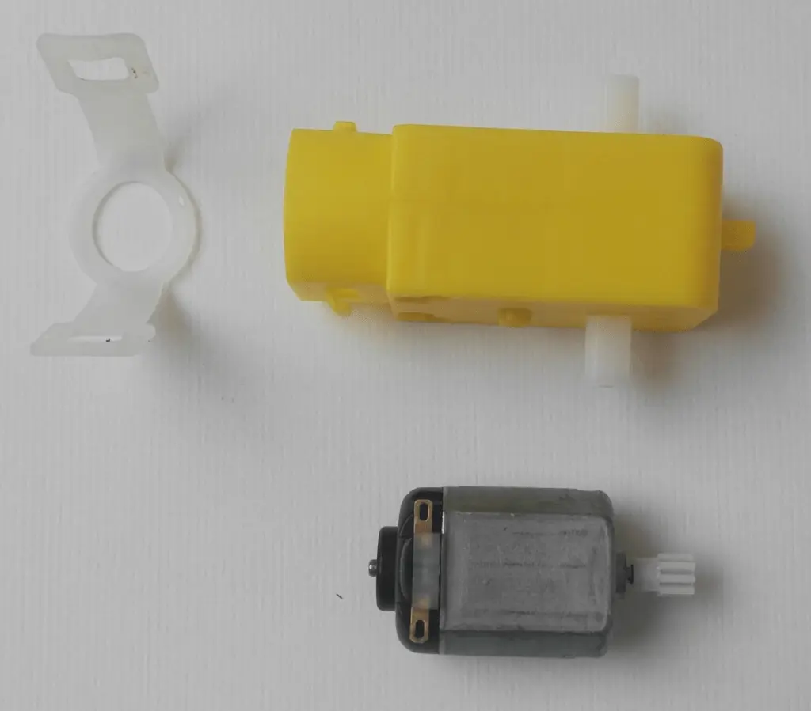
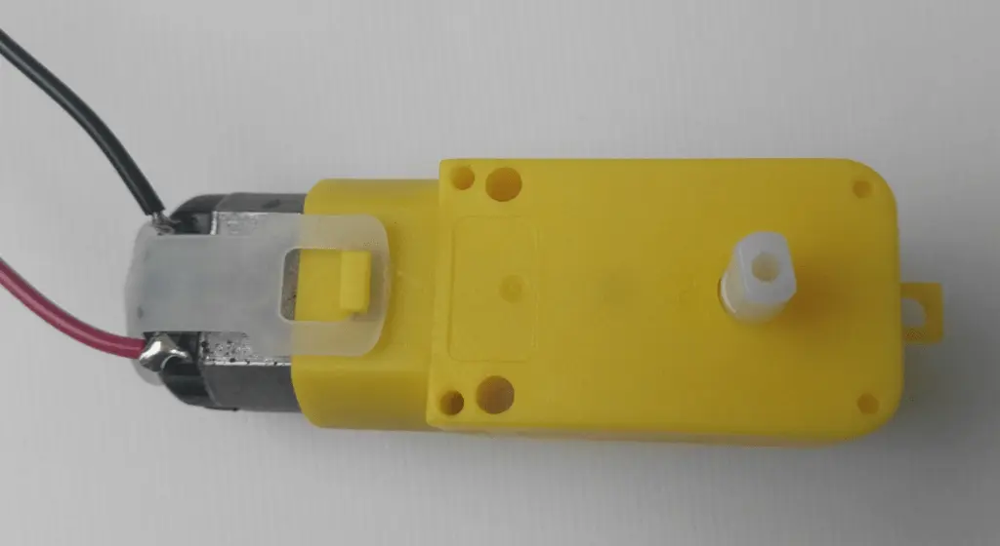
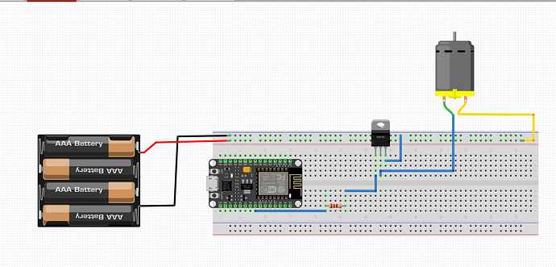

<!--
https://www.instructables.com/DIY-Motor-Driver-With-ESP32-Controller/

## aggiungere parte e software con LM398!!## aggiungere parte e software con LM398!!## aggiungere parte e software con LM398!!## aggiungere parte e software con LM398!!## aggiungere parte e software con LM398!!## aggiungere parte e software con LM398!!## aggiungere parte e software con LM398!!## aggiungere parte e software con LM398!!## aggiungere parte e software con LM398!!## aggiungere parte e software con LM398!!## aggiungere parte e software con LM398!!## aggiungere parte e software con LM398!!## aggiungere parte e software con LM398!!## aggiungere parte e software con LM398!!## aggiungere parte e software con LM398!!## aggiungere parte e software con LM398!!## aggiungere parte e software con LM398!!## aggiungere parte e software con LM398!!## aggiungere parte e software con LM398!!## aggiungere parte e software con LM398!!## aggiungere parte e software con LM398!!## aggiungere parte e software con LM398!!## aggiungere parte e software con LM398!!## aggiungere parte e software con LM398!!## aggiungere parte e software con LM398!!## aggiungere parte e software con LM398!!## aggiungere parte e software con LM398!!## aggiungere parte e software con LM398!!## aggiungere parte e software con LM398!!## aggiungere parte e software con LM398!!## aggiungere parte e software con LM398!!## aggiungere parte e software con LM398!!## aggiungere parte e software con LM398!!## aggiungere parte e software con LM398!!## aggiungere parte e software con LM398!!## aggiungere parte e software con LM398!!## aggiungere parte e software con LM398!!## aggiungere parte e software con LM398!!## aggiungere parte e software con LM398!!## aggiungere parte e software con LM398!!## aggiungere parte e software con LM398!!## aggiungere parte e software con LM398!!
++++++++++++++++++++++
-->


Questo è il driver del motore più semplice che potrebbe essere costruito utilizzando un solo transistor NPN, che è controllato e guidato dalla scheda micro controller ESP32.

> *Un motore DC (motore a corrente continua) è un dispositivo elettromeccanico estremamente diffuso nella automazione di fabbrica, nella robotica e nella elettronica di consumo. Riesce a convertire l'energia elettrica in energia meccanica ed è costituito da una combinazione di componenti elettrici e magnetici che consentono il movimento rotatorio.
<br>Un motore a corrente continua è costituito da due componenti principali: Statore e Rotore. Lo statore è la parte fissa del motore ed è composto da un magnete permanente e da una serie di avvolgimenti di filo di rame, che creano un campo magnetico stazionario. Il rotore è la parte mobile del motore, anch'esso contiene degli di avvolgimenti (noti come avvolgimenti del rotore), che creano un campo magnetico aggiuntivo. La interazione tra i due campi magnetici di statore e rotore permette di creare il movimento di rotazione.*


## Materiali e componenti

- Microcontrollore ESP32
- Motore a corrente continua
- Transistor BC337
- Resistenza da 100Ω
- Diodo N4148
- connettori Dupont
- Breadboard


## Collegamento del segnale
Collegare una resistenza da 100Ω al pin di base (centrale) del transistor NPN per proteggere la scheda EPS32 da sovratensione, quindi collegarla in serie a D5

## La alimentazione
Collegare il pin del collettore (a destra) a terra.
Collegare il perno dell'emettitore (a sinistra) al perno positivo del diodo per uso generale.
Collegare il pin negativo del diodo general purpose a 3.3 V.

## Il motore DC
Collegare il motore DC
Collegare uno dei pin a entrambe le estremità del diodo.
L'ordine non ha importanza, cambia solo la rotazione che è arbitraria e può essere codificata come alta attiva o bassa attiva.
Nella immagine in basso il motore elettrico *smontato*, come si vede si tratta del solito motorino economico che troviamo in molti gadget e giocattoli. 



<br>
<br>

In questa immagine invece vediamo il motorino con il moltiplicatore collegato per aumentare la coppia e i due fili per il collegamento. La polarità dei due fili rosso e nero non ha particolare importanza nel nostro progettino didattico, ma per applicazioni più complesse si dovrebbe sempre fare attenzione alla polarità e al verso di rotazione.



## Lo schema elettrico



## Il programma

Scegliere ESP32 come la scheda sotto strumenti,e collegarlo. Scegli la porta USB corrispondente etichettata ESP32, quindi carica il seguente codice sulla scheda.


## Il codice completo

```bash
const int motorPin = 5;
void setup()
{
  pinMode(motorPin, OUTPUT);
}
void loop()
{
   motorOnThenOff();
}
void motorOnThenOff()
{
  int onTime = 3000;
  int offTime = 3000; 
  digitalWrite(motorPin, HIGH); 
  delay(onTime);     
  digitalWrite(motorPin, LOW);  
  delay(offTime);               
}
```

<br>
<br>
<p style="font-size: 0.80em;">Robotdazero.it - post - R.160.0.5.1</p>