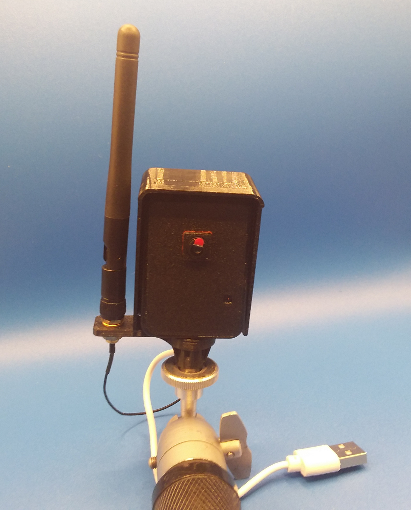

<hr>

```bash
https://play.google.com/store/apps/details?id=com.overlook.android.fing&hl=en&gl=US&pli=1

```


## Usiamo la ESP32 Cam per ESP32 per sorvegliare i punti sensibili

La ESP32 nella versione con la OV2640 CAM è una completa fotocamera digitale a colori con risoluzione di 2 megapixel. È piuttosto economica: la potete trovare su Amazon /trovi il link in basso tra i materiali ncessari) o a prezzi ancora più bassi su Aliexpress. Può essere usata per una vasta gamma di applicazioni, tra cui il monitoraggio di corridoi, accessi, luogi bui perche è dotata di un LED interno autonomo. Si può connettere al WI-fi senza necessità di inserire la password nel programma ma usando il Wi-Fi Manager per caricare da interfaccia Web qualunque rete vogliate utilizzare.

Per sorvegliare zone multiple potete acquistare più esemplari della CAM ed ognuno di essi sarà in grado di ottenere il suo indirizzo IP dal router fino ad un massimo di 128 telecamere. Per installazioni "interne" potete semplicemente adoperare la scheda "al naturale" ma per installazioni su balconi o nel prospetto dei "villini" in campagna ti suggerisco di utilizzare un piccolo box di derivazione tipo eletticista oppure di acquistare nel nostro ecommerce il case in 3D progettato appositamente per ottenere il minimo ingombro e la massima discrezione.


### Materiali necessari

Per realizzare il progetto avrai bisogno dei seguenti materiali:

- Una <a href="https://amzn.to/3MRTOs3" target="_blank" rel="noopener">ESP32 Cam</a> con fotocamera OV2640
- Un adattatore USB per la presa accendisigari della vettura
- Una scheda SD-card da almeno 16GB


### Come usare la scheda

- Formatta la SD-card usando il tuo PC
- Inserisci la SD-card nella feritoia della Cam
- Collega la fotocamera alla presa accendisigari della vettura
- La Cam si accenderà immediatamente
- Posiziona la fotocamera in modo che possa inquadrare il parabrezza e parte dei finestrini


In questo modo le foto della Cam saranno registrate ogni 15 secondi sulla SD-card in una directory chiamata "img". Questo vi permetterà di vedere i movimenti delle persone quando la vettura é parcheggiata. Il programma utilizza alcuni "trucchi" per minimizzare il consumo della ESP32, in particolare utilizza la modalità <a href="https://docs.espressif.com/projects/esp-idf/en/latest/esp32/api-reference/system/sleep_modes.html" target="_blank" rel="noopener">deep sleep</a> della scheda. In questo modo viene disabilito brevemente il WIFI, il Bluetooth e la <a href="https://docs.espressif.com/projects/esp-idf/en/latest/esp32/api-reference/peripherals/touch_pad.html" target="_blank" rel="noopener">funzione touchpad</a> di alcuni piedini. In questa modalità l'ESP32 consuma appena 1~2 mA contro i circa 130~150 mA della scheda in condizioni normali.

La scheda va a "dormire" per 10 secondi e si risveglia giusto il tempo necessario per scattare la foto. Senza questo accorgimento probabilmente la batteria della macchina potrebbe scaricarsi. Se non vuoi in nessun caso la batteria della vettura puoi usare un power bank da 20000 mAh, in grado di fare funzionare la Cam per 8/10 ore. 



Se avete installato PltformIO sul vostro PC potete compilare l'intero ptogramma facendo copia e incolla delle quattro righe sottostanti e premendo il tasto "INVIO" su PowerShell di Windows o sul terminale di Linux

```bash
git clone https://github.com/sebadima/spyder-cam.git
cd spyder-cam
make upload
platformio device monitor --baud 115200  --rts 0 --dtr 0 --port /dev/ttyUSB0
```
se tutto è andato correttamente dovreste vedere il seguente LOG con i passi dettagliati della compilazione 

```bash
Verbose mode can be enabled via `-v, --verbose` option
CONFIGURATION: https://docs.platformio.org/page/boards/espressif32/esp32cam.html
PLATFORM: Espressif 32 (6.4.0) > AI Thinker ESP32-CAM
HARDWARE: ESP32 240MHz, 320KB RAM, 4MB Flash
DEBUG: Current (cmsis-dap) External (cmsis-dap, esp-bridge, esp-prog, iot-bus-jtag, jlink, minimodule, olimex-arm-usb-ocd, olimex-arm-usb-ocd-h, olimex-arm-usb-tiny-h, olimex-jtag-tiny, tumpa)
PACKAGES: 
 - framework-arduinoespressif32 @ 3.20011.230801 (2.0.11) 
 - tool-esptoolpy @ 1.40501.0 (4.5.1) 
 - toolchain-xtensa-esp32 @ 8.4.0+2021r2-patch5
Converting CameraWebServer.ino
LDF: Library Dependency Finder -> https://bit.ly/configure-pio-ldf
LDF Modes: Finder ~ deep+, Compatibility ~ soft
Found 36 compatible libraries
Scanning dependencies...
Dependency Graph
|-- ESP Async WebServer @ 1.2.3+sha.f71e3d4
|-- WiFiManager @ 2.0.16-rc.2+sha.b1720d2
|-- WiFi @ 2.0.0
|-- Update @ 2.0.0
|-- WebServer @ 2.0.0
|-- DNSServer @ 2.0.0
Building in release mode
Compiling .pio/build/esp32cam/src/CameraWebServer.ino.cpp.o
Retrieving maximum program size .pio/build/esp32cam/firmware.elf
Checking size .pio/build/esp32cam/firmware.elf
Advanced Memory Usage is available via "PlatformIO Home > Project Inspect"
RAM:   [==        ]  22.0% (used 72212 bytes from 327680 bytes)
Flash: [=====     ]  51.8% (used 1629385 bytes from 3145728 bytes)
```


## Il programma da caricare sulla ESP32

```bash
#include "esp_camera.h"
#include <WiFi.h>
#include <WiFiManager.h>

// ===================
// Select camera model
// ===================

//#define CAMERA_MODEL_WROVER_KIT // Has PSRAM
//#define CAMERA_MODEL_ESP_EYE // Has PSRAM
//#define CAMERA_MODEL_ESP32S3_EYE // Has PSRAM
//#define CAMERA_MODEL_M5STACK_PSRAM // Has PSRAM
//#define CAMERA_MODEL_M5STACK_V2_PSRAM // M5Camera version B Has PSRAM
//#define CAMERA_MODEL_M5STACK_WIDE // Has PSRAM
//#define CAMERA_MODEL_M5STACK_ESP32CAM // No PSRAM
//#define CAMERA_MODEL_M5STACK_UNITCAM // No PSRAM
//#define CAMERA_MODEL_TTGO_T_JOURNAL // No PSRAM
//#define CAMERA_MODEL_XIAO_ESP32S3 // Has PSRAM
//#define CAMERA_MODEL_ESP32_CAM_BOARD
//#define CAMERA_MODEL_ESP32S2_CAM_BOARD
//#define CAMERA_MODEL_ESP32S3_CAM_LCD
//#define CAMERA_MODEL_DFRobot_FireBeetle2_ESP32S3 // Has PSRAM
//#define CAMERA_MODEL_DFRobot_Romeo_ESP32S3 // Has PSRAM
#define CAMERA_MODEL_AI_THINKER // Has PSRAM

#include "camera_pins.h"

void startCameraServer();
void setupLedFlash(int pin);


void setup() {
  Serial.begin(115200);
  Serial.setDebugOutput(true);
  Serial.println();

  camera_config_t config;
  config.ledc_channel = LEDC_CHANNEL_0;
  config.ledc_timer = LEDC_TIMER_0;
  config.pin_d0 = Y2_GPIO_NUM;
  config.pin_d1 = Y3_GPIO_NUM;
  config.pin_d2 = Y4_GPIO_NUM;
  config.pin_d3 = Y5_GPIO_NUM;
  config.pin_d4 = Y6_GPIO_NUM;
  config.pin_d5 = Y7_GPIO_NUM;
  config.pin_d6 = Y8_GPIO_NUM;
  config.pin_d7 = Y9_GPIO_NUM;
  config.pin_xclk = XCLK_GPIO_NUM;
  config.pin_pclk = PCLK_GPIO_NUM;
  config.pin_vsync = VSYNC_GPIO_NUM;
  config.pin_href = HREF_GPIO_NUM;
  config.pin_sccb_sda = SIOD_GPIO_NUM;
  config.pin_sccb_scl = SIOC_GPIO_NUM;
  config.pin_pwdn = PWDN_GPIO_NUM;
  config.pin_reset = RESET_GPIO_NUM;
  config.xclk_freq_hz = 2000000;
  config.frame_size = FRAMESIZE_UXGA;
  config.pixel_format = PIXFORMAT_JPEG; // for streaming
  //config.pixel_format = PIXFORMAT_RGB565; // for face detection/recognition
  config.grab_mode = CAMERA_GRAB_WHEN_EMPTY;
  config.fb_location = CAMERA_FB_IN_PSRAM;
  config.jpeg_quality = 12;
  config.fb_count = 10;

  // if PSRAM IC present, init with UXGA resolution and higher JPEG quality
  //                      for larger pre-allocated frame buffer.
  if (config.pixel_format == PIXFORMAT_JPEG) {
    if (psramFound()) {
      config.jpeg_quality = 10;
      config.fb_count = 2;
      config.grab_mode = CAMERA_GRAB_LATEST;
    } else {
      // Limit the frame size when PSRAM is not available
      config.frame_size = FRAMESIZE_SVGA;
      config.fb_location = CAMERA_FB_IN_DRAM;
    }
  } else {
    // Best option for face detection/recognition
    config.frame_size = FRAMESIZE_240X240;
    #if CONFIG_IDF_TARGET_ESP32S3
    config.fb_count = 2;
    #endif
  }

  #if defined(CAMERA_MODEL_ESP_EYE)
  pinMode(13, INPUT_PULLUP);
  pinMode(14, INPUT_PULLUP);
  #endif

  // camera init
  esp_err_t err = esp_camera_init( & config);
  if (err != ESP_OK) {
    Serial.printf("Camera init failed with error 0x%x", err);
    return;
  }

  sensor_t * s = esp_camera_sensor_get();
  // initial sensors are flipped vertically and colors are a bit saturated
  if (s -> id.PID == OV3660_PID) {
    s -> set_vflip(s, 1); // flip it back
    s -> set_brightness(s, 1); // up the brightness just a bit
    s -> set_saturation(s, -2); // lower the saturation
  }
  // drop down frame size for higher initial frame rate
  if (config.pixel_format == PIXFORMAT_JPEG) {
    s -> set_framesize(s, FRAMESIZE_QVGA); // old value
    s -> set_framesize(s, FRAMESIZE_VGA);
  }

  #if defined(CAMERA_MODEL_M5STACK_WIDE) || defined(CAMERA_MODEL_M5STACK_ESP32CAM)
  s -> set_vflip(s, 1);
  s -> set_hmirror(s, 1);
  #endif

  #if defined(CAMERA_MODEL_ESP32S3_EYE)
  s -> set_vflip(s, 1);
  #endif

  // Setup LED FLash if LED pin is defined in camera_pins.h
  #if defined(LED_GPIO_NUM)
  setupLedFlash(LED_GPIO_NUM);
  #endif

  WiFi.mode(WIFI_STA); // explicitly set mode, esp defaults to STA+AP
  // it is a good practice to make sure your code sets wifi mode how you want it.

  Serial.begin(115200);

  //WiFiManager, Local intialization. Once its business is done, there is no need to keep it around
  WiFiManager wm;

  // reset settings - wipe stored credentials for testing
  // these are stored by the esp library
  // wm.resetSettings();

  // Automatically connect using saved credentials,
  // if connection fails, it starts an access point with the specified name ( "AutoConnectAP"),
  // if empty will auto generate SSID, if password is blank it will be anonymous AP (wm.autoConnect())
  // then goes into a blocking loop awaiting configuration and will return success result

  bool res;
  // res = wm.autoConnect(); // auto generated AP name from chipid
  // res = wm.autoConnect("AutoConnectAP"); // anonymous ap
  res = wm.autoConnect("AutoConnectAP", "password"); // password protected ap

  if (!res) {
    Serial.println("Failed to connect");
    // ESP.restart();
  } else {
    //if you get here you have connected to the WiFi
    Serial.println("Connected...yeey :)");
  }

  startCameraServer();

  Serial.print("Camera Ready! Use 'http://");
  Serial.print(WiFi.localIP());
  Serial.println("' to connect");
}

void loop() {
}
```


### Come caricare il programma usando l'IDE di Arduino

Per compilare e caricare un programma usando l'Arduino IDE, è necessario seguire questi passaggi:

- Apri l'Arduino IDE.
- Crea un nuovo progetto o aprite un progetto esistente.
- Inserisci il codice del programma nel file .ino.
- Collega la scheda Arduino al computer.
- Seleziona la scheda Arduino dal menu Strumenti.
- Fai clic sul pulsante Compila.

Se la compilazione è andata a buon fine, il pulsante Carica diventerà attivo.
Fai clic sul pulsante Carica per caricare il programma sulla scheda Arduino.

##### Passaggio 1: Aprire l'Arduino IDE

Per aprire l'Arduino IDE, è possibile fare doppio clic sull'icona dell'applicazione sul desktop. Se non hai ancora installato l'Arduino IDE, puoi scaricarlo dal sito web di Arduino.

##### Passaggio 2: Creare un nuovo progetto o aprire un progetto esistente

Per creare un nuovo progetto, fai clic sul menu File e selezionate Nuovo. Per aprire un progetto esistente, fai clic sul menu File e seleziona Apri.

##### Passaggio 3: Inserisci il codice del programma nel file .ino

Il file .ino è il file di testo che contiene il codice del programma. Per inserire il codice del programma nel file .ino, potete utilizzare un editor di testo qualsiasi.

##### Passaggio 4: Collegare la scheda Arduino al computer

Per collegare la scheda Arduino al computer, è necessario utilizzare un cavo USB. La porta USB della scheda Arduino è contrassegnata con il simbolo USB.

#####  Passaggio 5: Seleziona la scheda Arduino dal menu Strumenti

Per selezionare la scheda Arduino dal menu Strumenti, fai clic sul menu Strumenti e seleziona la scheda Arduino che avete collegato al computer.

##### Passaggio 6: Fai clic sul pulsante Compila

Per compilare il programma, fai clic sul pulsante Compila. Se la compilazione è andata a buon fine, non verranno visualizzati errori nella finestra del terminale.

##### Passaggio 7: il pulsante Carica diventerà attivo

Se la compilazione è andata a buon fine, il pulsante Carica diventerà attivo.

##### Passaggio 8: Fare clic sul pulsante Carica

Per caricare il programma sulla scheda Arduino, fai clic sul pulsante Carica. Il programma verrà copiato sulla scheda Arduino e inizierà a funzionare.


### Come caricare il programma usando PlatformIO

Per compilare e caricare un programma usando <a href="https://platformio.org/install/ide?install=vscode" target="_blank" rel="noopener">PlatformIO</a>, è necessario seguire questi passaggi:

- Installare PlatformIO. Per fare ciò, è possibile utilizzare il gestore di pacchetti del proprio IDE.
- Creare un nuovo progetto. Per fare ciò, è possibile utilizzare la funzione "New Project" del proprio IDE.
- Scrivere il codice del programma.
- Compilare il programma. Per fare ciò, è possibile utilizzare il comando "PlatformIO Build" del proprio IDE.
- Caricare il programma sulla scheda. Per fare ciò, è possibile utilizzare il comando "PlatformIO Upload" del proprio IDE.

##### Passaggio 1: Installare PlatformIO

Per installare PlatformIO, è possibile utilizzare il gestore di pacchetti del proprio IDE. Per esempio, se si utilizza Visual Studio Code, è possibile aprire la barra laterale di Extensions e cercare "PlatformIO IDE". Una volta trovata l'estensione, è possibile installarla facendo clic sul pulsante "Install".

##### Passaggio 2: Creare un nuovo progetto

Per creare un nuovo progetto, è possibile utilizzare la funzione "New Project" del proprio IDE. Per esempio, in Visual Studio Code, è possibile aprire la barra laterale di Projects e fare clic sul pulsante "New Project".

Nella finestra di dialogo "New Project", è necessario selezionare il tipo di progetto da creare. Per i progetti Arduino, è necessario selezionare "Arduino". È inoltre necessario selezionare la scheda Arduino da utilizzare.

##### Passaggio 3: Scrivere il codice del programma

Una volta creato il progetto, è possibile scrivere il codice del programma. Il codice può essere scritto in qualsiasi linguaggio supportato da PlatformIO, tra cui C/C++, Python, JavaScript e TypeScript.

Per esempio, ecco un semplice programma Arduino che fa lampeggiare un LED:


```bash
#include <Arduino.h>

void
 
setup()
 
{
  pinMode(LED_BUILTIN, OUTPUT);
}

void
 
loop()
 
{
  digitalWrite(LED_BUILTIN, HIGH);
  delay(1000);
  digitalWrite(LED_BUILTIN, LOW);
  delay(1000);
}
```

##### Passaggio 4: Compilare il programma

Una volta scritto il codice del programma, è possibile compilarlo. Per fare ciò, è possibile utilizzare il comando "PlatformIO Build" del proprio IDE.

In Visual Studio Code, è possibile eseguire il comando "PlatformIO Build" premendo la scorciatoia da tastiera Ctrl+Shift+B.

##### Passaggio 5: Caricare il programma sulla scheda

Una volta compilato il programma, è possibile caricarlo sulla scheda. Per fare ciò, è possibile utilizzare il comando "PlatformIO Upload" del proprio IDE.

In Visual Studio Code, è possibile eseguire il comando "PlatformIO Upload" premendo la scorciatoia da tastiera Ctrl+Shift+U.

Una volta caricato il programma sulla scheda, esso inizierà ad eseguire.


### Usare PlatformIO dalla linea di comando

Se usate come facciamo noi PlatformIO dalla linea di comando dovrete inserire nel file platformio.ini il seguente codice:


```bash
; PlatformIO Project Configuration File
;
;   Build options: build flags, source filter
;   Upload options: custom upload port, speed and extra flags
;   Library options: dependencies, extra library storages
;   Advanced options: extra scripting
;
; Please visit documentation for the other options and examples
; https://docs.platformio.org/page/projectconf.html

[env:esp32cam]
platform = espressif32
board = esp32cam
framework = arduino
monitor_speed=115200
lib_ldf_mode=deep
build_flags =
   -I../lib/esp32-camera

lib_deps =
  esp32-camera
```


#### Conclusione

Dopo avere superato lo scoglio della formattazione e della compilazione puoi usare il progetto semplicemente collegandola la scheda alla presa accendisigari. In questo modo avrai a disposizione un sistema di controllo super economico.
La ESP32 con la camera OV2640 ti permetterà di salvare le immagini dell'esterno vettura e di usarle come prova per atti vandalici.

<br>
<br>
<p style="font-size: 0.80em;">Robotdazero.it - post - R.162.0.5.0</p>
