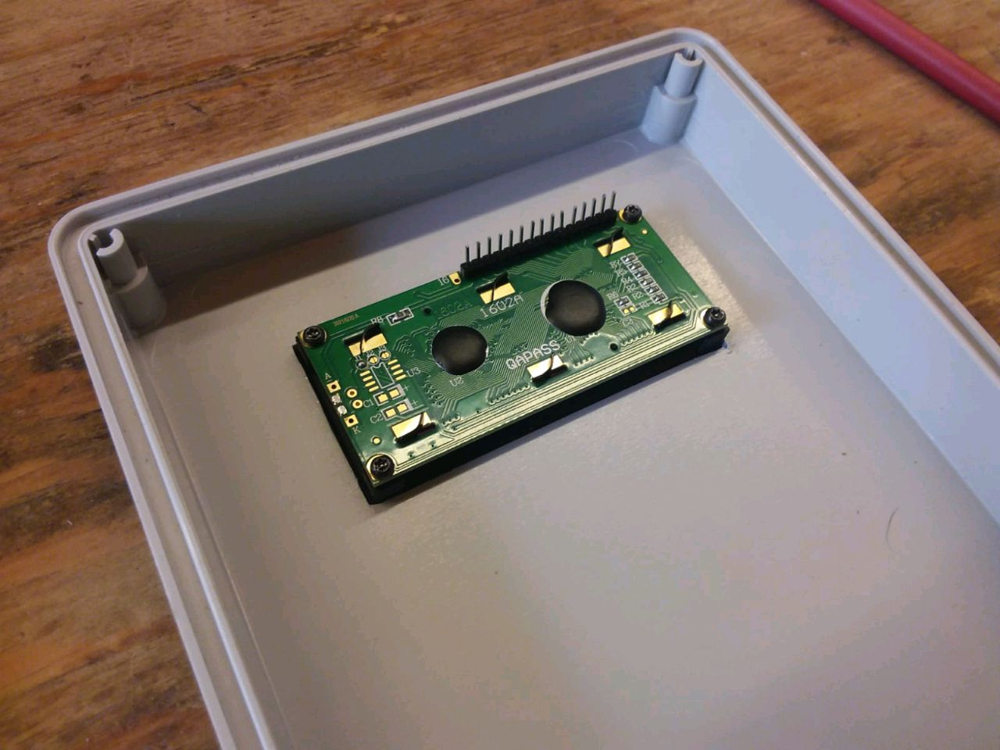
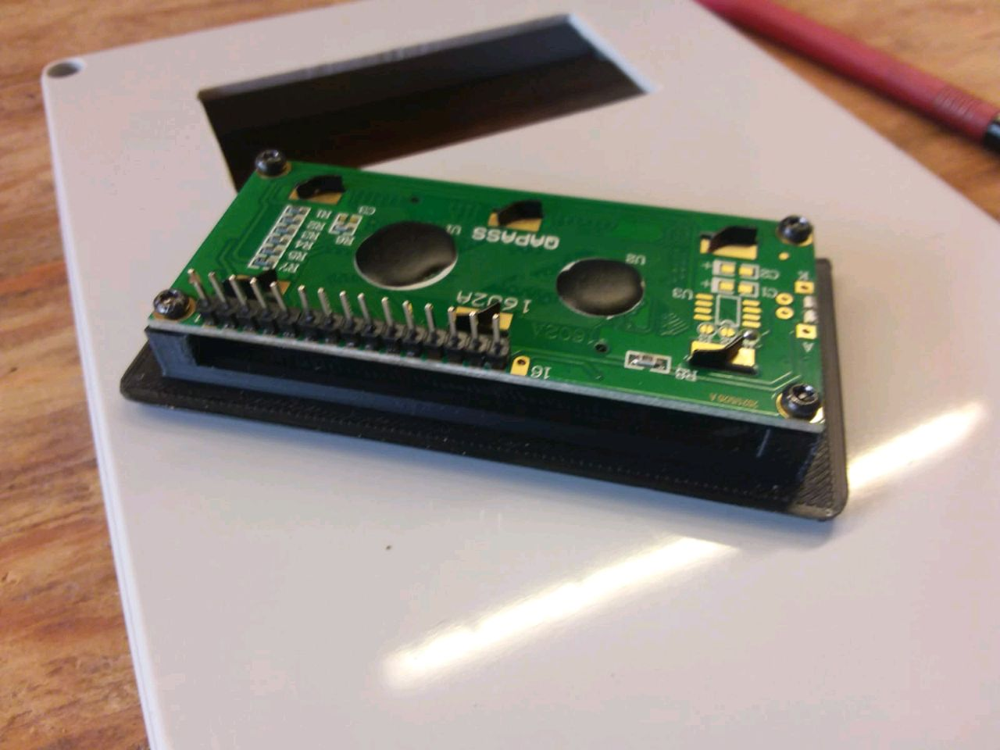
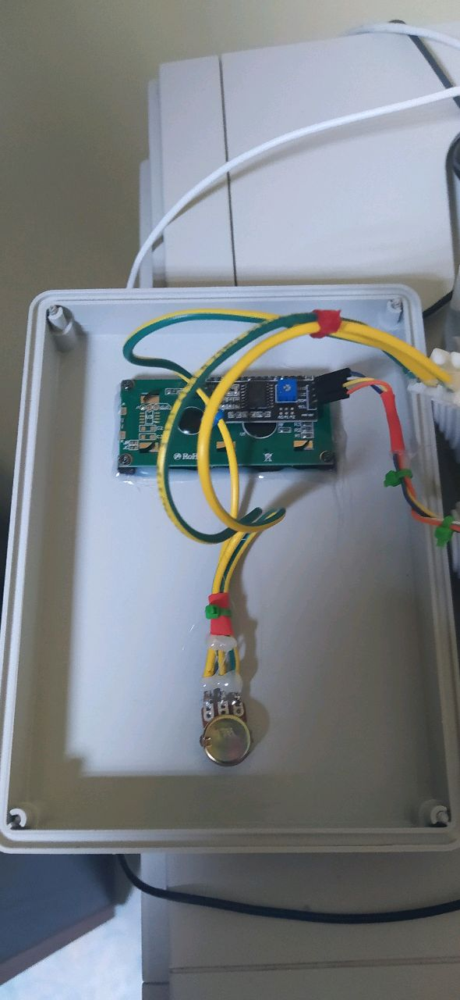
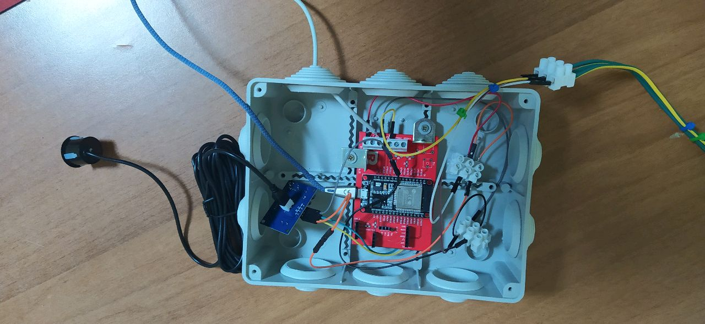
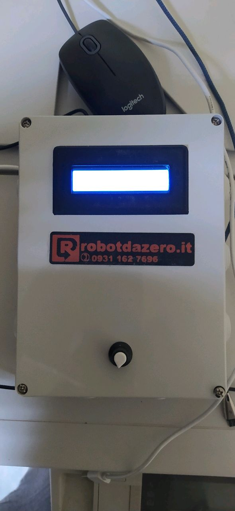
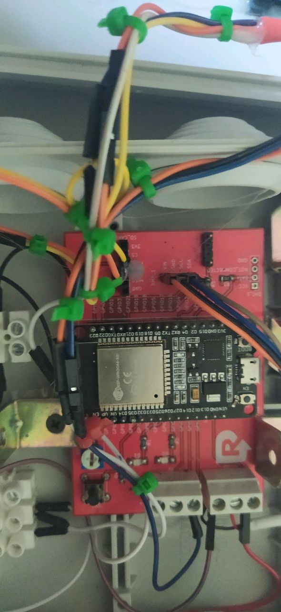
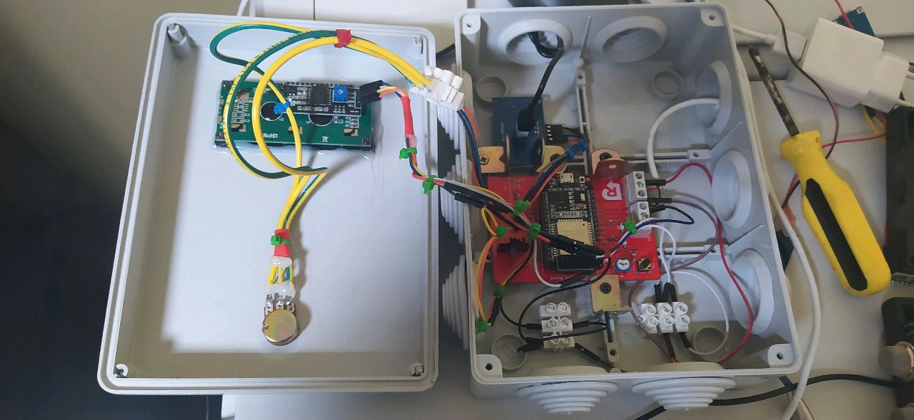
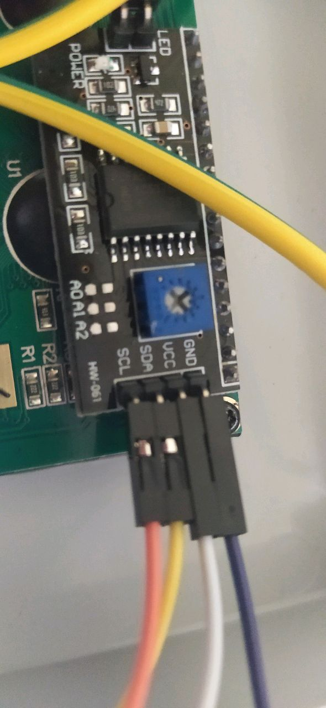

 

#### Un semplice progetto con ESP32 o Arduino per leggere in tempo reale il livello dei liquidi in un serbatoio. Useremo un sensore ad ultrasuoni ANGEEK JSN-SR04T con portata max di circa 3.5 mt e un normale display LCD. 

Per impermeabilizzare il box in plastica di provenienza commerciale useremo una cornicetta stampata in PETG 3D e collegheremo i dispositivi usando la interfaccia di "rete" I2C dell'ESP32. Il progetto completo è disponibile in kit oppure già montato e collaudato nel nostro ecommerce

 
 

jjjjj

bb

cc

dd

ee

ff

 
 
Dettaglio dell'ESP32 con la nostra basetta in colore rosso con connessioni I2C e mammut per collegare la alimentazione ed eventualmente un partitore di tensione. I minuscoli led gialli (spenti nella foto) sono in formato SMD da montare con una pistola ad aria calda e flussante. 
 
 
 
 

