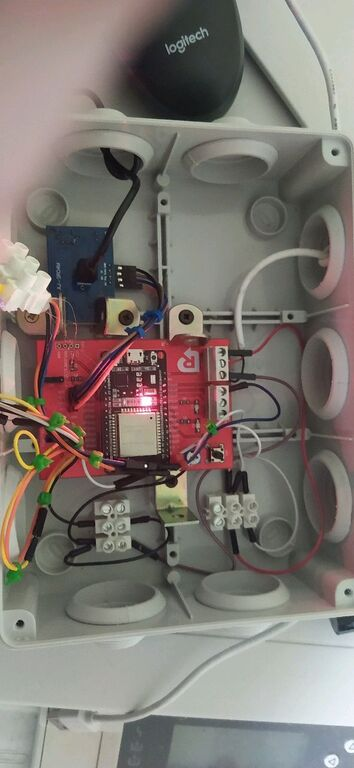
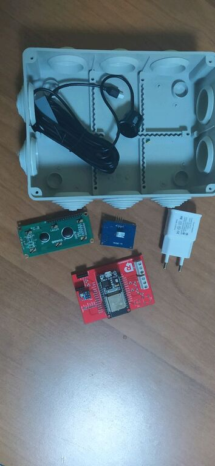
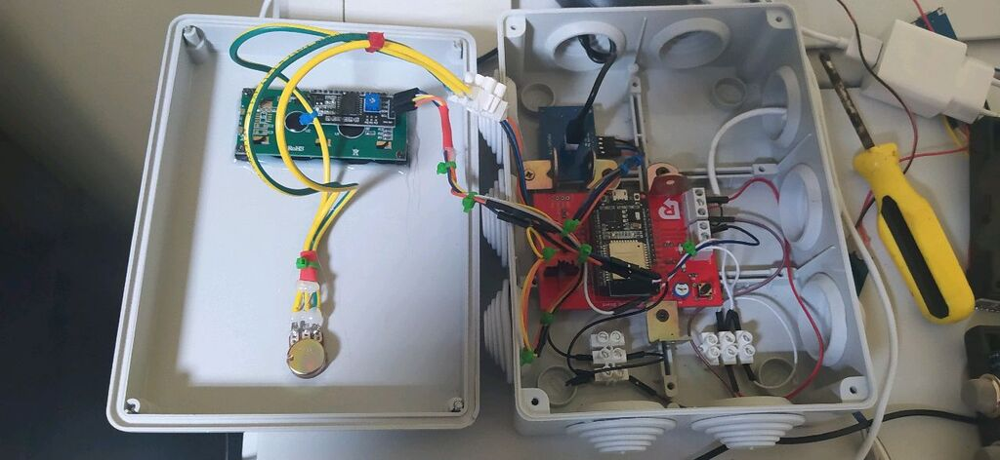
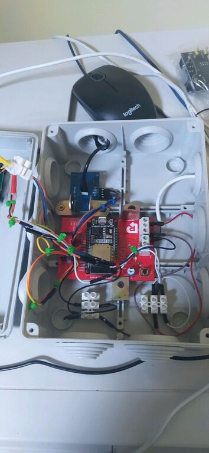
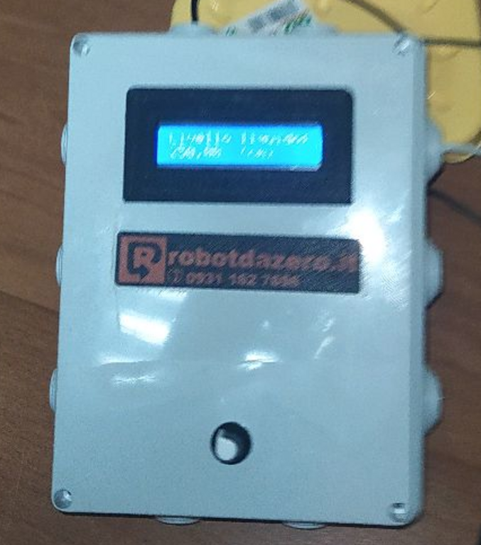
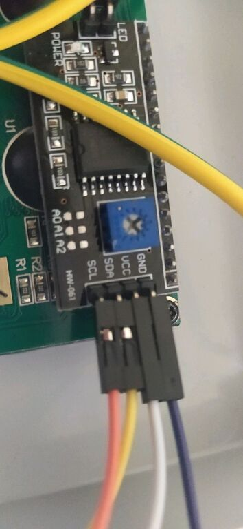
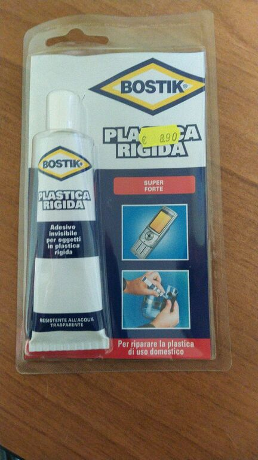
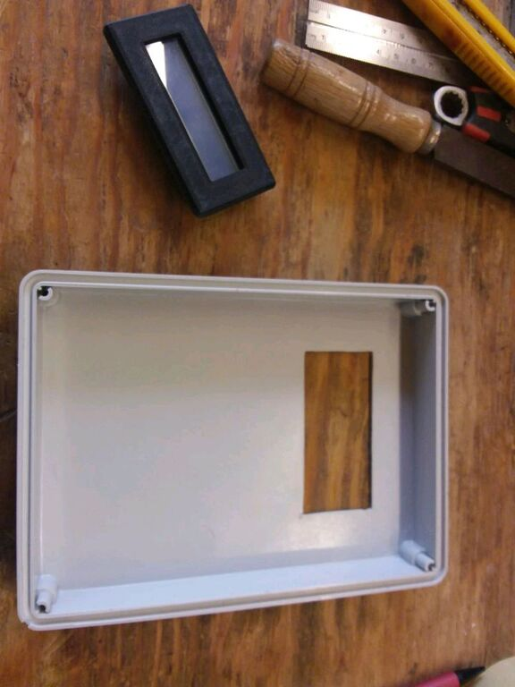

 

#### Un semplice progetto con ESP32 o Arduino per leggere in tempo reale il livello dei liquidi in un serbatoio. Useremo un sensore ad ultrasuoni ANGEEK JSN-SR04T con portata max di circa 3.5 mt e un normale display LCD. 

Questo hardware minimale serve a controllare la profondità di un serbatoio fino a circa 4 metri di altezza e a mostrare in real time e in modo continuo il valore della colonna del liquido. Un aspetto interessante e la capacità di adattarsi alla quantità "iniziale" del liquido con una facile calibrazione dei sensori.
La routine di calibrazione per l'ESP32 è davvero semplice ma comunque interessante per chi vuole imparare a programmare con Arduino/Ep32 e vi consigliamo di scaricare il programma (free come sempre) dal nostro sito Gitbhub.
Nell'articolo troverete molte foto della realizzazione pratica e dell'assemblaggio sperimentale che abbiamo adottato per costruire box e circuito.
Dovendo lavorare in un ambiente sottoposto a perdite di liquidi (l'acqua non è amica della elettronica!) Abbiano provveduto a schermare la basetta dalle infiltrazioni usando una cornicetta in plastica PET costruita con la nostra stampante 3D.
Il resto del progetto è abbastanza semplice e ve lo consiglio se vi siete stufati delle solite cose tipo:come accendere un LED con arduino etc.
 
 

