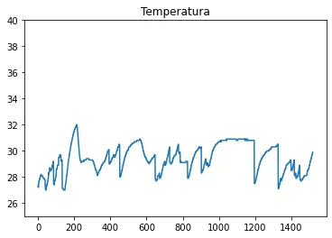

## LA QUALITÀ DELL'ARIA NEGLI AMBIENTI CHIUSI (IAQ)

La qualità dell'aria negli ambienti chiusi (IAQ) è la misura di quanto l'aria all'interno di un edificio sia sana da respirare. L'IAQ può essere influenzata da una serie di fattori, tra cui la presenza di inquinanti, la ventilazione e l'umidità.

Una buona IAQ è importante per la salute e il benessere di tutti coloro che trascorrono del tempo in un edificio. Una scarsa IAQ può causare una serie di problemi di salute, tra cui:

- Respirazione affannosa
- Tosse
- Mal di testa
- Stanchezza
- Occhi rossi e irritati
- Naso che cola
- Allergie

## I RIMEDI POSSIBILI

Esistono una serie di cose che possono essere fatte per migliorare l'IAQ in un edificio, tra cui:

- Ridurre l'esposizione a inquinanti, come fumo, gas di scarico, prodotti chimici e polvere.
- Aumentare la ventilazione, aprendo le finestre o utilizzando un sistema di ventilazione meccanica.
- Mantenere un livello di umidità adeguato, tra il 40% e il 60%.
- Pulire regolarmente l'edificio, in particolare i pavimenti, le pareti e i mobili.
- Utilizzare purificatori d'aria.

È importante prendere in considerazione la qualità dell'aria negli ambienti chiusi quando si sceglie un luogo in cui vivere, lavorare o studiare. Una buona IAQ può contribuire a migliorare la salute e il benessere di tutti coloro che trascorrono del tempo in un edificio.

Ecco alcuni suggerimenti aggiuntivi per migliorare l'IAQ in casa:

- Smetti di fumare in casa.
- Utilizza una cappa da cucina quando cucini.
- Pulisci regolarmente i filtri dell'aria condizionata e del riscaldamento.
- Evita di usare prodotti chimici aggressivi per la pulizia.
- Tieni le finestre chiuse quando fa freddo o umido fuori.
- Installa un purificatore d'aria.

## COME LA NOSTRA SCHEDA PUÒ MIGLIORARE LA TUA SICUREZZA

I sensori di 4/5 anni spesso controllavano singolarmente solo il monossido  di carbonio, i vapori di trielina], il fumo delle sigarette e altri gas nocivi separatamente. Se volevi misurare la presenza di tutti i gas pericolosi dovevi munirti di almeno 2/3 dispositivi separati.

Si possono controllare gli eccessi dell'aria condizionata nella tua casa/azienda?

Vuoi sapere se qualcuno sta spingendo a manetta i condizionatori nella tua azienda in barba alle recenti raccomandazioni del governo ?  
Vuoi capire se qualcuno sta volontariamente usando l'aria condizionata con le finestre aperte nella tua casa-vacanza, ad esempio e non vuoi perdere tempo a ispezionare di continuo?

Esiste un modo abbastanza preciso di capirlo

> **Se la pressione** e la umidità di una stanza coincidono con quelle esterne ma NON LA TEMPERATURA puoi scommettere che qualcosa di _tremendamente costoso_ accadrà alla tua bolletta dell&#8217;energia!

E inoltre come potresti  controllare se qualcuno sta usando l&#8217;aria condizionata a 18 gradi quando le temperatura ottimale non è mai inferiore ai 22 gradi? E soprattutto come controllare se lo ha fatto nei giorni o mesi precedenti?

 

**Fino ad oggi non hai potuto controllare tutto questo  a prezzi ragionevoli**, ma dal 2022 con i nuovi microsensori a basso costo e bassissimo consumo puoi farlo. E seppure non siamo i soli ad averli adottati (su Amazon trovi alternative similari) crediamo di poterti offrire dei vantaggi irrinunciabili!

<h3 style="text-align: center;">
  La tabella completa dei gas rilevati dalla scheda:
</h3>

  * Propano,
  * Metano,
  * Butano,
  * vapori di Alcool,
  * vapori di Trielina,
  * fumo di sigaretta,
  * Idrocarburi aromatici,
  * Monossido di Carbonio

e inoltre:
Vuoi controllare se qualcuno fuma nella tua azienda o istituto in barba a ogni regolamento e magari vorresti scoprire in quale locale ci sono state le maggiori violazioni? Con la scheda</strong> sorveglianza di Robotdazero puoi controllare il livello di ogni parametro nei giorni e nei mesi passati!
