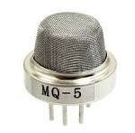

##### Come controllare la qualità dell&#8217;aria, l&#8217;abuso dell&#8217;aria condizionata, le fughe di tutti i gas infiammabili con un singolo prodotto accessibile da telefonino e da PC in ogni momento e in ogni luogo.

## Come la nostra scheda può migliorare la tua sicurezza

**1 – Attraverso il controllo dei gas esplodenti o infiammabili:**

Buona parte degli incidenti che accadono con metano o propano sarebbero evitabili se ogni abitazione si munisse di un rilevatore di fughe di gas! La scheda multi **sensore** di Robotdazero controlla propano, metano, butano e la presenza di vapori infiammabili e ti avvisa con una email in caso di problemi. Il dispositivo è in grado di rilevare anche la presenza di vapori di alcool.

**2 &#8211; Attraverso il controllo della qualità dell&#8217;aria:**

I sensori di 4/5 anni fa controllavano singolarmente solo il monossido  
di carbonio, i vapori di [trielina][1], il fumo delle sigarette e altri gas nocivi separatamente. Se volevi misurare la presenza di **tutti** i gas pericolosi dovevi munirti di almeno tre dispositivi separati e senza la App sul telefonino.

**3 &#8211; Controllando gli eccessi dell&#8217;aria condizionata nella tua casa/azienda:**

Vuoi sapere se qualcuno sta spingendo &#8220;a manetta&#8221; i condizionatori nella tua azienda in barba alle recenti raccomandazioni del governo ?  
Vuoi capire se qualcuno sta _volontariamente_ usando l&#8217;aria condizionata con le finestre aperte nella tua casa-vacanza, ad esempio e non vuoi perdere tempo a ispezionare di continuo?

Esiste un modo preciso di capirlo&#8230;

> **Se la pressione** e la umidità di una stanza coincidono con quelle esterne ma NON LA TEMPERATURA puoi scommettere che qualcosa di _tremendamente costoso_ accadrà alla tua bolletta dell&#8217;energia!

E inoltre come potresti  controllare se qualcuno sta usando l&#8217;aria condizionata a 18 gradi quando le temperatura ottimale non è mai inferiore ai 22 gradi? E soprattutto come controllare se lo ha fatto nei giorni o mesi precedenti?

**Fino ad oggi non hai potuto controllare tutto questo  a prezzi ragionevoli**, ma dal 2022 con i nuovi microsensori a basso costo e bassissimo consumo puoi farlo. E seppure non siamo i soli ad averli adottati (su Amazon trovi alternative similari) crediamo di poterti offrire dei vantaggi irrinunciabili!

<h3 style="text-align: center;">
  <strong>Perché dunque scegliere proprio NOI?</strong>
</h3>

Perché &#8220;fabbrichiamo&#8221; letteralmente le nostre schede e aggiungiamo i sensori necessari per la vostra casa/aziende senza farvi acquistare 3 o 4 centraline diverse. E ripariamo e assistiamo di persona le nostre schede senza spedirle a Milano come fanno i nostri concorrenti nel 99% dei casi. Spesso possiamo ripararle in 48 ore a costi molto bassi.

<h3 style="text-align: center;">
  La tabella completa dei gas rilevati dalla scheda:
</h3>

  * Propano,
  * Metano,
  * Butano,
  * vapori di Alcool,
  * vapori di Trielina,
  * fumo di sigaretta,
  * Idrocarburi aromatici,
  * Monossido di Carbonio

E INOLTRE:  
Vuoi controllare se qualcuno fuma nella tua azienda o istituto in barba a ogni regolamento e magari vorresti scoprire in quale locale ci sono state le maggiori violazioni?

> 

>   <strong>Con la scheda</strong> sorveglianza di Robotdazero puoi controllare il livello di ogni parametro nei giorni e nei mesi passati!
> 

## LA NOSTRA OFFERTA COMMERCIALE:

**Perchè dovresti comprare adesso e non domani**  
Il costo della energia elettrica sta letteralmente esplodendo e controllare gli abusi (magari dei tuoi figli adolescenti) sarebbe un _toccasana per le tue tasche_.  
**In breve, se acquisti la nostra [scheda completa][2] delle tre funzioni principali: qualità dell&#8217;aria, temperatura e umidità pagherai :**

###  87.00 euro I.C. comprendenti:

  * La installazione della scheda presso i tuoi locali,
  * la configurazione della rete WIFI per trasmettere i dati via Internet,
  * login e password per accedere alla nostra app,
  * il controllo iniziale della qualità dell&#8217; aria e la scelta della soglia di rischio (il valore che deve far scattare gli allarmi).

**E inoltre:**  
Se non sei soddisfatto ti rimborsiamo completamente la scheda entro 15 giorni senza obiezioni e senza cavilli!  
**Contattaci adesso via [WhatsApp][3]** oppure vai a questa [pagina][4] per farti richiamare entro 4 ore.

 [1]: https://ilsalvagente.it/2016/11/09/agenti-cancerogeni-nella-lista-entra-anche-il-virus-hiv-e-la-trielina/
 [2]: https://www.robotdazero.it/prodotto/centralina-di-controllo-della-qualita-dellaria/
 [3]: https://wa.me/message/TE75GBWRWBCEM1
 [4]: https://www.robotdazero.it/book/
