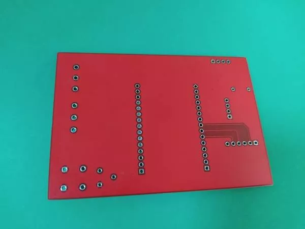
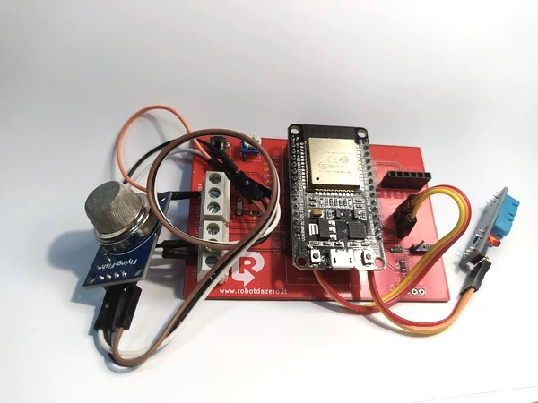

#### Da oggi puoi trovare sul nostro [ecommerce][1] il circuito stampato &#8220;ESP32 Multi Board&#8221;. Con questa PCB  puoi realizzare professionalmente tutti i nostri progetti e molti dei progetti per ESP32 che trovi in rete.

###### immagine con il retro del circuito stampato “Multifunzione” di Robotdazero

Potrai ad esempio costruire la  centralina di allarme per gas tossici o esplosivi che vedi qui sotto. Il progetto usa il sensore [MQT5][2] assieme al diffusissimo ed economico sensore di temperatura DHT11.

###### immagine della nostra centralina per il rilevamento dei gas con a sinistra il sensore MQ5 e a destra il sensore DHT11 in colore azzurro.

La scheda è espandibile con ulteriori 3 sensori o servocomandi e senza effettuare saldature. Ti basterà inserire i fili nella morsettiera che vedi a sinistra e avvitare! Se sei stanco delle breadboard e vuoi vendere i tuoi progetti devi necessariamente fornire un box e un assemblaggio solido con un circuito stampato.

Usa la nostra scheda Multifunzione e potrai assemblare le tue creazioni con delle modifiche minime o nessuna modifica. Come già detto potresti &#8211; in linea teorica &#8211; installare sensori e attuatori usando solamente  la doppia morsettiera a tre poli e sfuttando il circuito a doppia faccia per distribuire l&#8217; alimentazione di una presa USB.

La scheda Multifunzione prevede alloggiamenti per:

  * 2 LED a montaggio SMD
  * 5 resistenze SMD come pull up per i sensori
  * 1 alloggio per sensore BMP280
  * 1 alloggio per sensore DHT11
  * 1 alloggio pr lettore micro SD card Arduino e simili
  * 1 morsettiera con uscita a 3.3V, 5V e GND
  * 1 morsettiera con collegamento ai pin GPIO12, GPIO13 e GPIO14.

Gli alloggi per i sensori BMP280 e DHT11 sono ovviamente utilizzabili per qualsiasi dispositivo di I/O per ESP32 o Arduino. In ogni caso troverai le maschere serigrafate per collegare VIN, GND e il pin dati digitale o analogico.

Puoi saldare le resistenze di pullup nelle piazzole per SMD ma sempre più spesso si trovano già incorporate nei sensori. In tal caso non devi fare nulla: non devi saldare ponticelli o tagliare piste: la scheda riconosce il tipo di sensore e si limita ad usare la resistenza incorporata dal costruttore. Semplicissimo!

I pin **GPIO-21** e **GPIO-22** dell&#8217;ESP32 sono connessi nella piazzola **BMP_1** e permettono di implementare il protocollo [I2c][3]  per la comunicazione seriale tra due dispositivi. Si tratta del sistema più diffuso e semplice per connettere dispositivi nell&#8217;ecosistema dei controller e la sua diffusione si può paragonare solo a quelle dell&#8217;SPI. Anche i connettori per il [procotollo SPI][4] sono disponibili nella basetta e li puoi vedere nella piazzola marchiata **SD_CARD1**. Ovviamente non servono solo per la SDCard ma per ogni dispositivo (tipo display LCD) che usi i  4 fili previsti dal protocollo. Permette di collegare in rete fino a 128 dispositivi. Se volete usare questo versatile protocollo introdotto dalla Samsung sui suoi televisori date una occhiata alla sua [pagina][4] Wikipedia.

Vuoi dunque abbandonare i montaggi traballanti e liberarti dei fili volanti? Questa è l&#8217;occasione buona per farlo, vai sul nostro [ecommerce][5] e ordina la [scheda][1] ad un prezzo convenientissimo.

 [1]: https://www.robotdazero.it/prodotto/circuito-stampato-multifunzione-esp32/
 [2]: https://create.arduino.cc/projecthub/elbertshahzaib/mq5-gas-sensor-with-arduino-61351e?ref=part&ref_id=10308&offset=17
 [3]: https://it.wikipedia.org/wiki/I%C2%B2C
 [4]: https://it.wikipedia.org/wiki/Serial_Peripheral_Interface
 [5]: https://www.robotdazero.it/shop/
