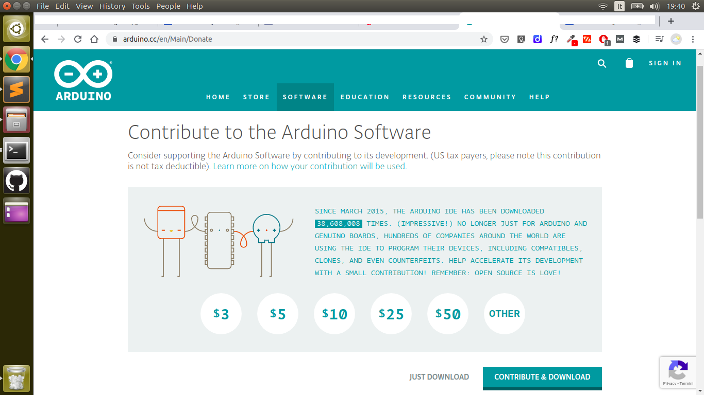

 

Come prima cosa devi scaricare il package adatto al tuo computer e perciò devi controllare se hai un PC a 32 o 64 bit. Probabilmente hai un PC a 64 bit perchè i 32 bit si trovano solo come “vecchio usato”, ma è sempre meglio controllare. Fatto questo, continua la installazione vai alla pagina di download sul sito di Arduino e leggi il resto del post per installare l’IDE su Windows, MAC e Linux.

 

> L’IDE di Arduino si può installare su tutte le versioni di Windows, compresa XP, Vista e Windows 7.

 
Se hai già controllato la versione (64 o 32 bit) del tuo PC, puoi andare alla pagina di <a href="https://www.arduino.cc/en/software">download</a> sul sito di Arduino.

Rintraccia la versione che devi scaricare, nel mio caso Windows a 64 bit, e ti ritroverai in una pagina che ti chiede di sostenere il sito con una cifra a tua scelta. Per il momento Premi “just download” e attendi la fine del download.

 

 
 

##### Alla fine del download inserisci la tua scheda Arduino nella presa USB  e attendi il caricamento dei driver su Windows 10, 8.1, 8.0

> Se hai Windows 7 o Vista o Xp dovrai aspettare il messaggio del sistema che ti chiede dove sono i driver. Per trovare i driver in ogni caso vai sulla cartella che hai scelto in precedenza e usa il file .inf nella cartella driver. 

 

Se hai problemi nella installazione e il sistema si rifiuta di rinoscere la porta USB di Arduino prova a riavviare il PC. Se i problemi persistono scollega il connettore per alcuni secondi, ricollegalo e ripeti la procedura.

### I driver per Windows 10

Dopo la installazione i driver dovrebbero essere già disponibili e nel momento in cui colleghi la scheda Arduino al PC non dovrebbero apparire messaggi di warning. Il sistema, infatti, avrà autonomamente provveduto a generare una porta COM virtuale che puoi trovare nella Gestione dispositivi.

Per controllare la porta virtuale, clicca con il tasto destro sul pulsante Start nella parte inferiore sinistra dello schermo, quindi seleziona Gestione dispositivi dal menu che appare.

Se espandi le porte (COM e LPT) in Gestione dispositivi, vedrai la porta COM collegata ad Arduino. Se il tuo PC, come probabile, ha altre porte COM, rimuovi l’Arduino a quel punto, controlla la porta COM che scompare dall’elenco: quindi ricollega Arduino per vedere quale porta riappare.

#### Cosa fare quando l’IDE va in crash con Windows 10
Le versioni di Arduino IDE precedenti alla beta1.9-BUILD-119 mandano in crash Windows 10. A volte accade quando parte il programma e altre volte durante la compilazione degli sketch. L’unica cosa da fare in questo caso è reinstallare l’IDE con la ultima versione disponibile sulla pagina di download del sito arduino.cc.

### Perchè non usare l’IDE fornito da Windows Store

Quando usate questa versione vi troverete l’eseguibile nella directory

    c:/utenti/nomeutente/AppData(directory nascosta)/Local/Packages

che non è ovviamente il massimo quando dovete fare debug, cercare i packages di Arduino, fare unzip di nuove librerie. Ci sono vari problemi con l’adattamento di Windows Store e non ci sono vantaggi rispetto ai programmi di installazione tradizionali e per questo motivo gli utenti più smaliziati la sconsigliano decisamente. Se la hai installata e vuoi rimuoverla vai sul pannello di controllo / disinstalla un programma e rimuovi la voce Arduino IDE qualunque versione appaia.

> Installa soltanto la versione “normale” dell’IDE di Arduino presa da arduino.cc o la versione portable se lavori con PC aziendali “locked”.

### Installare l’IDE di Arduino su MAC OS X

Scarica il file dalla solita pagina di download del sito di Arduino, fai doppio click e trascina la icona del programma nella cartella applicazioni. Se stai usando Arduino UNO o Arduino Mega 2560 la installazione è completa, mentre con versioni più vecchie tipo Diecimila, Duemilanove o Nano, devi installare i driver per la porta seriale. Nella immagine per disco troverai il file SerialDriver_10_4_10.pkg per la tua piattaforma, fai doppio click e segui le istruzioni per la installazione.
I Driver FTDI per MAC

In caso di problemi con vecchie versioni di MAC OS o di Arduino o se stai usando schede Arduino generiche comprate su Ebay, potrebbe essere risolutivo installare i driver FTDI per MAC.

Vai al sito FTDI e scarica il modulo più recente dei driver, quindi procedi in questo modo:

    1. Trova il sistema operativo del tuo MAC nella lista e clicca su download link.
    2. Sscarica il driver sul computer
    3. Aapril il file DMG
    4. Apri il file FTDIUSBSerial.pkg
    5. Il MAC ti chiederà la password di amministratore
    6. Clicca su “installa il software”
    7. Attendi la conclusione della installazione
    8. Guarda su Tools/Serial Port/ e dovresti vedere DEV/tty.usbmodem e DEV/cu.usbmodem

#### Come testare la installazione

Siamo pronti per provare il corretto funzionamento della scheda Arduino:

    1. Avvia l’IDE di Arduino
    2. Collega la scheda se non lo hai ancora fatto usando il cavetto USB
    3. Apri il programma (skectch) andando su: File> Esempi> 1.Basics> Blink
    4. Seleziona il tipo di scheda Arduino che stai utilizzando: Strumenti> Scheda> il tipo di scheda
    5. Seleziona la porta sequenziale / COM a cui è collegato il tuo Arduino: Strumenti> Porta> COMxx

Se non sai a quale porta è collegato il tuo Arduino, controlla le porte disponibili, scollega il tuo Arduino e guarda ancora una volta. Quello che è scomparso è il tuo Arduino! Con la tua scheda Arduino collegata e il programma “Blink” aperto, premi il pulsante “Trasferisci”

Dopo un secondo, dovresti vedere alcuni LED accesi sul tuo Arduino, seguiti dal messaggio “Caricamento completato” nella barra di stato dell’IDE.
