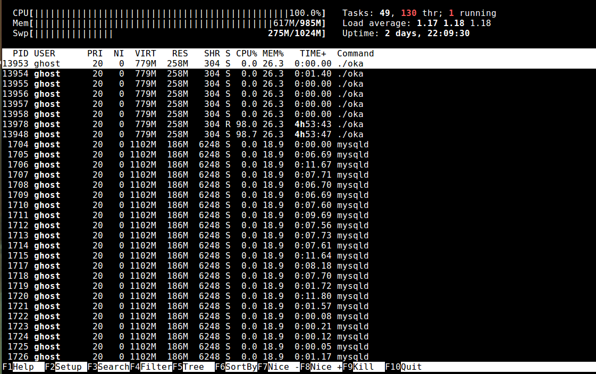

* * * 
### INIZIAMO AD USARE LA SHELL DI UBUNTU 

Useremo Ubuntu con dei comandi che non sono purtroppo disponibili su Windows e non potrebbero mai girare su una semplice scheda Arduino. In questo post vedremo come usare **fuser** nel terminale di Ubuntu.


### COME SCOPRIRE I PROGRAMMI CHE BLOCCANO UNA CERTA PORTA SU UBUNTU?

<div class="alert alert-doks d-flexflex-shrink-1" role="alert"> 👉 
Mettiamo che abbiate lanciato e dimenticato un programma proprio su una porta che vi serve. Ad esempio la porta 3000 di Nodejs o la 8000 di Python/Django. Come fare a trovare il programma preciso e a stopparlo?
</div>

<br>

Potremmo lanciare il comando **ps -ea** per andare a spulciare tra tutti i programmi in esecuzione ma perderemmo troppo tempo. 



<br>
<br>
Scriviamo invece sul prompt di Ubuntu (che si chiama SHELL) il comando seguente e otterremo in un instante il PID del programma:

```bash
$ fuser -i  :3000
```

oppure

```bash
$ fuser -i  :8000
```

facendo attenzione a lasciare uno spazio prima dei “due punti”.

Riceveremo un messaggio del tipo:


> **COMMAND PID USER FD TYPE DEVICE SIZE/OFF NODE NAME
node 16176 utente 22u IPv4 26591333 0t0 TCP :3000 (LISTEN)**

e da questo siamo in grado di capire che un server node sta girando in sottofondo (come demon) con un PID = 16176.
Per bloccarlo ci basta scrivere:

```bash
$ kill -9 16176 (o qualunque numero sia il PID)
```

facendo come sempre attenzione agli spazi.

### IL COMANDO NETSTAT

In alternativa puoi usare invece **netstat** insieme a **grep** per cercare il programma che occupa la porte 80 o 3000 o 8000.

```bash
sudo netstat -ltnp | grep 80
sudo netstat -ltnp | grep 3000
sudo netstat -ltnp | grep 8000
```

Dopo avere ottenuto il messaggio:

> **tcp 0 0 0.0.0.0:3000 0.0.0.0: LISTEN 16176/node**

possiamo procedere con il solito comando **kill -9 PID** per “stoppare” il programma che ci dà fastidio.

