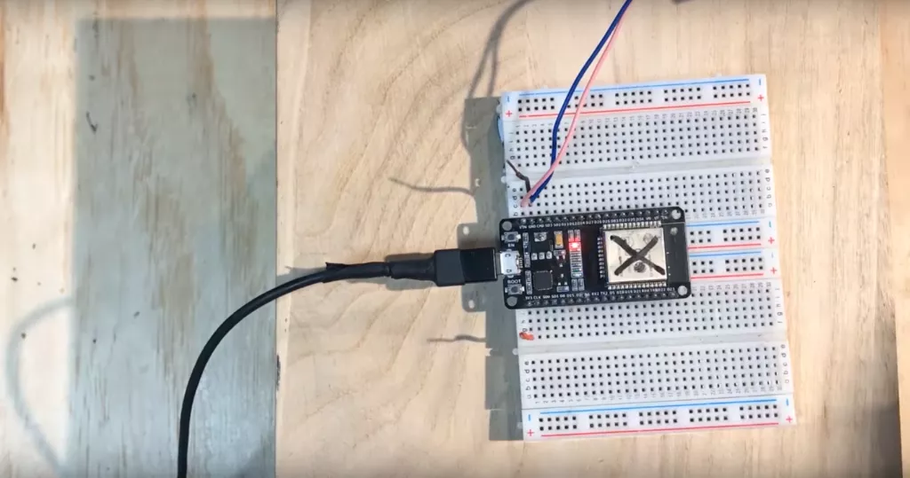
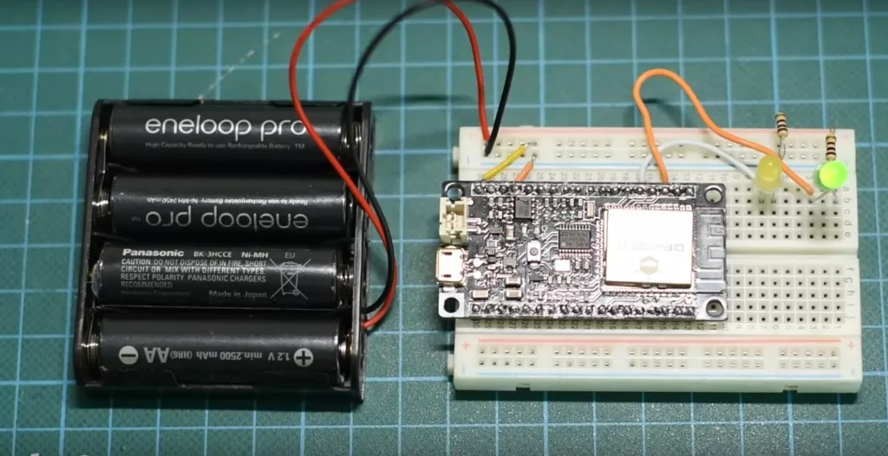
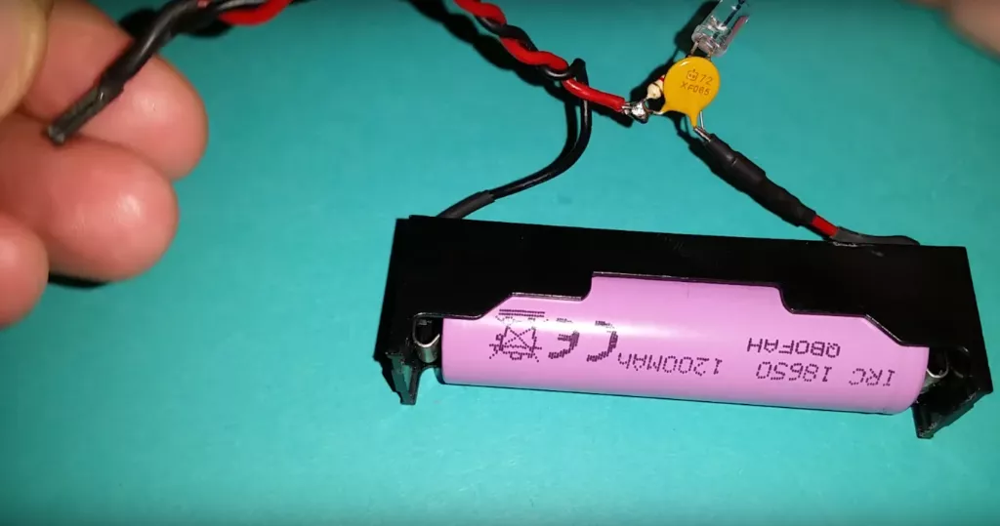

 

L&#8217;ESP32 è una scheda di sviluppo molto potente e versatile, utilizzata in molte applicazioni IOT. Una delle questioni più importanti quando si lavora con l&#8217;ESP32 è la scelta dell&#8217;alimentazione giusta per garantire il corretto funzionamento della scheda. Può essere alimentato attraverso un&#8217;ampia gamma di fonti di alimentazione, tra cui l&#8217;alimentazione tramite USB, l&#8217;alimentazione tramite batterie, l&#8217;alimentazione tramite un alimentatore esterno e molto altro. Ecco alcune delle opzioni più comuni.

## 1. Alimentazione con presa USB

 

##### L&#8217;alimentazione tramite USB è una delle opzioni più comuni per l&#8217;ESP32. In questo caso, l&#8217;ESP32 viene alimentato direttamente tramite il cavo USB che viene collegato alla scheda. Questa opzione è molto conveniente e facile da utilizzare, ma non è sempre la soluzione migliore. L&#8217;alimentazione tramite USB può limitare la quantità di corrente disponibile per l&#8217;ESP32, il che può influire sulla sua capacità di funzionare in modo efficiente, soprattutto quando si utilizzano sensori o componenti esterni.

Le prese USB sono diventate uno standard nella maggior parte dei computer e dei dispositivi elettronici. Sono utilizzate per alimentare i dispositivi, trasferire dati e fornire connettività a una vasta gamma di periferiche. Tuttavia, non tutte le prese USB sono create uguali. In questo articolo, vedremo il voltaggio delle prese USB dei computer e cosa significa per i dispositivi collegati ad esse.

#### Il voltaggio delle prese USB non è sempre di 5V

Il voltaggio delle prese USB può variare a seconda del tipo di porta USB. In genere, le porte USB di tipo 1.0 e 2.0 forniscono un voltaggio di 5 volt, mentre le porte USB di tipo 3.0 e 3.1 forniscono un voltaggio di 5 volt o 12 volt. Tuttavia, non tutte le prese USB forniscono la stessa quantità di corrente. Alcune prese USB possono fornire solo una quantità limitata di corrente dicamo circa 0.5A, mentre altre possono fornire una maggiore quantità di corrente fino a 1.2A.

#### Come controllare il voltaggio delle prese USB?

Per capire il voltaggio delle prese USB, è possibile utilizzare un voltmetro. Un voltmetro è un dispositivo che misura la tensione elettrica tra due punti. Per misurare la tensione delle prese USB, è necessario collegare il voltmetro alle prese USB e misurare la tensione. Tuttavia, è importante notare che non tutti i voltmetri sono in grado di misurare la tensione delle prese USB in modo accurato. Alcuni voltmetri potrebbero fornire una lettura inaccurata, a seconda della qualità del dispositivo e della porta USB stessa.

> In conclusione, il voltaggio delle prese USB può avere un impatto significativo sui dispositivi collegati ad esse. È sapere esattamente il voltaggio per evitare danni ai dispositivi e garantire un funzionamento corretto. Inoltre, è consigliabile utilizzare un voltmetro di alta qualità per misurare la tensione.

## Alimentazione tramite il pin Vin
Un altro modo per alimentare ESP32 è utilizzando il pin Vin, comunemente conosciuto come pin 5V. Il pin Vin in ESP32 e in altre schede microcontroller come Arduino è collegato a un regolatore di tensione a bordo. Qualsiasi tensione collegata al pin Vin passa prima attraverso il regolatore, che la riduce a 3,3 V e la alimenta ai periferici della scheda ESP32.
      
Utilizzando una alimentazione esterna regolata da 5V, possiamo alimentare ESP32 attraverso il pin Vin, collegando la GND di ESP32 con la GND esterna dell&#8217;alimentazione. Qualsiasi tensione compresa tra 5V e 12V può essere collegata al pin Vin di ESP32, tuttavia non è consigliabile utilizzare più di 6V o 7V. Poiché ESP32 ha bisogno solo di 3,3 V per funzionare, le restanti tensioni vengono dissipate dal regolatore di tensione LDO sotto forma di calore.

## 3. Alimentazione con batterie ricaricabili

 

La ultima opzione sulla lista per alimentare l&#8217;ESP32 è l&#8217;utilizzo di batterie esterne. L&#8217;ESP32 funziona a 3,3 V, quindi può essere facilmente alimentato utilizzando le batterie esterne. Mentre si alimenta l&#8217;ESP32 con una batteria esterna, utilizzare sempre il pin Vin poiché è collegato a un regolatore di tensione integrato che protegge da qualsiasi tipo di danni all&#8217;ESP32.
      
 Ecco un elenco di tutte le batterie che possono essere utilizzate per alimentare l&#8217;ESP32:
     
Utilizzo di una power bank
Utilizzo di batterie NiMH o batterie standard (2 x 1,5 V)
Batterie al litio
Batterie LiFePO4
Batterie al litio polimero
      
### Avvertenze
      
Ecco alcune avvertenze da tenere a mente durante l&#8217;alimentazione dell&#8217;ESP32 con una fonte di alimentazione esterna:
     
Utilizzare sempre una fonte di alimentazione a tensione regolata
Non collegare dispositivi all&#8217;ESP32 che richiedono più corrente, come i motori
Non utilizzare più di una fonte di alimentazione contemporaneamente
Se il regolatore di tensione si surriscalda, spegnere la scheda ESP32.

#### Le batterie ricaricabili LIPO

 

Gli accumulatori al litio sono utilizzati in una vasta gamma di dispositivi elettronici, come telefoni cellulari, computer portatili, tablet, droni elettrici, automobili elettriche e molto altro ancora. In questo articolo, vedremo come funzionano gli accumulatori al litio e quali sono i loro vantaggi e svantaggi.

Come funzionano gli accumulatori al litio?

> Gli accumulatori al litio funzionano attraverso il processo di ioni di litio che si spostano attraverso l&#8217;elettrolita tra gli elettrodi positivi e negativi. Quando gli ioni di litio si spostano verso l&#8217;elettrodo positivo, si verifica una reazione chimica che rilascia energia elettrica. Quando gli ioni di litio si spostano verso l&#8217;elettrodo negativo, la batteria viene ricaricata.

Gli accumulatori al litio hanno molte caratteristiche positive rispetto ad altri tipi di batterie. In primo luogo, sono leggeri e compatti, il che li rende adatti per l&#8217;uso in dispositivi portatili. In secondo luogo, hanno una durata della vita più lunga rispetto ad altre batterie. Infine, gli accumulatori al litio sono in grado di mantenere una tensione costante durante la maggior parte della loro scarica, il che significa che possono fornire una potenza costante ai dispositivi.

Quali sono i vantaggi e gli svantaggi degli accumulatori al litio?

Come tutte le tecnologie, gli accumulatori al litio hanno vantaggi e svantaggi.

Vantaggi:

  1. **Leggeri** e **compatti**: gli accumulatori al litio sono leggeri e compatti, il che li rende adatti per l&#8217;uso in dispositivi portatili.
  2. **Lunga** **durata** della vita: gli accumulatori al litio hanno una durata della vita più lunga rispetto ad altre batterie.
  3. **Potenza** **costante**: gli accumulatori al litio sono in grado di mantenere una tensione costante durante la maggior parte della loro scarica, il che significa che possono fornire una potenza costante ai dispositivi.

Svantaggi:

  1. **Costi**: gli accumulatori al litio possono essere costosi rispetto ad altre batterie.
  2. **Rischio** **di** **incendio**: gli accumulatori al litio possono causare incendi se non vengono caricati, scaricati o conservati correttamente.
  3. **Sensibilità** **alla** **temperatura**: gli accumulatori al litio possono essere sensibili alle temperature estreme.

> Gli accumulatori al litio sono diventati uno standard nell&#8217;industria delle batterie per i loro vantaggi in termini di leggerezza, durata della vita e potenza costante. Tuttavia, hanno anche degli svantaggi in termini di costi, rischio di incendio e sensibilità alla temperatura. È importante utilizzare gli accumulatori al litio in modo sicuro e corretto per evitare danni o incidenti.

## 3. Alimentazione con alimentatore esterno

L&#8217;alimentazione tramite alimentatore esterno è un&#8217;altra opzione che può essere utile quando si lavora con l&#8217;ESP32. In questo caso, l&#8217;ESP32 viene alimentato attraverso un alimentatore esterno, il quale fornisce una tensione di alimentazione costante e stabile. Questa opzione è particolarmente utile quando si utilizzano sensori o componenti esterni che richiedono una maggiore quantità di corrente.

### 3.1 Gli alimentatori da laboratorio

Gli alimentatori elettrici da laboratorio sono strumenti fondamentali per chi lavora con l&#8217;elettronica. Consentono di fornire tensione e corrente regolabili e stabili ai circuiti elettronici, sia per la verifica del funzionamento dei componenti che per la progettazione e la sperimentazione di nuovi circuiti. In questo articolo, esploreremo come funzionano gli alimentatori elettrici da laboratorio e quali sono le loro caratteristiche principali.

##### Come funzionano gli alimentatori elettrici da laboratorio?
Gli alimentatori elettrici da laboratorio funzionano mediante la conversione di tensione alternata (AC) in tensione continua (DC). L&#8217;alimentatore dispone di un trasformatore che converte la tensione alternata della presa a muro in una tensione alternata di bassa frequenza, che viene quindi raddrizzata e filtrata per ottenere una tensione continua. Questa tensione continua viene quindi regolata e controllata mediante circuiti di regolazione per fornire alla uscita dell&#8217;alimentatore una tensione e una corrente costanti e regolabili.
        Quali sono le caratteristiche principali degli alimentatori elettrici da laboratorio?
          <strong>Tensione e corrente regolabili</strong>: la capacità di regolare la tensione e la corrente dell&#8217;alimentatore è fondamentale per adattarsi alle esigenze specifiche del circuito elettronico in fase di test o sperimentazione.
          <strong>Stabilità</strong>: la tensione e la corrente devono essere stabili per evitare danni al circuito in fase di test. L&#8217;alimentatore deve mantenere una tensione e una corrente costante anche in presenza di carichi variabili.
          <strong>Protezioni</strong>: l&#8217;alimentatore deve essere dotato di protezioni come cortocircuiti, sovraccarichi e surriscaldamenti per evitare danni al circuito in fase di test e prevenire il rischio di incendi.
          <strong>Display</strong>: gli alimentatori moderni sono dotati di display LCD che forniscono informazioni sulla tensione e la corrente in uscita, consentendo un controllo accurato dei valori.
          <strong>Interfaccia</strong> <strong>utente</strong>: gli alimentatori moderni possono essere dotati di un&#8217;interfaccia utente facile da usare, composta da pulsanti e manopole per la regolazione dei valori di tensione e corrente.
      
> In conclusione, gli alimentatori elettrici da laboratorio sono strumenti fondamentali per chi lavora con l&#8217;elettronica. Consentono di fornire tensione e corrente regolabili e stabili ai circuiti elettronici, sia per la verifica del funzionamento dei componenti che per la progettazione e la sperimentazione di nuovi circuiti. Quando si sceglie un alimentatore elettrico da laboratorio, è importante valutare le caratteristiche principali come la regolazione della tensione e della corrente, la stabilità, le protezioni, il display e l&#8217;interfaccia utente per garantire un funzionamento sicuro ed efficace.

Indipendentemente dalla fonte di alimentazione scelta, **è importante assicurarsi che la tensione di alimentazione fornita sia stabile e costante**. Inoltre, è importante scegliere la giusta tensione di alimentazione in base alle <a href="https://www.mischianti.org/it/2020/05/30/esp32-piedinatura-specifiche-e-configurazione-dellarduino-ide-parte-1/" target="_blank" rel="noopener">specifiche</a> dell&#8217;ESP32.

Scegliere la giusta fonte di alimentazione per l&#8217;ESP32 è un aspetto critico per garantire il corretto funzionamento della scheda e dei componenti esterni. Prima di scegliere la fonte di alimentazione, è importante considerare le specifiche dell&#8217;ESP32 e delle componenti esterne utilizzate, in modo da evitare problemi di stabilità e di funzionamento.
