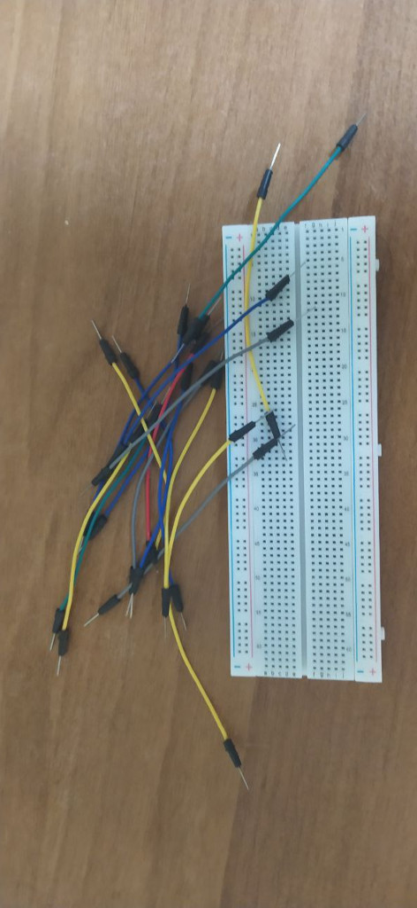

---
L&#8217;accessorio indispensabile per costruire rapidamente i tuoi prototipi di Robot.

&nbsp;

Le Breadboard servono a collegare i componenti elettronici **senza usare il saldatore**: basta prendere i terminali e inserirli nei buchi a misura standard ed il gioco è fatto. Le puoi comprare in varie forme e dimensioni e, per fortuna, **funzionano tutte allo stesso modo**.

Se servissero solo a inserire i componenti e basta non sarebbero comunque una grande invenzione: **invece la loro maggiore utilità deriva dal modo in cui i fori sono connessi**. I fori sono infatti connessi a **colonne**: se un solo foro viene collegato ad un alimentatore allora tutti gli altri fori della colonna saranno collegati alla alimentazione! E se collegate una colonna di fori alla massa, tutti i fori della colonna saranno collegati a massa.

> In questo modo potrai collegare tutti i componenti alla alimentazione e alla massa del circuito semplicemente variando la loro posizione sulla scheda!

## Inserire dei LED su una Breadboard {#inserire-dei-led-su-una-breadboard}

Stai iniziando a capire quanto lavoro ci risparmiano le Breadboard, ma vediamo subito come usarle in progetti appena più complessi. Fino ad ora (ad esempio in questo \[articolo\] (<https://www.robotdazero.it/blog/003-il-tuo-primo-programma-con-arduino/>) del Blog) abbiamo usato il LED interno di Arduino per fare dei semplici test, ma in futuro per realizzare progetti **UTILI** dovremo sempre collegare dei LED esterni, aggiungendo una [resistenza][1] per limitare la corrente.

**Tutti i LED infatti hanno bisogno di limitare il flusso di elettroni che altrimenti li brucerebbe in pochi secondi**, esperienza che capita a tutti principianti almeno una volta nella vita. Il fatto che si possano usare i **4 LED interni** di Arduino senza problemi vuol dire solo che i progettisti hanno già inserito le **resistenze adatte** nella scheda, non che puoi farne a meno!

Nella figura sottostante puoi vedere una immagine di un circuito completo assemblato su una Breadboard. Consiste di un Arduino, un LED e una resistenza di 1kΩ.

 

Come si vede nella colonna di **sinistra** abbiamo un filo nero che esce dal connettore GND (ground=**massa**) di Arduino. Il **filo nero** si innesta nella Breadboard e continua fino al terminale **negativo** del LED.

Il [filo rosso][2] (positivo) conduce il segnale che proviene dal **pin 2** di Arduino fino alla colonna di **destra**. Salendo sulla colonna di **destra** la corrente _incontra_ dapprima la [resistenza][1] di un kΩ e poi il terminale positivo del LED. Senza perdere tempo con stagno e saldatore ho realizzato il circuito **hardware** necessario per accendere un LED con Arduino! Prova a copiare la disposizone dei componenti sulla tua Breaboard. Volendo potresti modificare il **software** presentato in questo [articolo][3] del Blog e fare lampeggiare il LED a intervalli regolari di un secondo. La modifica è semplicissima, si tratta solo di cambiare una riga, ma se sei nuovo del Blog non ti preoccupare: **realizzeremo assieme molti di questi esercizi e in poco tempo saprai cavartela benissimo da solo**! Ti interessa questo articolo e vuoi scoprire a costo zero tutti i segreti della elettronica digitale?**E per concludere vorrei darti dei suggerimenti che ti faranno risparmiare un sacco di tempo lavorando con le Breadboard**:

  * Accorcia i terminali dei componenti se si piegano troppo mentre li inserisci nei fori
  * Quando accorci i terminali dovresti accorciare un poco di più i terminali **negativi** per riconoscerli più facilmente. I LED ad esempio hanno un terminale positivo e uno negativo
  * Se colleghi un LED ad una batteria o ad un alimentatore **DEVI** sempre inserire in linea una resistenza, che per le tensioni che si usano nella Robotica sarà di **150Ω** (si legge 150 Ohm) fino a **1 KΩ** (si legge un Kilo Ohm)
  * Puoi [ricavare il valore di una resistenza][4] dalle fasce colorate con cui vengono appositamente verniciate

#### Ma la cosa che vorrei sottolineare più di tutte è questa: {#ma-la-cosa-che-vorrei-sottolineare-più-di-tutte-è-questa}

> Le Breadboard servono a creare dei **prototipi** di Robot, ma sono così comode che vorrai usarle anche sui lavori da consegnare ai tuoi clienti.

Nei prossimi articoli del Blog vederemo come usare **collanti ed isolanti** in bomboletta per rendere più **stabili** i collegamenti nella Breadboard, limitando così l’uso del saldatore. E se ti stai chiedendo perchè vogliamo evitare il saldatore la risposta è semplice: **non esiste modo più rapido di distruggere un componente che toccarlo con il saldatore per pochi secondi**!

[Iscriviti ora alla nostra newsletter][5] e dopo avere confermato la tua iscrizione troverai ogni 15 gg nella tua mail un argomento o un progetto pratico da seguire, con la lista dei componenti e il software necessario.

 [1]: https://it.wikipedia.org/wiki/Resistenza_elettrica
 [2]: https://www.puntoluce.net/comefare/codice-colori-dei-fili-elettrici-una-guida/
 [3]: https://www.robotdazero.it/blog/003-il-tuo-primo-programma-con-arduino/
 [4]: https://www.leo-alberto.it/elettrotecnica/resistorscode.php
 [5]: https://landing.mailerlite.com/webforms/landing/k3h6p4
