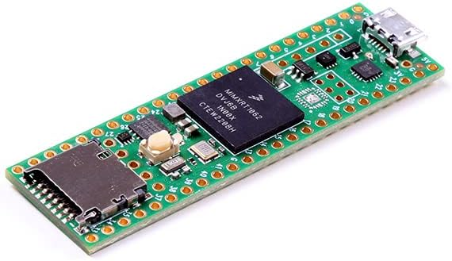

#### Cosa è Arduino?
Arduino è una piccola scheda creata da una azienda italiana in grado di leggere programmi e di interagire con l’ambiente esterno.
E' in definitiva il componente base di tutti i Robot e i sistemi di automazione che troverai nella industria e nella domotica</strong>. Con le sue dimensioni contenute è di utilizzo estremamente pratico ed economico: il segreto di tutto ciò sta nel sapiente mix di <strong>chip</strong> secondari e di un chip più potente chiamato <strong>microcontroller</strong>.
  
  

    Negli ultimi anni è diventato enormemente popolare per via dei <strong>costi accessibili</strong> e della <strong>facilità</strong> con cui si può imparare il suo linguaggio di programmazione; forse avevi già pensato di acquistarne uno e in questo caso ti consiglio di leggere questa <strong>guida completa all’acquisto di Arduino</strong>…
  

  
### Perchè Scegliere L'Arduino giusto è un problema
  
  

    Acquistare un Arduino qualsiasi non è certo complicato: basta, se hai davvero fretta, ordinare su Amazon.it una delle schede più vendute: ma se le differenze di prezzo e le <strong>tante versioni disponibili</strong> ti lasciano perplesso farai bene a leggere questa guida!
  

  
  <h4 id="le-cose-che-dovresti-sapere-prima-di-comprare-la-tua-scheda">
    Le cose che dovresti sapere prima di comprare la tua scheda:
  </h4>
  
  <ol>
    <li>
      Quale versione di Arduino dovresti scegliere?
    </li>
    <li>
      E&#8217; meglio originale o compatibile?
    </li>
    <li>
      Ci sono degli “accessori” indispensabili?
    </li>
    <li>
      Meglio una scheda singola o un KIT completo?
    </li>
    <li>
      Cosa sono gli “SHIELDS”?
    </li>
    <li>
      Quale scheda comprare se ti servono alte prestazioni?
    </li>
  </ol>
  
### Step #1 - QUALE VERSIONE DI ARDUINO DOVRESTI SCEGLIERE
  
  

    Se vai sul sito <a href="https://store.arduino.cc/">arduino.cc</a> e controlli sulla pagina <a href="https://store.arduino.cc/">STORE</a> ti troverai di fronte a circa una ventina di schede! E se vai sulla <a href="https://it.wikipedia.org/wiki/Arduino_(hardware)">pagina di Wikipedia</a> troverai oltre 180 schede compatibili di varia qualità.
  

  
  

    <strong>Ma soprattutto, quali schede funzionano senza problemi con l’IDE di Arduino e con tutto il software già disponibile in rete?</strong>
  

  
  <blockquote>
    

      Ti svelo la risposta a tutti questi dubbi: DEVI COMPRARE una scheda Arduino UNO Rev.3
    

  </blockquote>
  
  

    Rev.3 significa terza revisione e ti posso dire che è la scheda che ti darà le maggiori soddisfazioni per questi semplicissimi motivi:
  

  
  <ul>
    <li>
      <strong>1</strong> La UNO è la scheda più diffusa e se cerchi del software già pronto per partire troverai un mare di applicazioni disponibili.
    </li>
    <li>
      <strong>2</strong> Gran parte delle schede aggiuntive e degli accessori sono stati creati per questa versione di Arduino e i famosi “shields” sono in genere pensati per Arduino UNO.
    </li>
    <li>
      <strong>3</strong> Se andiamo nel dettaglio tecnico Arduino UNO ha tutto quello che ti serve per iniziare. Ha <strong>20</strong> canali separati per INPUT e OUTPUT e tutti questi canali possono essere usati per leggere segnali digitali (zero e uno), mentre <strong>6</strong> sono a doppio uso e leggono anche segnali analogici. Con questa dotazione può bastare per le esigenze di chi inizia e non solo.
    </li>
  </ul>
  
  

    Ti consiglio dunque certamente di iniziare con <a href="https://www.robotdazero.it/prodotto/arduino-uno-r3/">questa scheda.</a>
  

  
  

    
  

  
  

    In effetti se Arduino UNO fosse la soluzione “universale” non ci sarebbero così tante schede in circolazione, giusto? Vediamo in quale caso ti potrebbe servire una altra versione di Arduino:
  

  
  

    Se hai un mare di sensori e di livelli da controllare allora è il caso si scegliere qualcosa di più completo come la <a href="https://amzn.to/33X5ALJ">Arduino MEGA 2560 Rev3</a>. E’ dotata di <strong>54</strong> linee (pin) di input / output e seppure leggermente più costosa di Arduino UNO ne condivide la sterminata libreria di applicazioni già pronte.
  

  
  

    
  

  
  

    Arduino MEGA funziona esattamente come l’UNO e perciò non dovrai adattare il software disponibile o cercare documentazione specifica per questo prodotto.
  

  
  

    Se invece vuoi una scheda già fornita di connessione <strong>Wifi</strong> ti consiglio di comprare una scheda che usi il chip <strong>ESP8266</strong>.
  

  
  

    Tra queste ti segnalo <strong>2</strong> ottime schede compatibili e precisamente: la <a href="https://www.adafruit.com/product/2821?utm_source=Programming%20Electronics%20Academy&utm_medium=Blog%20Post%20-%20Arduino%20Buying%20Guide&utm_campaign=Lead%20Generation&utm_content=Adafruit">Adafruit Feather HUZZAH with ESP8266</a>, oppure la <a href="https://www.sparkfun.com/products/13711?utm_source=Programming%20Electronics%20Academy&utm_medium=Blog%20Post%20-%20Arduino%20Buying%20Guide&utm_campaign=Lead%20Generation&utm_content=SparkFun">SparkFun ESP8266 Thing Development Board</a>.
  

  
  

    Ad essere pignoli queste schede non sono davvero delle “Arduino”, ma sono 100% compatibili con il software e l’IDE di Arduino
  

  
  

    
  

  
  

    
  

  
  

    Sono in vendita con delle ottime librerie per collegarsi ad Internet e se le compri <strong>espressamente</strong> da questi due produttori (o da altri di buon livello) ti arriveranno fornite di <strong>sketch</strong> (applicazioni) internet complete e funzionanti.
  

  
  

    <strong>La cosa curiosa di queste schede con Wifi è che in certi casi costano meno dell’Arduino originale</strong>: possono essere un buon affare, ma ricordati che aggiungono un secondo livello di complessità all’utilizzo della scheda.
  

  
  

    Se preferisci una scheda <strong>originale</strong> la <strong>Arduino Yún</strong> implementa la connessione Wifi con un altro chip, l&#8217;<strong>Atheros AR9331</strong>.
  

  
  

    <strong>La Yún offre inoltre una interfaccia Ethernet e una porta USB di tipo A e uno slot per Micro SD</strong>. Con <strong>20</strong> pin di input/output e <strong>12</strong> ingressi analogici è all’altezza delle due schede precedenti, <strong>dotate però di chip ESP8266</strong> un componente molto <strong>discusso nei forum</strong> e secondo me migliore.
  

  
  <blockquote>
    

      Ti consiglio di comprare una scheda con Wifi incorporato se vuoi costruire Robot pilotati via Web: potrai imparare facilmente a costruirli seguendo i miei corsi su Robotdazero.
    

  </blockquote>
  
  <h4 id="piccolo-è-bello">
    Piccolo è bello
  </h4>
  
  

    Forse hai già usato Arduino UNO e vuoi realizzare qualche progetto più compatto: anche in questo caso le soluzioni sul mercato abbondano. Puoi intanto dare una occhiata ai prodotti di <a href="https://tinycircuits.com/?utm_source=Programming%20Electronics%20Academy&utm_medium=Blog%20Post%20-%20Arduino%20Buying%20Guide&utm_campaign=Lead%20Generation&utm_content=TinyCircuits"><strong>TinyCircuits</strong></a>, che realizza delle schede Arduino davvero minuscole.
  

  
  

    
  

  
  

    Ti consiglio la scheda di <a href="https://tinycircuits.com/"><strong>TinyCircuits</strong></a> per modelli di Robot in miniatura o telecamere motorizzate poco visibili. E&#8217; compatibile al 100% con il software e l’IDE di Arduino. Ricorda che, in linea di massima, se non sviluppi programmi destinati ad un particolare <strong>microchip</strong> (lo fanno in pochi) puoi comprare schede di ogni dimensione.
  

  
  <h4 id="arduino-micro">
    Arduino Micro
  </h4>
  
  

    Arduino <a href="https://store.arduino.cc/arduino-micro">Micro</a> è stato creato in collaborazione con <a href="https://www.adafruit.com/">Adafruit</a>, e monta il processore <strong>ATmega32U4</strong>. Da anni è il punto di riferimento per chi cerca la miniaturizzazione estrema pur mantenendo qualità e resistenza all’uso continuato.
  

  
  

    Facile da montare su una breadboard (a differenza delle schede TinyCircuits), è fornito di 20 porte I/O con i soliti 7 pin PWM e 12 pin analogici.
  

  
  

    <strong>Arduino Micro contiene lo stesso eccellente chip di conversione seriale/USB di Arduino Uno</strong>: meno problemi di compatibilità con i driver per Windows 10 e meno errori dell&#8217;<a href="https://www.robotdazero.it/blog/004-come-installare-ide-di-arduino/">IDE</a> in fase di caricamento. Non possiede il comodo portabatteria “coin” per la CR32 che trovi su <a href="https://tinycircuits.com/collections/all/products/tinyduino-starter-kit">TinyDuino</a>, e neppure attachi per cam di sorveglianza, ma resta una eccellente scelta per collegare sensori multipli.
  

  
### Step #2 - E’ MEGLIO UN ARDUINO ORIGINALE O “COMPATIBILE”?
  
  

    Se vuoi comprare un Arduino originale sei a posto, ma molti comprano dei <strong>compatibili</strong>. Perchè?
  

  
  

    <strong>Perchè la convenienza può essere molta e notoriamente il basso prezzo riesce a stimolare la domanda</strong>.
  

  
  

    Come mai esistono tanti Arduino compatili? Perchè la casa madre a suo tempo decise di rendere disponibile l’intero progetto della scheda, imitando un modello detto <strong>Open source</strong> che ha funzionato benissimo nel software. In questo modo la azienda si è garantita un enorme interesse da parte degli sviluppatori hardware cui in pratica REGALA l’IDE, le librerie e il linguaggio di programmazione C++.
  

  
  <blockquote>
    

      <strong>Il ritorno in termini di marketing è stato enorme e la diffusione di Arduino universale</strong>.
    

  </blockquote>
  
  <h4 id="dove-comprare-una-scheda-arduino-o-arduino-compatibile">
    Dove comprare una scheda Arduino o Arduino compatibile?
  </h4>
  
  

    Se sei agli inizi ti consiglio di comprare una scheda da Arduino.cc o da Amazon.it e di lasciar perdere per il momento Ebay e Alibaba e siti “alternativi”. Su Amazon.it troverai le ultime offerte e gli utili kit completi, mentre su Arduino.cc pagherai forse il 20 o 30% in più ma con il beneficio di finanziare direttamente la casa madre (che è italiana) e di fornire un serio contributo allo sviluppo del software della scheda. <strong>Un fatto rilevante da non sottovalutare</strong>.
  

  
  <h4 id="non-fidatevi-degli-arduino-contraffatti">
    Non fidatevi degli Arduino contraffatti
  </h4>
  
  

    Oltre alle aziende che producono schede “legalmente” compatibili ed espongono il loro marchio, ci sono decine di produttori non autorizzati <strong>che falsificano logo e brand</strong>. Diffidate di questi prodotti: <strong>NON sono 100% hardware compatibili</strong>. La società Arduino LLC chiama queste schede “contraffatte” e ha spiegato per esteso quali sono le loro differenze e i loro difetti. Ad esempio, la precisione della tensione di uscita è molto inferiore rispetto alle schede ufficiali. Questi venditori dichiarano <strong>falsamente</strong> una corrente ammissibile simile alla specifica ufficiale di Arduino, con conseguente rottura della scheda o di dispositivi collegati. In alcune schede, anche i componenti sono del tutto diversi dalla scheda ufficiale. Ad esempio, nelle schede UNO contraffatte, invece del chip ATMEGA16U4 per la conversione da USB a seriale, <strong>potresti trovare un chip più economico come l’FTDI o il CH340 IC</strong>.
  

  
  <blockquote>
    

      Pertanto, queste schede non sono compatibili con alcuni sistemi operativi o richiedono ulteriori driver per l’installazione.
    

  </blockquote>
  
  

    Per riassumere, <strong>evita le schede super economiche con il marchio Arduino</strong>: se vuoi pagare di meno, acquista schede da produttori che espongono il loro marchio, e preferibilmente su Amazon.it. Se acquisti marchi contraffatti, inoltre, stai supportando venditori fuorilegge che <strong>violano la normativa sul copyright</strong>.
  

  
### Step #3 - GLI ACCESSORI INDISPENSABILI PER ARDUINO
  
  

    Anche in questo caso, non ti consiglio di precipitarti su Amazon.it o in un negozio fisico a comprare accessori alla rinfusa. Sarebbe molto meglio comprarli gradatamente, limitandoti all’ inizio solo alle breadboard, ai fili di connessione, a pochi sensori e agli utilissimi kit di resistenze e condensatori.
  

  
  <h4 id="il-cavo-usb">
    IL CAVO USB
  </h4>
  
  

    Per quanto possa apparire banale ti serve un cavo USB e <strong>non si tratta realmente di un accessorio</strong> perchè senza cavetto non puoi usare Arduino! Con un semplice cavetto e niente altro potrai già completare il tuo <a href="https://www.robotdazero.it/blog/003-il-tuo-primo-programma-con-arduino/">primo programma</a> Arduino seguendo questo link su Robotdazero. In pochi minuti vedrai qualcosa di <strong>funzionante e magari riuscirai a modificarlo</strong>!
  

  
  

    Ricorda, non ti serve un cavo USB normale, ma un <strong>tipo AB</strong>.Per capirci si tratta del classico cavo che usi per collegare il PC alle <strong>stampante</strong> e non si tratta del tipo MICRO-USB che usi per collegare lo smartphone al PC.
  

  
  

    Molte schede sono già fornite di cavetto, ma non è una regola universale e in ogni caso ti consiglio di averne uno di scorta. Se compri un Arduino <strong>molto compatto</strong> ricorda che alcuni di essi <strong>usano un cavo MISCRO-USB</strong> &#8211; quello dello smartphone. Controlla con attenzione prima di comprare.
  

  
### Step #4 - I KIT DA SCEGLIERE PER INIZIARE CON ARDUINO
  
  

    Specialmente all’inizio, comunque, non è facile indovinare cosa serve davvero e di quali componenti puoi fare a meno. Se vuoi un consiglio <strong>concentrati sui sensori e cerca il kit che li contiene</strong>: avrai il duplice vantaggio di fare un solo ordine on line e di essere sicuro della compatibilità hardware.
  

  
  

    A parte i sensori ti serviranno di sicuro questi <strong>4</strong> accessori:
  

  
  <ul>
    <li>
      <strong>Schede Breadboard</strong> (almeno un paio)
    </li>
    <li>
      <strong>Jumper</strong> (i fili con i connettori)
    </li>
    <li>
      <strong>Resistenze</strong>
    </li>
    <li>
      <strong>LED di vario colore</strong>
    </li>
    <li>
      <strong>le Schede Breadboard</strong> risolvono una delle maggiori difficoltà della Elettronica: come fare saldature rapide che non danneggino i delicati componenti elettronici. Il problema delle saldature esiste da tempo, e per fortuna sono state create delle soluzioni efficaci. Con queste schede infatti puoi fissare e collegare tutti i componenti senza saldatore (vengono definite “solderless boards” proprio per questo).
    </li>
    <li>
      <strong>i Jumper</strong> servono a fare le connessioni tra i fori delle basette e dovrai acquistarne in quantità industriali. Ma <strong>costano pochissimo</strong> e sono sempre inclusi in tutti kit di Arduino.
    </li>
    <li>
      <strong>le Resistenze</strong> sono usate per limitare la tensione o la corrente e sono un <em>must</em> di ogni circuito elettronico, anche del più semplice. Dovrai usarle anche per collegare un semplice LED o un motorino elettrico e quindi non c’è ragione di rinviarne l’acquisto. Si possono comprare a poco prezzo anche in serie completa di una cinquantina di pezzi.
    </li>
    <li>
      <strong>i LED </strong>sono delle “mini lampadine” che puoi accendere con un consumo di corrente bassissimo. Sono onnipresenti in ogni apparato elettronico e <strong>ne puoi trovare 4 incorporate nella scheda del tuo Arduino UNO</strong>. Non esiste progetto robotico in cui non vengano usati e grazie al costo limitato li trovi in tutti i KIT di Arduino.
    </li>
  </ul>
  
### Step #5 - COSA SONO GLI “SHIELDS” DI ARDUINO
  
  

    Per avere un Arduino UNO dalle funzionalità molto complete potresti affidarti a uno SHIELD, uno “<strong>scudo</strong>” che contiene molte parti accessorie già incorporate nella scheda. <strong>Se vuoi concentrarti sullo sviluppo del software e degli algoritmi potrebbero essere la soluzione migliore</strong>: ti permette di risparmiare il tempo che perderesti a comprare, collegare e testare le schede aggiuntive.
  

  
  

    Tra gli SHIELD che uso di solito ti segnalo questi prodotto preso da <a href="https://programmingelectronics.com/"><strong>programmingelectronic</strong></a>, si chiama <a href="https://programmingelectronics.com/kit-shield-arduino-info/?utm_source=Programming%20Electronics%20Academy&utm_medium=Blog%20Post%20-%20Arduino%20Buying%20Guide&utm_campaign=Lead%20Generation&utm_content=Programming%20Electronics%20Academy"><strong>Kit-on-a-Shield for Arduino</strong></a>, possiede la bellezza di 15 circuiti già incorporati, davvero molti e viene offerto ad un prezzo competitivo.
  

  
  

    
  

  
  

    Tra le alternative ti segnalo anche <a href="https://www.drduino.com/products/dr-duino-arduino-uno-shield?utm_source=Programming%20Electronics%20Academy&utm_medium=Blog%20Post%20-%20Arduino%20Buying%20Guide&utm_campaign=Lead%20Generation&utm_content=DrDuino">DrDuino</a>, che realizza una copia di Arduino con 12 circuiti aggiuntivi già pronti.
  

  
  

    Arduino ha usato storicamente <strong>chip ATMEL</strong> per le sue schede. Li chiamo chip perchè il nome “processori” richiama alla mente le varie CPU tipo Intel <strong>i3-i7</strong> da cui sono lontani anni luce in fatto di prestazioni. Nell’ultimo periodo sono stati adottati dei veri processori (<strong>Intel Curie</strong>) ma per il momento voglio fare un poco di chiarezza sulle schede equipaggiate con chip ATMEL o ARM.
  

  
  <ul>
    <li>
      <strong>ATMEGA328</strong>
    </li>
  </ul>
  
  <h4 id="questo-processore-viene-usato-su-arduino-uno-mini-nano-pro-fio-lilypad-e--ethernet">
    Questo processore viene usato su Arduino UNO, MINI, NANO, PRO, FIO, LILYPAD e ETHERNET.
  </h4>
  
  

    Può lavorare a 3,3 volt e 5 volt. Per le schede Arduino settate a 5 volt viene <strong>clockato</strong> con un oscillatore da 16 MHz; nelle schede con una tensione operativa di 3,3 volt viene invece utilizzato un oscillatore da 8 MHz per risparmiare energia. Ha solo un kilobyte di memoria EEPROM, 2 kilobyte di SRAM, 32 kilobyte di memoria flash e una porta seriale e il numero di GPIO (delle porte) disponibili dipende dal tipo di scheda. Questo processore è sufficiente per l’uso quotidiano, la memoria non è esagerata ma è in genere sufficiente. Se ti servono prestazioni migliori e maggior memoria è meglio passare ai modelli superiori.
  

  
  <ul>
    <li>
      <strong>ATMEGA168</strong>
    </li>
  </ul>
  
  <h4 id="esistono-due-versioni-delle-schede-lilypad-nano-e-pro">
    Esistono due versioni delle schede LILYPAD, NANO e PRO.
  </h4>
  
  

    La prima versione utilizza un processore ATMEGA168 più debole invece di ATMEGA328 con 0,5 kilobyte di memoria EEPROM, 1 kilobyte di SRAM e 16 kilobyte di memoria flash. <strong>Oggi si può quasi considerare fuori catalogo</strong>.
  

  
  <ul>
    <li>
      <strong>ATMEGA2560</strong>
    </li>
  </ul>
  
  <h4 id="se-stai-cercando-un-processore-più-potente-con-più-gpio-la-scheda-arduino-mega-è-una-delle-migliori-opzioni">
    Se stai cercando un processore più potente con più GPIO la scheda Arduino MEGA è una delle migliori opzioni.
  </h4>
  
  

    MEGA è l’unica scheda Arduino che dispone del microcontrollore ATMEGA2560 con 4 kilobyte di memoria EEPROM, 8 kilobyte di SRAM e 256 kilobyte di flash. Dispone inoltre di <strong>quattro</strong> porte di comunicazione seriale.
  

  
  <ul>
    <li>
      <strong>ATtiny85</strong>
    </li>
  </ul>
  
  <h4 id="per-applicazioni-minimali-come-accendere-dei-led-o-leggere-interruttori-non-serve-un-processore-potente">
    Per applicazioni minimali come accendere dei LED o leggere interruttori non serve un processore potente.
  </h4>
  
  

    La scheda GEMMA Arduino (alcuni produttori la chiamano TINY LILYPAD) ha un microcontrollore ATtiny85 con 0,5 kilobyte di EEPROM e SRAM e 8 kilobyte di memoria flash. La società Arduino non produce più questa scheda, ma molte altre aziende la stanno ancora producendo.
  

  
  <ul>
    <li>
      <strong>ATSAMD21</strong> Se la velocità del tuo MEGA Arduino non soddisfa le tue esigenze e sei deluso dal processore AVR pensa alla scheda ZERO. La ZERO contiene un processore ATSAM D21G18 a 32 bit con un oscillatore a 48 MHz, 32 kilobyte di SRAM e 256 kilobyte di memoria flash. Lavora a 3,3 volt come consuetudine per i chip ARM e dispone di due porte USB.
    </li>
    <li>
      <strong>ATSAM3X8E</strong> Se vuoi ancora più potenza rispetto all’ATSAMD21, è tempo di passare alla scheda Arduino DUE. E&#8217; dotata di un processore ARM ATSAM3X8E a 32 bit, di un oscillatore da 84 MHz con 96 kilobyte di SRAM e 512 kilobyte di memoria flash, quattro porte seriali e due porte USB e oltre 60 pin GPIO. <strong>Davvero performante</strong>!
    </li>
  </ul>

 

### Step #6 - ARDUINO TEENSY

 
 

Arduino Teensy è una scheda di sviluppo open source che utilizza un microcontrollore ARM Cortex-M4. È una delle schede più potenti e versatili sul mercato, ed è ideale per progetti di qualsiasi grandezza.

Arduino Teensy è disponibile in una varietà di modelli, ognuno con le proprie caratteristiche e capacità. Il modello più popolare è il Teensy 3.2, che ha 60 pin digitali, 12 pin analogici, un convertitore analogico-digitale da 12 bit e un oscillatore a 200 MHz.

> **Arduino Teensy** può essere programmato utilizzando l'IDE Arduino, che è un software gratuito e open source. L'IDE Arduino è facile da usare e supporta una varietà di linguaggi di programmazione, tra cui C, C++ e Python.

Se stai cercando una scheda di sviluppo potente e versatile, Arduino Teensy è una scelta eccellente. È facile da usare, supporta una varietà di linguaggi di programmazione ed è ideale per progetti di qualsiasi grandezza.
Ecco alcuni dei vantaggi dell'utilizzo di Arduino Teensy:

- Potenza: Arduino Teensy è una delle schede più potenti sul mercato, ed è ideale per progetti complessi.
- Versatilità: Arduino Teensy può essere utilizzata per creare una vasta gamma di progetti, da robot a strumenti musicali.
- Facilità d'uso: Arduino Teensy è facile da usare, anche per i principianti.
- Supporto: Arduino Teensy ha una grande comunità di utenti e sviluppatori, che offrono supporto e aiuto.

 👉 
Se stai cercando una scheda di sviluppo potente, versatile e facile da usare, Arduino Teensy è una scelta eccellente.

  
#### In conclusione, un breve sommario su cosa fare attenzione scegliendo la scheda Arduino più adatta:
  
1. **Scopo del progetto**
La prima cosa da considerare è lo scopo del tuo progetto. Se stai cercando di creare un progetto semplice con pochi componenti, la scheda Arduino Uno potrebbe essere la scelta giusta. Se stai cercando di creare un progetto più complesso, potresti voler considerare schede come Arduino Mega o Arduino Due, che hanno più pin I/O e risorse di memoria.
  
2. **Numero di pin I/O**
Il numero di pin I/O è un fattore importante da considerare quando si sceglie una scheda Arduino. La maggior parte delle schede Arduino ha tra 14 e 54 pin I/O. Se il tuo progetto richiede l&#8217;utilizzo di molti sensori e attuatori, potresti voler scegliere una scheda con un maggior numero di pin I/O.

3. **Tipo di microcontrollore**
Le schede Arduino sono disponibili con diversi tipi di microcontrollori. Ad esempio, la scheda Arduino Uno utilizza un microcontrollore ATmega328P, mentre la scheda Arduino Due utilizza un microcontrollore ARM Cortex-M3. Scegliere la scheda giusta dipenderà dalle esigenze specifiche del tuo progetto.

4. **Dimensioni**
La dimensione della scheda Arduino è un altro fattore importante da considerare. Se il tuo progetto ha spazio limitato, potresti voler scegliere una scheda più piccola come la scheda Arduino Nano. Se il tuo progetto ha bisogno di una scheda più grande, la scheda Arduino Mega potrebbe essere la scelta giusta.

5. **Caratteristiche aggiuntive**
Infine, ci sono alcune caratteristiche aggiuntive da considerare quando si sceglie una scheda Arduino. Ad esempio, alcune schede Arduino hanno un&#8217;interfaccia Ethernet integrata, mentre altre hanno un modulo Wi-Fi integrato. Altre schede possono essere dotate di Bluetooth integrato o di un&#8217;interfaccia USB-C.
