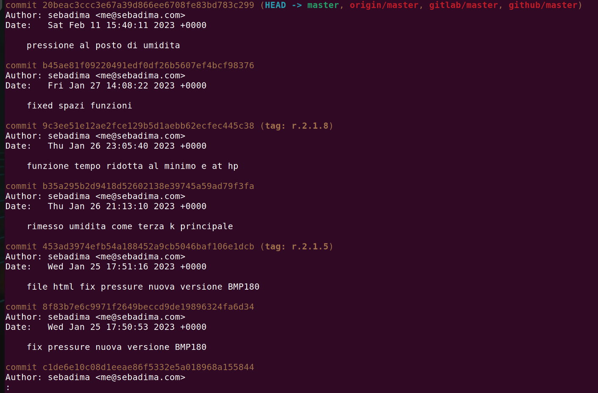

## Perchè usare il comando Git

Il software Git è stato creato da <a href="https://it.wikipedia.org/wiki/Linus_Torvalds" target="_blank" rel="noopener">Linus Torvalds</a>, il famoso sviluppatore finlandese noto principalmente come creatore del kernel Linux. Torvalds ha creato Git nel 2005 per gestire lo sviluppo del kernel Linux stesso. Ha sviluppato Git come un sistema di controllo delle versioni distribuito, progettato per affrontare le esigenze specifiche del grande progetto open-source che è il kernel Linux. 

### Cosa veniva usato prima dell'arrivo di Git?


Prima del programma Git, i programmatori utilizzavano diversi sistemi per il controllo delle versioni e la gestione del codice sorgente. Alcuni dei sistemi più comuni erano:

1.    **RCS (Revision Control System)**: RCS è stato uno dei primi sistemi di controllo delle versioni, introdotto nel 1982. Era principalmente utilizzato per gestire le modifiche ai file di testo, mantenendo una singola versione del file in modo esplicito.

2.    **CVS (Concurrent Versions System)**: Introdotta nel 1986, CVS è un sistema di controllo delle versioni distribuito utilizzato per gestire progetti collaborativi. Era ampiamente utilizzato nei primi anni 2000 e consentiva a più sviluppatori di lavorare contemporaneamente sullo stesso progetto.

3.    **SVN (Subversion)**: SVN è stato introdotto nel 2000 ed è stato un sistema di controllo delle versioni molto popolare e un passo avanti rispetto a CVS. SVN forniva un modello di gestione delle versioni centralizzato e supportava la collaborazione tra sviluppatori.

4.    **Mercurial**: Mercurial è un sistema di controllo delle versioni distribuito simile a Git, ma è stato sviluppato indipendentemente da Git. È stato introdotto nel 2005 ed è stato utilizzato da molte comunità di sviluppatori.

5.    **Bazaar**: Bazaar è un altro sistema di controllo delle versioni distribuito che ha avuto una certa popolarità nella comunità open-source prima dell'avvento di Git. È stato sviluppato da Canonical e utilizzato per progetti come Ubuntu.

Questi sistemi di controllo delle versioni erano stati ampiamente utilizzati prima che Git diventasse ampiamente popolare grazie alla sua velocità, efficienza e capacità di gestire grandi progetti distribuiti in modo eccellente. 

#### Git è diventato ampiamente popolare e ora viene utilizzato per gestire lo sviluppo di numerosi altri progetti software in tutto il mondo.

<div class="alert alert-doks d-flexflex-shrink-1" role="alert"> 👉 
Il comando "git" è importante su Linux (e in generale su molti altri sistemi operativi) perché è uno strumento di controllo delle versioni ampiamente utilizzato e potente. Inoltre con Git puoi accedere amolti progetti Open di robotica disponibili liberamente su github.com
</div>


##### Ecco alcuni dei migliori progetti di robotica ospitati su GitHub:

- Open Robotics: <a href="https://github.com/osrf" target="_blank" rel="noopener">Open Robotics</a> è un'organizzazione senza scopo di lucro che gestisce una serie di progetti di robotica open source, tra cui ROS, Gazebo e MoveIt!
- Robot Operating System (ROS): <a href="https://github.com/ros2" target="_blank" rel="noopener">ROS</a> è un framework open source per lo sviluppo di robot. Fornisce una piattaforma comune per la comunicazione tra i diversi componenti di un robot, come i sensori, i motori e l'intelligenza artificiale.
- Gazebo: <a href="https://gazebosim.org/home" target="_blank" rel="noopener">Gazebo</a> è un simulatore di robot open source. Può essere utilizzato per simulare l'ambiente in cui opera un robot, testando e valutando i diversi algoritmi di controllo.
- MoveIt!: MoveIt! è un framework open source per il controllo del movimento dei robot. Fornisce una serie di funzionalità per pianificare e comandare i movimenti di un robot, in modo sicuro ed efficiente.
- Arduino: Arduino è una piattaforma di sviluppo open source per la creazione di dispositivi elettronici. Offre una serie di schede di sviluppo, che possono essere utilizzate per creare una varietà di progetti robotici.

### Una avvertenza per chi usa Windows

Ci sono alcune ragioni per cui Git può essere più difficile da usare su Windows che su Linux.

- Git è stato originariamente sviluppato per Linux. Questo significa che Git è più compatibile con l'architettura Linux e può essere più difficile da usare su Windows, che ha una diversa architettura.

- Windows non viene fornito con Git preinstallato. Gli utenti di Windows devono installare Git separatamente, il che può essere un processo complicato.

- Ci sono meno risorse disponibili per aiutare gli utenti di Windows con Git. Ci sono molti tutorial e documentazione disponibili per aiutare gli utenti di Linux con Git, ma ci sono meno risorse disponibili per gli utenti di Windows.

> Nonostante queste difficoltà, Git può essere utilizzato su Windows. Esistono diversi modi per semplificare l'uso di Git su Windows, ad esempio utilizzando un client Git come SourceTree o GitHub Desktop.

### Come installare Git su Windows 10/11

1. #### Scarica Git

Il primo passo è scaricare il programma di installazione di Git dal <a href="https://github.com/git-for-windows/git/releases/tag/v2.41.0.windows.3" target="_blank" rel="noopener">sito web</a> di Git per Windows.

2. #### Esegui il programma di installazione

Una volta scaricato il programma di installazione, eseguilo. Il programma di installazione ti guiderà attraverso il processo di installazione di Git.

3. #### Configura Git

Dopo aver installato Git, dovrai configurarlo. Ciò include impostare il tuo nome utente e indirizzo e-mail. Puoi farlo eseguendo il seguente comando in una finestra del prompt dei comandi:

```bash
git config --global user.name Your Name
git config --global user.email your@email.com
```

4. ##### Come testare Git

Una volta configurato Git, puoi testarlo eseguendo il seguente comando in una finestra del prompt dei comandi:

```bash
git --version
```
Questo comando dovrebbe stampare la versione di Git che hai installato.

## Ecco alcuni motivi per cui dovresti usare Git su Linux:

Noi di Robotdazero preferiamo sempre usare software e sistemi Open Source. A nostro modesto avviso permettono maggiore libertà di azione al programmatore e presentano meno bug rispetto al sofware a pagamento.


<div class="alert alert-doks d-flexflex-shrink-1" role="alert"> 👉 
Se vuoi provare un sistema alternativo a Windows ti suggerisco Linux nella distro di Ubuntu. Per noi si tratta di un OS maturo e affidabile e ti consiglio di provarlo se non lo usi già!
</div>

##### Cosa può fare Git su Ubuntu/Linux:

1.    Controllo delle versioni: Git permette di tenere traccia delle modifiche apportate ai file nel tempo, consentendo di recuperare versioni precedenti di un progetto. Questo è utile per il backup, per ripristinare modifiche indesiderate o per collaborare con altri sviluppatori.

2.    Collaborazione: Git facilita la collaborazione tra sviluppatori. Consente a più persone di lavorare contemporaneamente sullo stesso progetto, integrando e gestendo facilmente le modifiche apportate da ciascun membro del team.

3. Branching e merging: Git offre funzionalità avanzate per creare nuovi "branch" (rami) di sviluppo, che consentono di lavorare su nuove funzionalità o correzioni di bug senza influire direttamente sulla versione principale del codice. Successivamente, i rami possono essere facilmente fusi (merged) per integrare le modifiche nella versione principale.

4. Gestione delle modifiche: Git consente di analizzare le modifiche apportate ai file, visualizzare le differenze tra versioni e ripristinare parti specifiche dei file. Questo rende più semplice individuare e risolvere problemi o errori nel codice.

5. Distribuzione e hosting: Git offre la possibilità di distribuire e condividere facilmente il codice sorgente attraverso servizi di hosting come GitHub, GitLab e Bitbucket. Questi servizi consentono agli sviluppatori di pubblicare i loro progetti, collaborare con altri, ricevere feedback e tenere traccia delle modifiche nel tempo.

<div class="alert alert-doks d-flexflex-shrink-1" role="alert"> 👉 
In sintesi, Git semplifica il processo di sviluppo del software, migliorando la gestione delle versioni, la collaborazione tra team di sviluppo e la distribuzione dei progetti. È diventato uno standard de facto nell'ambito dello sviluppo software ed è ampiamente utilizzato sia su Linux che su altri sistemi operativi.
</div>


Github e Gitlab prendono il nome da questo tool e in linea di massima sei obbligato ad usarlo. In certe occasioni potresti usare in alternativa il comando **wget**, ad esempio per scaricare i file binari di un progetto su github.com.


++++++++++++++++++++++++++


<p style="font-size: 16px"> Output del programma Git sulla nostra piattaforma ML Kaspian </p>


#### Per installare Git su Ubuntu, puoi seguire questi passaggi:

Apri il terminale sul tuo sistema Ubuntu. Puoi farlo premendo Ctrl+Alt+T sulla tastiera o cercando "Terminal" nel menu delle applicazioni.

Aggiorna l'elenco dei pacchetti disponibili con il seguente comando:

```bash
$ sudo apt update
```

Installa Git utilizzando il comando:

```bash
$ sudo apt install git
```

Durante l'installazione, ti verrà chiesto di confermare l'installazione dei pacchetti. Digita "Y" e premi Invio per procedere.

Una volta completata l'installazione, puoi verificare se Git è stato installato correttamente digitando il seguente comando:

```bash
$ git --version
```

Verrà visualizzata la versione di Git installata sul tuo sistema.

Ora hai Git correttamente installato su Ubuntu e sei pronto per utilizzarlo nel terminale. Puoi iniziare a clonare repository, creare nuovi repository o gestire i tuoi progetti con Git.


<br>
<p style="font-size: 16px">Esempio di output del programma Git sulla nostra piattaforma Kaspian.</p>

### I Primi comandi su Git

I comandi di Git possono essere talvolta complicati ma per svolgere le operazioni di base la sintassi del comando è sempre intuitiva. Di seguito riportiamo i comandi indispensabili per iniziare.

1. **git init**
> Il comando git init viene usato per creare un archivio Git vuoto. Dopo il comando viene fisicamente creata una directory .git con alcuni files e delle sottodirectory. Continuando ad usare gli altri comandi Git, la directory si riempirà di altri files e directory. In linea di massima sono usati per contenere tutte le versioni del sofware sotto revisione.

2. **git add .**

> Il comando Add viene udato per aggiungere dei file al sistema di controllo di Git. Dopo questo comando Git terrà traccia delle modifiche e ne conserverà tutte le versioni.

3. **git commit -m "messaggio di commento"**

> Il comando commit permette di salvare i cambiamenti della directory locale. Tutti gli aggiornamenti finiscono nel repository di Git.
La opzione:  –m "<messaggio du commento>" ti permette di descrivere le modifiche al programma e il motivo in modo che siamo comprensibili ai collaboratori.


4. **git status**

> Questo comando fornisce lo status del repository in esame.  Il comando elenca il "branch" di lavoro, i files modificati e se esistono dei files resenti nella directory ma non sotto controllo di Git. 

5. **git clone** <remote_URL>

<div class="alert alert-doks d-flexflex-shrink-1" role="alert"> 👉 
Il comando <strong>clone</strong> è forse il più utile se volete usare software open source preso dal nostro sito o da internet. Il comando permette di scaricare un programma remoto in una directory locale mantenendo intatta la struttura dei file e salvando tutte le le revisioni. E' equivalente a "Git init" quando lavorate con dei repository remoti.
</div>


### Alcune anomalie di Git

#### Git può essere difficile da imparare. 
Git è un sistema complesso con molti comandi e opzioni. Può essere difficile imparare a usarlo, soprattutto per chi non ha familiarità con i sistemi di controllo versione.
#### Git può essere lento. 
Git è un sistema efficiente, ma può essere lento quando si lavora con grandi repository.

#### Git può essere difficile da configurare. 

Git può essere difficile da configurare, soprattutto su sistemi con molti utenti.

#### Git può essere difficile da usare in team. 
Git può diventare assai ostico da usare in team, soprattutto quando si lavora su progetti con molti sviluppatori.


### Alcuni suggerimenti per superare queste difficoltà:

1. Imparare Git gradualmente. 
Non c'è bisogno di imparare tutto Git in una volta sola. Inizia imparando i comandi e le opzioni di base e poi approfondisci man mano che ne hai bisogno.
2. Usare un client Git. 
Ci sono molti client Git disponibili, che possono semplificare l'uso di Git. Un client Git può aiutarti con attività come la clonazione, il commit, il push e il pull di repository.
3. Usare un hosting Git. 
Un hosting Git, come GitHub, GitLab o BitBucket, può aiutarti a gestire i tuoi repository Git e a collaborare con altri sviluppatori.

> Nonostante i suoi difetti, Git è uno strumento potente e versatile.

Ti consiglio di usarlo per gestire progetti di qualsiasi dimensione, anche minima: la comodità di azzerare modifiche "sbagliate" con un solo comando del tipo:


```bash
$ git checkout HEAD nomefile
```

è davvero impagabile. Con un po' di pratica, puoi superare le difficoltà di Git e sfruttare i suoi numerosi vantaggi.

##### E infine alcuni suggerimenti generali per aumentare la qualità del codice sorgente con Git


- Tracciamento delle modifiche al codice: Git può essere utilizzato per tenere traccia delle modifiche al codice, in modo da poter identificare e risolvere i bug nel codice.
- Test del codice: Git può essere utilizzato per automatizzare i test del codice, in modo da poter eseguire i test su tutte le modifiche al codice in modo rapido e semplice.
- Restituzione a una versione precedente: Git può essere utilizzato per ripristinare il codice a una versione precedente, se necessario. Questo può essere utile se si introduce un bug nel codice o se si verifica un problema con le modifiche al codice.
- Documentazione: Git può essere utilizzato per documentare il codice, in modo che sia facile capire come funziona il codice e come utilizzarlo.


Se ti è piaciuto questo post puoi iscriverti alla nostra newletter e contribuire al successo della nostra piattaforma.

