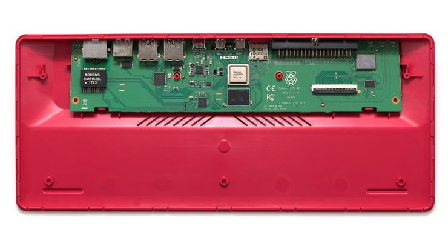
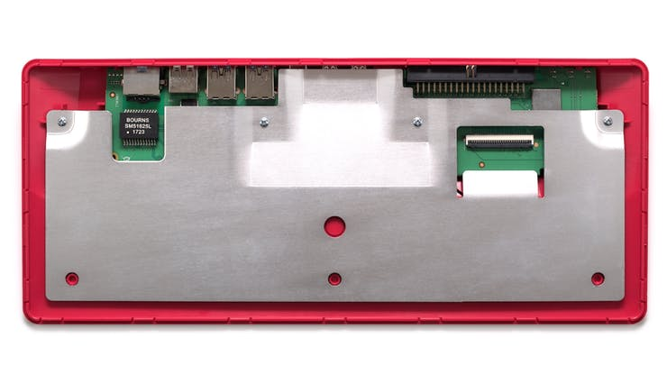

#### In questa primo articolo di una serie piuttosto lunga vedremo come costruire un rover guidato dalla intelligenza artificiale destinato a compiti di sorveglianza "reale"

quindi con la capacità di:
<ol>
 	<li>muoversi da solo H24,</li>
 	<li>ricaricarsi da solo collegandosi alla presa 220V o 12V,</li>
 	<li>scattare foto di presunti intrusi, riconoscere voci e volti familiari,</li>
 	<li>aprire e chiudere porte e cancelli,</li>
 	<li>inviare sms o email in caso di pericolo.</li>
 	<li>superare piccoli ostacoli non oltre i 6/10 cm grazie a grosse ruote o cingoli in gomma</li>
</ol>

 

In linea di massima in questi post seguiremo questo percorso:
<ol>
 	<li>Progettazione del rover, compresa la scelta delle librerie Machine Learning</li>
 	<li>Acquisto dei componenti necessari</li>
 	<li>Costruzione del telaio e del sistema di guida</li>
 	<li>Installazione del sistema di alimentazione e ricarica</li>
 	<li>Installazione del sistema di sorveglianza e riconoscimento facciale / vocale</li>
 	<li>Programmazione dell'intelligenza artificiale</li>
 	<li>Test e debugging del rover</li>
</ol>


Usare le nuove librerie disponibile per Python consente di riconoscere oggetti e mura perimetrali. Oltre all'ovvio utilizzo per compiti di sorveglianza i programmi ML consentono di ottimizzare il movimento del Rover e di evitare buche e ostacoli di altezza eccessiva. 

Il primo argomento che affronteremo sarà la scelta della libreria di Machine Learning per guidare il robot e in via preliminare abbiamo pensato a queste librerie;
<ul>
 	<li><a href="https://www.tensorflow.org/lite">TensorFlow Lite</a></li>
 	<li><a href="https://www.tinyml.org/">Tiny ML</a></li>
 	<li><a href="https://keras.io/">Keras</a></li>
</ul>

#### Quali librerie ML si possono installare sul PI 400...

Per controllare le prestazioni di Tensor Flow Lite abbiamo seguito questo <a target=”_blank” href="https://github.com/EdjeElectronics/TensorFlow-Lite-Object-Detection-on-Android-and-Raspberry-Pi/blob/master/deploy_guides/Raspberry_Pi_Guide.md">tutorial</a> su Github senza però installare Coral USB Accelerator: <a target=”_blank” href="https://www.amazon.it/Google-Coral-USB-Accelerator-Edge/dp/B07S214S5Y">qui</a> il link per acquistare Coral USB su Amazon. Per installare Tiny ML su Raspberry abbiamo seguito questo <a target=”_blank” href="https://it.emcelettronica.com/deep-learning-con-keras-sul-raspberry-pi">articolo</a> in italiano su emcelettronica. Infine come terza opzione abbiamo testato Keras seguendo questo <a target=”_blank” href="https://www.teknotut.com/install-tensorflow-and-keras-on-the-raspberry-pi/">tutorial</a> su Teknotut.
Tutte sono in grado di girare sulla piattaforma hardware che abbiamo deciso di provare, cioè un “Raspberry PI 400” con le seguenti caratteristiche:

<ul>
 	<li>RAM: 4GB,</li>
 	<li>Processore: Broadcom BCM2711, quad-core Cortex-A72 (ARM v8) 64-bit SoC @ 1.8GHz</li>
 	<li>Connettività: Gigabit Ethernet, Wi-Fi dual-band 802.11ac, Bluetooth 5.0, BLE</li>
 	<li>Porte: 2 USB 3.0, 2 USB 2.0, 2 micro-HDMI, jack audio da 3,5 mm, GPIO a 40 pin</li>
 	<li>Alimentazione: 5V DC tramite USB-C o GPIO</li>
</ul>



##### Con il RPI 400 siamo riusciti a risolvere di colpo tutti i problemi di riscaldamento della piattaforma hardware

<blockquote class="twitter-tweet">
How to install heat sinks on a Raspberry Pi 3 B+ ? <a href="https://t.co/jIn9Xg1ZmQ">https://t.co/jIn9Xg1ZmQ</a> <a href="https://twitter.com/hashtag/raspberrypi?src=hash&amp;ref_src=twsrc%5Etfw">#raspberrypi</a> <a href="https://t.co/RWI4mXJQo3">pic.twitter.com/RWI4mXJQo3</a>
&mdash; RaspberryTips (@TipsRaspberry) <a href="https://twitter.com/TipsRaspberry/status/1664908543164547072?ref_src=twsrc%5Etfw">June 3, 2023</a></blockquote>  

## I requisiti di mobilità che dovranno essere risolti dalla CPU

#### Il nostro Rover dovrà essere in grado di:

1. superare ostacoli come piccole rocce e dislivelli</li>
2. funzionare in condizioni meteorologiche avverse, come pioggia e vento</li>
3. comunicare con il mondo esterno, inviando informazioni sulle sue attività e ricevendo comandi remoti se necessario.</li>
4. arrestare i motori e metterli in “stallo” in caso di blocco delle ruote o pendenze eccessive,</li>
5. rilevare consumi di corrente eccessivi e spegnere i motori per due secondi e riaccenderli subito dopo</li>
6. diminuire la alimentazione ai motori in caso di discese e aumentarla in caso opposto</li>
7. usare un driver economico come il <a href="https://lastminuteengineers.com/l298n-dc-stepper-driver-arduino-tutorial/">L298N</a> DC Motor Driver

### I FATTORI DA CONSIDERARE QUANDO SI SCEGLIE LA CPU...

1. Dimensioni e peso del robot: la CPU dovrebbe essere abbastanza piccola da adattarsi al corpo del robot e abbastanza leggera da non appesantire il robot.
2. Requisiti di alimentazione del robot: la CPU dovrebbe consumare una quantità ragionevole di energia in modo che il robot possa funzionare a lungo con una batteria.
3. Capacità del robot: la CPU dovrebbe essere abbastanza potente da gestire i compiti del robot. Ad esempio, se il robot verrà utilizzato per compiti complessi come il riconoscimento di oggetti o la navigazione, avrà bisogno di una CPU più potente di un robot che verrà utilizzato solo per compiti semplici come muoversi ed evitare gli ostacoli.
4. Sistema operativo del robot: La CPU deve essere compatibile con il sistema operativo del robot. La maggior parte dei piccoli robot usano Linux, ma alcuni possono utilizzare altri sistemi operativi come Windows o Android.

#### Alcune delle alternative che abbiamo considerato:

**Raspberry Pi**: Il Raspberry Pi è una scelta popolare per i piccoli robot perché è conveniente, piccolo e potente. È compatibile con una vasta gamma di sensori e attuatori e può eseguire una varietà di sistemi operativi, tra cui Linux che useremo nel nostro progetto.

**Arduino**: Arduino è un'altra scelta popolare per i piccoli robot. È un microcontrollore, il che significa che è meno potente di una CPU come il Raspberry Pi, ma è anche molto più piccolo ed economico. Arduino è compatibile con una vasta gamma di sensori e attuatori, e può eseguire una varietà di linguaggi di programmazione, tra cui C e C++.

 
 

 
 

**Nvidia Jetson Nano**: Nvidia Jetson Nano è una potente CPU progettata per applicazioni AI. È compatibile con una vasta gamma di sensori e attuatori e può eseguire Linux e Jetpack, la piattaforma di sviluppo AI di Nvidia.

#### E inoltre, perchè non possiamo usare soltanto la CPU principale per guidare i motori...
Il nostro Rover dovrà regolare continuamente la velocità dei motori in base alle esigenze di sterzata. La architettura a 6 ruote che abbiano scelto ha bisogno di sterzare cambiando la velocità delle singole ruotei e deve farlo in maniera precisa con ritardi minimi, pena vedere il rover ondeggiare durante le manovre.
Perchè ci serve un sistema PID?

 👉 
Il sistema di controllo PID (Proportional-Integral-Derivative) è un algoritmo di controllo automatico utilizzato per regolare un processo in modo preciso e affidabile. Questo sistema utilizza una combinazione di tre elementi di controllo: il termine proporzionale (P), il termine integrale (I) e il termine derivativo (D).

 

Il termine proporzionale (P) è proporzionale all'errore corrente del processo, cioè alla differenza tra il valore desiderato e il valore attuale. Il termine integrale (I) tiene conto della storia dell'errore, integrando l'errore nel tempo. Infine, il termine derivativo (D) è proporzionale alla variazione dell'errore nel tempo.

Il controllo PID nel nostro rover dovrà regolare continuamente il processo in modo da minimizzare l'errore tra il valore desiderato e il valore <a href="http://effettivo.Il">effettivo.Il</a> controllo PID è ampiamente utilizzato in molti settori, tra cui l'automazione industriale, il controllo di motori, il controllo della temperatura, il controllo del flusso e molto altro ancora.

con controllo PID per il rover, seguiremo questi passaggi:
<ol>
 	<li>Acquisire sensori adeguati per la rilevazione della posizione del rover (ad esempio, sensori di posizione ad ultrasuoni o magnetici).</li>
 	<li>Utilizzare un microcontrollore o un microprocessore per elaborare i dati dei sensori e controllare i motori delle ruote.</li>
 	<li>Implementare un algoritmo di controllo PID per regolare la velocità e la direzione del rover in base alla posizione rilevata dai sensori.</li>
 	<li>Testare il sistema di guida e regolare i parametri del controllo PID per migliorare le prestazioni.</li>
</ol>

### PERCHÈ ABBIAMO SCELTO RASPBERRY...

### LE PRESTAZIONI SONO IL PRINCIPALE PARAMETRO PER SCEGLIERE LA CPU?

E' innegabile che le prestazioni siano un punto chiave nella scelta, perchè gli algoritmi di ML impongono la elaborazione di miliardi di singole operazione al secondo (pensiamo alla chiavette TPU come Google Coral o Orange PI). Tale carico di lavoro ci propone un serio dubbio da risolvere in fase di pianificazione: La nostra CPU dovrà elaborare in toto i dati (immagini e video ) o deve appogiarsi ad unita' di calcolo esterno?

Nel nostro caso abbiamo deciso di scegliere la seconda strada e ricorrere alla unita di elaborazione esterna con Tensorfklow e quindi abbiamo optato per l'ecosistema Google Coral e Tensorflow.

In genere nella costuzione di robot mobili o di rover ci si orienta come prima scelta vero il Raspberry PI4 con 8GB di memoria. In alternativa si può usare una CPU della gamma Jetson Nvidia con simile capacità di memoria RAM ma con un coprocessore grafico molto più potente per sostenere il carico del riconoscimento delle immagini. Nel nostro Rover che sarà nella classe degli 8/10 Kg di peso al completo volevamo avere molta più liberta nella scelta della CPU perchè il consumo e il peso delle batterie sono meno importanti.

### POTEVAMO USARE UNA CPU INTEL PER IL ROVER?

 
 

A suggerirci questa alternativa è stato questo <a href="https://www.youtube.com/watch?v=yrI_C9hVV4M&t=5s" target="_blank" rel="noopener">video</a> su YT con un Rover a 6 ruote e un laptop Intel letteralmente appoggiato sopra lo chassis. I vantaggi di una soluzione simile sono ovvi, primo fra tutti poter usare un PC ad alte prestazioni spendendo 100 euro su ebay o su Amazon (refurbished). 

 

 
 

Gli svantaggi però secondo noi sono maggiori dei vantaggi, primo fra tutti il consumo di una CPU I3/5/7

#### Quanto consuma una CPU Raspberry?

 
 

Nella tabella sopra vediamo i consumi della gamma RPI a partire dal modello minore Zero fino al PI4B+ (il 400 è equivalente) in varie situazioni di utilizzo. Come possiamo notare anche sotto condizioni di forte carico l'assorbimento di corrente non supera gli 885mA. Quindi ammettendo un assorbimento di circa 1A a 5V staremo sempre comodamente sotto i 5W di consumo. 

Per avere un termine di paragone un portatile Intel con un CPU i3 e disco SSD interno può consumare 4/10 volte tanto:

 

 👉 
Il consumo medio di energia di un pc portatile può, quindi, oscillare tra i 20 e i 50 W nel caso dei modelli a risparmio energetico, per arrivare ad assorbire anche 130 W nel caso dei modelli di dimensioni superiori o dalle prestazioni più elevate.

 

Il dato viene da un sito autorevole come [energit.it](https://energit.it/quale-e-il-consumo-medio-di-un-pc/) che vi consigliamo di leggere per approfondire l'argomento.

### PERCHÈ NON POTEVAMO USARE ESP32 O ARDUINO PER LA ELABORAZIONE DELLE IMMAGINI IN MACHINE LEARNING

Il controller ESP32 riesce a rilevare ostacoli negli spazi aperti usando una versione ridotta di un <a href="https://en.wikipedia.org/wiki/Computer_vision">sistema</a> di riconoscimento delle immagini, ma non può gestire altri compiti di ML o tantomeno far girare programmi in <a href="https://docs.micropython.org/en/latest/library/index.html">MicroPython</a> a velocità accettabile. Durante le nostre <a href="https://www.hackster.io/mjrobot/esp32-cam-tinyml-image-classification-fruits-vs-veggies-4ab970">prove</a> condotte con Tiny ML siamo riusciti a riconoscere volti, animali e oggetti precisi senza ncecessità di extra RAM o di risorse di CPU aggiuntive, ma

 

 👉 
Allenare la ESP32 con molteplici modelli e immagini à semplicemente aldilà degli scopi di un controller

 

Il controllo PID è un algoritmo di controllo di feedback che utilizza la regolazione proporzionale integrale e derivata per mantenere un valore di uscita vicino a un valore di riferimento desiderato. Nel caso di un sistema di guida per il rover, il valore di riferimento sarebbe la posizione desiderata del rover e il valore di uscita sarebbe la velocità e la direzione del rover.

