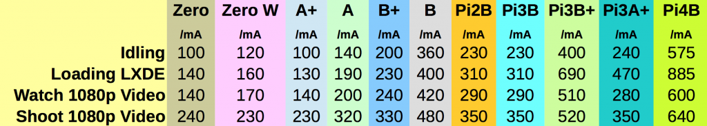

<h2>In questa primo articolo di una serie piuttosto lunga vedremo come costruire un rover guidato dalla intelligenza artificiale destinato a compiti di sorveglianza "reale".</h2>
quindi con la capacità di:
<ol>
 	<li>muoversi da solo H24,</li>
 	<li>ricaricarsi da solo collegandosi alla presa 220V o 12V,</li>
 	<li>scattare foto di presunti intrusi, riconoscere voci e volti familiari,</li>
 	<li>aprire e chiudere porte e cancelli,</li>
 	<li>inviare sms o email in caso di pericolo.</li>
 	<li>superare piccoli ostacoli non oltre i 6/10 cm grazie a grosse ruote o cingoli in gomma</li>
</ol>
In linea di massima in questi post seguiremo questo percorso:
<ol>
 	<li>Progettazione del rover, compresa la scelta delle librerie Machine Learning</li>
 	<li>Acquisto dei componenti necessari</li>
 	<li>Costruzione del telaio e del sistema di guida</li>
 	<li>Installazione del sistema di alimentazione e ricarica</li>
 	<li>Installazione del sistema di sorveglianza e riconoscimento facciale / vocale</li>
 	<li>Programmazione dell'intelligenza artificiale</li>
 	<li>Test e debugging del rover</li>
</ol>
Il primo argomento che affronteremo sarà la scelta della libreria di Machine Learning per guidare il robot e in via preliminare abbiamo pensato a queste librerie;
<ul>
 	<li><a href="https://www.tensorflow.org/lite">TensorFlow Lite</a></li>
 	<li><a href="https://www.tinyml.org/">Tiny ML</a></li>
 	<li><a href="https://keras.io/">Keras</a></li>
</ul>
Tutte sono in grado di girare su una piattaforma “Raspberry PI 4” con le seguenti caratteristiche:
<ul>
 	<li>RAM: 4GB,</li>
 	<li>Processore: Broadcom BCM2711, quad-core Cortex-A72 (ARM v8) 64-bit SoC @ 1.5GHz</li>
 	<li>Connettività: Gigabit Ethernet, Wi-Fi dual-band 802.11ac, Bluetooth 5.0, BLE</li>
 	<li>Porte: 2 USB 3.0, 2 USB 2.0, 2 micro-HDMI, jack audio da 3,5 mm, GPIO a 40 pin</li>
 	<li>Alimentazione: 5V DC tramite USB-C o GPIO</li>
</ul>
<blockquote>Per controllare le prestazioni di Tensor Flow Lite abbiamo seguito questo <a href="https://github.com/EdjeElectronics/TensorFlow-Lite-Object-Detection-on-Android-and-Raspberry-Pi/blob/master/deploy_guides/Raspberry_Pi_Guide.md">tutorial</a> su Github senza però installare Coral USB Accelerator: <a href="https://www.amazon.it/Google-Coral-USB-Accelerator-Edge/dp/B07S214S5Y">qui</a> il link per acquistare Coral USB su Amazon. Per installare Tin ML su Raspberry abbiamo seguito questo <a href="https://it.emcelettronica.com/deep-learning-con-keras-sul-raspberry-pi">articolo</a> in italiano su emcelettronica. Infine come terza opzione abbiamo testato Keras seguendo questo <a href="https://www.teknotut.com/install-tensorflow-and-keras-on-the-raspberry-pi/">tutorial</a> su Teknotut.</blockquote>
<h2>I requisiti di mobilità</h2>
Il nostro Rover dovrà essere in grado di:
<ol>
 	<li>superare ostacoli come piccole rocce e dislivelli</li>
 	<li>funzionare in condizioni meteorologiche avverse, come pioggia e neve</li>
 	<li>comunicare con il mondo esterno, inviando informazioni sulle sue attività e ricevendo comandi remoti se necessario.</li>
 	<li>arrestare i motori e metterli in “stallo” in caso di blocco delle ruote o pendenze eccessive,</li>
 	<li>rilevare consumi di corrente eccessivi e spegnere i motori per due secondi e riaccenderli subito dopo</li>
 	<li>dimunire la alimentazione ai motori in caso di discese e aumentarla in caso opposto</li>
 	<li>usare un normale drive come <strong><a href="https://lastminuteengineers.com/l298n-dc-stepper-driver-arduino-tutorial/">L298N</a></strong> DC Motor Driver almeno per il prototipo</li>
</ol>
<h1>Come impostare il controller della velocità PID</h1>
Perchè ci serve un sistema PID?
<blockquote>Il sistema di controllo PID (Proportional-Integral-Derivative) è un algoritmo di controllo automatico utilizzato per regolare un processo in modo preciso e affidabile. Questo sistema utilizza una combinazione di tre elementi di controllo: il termine proporzionale (P), il termine integrale (I) e il termine derivativo (D).</blockquote>
Il termine proporzionale (P) è proporzionale all'errore corrente del processo, cioè alla differenza tra il valore desiderato e il valore attuale. Il termine integrale (I) tiene conto della storia dell'errore, integrando l'errore nel tempo. Infine, il termine derivativo (D) è proporzionale alla variazione dell'errore nel tempo.

Il controllo PID nel nostro rover dovrà regolare continuamente il processo in modo da minimizzare l'errore tra il valore desiderato e il valore <a href="http://effettivo.Il">effettivo.Il</a> controllo PID è ampiamente utilizzato in molti settori, tra cui l'automazione industriale, il controllo di motori, il controllo della temperatura, il controllo del flusso e molto altro ancora.

con controllo PID per il rover, seguiremo questi passaggi:
<ol>
 	<li>Acquisire sensori adeguati per la rilevazione della posizione del rover (ad esempio, sensori di posizione ad ultrasuoni o magnetici).</li>
 	<li>Utilizzare un microcontrollore o un microprocessore per elaborare i dati dei sensori e controllare i motori delle ruote.</li>
 	<li>Implementare un algoritmo di controllo PID per regolare la velocità e la direzione del rover in base alla posizione rilevata dai sensori.</li>
 	<li>Testare il sistema di guida e regolare i parametri del controllo PID per migliorare le prestazioni.</li>
</ol>

## La scelta della CPU

In genere nella costuzione di robot mobili o di rover ci si orienta come prima scelta vero il Raspberry PI4 con 8GB di memoria. In alternativa si può usare una CPU della gamma Jetson Nvidia con simile capacità di memoria RAM ma con un coprocessore grafico molto più potente per sostenere il carico del riconoscimento delle immagini. Nel nostro Rover che sarà nella classe degli 8/10 Kg di peso al completo volevamo avere molta più liberta nella scelta della CPU perchè il consumo e il peso delle batterie sono meno importanti.

### La soluzione Intel 

A darci una prima intuizione è stato questo video su YT con poche centinaia di visualizzazioni che cmunque spiega benissmo la strada che vogliamo intraprendere. La CPU è un laptop Intel con lo schermo aperto!.
 

<h3>Perchè abbiamo scelto <a href="https://www.raspberrypi.org/">Raspberry PI</a> per il controllo dei sensori e la intelligenza artificiale e il controller ESP32 per la gestione dei motori e il sistema di guida</h3>
La ESP32-CAM (un controller ESP32S con una Cam OV2640)

riesce perfettamente a rilevare ostacoli negli spazi aperti usando una versione ridotta di un <a href="https://en.wikipedia.org/wiki/Computer_vision">sistema</a> di riconoscimento delle immagini, ma non può gestire altri compiti di ML o tantomeno far girare programmi in <a href="https://docs.micropython.org/en/latest/library/index.html">MicroPython</a> a velocità accettabile. Durante le nostre <a href="https://www.hackster.io/mjrobot/esp32-cam-tinyml-image-classification-fruits-vs-veggies-4ab970">prove</a> condotte con Tiny ML siamo riusciti a riconoscere volti, animali e oggetti precisi senza ncecessità di extra RAM o di risorse di CPU aggiuntive, ma
<blockquote>allenare la ESP32 con molteplici modelli e immagini à semplicemente aldilà degli scopi di un controller</blockquote>
Il controllo PID è un algoritmo di controllo di feedback che utilizza la regolazione proporzionale integrale e derivata per mantenere un valore di uscita vicino a un valore di riferimento desiderato. Nel caso di un sistema di guida per il rover, il valore di riferimento sarebbe la posizione desiderata del rover e il valore di uscita sarebbe la velocità e la direzione del rover.

Parliamo adesso dell’hardware;

i link utili che abbiamo usato per scegliere la tipologia di hardware:

<a href="https://www.researchgate.net/publication/259487884_Hardware_and_software_architecture_for_a_Rover_robot">researchgate - Hardware and software architecture for a Rover robot</a>

<a href="https://dronebotworkshop.com/esp32cam-robot-car/">dronebotworkshop.com - robocar</a>
