

#### Costruire un pacco di batterie LIPO: lo schema teorico

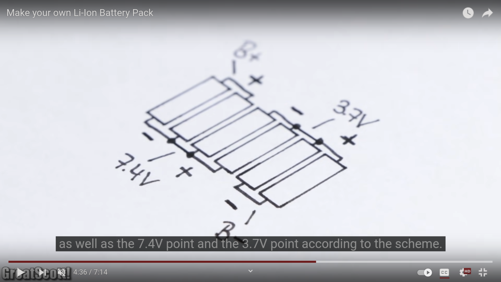

#### Costruire un pacco di batterie LIPO: la costruzione in sequenza

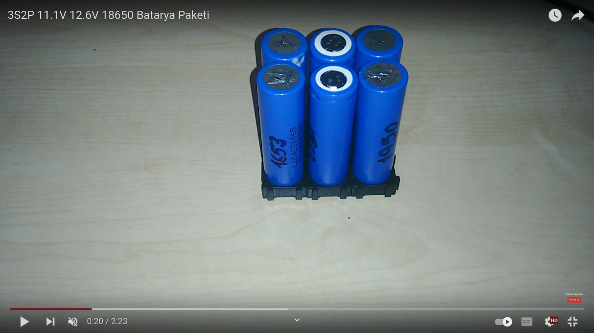
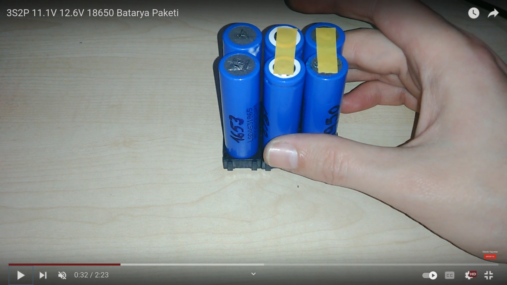
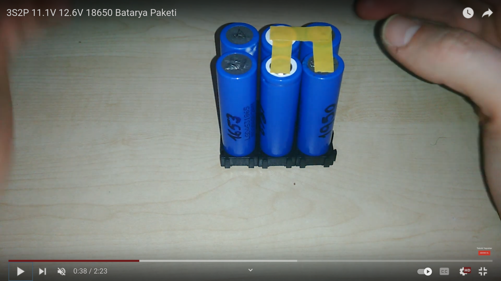
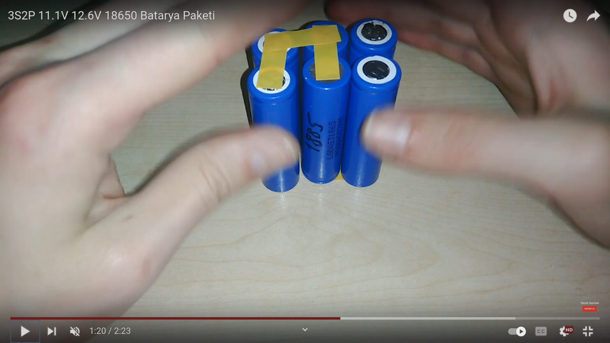
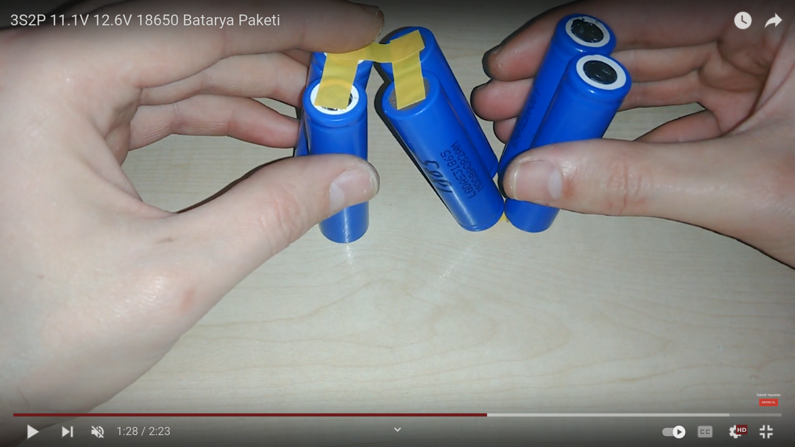
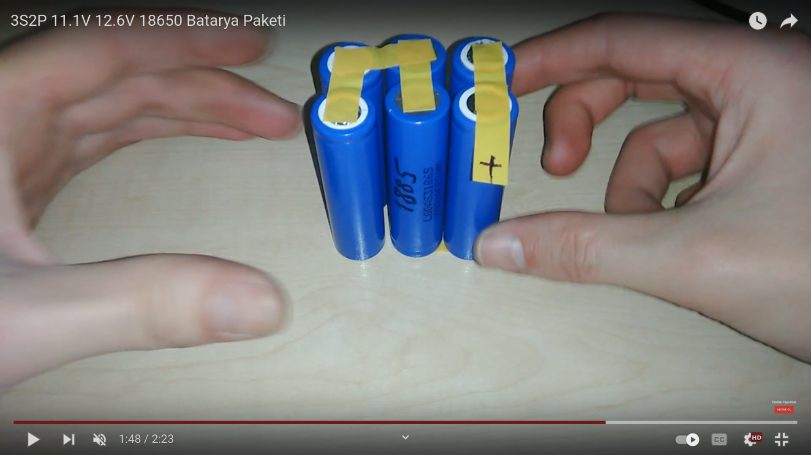
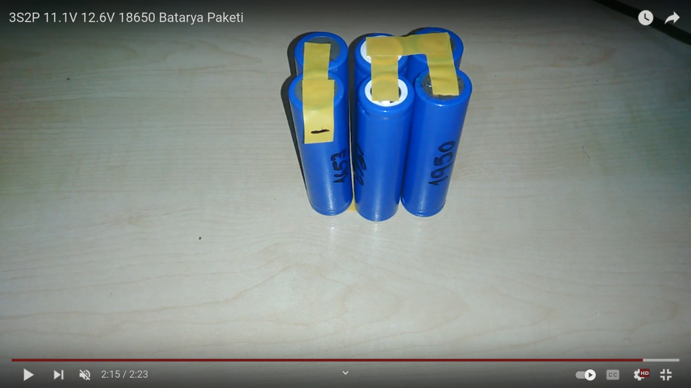

 
 

#### L'assemblaggio finale del nostro pacco batterie

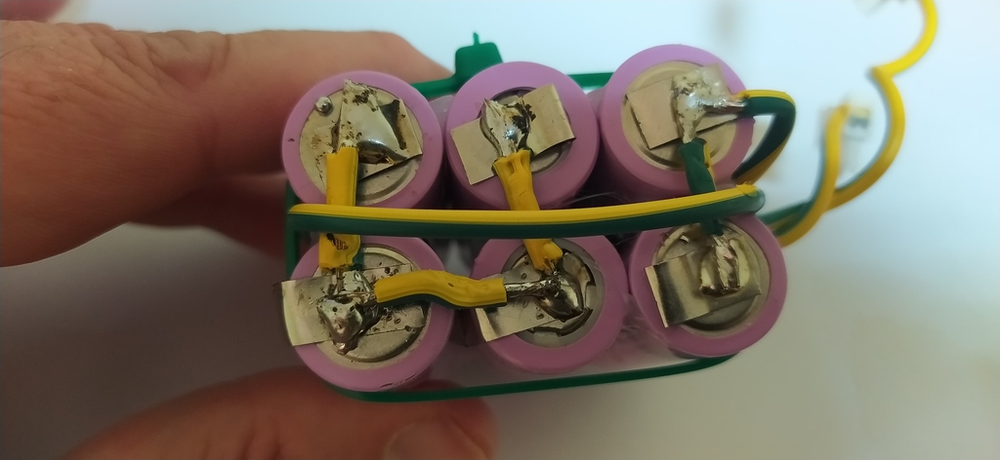
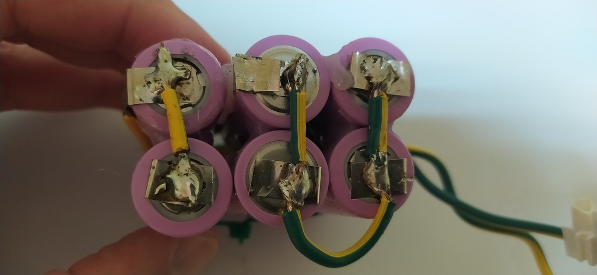
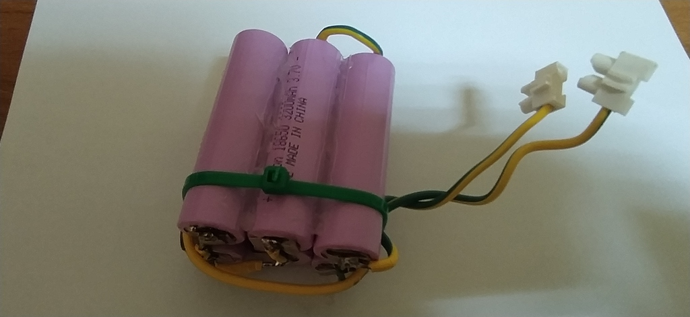
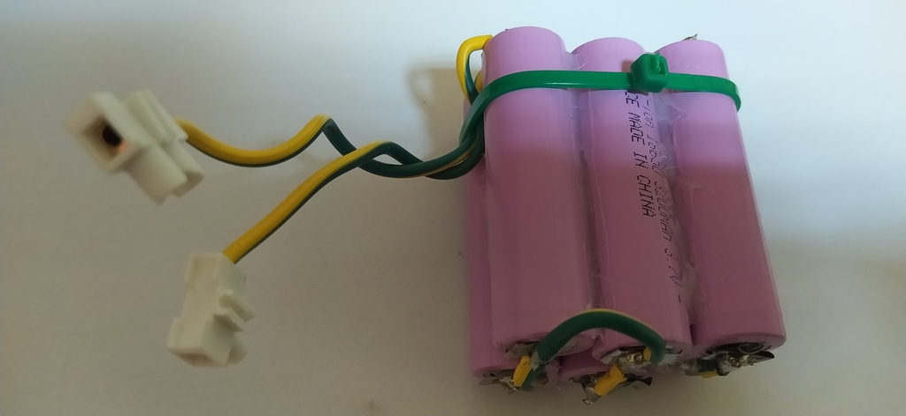
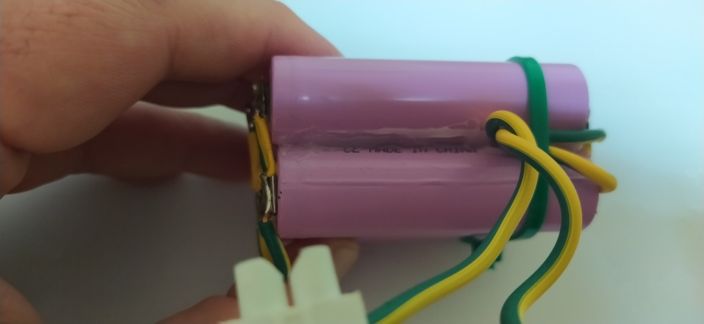
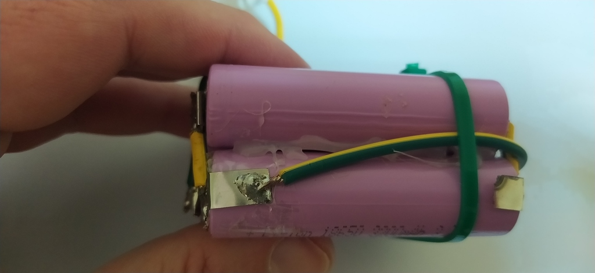

#### Il caricabatterie LIPO che abbiamo scelto
###### HTRC iMAX B6 80W utilizzabile con batterie Lipo, NiMh, li-ion, Ni-Cd
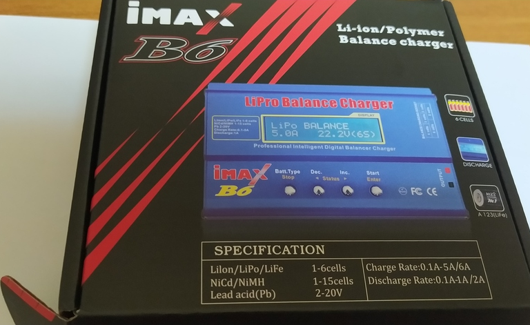
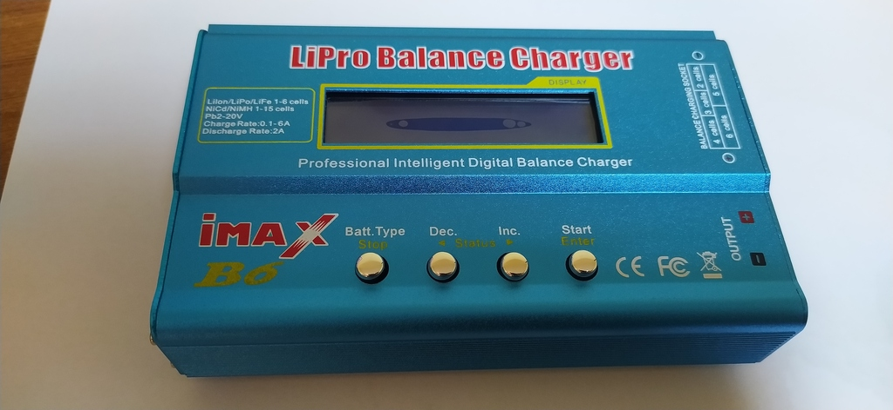
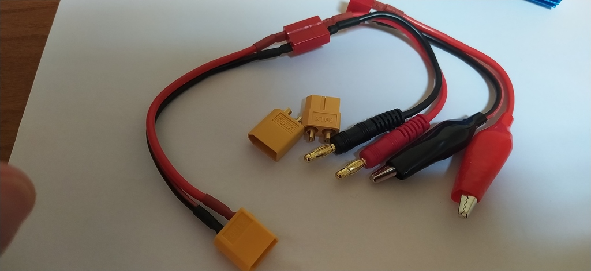
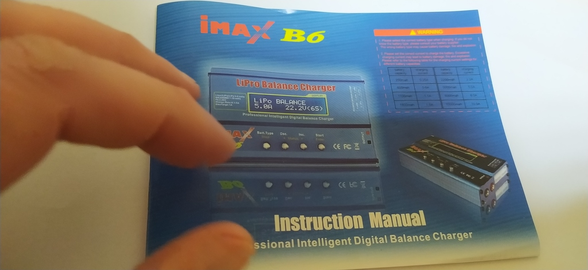

 
 
 

<!--

#### Una soluzione estrema ma funzionante...

A darci una prima intuizione è stato questo video su YT con poche centinaia di visualizzazioni che cmunque spiega benissmo la strada che vogliamo intraprendere. La CPU è un laptop Intel con lo schermo aperto!.
 

++++++++++++++++


graph TD
  A[Hard] -->|Text| B(Round)
  B --> C{Decision}
  C -->|One| D[Result 1]
  C -->|Two| E[Result 2]


-->

